<a href="https://colab.research.google.com/github/dulska-ola/Data_Analysis_Workshops/blob/main/Cleaning_Data_in_Python_live_session.ipynb" target="_parent"></a>

## **Cleaning Data in Python live training**


Welcome to this live, hands-on training where you will learn how to effectively diagnose and treat missing data in Python.

The majority of data science work often revolves around pre-processing data, and making sure it's ready for analysis. In this session, we will be covering how transform our raw data into accurate insights. In this notebook, you will learn:

* Import data into `pandas`, and use simple functions to diagnose problems in our data.
* Visualize missing and out of range data using `missingno` and `seaborn`.
* Apply a range of data cleaning tasks that will ensure the delivery of accurate insights.

## **The Dataset**

The dataset to be used in this webinar is a CSV file named `airbnb.csv`, which contains data on airbnb listings in the state of New York. It contains the following columns:

- `listing_id`: The unique identifier for a listing
- `description`: The description used on the listing
- `host_id`: Unique identifier for a host
- `host_name`: Name of host
- `neighbourhood_full`: Name of boroughs and neighbourhoods
- `coordinates`: Coordinates of listing _(latitude, longitude)_
- `Listing added`: Date of added listing
- `room_type`: Type of room
- `rating`: Rating from 0 to 5.
- `price`: Price per night for listing
- `number_of_reviews`: Amount of reviews received
- `last_review`: Date of last review
- `reviews_per_month`: Number of reviews per month
- `availability_365`: Number of days available per year
- `Number of stays`: Total number of stays thus far


## **Getting started**


```python
# Import libraries
import pandas as pd
import matplotlib.pyplot as plt
import numpy as np
import seaborn as sns
import missingno as msno
import scipy.stats as ss
import datetime as dt
```


```python
# Read in the dataset
airbnb = pd.read_csv('https://raw.githubusercontent.com/kflisikowsky/Descriptive_Statistics/refs/heads/main/data/airbnb.csv', index_col = 'Unnamed: 0')
```

## **Diagnosing data cleaning problems using simple `pandas` and visualizations**

Some important and common methods needed to get a better understanding of DataFrames and diagnose potential data problems are the following:

- `.head()` prints the header of a DataFrame
- `.dtypes` prints datatypes of all columns in a DataFrame
- `.info()` provides a bird's eye view of column data types and missing values in a DataFrame
- `.describe()` returns a distribution of numeric columns in your DataFrame
- `.isna().sum()` allows us to break down the number of missing values per column in our DataFrame
- `.unique()` finds the number of unique values in a DataFrame column

<br>

- `sns.histplot()` plots the distribution of one column in your DataFrame.


```python
# Print the header of the DataFrame
airbnb.head()
```


<div>
<style scoped>
    .dataframe tbody tr th:only-of-type {
        vertical-align: middle;
    }

    .dataframe tbody tr th {
        vertical-align: top;
    }

    .dataframe thead th {
        text-align: right;
    }
</style>
<table border="1" class="dataframe">
  <thead>
    <tr style="text-align: right;">
      <th></th>
      <th>listing_id</th>
      <th>name</th>
      <th>host_id</th>
      <th>host_name</th>
      <th>neighbourhood_full</th>
      <th>coordinates</th>
      <th>room_type</th>
      <th>price</th>
      <th>number_of_reviews</th>
      <th>last_review</th>
      <th>reviews_per_month</th>
      <th>availability_365</th>
      <th>rating</th>
      <th>number_of_stays</th>
      <th>5_stars</th>
      <th>listing_added</th>
    </tr>
  </thead>
  <tbody>
    <tr>
      <th>0</th>
      <td>13740704</td>
      <td>Cozy,budget friendly, cable inc, private entra...</td>
      <td>20583125</td>
      <td>Michel</td>
      <td>Brooklyn, Flatlands</td>
      <td>(40.63222, -73.93398)</td>
      <td>Private room</td>
      <td>45$</td>
      <td>10</td>
      <td>2018-12-12</td>
      <td>0.70</td>
      <td>85</td>
      <td>4.100954</td>
      <td>12.0</td>
      <td>0.609432</td>
      <td>2018-06-08</td>
    </tr>
    <tr>
      <th>1</th>
      <td>22005115</td>
      <td>Two floor apartment near Central Park</td>
      <td>82746113</td>
      <td>Cecilia</td>
      <td>Manhattan, Upper West Side</td>
      <td>(40.78761, -73.96862)</td>
      <td>Entire home/apt</td>
      <td>135$</td>
      <td>1</td>
      <td>2019-06-30</td>
      <td>1.00</td>
      <td>145</td>
      <td>3.367600</td>
      <td>1.2</td>
      <td>0.746135</td>
      <td>2018-12-25</td>
    </tr>
    <tr>
      <th>2</th>
      <td>21667615</td>
      <td>Beautiful 1BR in Brooklyn Heights</td>
      <td>78251</td>
      <td>Leslie</td>
      <td>Brooklyn, Brooklyn Heights</td>
      <td>(40.7007, -73.99517)</td>
      <td>Entire home/apt</td>
      <td>150$</td>
      <td>0</td>
      <td>NaN</td>
      <td>NaN</td>
      <td>65</td>
      <td>NaN</td>
      <td>NaN</td>
      <td>NaN</td>
      <td>2018-08-15</td>
    </tr>
    <tr>
      <th>3</th>
      <td>6425850</td>
      <td>Spacious, charming studio</td>
      <td>32715865</td>
      <td>Yelena</td>
      <td>Manhattan, Upper West Side</td>
      <td>(40.79169, -73.97498)</td>
      <td>Entire home/apt</td>
      <td>86$</td>
      <td>5</td>
      <td>2017-09-23</td>
      <td>0.13</td>
      <td>0</td>
      <td>4.763203</td>
      <td>6.0</td>
      <td>0.769947</td>
      <td>2017-03-20</td>
    </tr>
    <tr>
      <th>4</th>
      <td>22986519</td>
      <td>Bedroom on the lively Lower East Side</td>
      <td>154262349</td>
      <td>Brooke</td>
      <td>Manhattan, Lower East Side</td>
      <td>(40.71884, -73.98354)</td>
      <td>Private room</td>
      <td>160$</td>
      <td>23</td>
      <td>2019-06-12</td>
      <td>2.29</td>
      <td>102</td>
      <td>3.822591</td>
      <td>27.6</td>
      <td>0.649383</td>
      <td>2020-10-23</td>
    </tr>
  </tbody>
</table>
</div>


By merely looking at the data, we can already diagnose a range of potential problems down the line such as:

<br>

_Data type problems:_

- **Problem 1**: We can see that the `coordinates` column is probably a string (`str`) - most mapping functions require a latitude input, and longitude input, so it's best to split this column into two and convert the values to `float`.
- **Problem 2**: Similar to `coordinates` - the `price` column also is a string with `$` attached to each price point, we need to convert that to `float` if we want a good understanding of the dataset.
- **Problem 3**: We need to make sure date columns (`last_review` and `listing_added`) are in `datetime` to allow easier manipulation of data data.

<br>

_Missing data problems:_

- **Problem 4**: We can see that there are missing data in some columns, we'll get a better bird's eye view of that down the line.

<br>

_Text/categorical data problems:_


- **Problem 5**: To be able to visualize number of listings by boroughs - we need to separate neighborhoud name from borough name in `neighbourhood_full` column.
- **Problem 6**: Looking at `room_type`, let's replace those values to make them `'Shared Room'`, `'Private Home/Apartment'`, `'Private Room'` and `'Hotel Room'`.


```python
# Print data types of DataFrame
airbnb.dtypes
```


    listing_id              int64
    name                      str
    host_id                 int64
    host_name                 str
    neighbourhood_full        str
    coordinates               str
    room_type                 str
    price                     str
    number_of_reviews       int64
    last_review               str
    reviews_per_month     float64
    availability_365        int64
    rating                float64
    number_of_stays       float64
    5_stars               float64
    listing_added             str
    dtype: object


Printing the data types confirms that `coordinates` and `price` need to be converted to `float`, and date columns need to be converted to `datetime` _(**problems 1,2 3)**_


```python
# Print info of DataFrame
airbnb.info()
```

    <class 'pandas.DataFrame'>
    RangeIndex: 10019 entries, 0 to 10018
    Data columns (total 16 columns):
     #   Column              Non-Null Count  Dtype  
    ---  ------              --------------  -----  
     0   listing_id          10019 non-null  int64  
     1   name                10014 non-null  str    
     2   host_id             10019 non-null  int64  
     3   host_name           10017 non-null  str    
     4   neighbourhood_full  10019 non-null  str    
     5   coordinates         10019 non-null  str    
     6   room_type           10019 non-null  str    
     7   price               9781 non-null   str    
     8   number_of_reviews   10019 non-null  int64  
     9   last_review         7944 non-null   str    
     10  reviews_per_month   7944 non-null   float64
     11  availability_365    10019 non-null  int64  
     12  rating              7944 non-null   float64
     13  number_of_stays     7944 non-null   float64
     14  5_stars             7944 non-null   float64
     15  listing_added       10019 non-null  str    
    dtypes: float64(4), int64(4), str(8)
    memory usage: 1.2 MB
    

Printing the info confirms our hunch about the following:

- There is missing data in the `price`, `last_review`, `reviews_per_month`, `rating`, `number_of_stays`, `5_stars` columns. It also seems that the missingness of `last_review`, `reviews_per_month`, `rating`, `number_of_stays`, `5_stars` are related since they have the same amount of missing data. We will confirm later with `missingno` _(**problem 4**)_.


```python
# Print number of missing values
airbnb.isna().sum()
```


    listing_id               0
    name                     5
    host_id                  0
    host_name                2
    neighbourhood_full       0
    coordinates              0
    room_type                0
    price                  238
    number_of_reviews        0
    last_review           2075
    reviews_per_month     2075
    availability_365         0
    rating                2075
    number_of_stays       2075
    5_stars               2075
    listing_added            0
    dtype: int64


There are a variety of ways of dealing with missing data that is dependent on type of missingness, as well as the business assumptions behind our data - our options could be:

- Dropping missing data (if the data dropped does not impact or skew our data)
- Setting to missing and impute with statistical measures (median, mean, mode ...)
- Imputing with more complex algorithmic/machine learning based approaches
- Impute based on business assumptions of our data


```python
# Print description of DataFrame
airbnb.describe()
```


<div>
<style scoped>
    .dataframe tbody tr th:only-of-type {
        vertical-align: middle;
    }

    .dataframe tbody tr th {
        vertical-align: top;
    }

    .dataframe thead th {
        text-align: right;
    }
</style>
<table border="1" class="dataframe">
  <thead>
    <tr style="text-align: right;">
      <th></th>
      <th>listing_id</th>
      <th>host_id</th>
      <th>number_of_reviews</th>
      <th>reviews_per_month</th>
      <th>availability_365</th>
      <th>rating</th>
      <th>number_of_stays</th>
      <th>5_stars</th>
    </tr>
  </thead>
  <tbody>
    <tr>
      <th>count</th>
      <td>1.001900e+04</td>
      <td>1.001900e+04</td>
      <td>10019.000000</td>
      <td>7944.000000</td>
      <td>10019.000000</td>
      <td>7944.000000</td>
      <td>7944.000000</td>
      <td>7944.000000</td>
    </tr>
    <tr>
      <th>mean</th>
      <td>1.927634e+07</td>
      <td>6.795923e+07</td>
      <td>22.459727</td>
      <td>1.353894</td>
      <td>112.284260</td>
      <td>4.014458</td>
      <td>33.991541</td>
      <td>0.718599</td>
    </tr>
    <tr>
      <th>std</th>
      <td>1.095056e+07</td>
      <td>7.863106e+07</td>
      <td>43.173896</td>
      <td>1.615380</td>
      <td>131.636043</td>
      <td>0.575064</td>
      <td>56.089279</td>
      <td>0.079978</td>
    </tr>
    <tr>
      <th>min</th>
      <td>3.831000e+03</td>
      <td>2.787000e+03</td>
      <td>0.000000</td>
      <td>0.010000</td>
      <td>0.000000</td>
      <td>3.000633</td>
      <td>1.200000</td>
      <td>0.600026</td>
    </tr>
    <tr>
      <th>25%</th>
      <td>9.674772e+06</td>
      <td>7.910880e+06</td>
      <td>1.000000</td>
      <td>0.200000</td>
      <td>0.000000</td>
      <td>3.520443</td>
      <td>3.600000</td>
      <td>0.655576</td>
    </tr>
    <tr>
      <th>50%</th>
      <td>2.007030e+07</td>
      <td>3.165167e+07</td>
      <td>5.000000</td>
      <td>0.710000</td>
      <td>44.000000</td>
      <td>4.027965</td>
      <td>10.800000</td>
      <td>0.709768</td>
    </tr>
    <tr>
      <th>75%</th>
      <td>2.933864e+07</td>
      <td>1.074344e+08</td>
      <td>22.000000</td>
      <td>2.000000</td>
      <td>226.000000</td>
      <td>4.516378</td>
      <td>38.400000</td>
      <td>0.763978</td>
    </tr>
    <tr>
      <th>max</th>
      <td>3.648724e+07</td>
      <td>2.741034e+08</td>
      <td>510.000000</td>
      <td>16.220000</td>
      <td>365.000000</td>
      <td>5.181114</td>
      <td>612.000000</td>
      <td>0.950339</td>
    </tr>
  </tbody>
</table>
</div>


- **Problem 7:** Looking at the maximum of the `rating` column - we see that it is out of range of `5` which is the maximum rating possible. We need to make sure we fix the range this column.

It's worth noting that `.describe()` does not offer a bird's eye view of all the out of range data we have, for example, what if we have date data in the future? Or given our dataset, `listing_added` dates that are in the future of `last_review` dates?


```python
# Visualize the distribution of the rating column
sns.histplot(airbnb['rating'], kde=True, bins = 20)
plt.title('Distribution of listing ratings')
plt.show()
```


    

    


```python
# Find number of unique values in room_type column
airbnb['room_type'].unique()
```


    <StringArray>
    [        'Private room',      'Entire home/apt',              'Private',
              'Shared room',         'PRIVATE ROOM',                 'home',
     '   Shared room      ']
    Length: 7, dtype: str


- **Problem 8**: There are trailing spaces and capitalization issues with `room_type`, we need to fix this problem.


```python
# How many values of different room_types do we have?
airbnb['room_type'].value_counts()
```


    room_type
    Entire home/apt         5120
    Private room            4487
    Shared room              155
    Private                   89
       Shared room            71
    home                      66
    PRIVATE ROOM              31
    Name: count, dtype: int64


```python
airbnb['price'].head(5)
```


    0     45$
    1    135$
    2    150$
    3     86$
    4    160$
    Name: price, dtype: str


## **Our to do list:**

_Data type problems:_

- **Task 1**: Split `coordinates` into 2 columns and convert them to `float`
- **Task 2**: Remove `$` from `price` and convert it to `float`
- **Task 3**: Convert `listing_added` and `last_review` to `datetime`

<br>

_Text/categorical data problems:_

- **Task 4**: We need to collapse `room_type` into correct categories
- **Task 5**: Divide `neighbourhood_full` into 2 columns and making sure they are clean

<br>

_Data range problems:_

- **Task 6**: Make sure we set the correct maximum for `rating` column out of range values

<br>

_Dealing with missing data:_

- **Task 7**: Understand the type of missingness, and deal with the missing data in most of the remaining columns.

<br>

_Is that all though?_

- We need to investigate if we duplicates in our data
- We need to make sure that data makes sense by applying some sanity checks on our DataFrame

## **Q&A**

## **Cleaning data**

### Data type problems


```python
# Reminder of the DataFrame
airbnb.head()
```


<div>
<style scoped>
    .dataframe tbody tr th:only-of-type {
        vertical-align: middle;
    }

    .dataframe tbody tr th {
        vertical-align: top;
    }

    .dataframe thead th {
        text-align: right;
    }
</style>
<table border="1" class="dataframe">
  <thead>
    <tr style="text-align: right;">
      <th></th>
      <th>listing_id</th>
      <th>name</th>
      <th>host_id</th>
      <th>host_name</th>
      <th>neighbourhood_full</th>
      <th>coordinates</th>
      <th>room_type</th>
      <th>price</th>
      <th>number_of_reviews</th>
      <th>last_review</th>
      <th>reviews_per_month</th>
      <th>availability_365</th>
      <th>rating</th>
      <th>number_of_stays</th>
      <th>5_stars</th>
      <th>listing_added</th>
    </tr>
  </thead>
  <tbody>
    <tr>
      <th>0</th>
      <td>13740704</td>
      <td>Cozy,budget friendly, cable inc, private entra...</td>
      <td>20583125</td>
      <td>Michel</td>
      <td>Brooklyn, Flatlands</td>
      <td>(40.63222, -73.93398)</td>
      <td>Private room</td>
      <td>45$</td>
      <td>10</td>
      <td>2018-12-12</td>
      <td>0.70</td>
      <td>85</td>
      <td>4.100954</td>
      <td>12.0</td>
      <td>0.609432</td>
      <td>2018-06-08</td>
    </tr>
    <tr>
      <th>1</th>
      <td>22005115</td>
      <td>Two floor apartment near Central Park</td>
      <td>82746113</td>
      <td>Cecilia</td>
      <td>Manhattan, Upper West Side</td>
      <td>(40.78761, -73.96862)</td>
      <td>Entire home/apt</td>
      <td>135$</td>
      <td>1</td>
      <td>2019-06-30</td>
      <td>1.00</td>
      <td>145</td>
      <td>3.367600</td>
      <td>1.2</td>
      <td>0.746135</td>
      <td>2018-12-25</td>
    </tr>
    <tr>
      <th>2</th>
      <td>21667615</td>
      <td>Beautiful 1BR in Brooklyn Heights</td>
      <td>78251</td>
      <td>Leslie</td>
      <td>Brooklyn, Brooklyn Heights</td>
      <td>(40.7007, -73.99517)</td>
      <td>Entire home/apt</td>
      <td>150$</td>
      <td>0</td>
      <td>NaN</td>
      <td>NaN</td>
      <td>65</td>
      <td>NaN</td>
      <td>NaN</td>
      <td>NaN</td>
      <td>2018-08-15</td>
    </tr>
    <tr>
      <th>3</th>
      <td>6425850</td>
      <td>Spacious, charming studio</td>
      <td>32715865</td>
      <td>Yelena</td>
      <td>Manhattan, Upper West Side</td>
      <td>(40.79169, -73.97498)</td>
      <td>Entire home/apt</td>
      <td>86$</td>
      <td>5</td>
      <td>2017-09-23</td>
      <td>0.13</td>
      <td>0</td>
      <td>4.763203</td>
      <td>6.0</td>
      <td>0.769947</td>
      <td>2017-03-20</td>
    </tr>
    <tr>
      <th>4</th>
      <td>22986519</td>
      <td>Bedroom on the lively Lower East Side</td>
      <td>154262349</td>
      <td>Brooke</td>
      <td>Manhattan, Lower East Side</td>
      <td>(40.71884, -73.98354)</td>
      <td>Private room</td>
      <td>160$</td>
      <td>23</td>
      <td>2019-06-12</td>
      <td>2.29</td>
      <td>102</td>
      <td>3.822591</td>
      <td>27.6</td>
      <td>0.649383</td>
      <td>2020-10-23</td>
    </tr>
  </tbody>
</table>
</div>


##### **Task 1:** Replace `coordinates` with `latitude` and `longitude` columns

To perform this task, we will use the following methods:

- `.str.replace("","")` replaces one string in each row of a column with another
- `.str.split("")` takes in a string and lets you split a column into two based on that string
- `.astype()` lets you convert a column from one type to another


```python
airbnb['coordinates'] = airbnb['coordinates'].str.replace('(', '')
airbnb['coordinates'] = airbnb['coordinates'].str.replace(')', '')
airbnb[['latitude','longitude']] = airbnb['coordinates'].str.split(',',expand = True)
airbnb['latitude']=airbnb['latitude'].astype(float)
airbnb['longitude']=airbnb['longitude'].astype(float)
airbnb.drop('coordinates',axis=1,inplace=True)
airbnb[['latitude','longitude']].head()
```


<div>
<style scoped>
    .dataframe tbody tr th:only-of-type {
        vertical-align: middle;
    }

    .dataframe tbody tr th {
        vertical-align: top;
    }

    .dataframe thead th {
        text-align: right;
    }
</style>
<table border="1" class="dataframe">
  <thead>
    <tr style="text-align: right;">
      <th></th>
      <th>latitude</th>
      <th>longitude</th>
    </tr>
  </thead>
  <tbody>
    <tr>
      <th>0</th>
      <td>40.63222</td>
      <td>-73.93398</td>
    </tr>
    <tr>
      <th>1</th>
      <td>40.78761</td>
      <td>-73.96862</td>
    </tr>
    <tr>
      <th>2</th>
      <td>40.70070</td>
      <td>-73.99517</td>
    </tr>
    <tr>
      <th>3</th>
      <td>40.79169</td>
      <td>-73.97498</td>
    </tr>
    <tr>
      <th>4</th>
      <td>40.71884</td>
      <td>-73.98354</td>
    </tr>
  </tbody>
</table>
</div>


##### **Task 2:** Remove `$` from `price` and convert it to `float`

To perform this task, we will be using the following methods:

- `.str.strip()` which removes a specified string from each row in a column
- `.astype()`


```python
# Convert to string first (so .str works)
airbnb['price'] = airbnb['price'].astype(str)

# Remove $
airbnb['price'] = airbnb['price'].str.strip("$")

# Convert back to float
airbnb['price'] = airbnb['price'].astype(float)

# Check result
airbnb['price'].head()
```


    0     45.0
    1    135.0
    2    150.0
    3     86.0
    4    160.0
    Name: price, dtype: float64


##### **Task 3:** Convert `listing_added` and `last_review` columns to `datetime`

To perform this task, we will use the following functions:

- `pd.to_datetime(format = "")`
  - `format` takes in the desired date format `"%Y-%m-%d"`


```python
# Print header of two columns
airbnb[['listing_added', 'last_review']].head()
```


<div>
<style scoped>
    .dataframe tbody tr th:only-of-type {
        vertical-align: middle;
    }

    .dataframe tbody tr th {
        vertical-align: top;
    }

    .dataframe thead th {
        text-align: right;
    }
</style>
<table border="1" class="dataframe">
  <thead>
    <tr style="text-align: right;">
      <th></th>
      <th>listing_added</th>
      <th>last_review</th>
    </tr>
  </thead>
  <tbody>
    <tr>
      <th>0</th>
      <td>2018-06-08</td>
      <td>2018-12-12</td>
    </tr>
    <tr>
      <th>1</th>
      <td>2018-12-25</td>
      <td>2019-06-30</td>
    </tr>
    <tr>
      <th>2</th>
      <td>2018-08-15</td>
      <td>NaN</td>
    </tr>
    <tr>
      <th>3</th>
      <td>2017-03-20</td>
      <td>2017-09-23</td>
    </tr>
    <tr>
      <th>4</th>
      <td>2020-10-23</td>
      <td>2019-06-12</td>
    </tr>
  </tbody>
</table>
</div>


```python
airbnb['listing_added'] = pd.to_datetime(airbnb['listing_added'],format="%Y-%m-%d")
airbnb['last_review'] = pd.to_datetime(airbnb['last_review'], format ="%Y-%m-%d")
airbnb[['listing_added', 'last_review']].dtypes
```


    listing_added    datetime64[us]
    last_review      datetime64[us]
    dtype: object


OUR CODE FOR TASK 3


```python
# Convert listing_added to datetime
airbnb['listing_added'] = pd.to_datetime(
    airbnb['listing_added'],
    format="%Y-%m-%d"
)

# Convert last_review to datetime
airbnb['last_review'] = pd.to_datetime(
    airbnb['last_review'],
    format="%Y-%m-%d"
)

# Check result
airbnb[['listing_added', 'last_review']].dtypes
```


    listing_added    datetime64[us]
    last_review      datetime64[us]
    dtype: object


### Text and categorical data problems

##### **Task 4:** We need to collapse `room_type` into correct categories

To perform this task, we will be using the following methods:

- `.str.lower()` to lowercase all rows in a string column
- `.str.strip()` to remove all white spaces of each row in a string column
- `.replace()` to replace values in a column with another


```python
# Print unique values of `room_type`
airbnb['room_type'].unique()
```


    <StringArray>
    [        'Private room',      'Entire home/apt',              'Private',
              'Shared room',         'PRIVATE ROOM',                 'home',
     '   Shared room      ']
    Length: 7, dtype: str


```python
# Deal with capitalized values
airbnb['room_type'] = airbnb['room_type'].str.lower()
airbnb['room_type'].unique()
```


    <StringArray>
    [        'private room',      'entire home/apt',              'private',
              'shared room',                 'home', '   shared room      ']
    Length: 6, dtype: str


```python
# Deal with trailing spaces
airbnb['room_type'] = airbnb['room_type'].str.strip()
airbnb['room_type'].unique()
```


    <StringArray>
    ['private room', 'entire home/apt', 'private', 'shared room', 'home']
    Length: 5, dtype: str


```python
# Replace values to 'Shared room', 'Entire place', 'Private room' and 'Hotel room' (if applicable).
mappings = {'private room': 'Private Room',
            'private': 'Private Room',
            'entire home/apt': 'Entire place',
            'shared room': 'Shared room',
            'home': 'Entire place'}

# Replace values and collapse data
airbnb['room_type'] = airbnb['room_type'].replace(mappings)
airbnb['room_type'].unique()
```


    <StringArray>
    ['Private Room', 'Entire place', 'Shared room']
    Length: 3, dtype: str


OUR CODE FOR TASK 4


```python
# Standardize text first
airbnb['room_type'] = (
    airbnb['room_type']
    .str.lower()
    .str.strip()
)

# Apply mapping
mappings = {
    'private room': 'Private Room',
    'private': 'Private Room',
    'entire home/apt': 'Entire place',
    'home': 'Entire place',
    'shared room': 'Shared room'
}

airbnb['room_type'] = airbnb['room_type'].replace(mappings)

# Check result
airbnb['room_type'].value_counts()
```


    room_type
    entire place    5186
    Private Room    4607
    Shared room      226
    Name: count, dtype: int64


##### **Task 5:** Divide `neighbourhood_full` into 2 columns and making sure they are clean


```python
# Print header of column
airbnb['neighbourhood_full'].head()
```


    0           Brooklyn, Flatlands
    1    Manhattan, Upper West Side
    2    Brooklyn, Brooklyn Heights
    3    Manhattan, Upper West Side
    4    Manhattan, Lower East Side
    Name: neighbourhood_full, dtype: str


OUR CODE FOR TASK 5


```python
# Split into two columns
airbnb[['borough', 'neighbourhood']] = airbnb['neighbourhood_full'].str.split(',', expand=True)

# Clean whitespace
airbnb['borough'] = airbnb['borough'].str.strip()
airbnb['neighbourhood'] = airbnb['neighbourhood'].str.strip()

# Check result
airbnb[['borough', 'neighbourhood']].head()
```


<div>
<style scoped>
    .dataframe tbody tr th:only-of-type {
        vertical-align: middle;
    }

    .dataframe tbody tr th {
        vertical-align: top;
    }

    .dataframe thead th {
        text-align: right;
    }
</style>
<table border="1" class="dataframe">
  <thead>
    <tr style="text-align: right;">
      <th></th>
      <th>borough</th>
      <th>neighbourhood</th>
    </tr>
  </thead>
  <tbody>
    <tr>
      <th>0</th>
      <td>Brooklyn</td>
      <td>Flatlands</td>
    </tr>
    <tr>
      <th>1</th>
      <td>Manhattan</td>
      <td>Upper West Side</td>
    </tr>
    <tr>
      <th>2</th>
      <td>Brooklyn</td>
      <td>Brooklyn Heights</td>
    </tr>
    <tr>
      <th>3</th>
      <td>Manhattan</td>
      <td>Upper West Side</td>
    </tr>
    <tr>
      <th>4</th>
      <td>Manhattan</td>
      <td>Lower East Side</td>
    </tr>
  </tbody>
</table>
</div>


##### **Task 6:** Make sure we set the correct maximum for `rating` column out of range values


```python


airbnb.loc[airbnb['rating'] > 5.0, 'rating'] = 5.0


airbnb['rating'].max()
airbnb[['room_type', 'rating']].sort_values(by='rating', ascending=False).head()
```


<div>
<style scoped>
    .dataframe tbody tr th:only-of-type {
        vertical-align: middle;
    }

    .dataframe tbody tr th {
        vertical-align: top;
    }

    .dataframe thead th {
        text-align: right;
    }
</style>
<table border="1" class="dataframe">
  <thead>
    <tr style="text-align: right;">
      <th></th>
      <th>room_type</th>
      <th>rating</th>
    </tr>
  </thead>
  <tbody>
    <tr>
      <th>6732</th>
      <td>Private Room</td>
      <td>5.000000</td>
    </tr>
    <tr>
      <th>8821</th>
      <td>entire place</td>
      <td>5.000000</td>
    </tr>
    <tr>
      <th>1925</th>
      <td>entire place</td>
      <td>5.000000</td>
    </tr>
    <tr>
      <th>9317</th>
      <td>entire place</td>
      <td>4.999561</td>
    </tr>
    <tr>
      <th>2060</th>
      <td>entire place</td>
      <td>4.999229</td>
    </tr>
  </tbody>
</table>
</div>


## **Q&A**

### Dealing with missing data

The `missingno` (imported as `msno`) package is great for visualizing missing data - we will be using:

- `msno.matrix()` visualizes a missingness matrix
- `msno.bar()` visualizes a missngness barplot
- `plt.show()` to show the plot


```python
# Visualize the missingness
msno.matrix(airbnb)
plt.show()
```


    

    


Looking at the missingness matrix, we can see that missing values are almost identical between `last_review`, `reviews_per_month`, `rating`, `number_of_stays`, and `5_stars`. Let's confirm this further by sorting on `rating`.


```python
# Visualize the missingness on sorted values
msno.matrix(airbnb.sort_values(by = 'rating'))
plt.show()
```


    

    


```python
# Missingness barplot
msno.bar(airbnb)
```


    <Axes: >


    

    


**Treating the** `rating`, `number_of_stays`, `5_stars`, `reviews_per_month` **columns**


```python
# Understand DataFrame with missing values in rating, number_of_stays, 5_stars, reviews_per_month
airbnb[airbnb['rating'].isna()].describe()
```


<div>
<style scoped>
    .dataframe tbody tr th:only-of-type {
        vertical-align: middle;
    }

    .dataframe tbody tr th {
        vertical-align: top;
    }

    .dataframe thead th {
        text-align: right;
    }
</style>
<table border="1" class="dataframe">
  <thead>
    <tr style="text-align: right;">
      <th></th>
      <th>listing_id</th>
      <th>host_id</th>
      <th>price</th>
      <th>number_of_reviews</th>
      <th>last_review</th>
      <th>reviews_per_month</th>
      <th>availability_365</th>
      <th>rating</th>
      <th>number_of_stays</th>
      <th>5_stars</th>
      <th>listing_added</th>
      <th>latitude</th>
      <th>longitude</th>
    </tr>
  </thead>
  <tbody>
    <tr>
      <th>count</th>
      <td>2.075000e+03</td>
      <td>2.075000e+03</td>
      <td>2028.000000</td>
      <td>2075.0</td>
      <td>0</td>
      <td>0.0</td>
      <td>2075.000000</td>
      <td>0.0</td>
      <td>0.0</td>
      <td>0.0</td>
      <td>2075</td>
      <td>2075.000000</td>
      <td>2075.000000</td>
    </tr>
    <tr>
      <th>mean</th>
      <td>2.274238e+07</td>
      <td>8.022455e+07</td>
      <td>191.553748</td>
      <td>0.0</td>
      <td>NaT</td>
      <td>NaN</td>
      <td>104.531566</td>
      <td>NaN</td>
      <td>NaN</td>
      <td>NaN</td>
      <td>2018-06-08 17:01:31.951807</td>
      <td>40.732074</td>
      <td>-73.956771</td>
    </tr>
    <tr>
      <th>min</th>
      <td>6.358800e+04</td>
      <td>1.475100e+04</td>
      <td>0.000000</td>
      <td>0.0</td>
      <td>NaT</td>
      <td>NaN</td>
      <td>0.000000</td>
      <td>NaN</td>
      <td>NaN</td>
      <td>NaN</td>
      <td>2018-02-03 00:00:00</td>
      <td>40.527000</td>
      <td>-74.209410</td>
    </tr>
    <tr>
      <th>25%</th>
      <td>1.232923e+07</td>
      <td>1.224305e+07</td>
      <td>70.000000</td>
      <td>0.0</td>
      <td>NaT</td>
      <td>NaN</td>
      <td>0.000000</td>
      <td>NaN</td>
      <td>NaN</td>
      <td>NaN</td>
      <td>2018-04-05 00:00:00</td>
      <td>40.697845</td>
      <td>-73.985185</td>
    </tr>
    <tr>
      <th>50%</th>
      <td>2.345182e+07</td>
      <td>4.040116e+07</td>
      <td>120.000000</td>
      <td>0.0</td>
      <td>NaT</td>
      <td>NaN</td>
      <td>7.000000</td>
      <td>NaN</td>
      <td>NaN</td>
      <td>NaN</td>
      <td>2018-06-05 00:00:00</td>
      <td>40.727790</td>
      <td>-73.960940</td>
    </tr>
    <tr>
      <th>75%</th>
      <td>3.400364e+07</td>
      <td>1.333498e+08</td>
      <td>205.250000</td>
      <td>0.0</td>
      <td>NaT</td>
      <td>NaN</td>
      <td>211.000000</td>
      <td>NaN</td>
      <td>NaN</td>
      <td>NaN</td>
      <td>2018-08-13 00:00:00</td>
      <td>40.763480</td>
      <td>-73.939540</td>
    </tr>
    <tr>
      <th>max</th>
      <td>3.648724e+07</td>
      <td>2.741034e+08</td>
      <td>5250.000000</td>
      <td>0.0</td>
      <td>NaT</td>
      <td>NaN</td>
      <td>365.000000</td>
      <td>NaN</td>
      <td>NaN</td>
      <td>NaN</td>
      <td>2018-10-17 00:00:00</td>
      <td>40.911690</td>
      <td>-73.727310</td>
    </tr>
    <tr>
      <th>std</th>
      <td>1.123730e+07</td>
      <td>8.663163e+07</td>
      <td>316.186639</td>
      <td>0.0</td>
      <td>NaN</td>
      <td>NaN</td>
      <td>138.266525</td>
      <td>NaN</td>
      <td>NaN</td>
      <td>NaN</td>
      <td>NaN</td>
      <td>0.051168</td>
      <td>0.041065</td>
    </tr>
  </tbody>
</table>
</div>


```python
# Understand DataFrame with missing values in rating, number_of_stays, 5_stars, reviews_per_month
airbnb[~airbnb['rating'].isna()].describe()
```


<div>
<style scoped>
    .dataframe tbody tr th:only-of-type {
        vertical-align: middle;
    }

    .dataframe tbody tr th {
        vertical-align: top;
    }

    .dataframe thead th {
        text-align: right;
    }
</style>
<table border="1" class="dataframe">
  <thead>
    <tr style="text-align: right;">
      <th></th>
      <th>listing_id</th>
      <th>host_id</th>
      <th>price</th>
      <th>number_of_reviews</th>
      <th>last_review</th>
      <th>reviews_per_month</th>
      <th>availability_365</th>
      <th>rating</th>
      <th>number_of_stays</th>
      <th>5_stars</th>
      <th>listing_added</th>
      <th>latitude</th>
      <th>longitude</th>
    </tr>
  </thead>
  <tbody>
    <tr>
      <th>count</th>
      <td>7.944000e+03</td>
      <td>7.944000e+03</td>
      <td>7753.000000</td>
      <td>7944.000000</td>
      <td>7944</td>
      <td>7944.000000</td>
      <td>7944.000000</td>
      <td>7944.000000</td>
      <td>7944.000000</td>
      <td>7944.000000</td>
      <td>7944</td>
      <td>7944.000000</td>
      <td>7944.000000</td>
    </tr>
    <tr>
      <th>mean</th>
      <td>1.837100e+07</td>
      <td>6.475548e+07</td>
      <td>140.272411</td>
      <td>28.326284</td>
      <td>2018-10-07 03:30:05.438066</td>
      <td>1.353894</td>
      <td>114.309290</td>
      <td>4.014422</td>
      <td>33.991541</td>
      <td>0.718599</td>
      <td>2018-04-03 15:56:11.601208</td>
      <td>40.728325</td>
      <td>-73.950642</td>
    </tr>
    <tr>
      <th>min</th>
      <td>3.831000e+03</td>
      <td>2.787000e+03</td>
      <td>0.000000</td>
      <td>1.000000</td>
      <td>2011-03-28 00:00:00</td>
      <td>0.010000</td>
      <td>0.000000</td>
      <td>3.000633</td>
      <td>1.200000</td>
      <td>0.600026</td>
      <td>2010-09-22 00:00:00</td>
      <td>40.508680</td>
      <td>-74.239860</td>
    </tr>
    <tr>
      <th>25%</th>
      <td>8.970241e+06</td>
      <td>7.137797e+06</td>
      <td>69.000000</td>
      <td>3.000000</td>
      <td>2018-07-16 00:00:00</td>
      <td>0.200000</td>
      <td>0.000000</td>
      <td>3.520443</td>
      <td>3.600000</td>
      <td>0.655576</td>
      <td>2018-01-10 00:00:00</td>
      <td>40.688567</td>
      <td>-73.982152</td>
    </tr>
    <tr>
      <th>50%</th>
      <td>1.928118e+07</td>
      <td>2.949374e+07</td>
      <td>105.000000</td>
      <td>9.000000</td>
      <td>2019-05-19 00:00:00</td>
      <td>0.710000</td>
      <td>54.000000</td>
      <td>4.027965</td>
      <td>10.800000</td>
      <td>0.709768</td>
      <td>2018-11-13 00:00:00</td>
      <td>40.721785</td>
      <td>-73.954415</td>
    </tr>
    <tr>
      <th>75%</th>
      <td>2.789420e+07</td>
      <td>1.016715e+08</td>
      <td>170.000000</td>
      <td>32.000000</td>
      <td>2019-06-23 00:00:00</td>
      <td>2.000000</td>
      <td>229.000000</td>
      <td>4.516378</td>
      <td>38.400000</td>
      <td>0.763978</td>
      <td>2018-12-18 00:00:00</td>
      <td>40.763360</td>
      <td>-73.934930</td>
    </tr>
    <tr>
      <th>max</th>
      <td>3.641363e+07</td>
      <td>2.733615e+08</td>
      <td>8000.000000</td>
      <td>510.000000</td>
      <td>2019-07-08 00:00:00</td>
      <td>16.220000</td>
      <td>365.000000</td>
      <td>5.000000</td>
      <td>612.000000</td>
      <td>0.950339</td>
      <td>2020-10-23 00:00:00</td>
      <td>40.913060</td>
      <td>-73.719280</td>
    </tr>
    <tr>
      <th>std</th>
      <td>1.069161e+07</td>
      <td>7.608428e+07</td>
      <td>163.668464</td>
      <td>46.741066</td>
      <td>NaN</td>
      <td>1.615380</td>
      <td>129.781153</td>
      <td>0.574998</td>
      <td>56.089279</td>
      <td>0.079978</td>
      <td>NaN</td>
      <td>0.055482</td>
      <td>0.047013</td>
    </tr>
  </tbody>
</table>
</div>


Looking at the missing data in the DataFrame - we can see that `number_of_reviews` across all missing rows is 0. We can infer that these listings have never been visited - hence could be inferred they're inactive/have never been visited.

We can impute them as following:

- Set `NaN` for `reviews_per_month`, `number_of_stays`, `5_stars` to 0.
- Since a `rating` did not happen, let's keep the column as is - but create a new column named `rated` that takes in `1` if yes, `0` if no.
- We will also leave `last_review` as is.


```python
# Impute missing data
airbnb = airbnb.fillna({'reviews_per_month':0,
                        'number_of_stays':0,
                        '5_stars':0})

# Create is_rated column
is_rated = np.where(airbnb['rating'].isna() == True, 0, 1)
airbnb['is_rated'] = is_rated
```

**Treating the** `price` **column**


```python
# Investigate DataFrame with missing values in price
airbnb[airbnb['price'].isna()].describe()
```


<div>
<style scoped>
    .dataframe tbody tr th:only-of-type {
        vertical-align: middle;
    }

    .dataframe tbody tr th {
        vertical-align: top;
    }

    .dataframe thead th {
        text-align: right;
    }
</style>
<table border="1" class="dataframe">
  <thead>
    <tr style="text-align: right;">
      <th></th>
      <th>listing_id</th>
      <th>host_id</th>
      <th>price</th>
      <th>number_of_reviews</th>
      <th>last_review</th>
      <th>reviews_per_month</th>
      <th>availability_365</th>
      <th>rating</th>
      <th>number_of_stays</th>
      <th>5_stars</th>
      <th>listing_added</th>
      <th>latitude</th>
      <th>longitude</th>
      <th>is_rated</th>
    </tr>
  </thead>
  <tbody>
    <tr>
      <th>count</th>
      <td>2.380000e+02</td>
      <td>2.380000e+02</td>
      <td>0.0</td>
      <td>238.000000</td>
      <td>191</td>
      <td>238.000000</td>
      <td>238.000000</td>
      <td>191.000000</td>
      <td>238.000000</td>
      <td>238.000000</td>
      <td>238</td>
      <td>238.000000</td>
      <td>238.000000</td>
      <td>238.000000</td>
    </tr>
    <tr>
      <th>mean</th>
      <td>1.805656e+07</td>
      <td>6.262965e+07</td>
      <td>NaN</td>
      <td>22.445378</td>
      <td>2018-10-18 04:31:24.816754</td>
      <td>1.117563</td>
      <td>98.953782</td>
      <td>4.078343</td>
      <td>26.934454</td>
      <td>0.577721</td>
      <td>2018-04-22 11:47:53.949579</td>
      <td>40.727270</td>
      <td>-73.946071</td>
      <td>0.802521</td>
    </tr>
    <tr>
      <th>min</th>
      <td>8.092400e+04</td>
      <td>1.145900e+05</td>
      <td>NaN</td>
      <td>0.000000</td>
      <td>2015-08-11 00:00:00</td>
      <td>0.000000</td>
      <td>0.000000</td>
      <td>3.007359</td>
      <td>0.000000</td>
      <td>0.000000</td>
      <td>2015-02-05 00:00:00</td>
      <td>40.581980</td>
      <td>-74.160620</td>
      <td>0.000000</td>
    </tr>
    <tr>
      <th>25%</th>
      <td>8.282298e+06</td>
      <td>6.034050e+06</td>
      <td>NaN</td>
      <td>1.000000</td>
      <td>2018-07-10 12:00:00</td>
      <td>0.080000</td>
      <td>0.000000</td>
      <td>3.646496</td>
      <td>1.200000</td>
      <td>0.613462</td>
      <td>2018-02-26 00:00:00</td>
      <td>40.688043</td>
      <td>-73.970362</td>
      <td>1.000000</td>
    </tr>
    <tr>
      <th>50%</th>
      <td>1.863600e+07</td>
      <td>2.809524e+07</td>
      <td>NaN</td>
      <td>6.000000</td>
      <td>2019-05-20 00:00:00</td>
      <td>0.350000</td>
      <td>23.000000</td>
      <td>4.149203</td>
      <td>7.200000</td>
      <td>0.681884</td>
      <td>2018-08-30 00:00:00</td>
      <td>40.719925</td>
      <td>-73.951370</td>
      <td>1.000000</td>
    </tr>
    <tr>
      <th>75%</th>
      <td>2.753759e+07</td>
      <td>1.009006e+08</td>
      <td>NaN</td>
      <td>26.000000</td>
      <td>2019-06-24 00:00:00</td>
      <td>1.435000</td>
      <td>192.000000</td>
      <td>4.538671</td>
      <td>31.200000</td>
      <td>0.746239</td>
      <td>2018-12-17 18:00:00</td>
      <td>40.762030</td>
      <td>-73.927908</td>
      <td>1.000000</td>
    </tr>
    <tr>
      <th>max</th>
      <td>3.638875e+07</td>
      <td>2.668265e+08</td>
      <td>NaN</td>
      <td>207.000000</td>
      <td>2019-07-08 00:00:00</td>
      <td>8.870000</td>
      <td>365.000000</td>
      <td>4.957646</td>
      <td>248.400000</td>
      <td>0.934979</td>
      <td>2019-01-02 00:00:00</td>
      <td>40.870390</td>
      <td>-73.734620</td>
      <td>1.000000</td>
    </tr>
    <tr>
      <th>std</th>
      <td>1.065176e+07</td>
      <td>7.518785e+07</td>
      <td>NaN</td>
      <td>35.798003</td>
      <td>NaN</td>
      <td>1.666262</td>
      <td>125.872256</td>
      <td>0.568705</td>
      <td>42.957603</td>
      <td>0.297066</td>
      <td>NaN</td>
      <td>0.057426</td>
      <td>0.048688</td>
      <td>0.398936</td>
    </tr>
  </tbody>
</table>
</div>


```python
# Investigate DataFrame with missing values in price
airbnb[~airbnb['price'].isna()].describe()
```


<div>
<style scoped>
    .dataframe tbody tr th:only-of-type {
        vertical-align: middle;
    }

    .dataframe tbody tr th {
        vertical-align: top;
    }

    .dataframe thead th {
        text-align: right;
    }
</style>
<table border="1" class="dataframe">
  <thead>
    <tr style="text-align: right;">
      <th></th>
      <th>listing_id</th>
      <th>host_id</th>
      <th>price</th>
      <th>number_of_reviews</th>
      <th>last_review</th>
      <th>reviews_per_month</th>
      <th>availability_365</th>
      <th>rating</th>
      <th>number_of_stays</th>
      <th>5_stars</th>
      <th>listing_added</th>
      <th>latitude</th>
      <th>longitude</th>
      <th>is_rated</th>
    </tr>
  </thead>
  <tbody>
    <tr>
      <th>count</th>
      <td>9.781000e+03</td>
      <td>9.781000e+03</td>
      <td>9781.000000</td>
      <td>9781.000000</td>
      <td>7753</td>
      <td>9781.000000</td>
      <td>9781.000000</td>
      <td>7753.000000</td>
      <td>9781.000000</td>
      <td>9781.000000</td>
      <td>9781</td>
      <td>9781.000000</td>
      <td>9781.000000</td>
      <td>9781.000000</td>
    </tr>
    <tr>
      <th>mean</th>
      <td>1.930602e+07</td>
      <td>6.808891e+07</td>
      <td>150.905122</td>
      <td>22.460076</td>
      <td>2018-10-06 20:58:21.096349</td>
      <td>1.072421</td>
      <td>112.608629</td>
      <td>4.012848</td>
      <td>26.952091</td>
      <td>0.569579</td>
      <td>2018-04-17 05:12:42.253348</td>
      <td>40.729146</td>
      <td>-73.952053</td>
      <td>0.792659</td>
    </tr>
    <tr>
      <th>min</th>
      <td>3.831000e+03</td>
      <td>2.787000e+03</td>
      <td>0.000000</td>
      <td>0.000000</td>
      <td>2011-03-28 00:00:00</td>
      <td>0.000000</td>
      <td>0.000000</td>
      <td>3.000633</td>
      <td>0.000000</td>
      <td>0.000000</td>
      <td>2010-09-22 00:00:00</td>
      <td>40.508680</td>
      <td>-74.239860</td>
      <td>0.000000</td>
    </tr>
    <tr>
      <th>25%</th>
      <td>9.697749e+06</td>
      <td>7.950356e+06</td>
      <td>69.000000</td>
      <td>1.000000</td>
      <td>2018-07-16 00:00:00</td>
      <td>0.040000</td>
      <td>0.000000</td>
      <td>3.519034</td>
      <td>1.200000</td>
      <td>0.611653</td>
      <td>2018-03-08 00:00:00</td>
      <td>40.689920</td>
      <td>-73.983040</td>
      <td>1.000000</td>
    </tr>
    <tr>
      <th>50%</th>
      <td>2.012526e+07</td>
      <td>3.167887e+07</td>
      <td>106.000000</td>
      <td>5.000000</td>
      <td>2019-05-19 00:00:00</td>
      <td>0.380000</td>
      <td>44.000000</td>
      <td>4.024336</td>
      <td>6.000000</td>
      <td>0.681930</td>
      <td>2018-09-09 00:00:00</td>
      <td>40.723090</td>
      <td>-73.955590</td>
      <td>1.000000</td>
    </tr>
    <tr>
      <th>75%</th>
      <td>2.941006e+07</td>
      <td>1.074344e+08</td>
      <td>180.000000</td>
      <td>22.000000</td>
      <td>2019-06-23 00:00:00</td>
      <td>1.550000</td>
      <td>228.000000</td>
      <td>4.514836</td>
      <td>26.400000</td>
      <td>0.750136</td>
      <td>2018-12-14 00:00:00</td>
      <td>40.763430</td>
      <td>-73.936270</td>
      <td>1.000000</td>
    </tr>
    <tr>
      <th>max</th>
      <td>3.648724e+07</td>
      <td>2.741034e+08</td>
      <td>8000.000000</td>
      <td>510.000000</td>
      <td>2019-07-08 00:00:00</td>
      <td>16.220000</td>
      <td>365.000000</td>
      <td>5.000000</td>
      <td>612.000000</td>
      <td>0.950339</td>
      <td>2020-10-23 00:00:00</td>
      <td>40.913060</td>
      <td>-73.719280</td>
      <td>1.000000</td>
    </tr>
    <tr>
      <th>std</th>
      <td>1.095656e+07</td>
      <td>7.871215e+07</td>
      <td>205.877428</td>
      <td>43.339259</td>
      <td>NaN</td>
      <td>1.536342</td>
      <td>131.762503</td>
      <td>0.575099</td>
      <td>52.007111</td>
      <td>0.299874</td>
      <td>NaN</td>
      <td>0.054568</td>
      <td>0.045834</td>
      <td>0.405422</td>
    </tr>
  </tbody>
</table>
</div>


From a common sense perspective, the most predictive factor for a room's price is the `room_type` column, so let's visualize how price varies by room type with `sns.boxplot()` which displays the following information:


<p align="center">

</p>


```python
# Visualize relationship between price and room_type
sns.boxplot(x = 'room_type', y = 'price', data = airbnb)
plt.ylim(0, 400)
plt.xlabel('Room Type')
plt.ylabel('Price')
plt.show()
```


    

    


```python
# Get median price per room_type
airbnb.groupby('room_type')['price'].median()
```


    room_type
    Private Room     70.0
    Shared room      50.0
    entire place    163.0
    Name: price, dtype: float64


```python
# Impute price based on conditions
airbnb.loc[(airbnb['price'].isna()) & (airbnb['room_type'] == 'Entire place'), 'price'] = 163.0
airbnb.loc[(airbnb['price'].isna()) & (airbnb['room_type'] == 'Private Room'), 'price'] = 70.0
airbnb.loc[(airbnb['price'].isna()) & (airbnb['room_type'] == 'Shared Room'), 'price'] = 50.0
```


```python
# Confirm price has been imputed
airbnb.isna().sum()
```


    listing_id               0
    name                     5
    host_id                  0
    host_name                2
    neighbourhood_full       0
    room_type                0
    price                  107
    number_of_reviews        0
    last_review           2075
    reviews_per_month        0
    availability_365         0
    rating                2075
    number_of_stays          0
    5_stars                  0
    listing_added            0
    latitude                 0
    longitude                0
    borough                  0
    neighbourhood            0
    is_rated                 0
    dtype: int64


### What's still to be done?

Albeit we've done a significant amount of data cleaning tasks, there are still a couple of problems we have yet to diagnose. When cleaning data, we need to consider:

- Values that do not make any sense *(for example: are there values of `last_review` that older than `listing_added`? Are there listings in the future?*)
- Presence of duplicates values - and how to deal with them?

##### **Task 8:** Do we have consistent date data?


```python
# Doing some sanity checks on date data
today = dt.date.today()
```


```python
# Are there reviews in the future?
airbnb[airbnb['last_review'].dt.date > today]
airbnb = airbnb[~(airbnb['last_review'].dt.date > today)]
```


```python
# Are there listings in the future?
airbnb[airbnb['listing_added'].dt.date > today]
```


<div>
<style scoped>
    .dataframe tbody tr th:only-of-type {
        vertical-align: middle;
    }

    .dataframe tbody tr th {
        vertical-align: top;
    }

    .dataframe thead th {
        text-align: right;
    }
</style>
<table border="1" class="dataframe">
  <thead>
    <tr style="text-align: right;">
      <th></th>
      <th>listing_id</th>
      <th>name</th>
      <th>host_id</th>
      <th>host_name</th>
      <th>neighbourhood_full</th>
      <th>room_type</th>
      <th>price</th>
      <th>number_of_reviews</th>
      <th>last_review</th>
      <th>reviews_per_month</th>
      <th>availability_365</th>
      <th>rating</th>
      <th>number_of_stays</th>
      <th>5_stars</th>
      <th>listing_added</th>
      <th>latitude</th>
      <th>longitude</th>
      <th>borough</th>
      <th>neighbourhood</th>
      <th>is_rated</th>
    </tr>
  </thead>
  <tbody>
  </tbody>
</table>
</div>


```python
# Drop these rows since they are only 4 rows
airbnb = airbnb[~(airbnb['listing_added'].dt.date > today)]
```


```python
# Are there any listings with listing_added > last_review
inconsistent_dates = airbnb[airbnb['listing_added'].dt.date > airbnb['last_review'].dt.date]
inconsistent_dates
```


<div>
<style scoped>
    .dataframe tbody tr th:only-of-type {
        vertical-align: middle;
    }

    .dataframe tbody tr th {
        vertical-align: top;
    }

    .dataframe thead th {
        text-align: right;
    }
</style>
<table border="1" class="dataframe">
  <thead>
    <tr style="text-align: right;">
      <th></th>
      <th>listing_id</th>
      <th>name</th>
      <th>host_id</th>
      <th>host_name</th>
      <th>neighbourhood_full</th>
      <th>room_type</th>
      <th>price</th>
      <th>number_of_reviews</th>
      <th>last_review</th>
      <th>reviews_per_month</th>
      <th>availability_365</th>
      <th>rating</th>
      <th>number_of_stays</th>
      <th>5_stars</th>
      <th>listing_added</th>
      <th>latitude</th>
      <th>longitude</th>
      <th>borough</th>
      <th>neighbourhood</th>
      <th>is_rated</th>
    </tr>
  </thead>
  <tbody>
    <tr>
      <th>4</th>
      <td>22986519</td>
      <td>Bedroom on the lively Lower East Side</td>
      <td>154262349</td>
      <td>Brooke</td>
      <td>Manhattan, Lower East Side</td>
      <td>Private Room</td>
      <td>160.0</td>
      <td>23</td>
      <td>2019-06-12</td>
      <td>2.29</td>
      <td>102</td>
      <td>3.822591</td>
      <td>27.6</td>
      <td>0.649383</td>
      <td>2020-10-23</td>
      <td>40.71884</td>
      <td>-73.98354</td>
      <td>Manhattan</td>
      <td>Lower East Side</td>
      <td>1</td>
    </tr>
    <tr>
      <th>50</th>
      <td>20783900</td>
      <td>Marvelous Manhattan Marble Hill Private Suites</td>
      <td>148960265</td>
      <td>Randy</td>
      <td>Manhattan, Marble Hill</td>
      <td>Private Room</td>
      <td>93.0</td>
      <td>7</td>
      <td>2018-10-06</td>
      <td>0.32</td>
      <td>0</td>
      <td>4.868036</td>
      <td>8.4</td>
      <td>0.609263</td>
      <td>2020-02-17</td>
      <td>40.87618</td>
      <td>-73.91266</td>
      <td>Manhattan</td>
      <td>Marble Hill</td>
      <td>1</td>
    </tr>
    <tr>
      <th>60</th>
      <td>1908852</td>
      <td>Oversized Studio By Columbus Circle</td>
      <td>684629</td>
      <td>Alana</td>
      <td>Manhattan, Upper West Side</td>
      <td>entire place</td>
      <td>189.0</td>
      <td>7</td>
      <td>2016-05-06</td>
      <td>0.13</td>
      <td>0</td>
      <td>4.841204</td>
      <td>8.4</td>
      <td>0.725995</td>
      <td>2017-09-17</td>
      <td>40.77060</td>
      <td>-73.98919</td>
      <td>Manhattan</td>
      <td>Upper West Side</td>
      <td>1</td>
    </tr>
    <tr>
      <th>124</th>
      <td>28659894</td>
      <td>Private bedroom in prime Bushwick! Near Trains!!!</td>
      <td>216235179</td>
      <td>Nina</td>
      <td>Brooklyn, Bushwick</td>
      <td>Private Room</td>
      <td>55.0</td>
      <td>4</td>
      <td>2019-04-12</td>
      <td>0.58</td>
      <td>358</td>
      <td>4.916252</td>
      <td>4.8</td>
      <td>0.703117</td>
      <td>2020-08-23</td>
      <td>40.69988</td>
      <td>-73.92072</td>
      <td>Brooklyn</td>
      <td>Bushwick</td>
      <td>1</td>
    </tr>
    <tr>
      <th>511</th>
      <td>33619855</td>
      <td>Modern &amp; Spacious in trendy Crown Heights</td>
      <td>253354074</td>
      <td>Yehudis</td>
      <td>Brooklyn, Crown Heights</td>
      <td>entire place</td>
      <td>150.0</td>
      <td>6</td>
      <td>2019-05-27</td>
      <td>2.50</td>
      <td>148</td>
      <td>3.462432</td>
      <td>7.2</td>
      <td>0.610929</td>
      <td>2020-10-07</td>
      <td>40.66387</td>
      <td>-73.93840</td>
      <td>Brooklyn</td>
      <td>Crown Heights</td>
      <td>1</td>
    </tr>
    <tr>
      <th>521</th>
      <td>25317793</td>
      <td>Awesome Cozy Room in The Heart of Sunnyside!</td>
      <td>136406167</td>
      <td>Kara</td>
      <td>Queens, Sunnyside</td>
      <td>Private Room</td>
      <td>65.0</td>
      <td>22</td>
      <td>2019-06-11</td>
      <td>1.63</td>
      <td>131</td>
      <td>4.442485</td>
      <td>26.4</td>
      <td>0.722388</td>
      <td>2020-10-22</td>
      <td>40.74090</td>
      <td>-73.92696</td>
      <td>Queens</td>
      <td>Sunnyside</td>
      <td>1</td>
    </tr>
  </tbody>
</table>
</div>


```python
# Drop these rows since they are only 2 rows
airbnb.drop(inconsistent_dates.index, inplace = True, errors='ignore')
```

##### **Task 9:** Let's deal with duplicate data


There are two notable types of duplicate data:

- Identical duplicate data across all columns
- Identical duplicate data cross most or some columns

To diagnose, and deal with duplicate data, we will be using the following methods and functions:

- `.duplicated(subset = , keep = )`
  - `subset` lets us pick one or more columns with duplicate values.
  - `keep` returns lets us return all instances of duplicate values.
- `.drop_duplicates(subset = , keep = )`
  


```python
# Print the header of the DataFrame again
airbnb.head()
```


<div>
<style scoped>
    .dataframe tbody tr th:only-of-type {
        vertical-align: middle;
    }

    .dataframe tbody tr th {
        vertical-align: top;
    }

    .dataframe thead th {
        text-align: right;
    }
</style>
<table border="1" class="dataframe">
  <thead>
    <tr style="text-align: right;">
      <th></th>
      <th>listing_id</th>
      <th>name</th>
      <th>host_id</th>
      <th>host_name</th>
      <th>neighbourhood_full</th>
      <th>room_type</th>
      <th>price</th>
      <th>number_of_reviews</th>
      <th>last_review</th>
      <th>reviews_per_month</th>
      <th>availability_365</th>
      <th>rating</th>
      <th>number_of_stays</th>
      <th>5_stars</th>
      <th>listing_added</th>
      <th>latitude</th>
      <th>longitude</th>
      <th>borough</th>
      <th>neighbourhood</th>
      <th>is_rated</th>
    </tr>
  </thead>
  <tbody>
    <tr>
      <th>0</th>
      <td>13740704</td>
      <td>Cozy,budget friendly, cable inc, private entra...</td>
      <td>20583125</td>
      <td>Michel</td>
      <td>Brooklyn, Flatlands</td>
      <td>Private Room</td>
      <td>45.0</td>
      <td>10</td>
      <td>2018-12-12</td>
      <td>0.70</td>
      <td>85</td>
      <td>4.100954</td>
      <td>12.0</td>
      <td>0.609432</td>
      <td>2018-06-08</td>
      <td>40.63222</td>
      <td>-73.93398</td>
      <td>Brooklyn</td>
      <td>Flatlands</td>
      <td>1</td>
    </tr>
    <tr>
      <th>1</th>
      <td>22005115</td>
      <td>Two floor apartment near Central Park</td>
      <td>82746113</td>
      <td>Cecilia</td>
      <td>Manhattan, Upper West Side</td>
      <td>entire place</td>
      <td>135.0</td>
      <td>1</td>
      <td>2019-06-30</td>
      <td>1.00</td>
      <td>145</td>
      <td>3.367600</td>
      <td>1.2</td>
      <td>0.746135</td>
      <td>2018-12-25</td>
      <td>40.78761</td>
      <td>-73.96862</td>
      <td>Manhattan</td>
      <td>Upper West Side</td>
      <td>1</td>
    </tr>
    <tr>
      <th>2</th>
      <td>21667615</td>
      <td>Beautiful 1BR in Brooklyn Heights</td>
      <td>78251</td>
      <td>Leslie</td>
      <td>Brooklyn, Brooklyn Heights</td>
      <td>entire place</td>
      <td>150.0</td>
      <td>0</td>
      <td>NaT</td>
      <td>0.00</td>
      <td>65</td>
      <td>NaN</td>
      <td>0.0</td>
      <td>0.000000</td>
      <td>2018-08-15</td>
      <td>40.70070</td>
      <td>-73.99517</td>
      <td>Brooklyn</td>
      <td>Brooklyn Heights</td>
      <td>0</td>
    </tr>
    <tr>
      <th>3</th>
      <td>6425850</td>
      <td>Spacious, charming studio</td>
      <td>32715865</td>
      <td>Yelena</td>
      <td>Manhattan, Upper West Side</td>
      <td>entire place</td>
      <td>86.0</td>
      <td>5</td>
      <td>2017-09-23</td>
      <td>0.13</td>
      <td>0</td>
      <td>4.763203</td>
      <td>6.0</td>
      <td>0.769947</td>
      <td>2017-03-20</td>
      <td>40.79169</td>
      <td>-73.97498</td>
      <td>Manhattan</td>
      <td>Upper West Side</td>
      <td>1</td>
    </tr>
    <tr>
      <th>5</th>
      <td>271954</td>
      <td>Beautiful brownstone apartment</td>
      <td>1423798</td>
      <td>Aj</td>
      <td>Manhattan, Greenwich Village</td>
      <td>entire place</td>
      <td>150.0</td>
      <td>203</td>
      <td>2019-06-20</td>
      <td>2.22</td>
      <td>300</td>
      <td>4.478396</td>
      <td>243.6</td>
      <td>0.743500</td>
      <td>2018-12-15</td>
      <td>40.73388</td>
      <td>-73.99452</td>
      <td>Manhattan</td>
      <td>Greenwich Village</td>
      <td>1</td>
    </tr>
  </tbody>
</table>
</div>


```python
# Find duplicates
airbnb.duplicated().sum()
```


    np.int64(13)


```python
# Remove identical duplicates
airbnb = airbnb.drop_duplicates()
```


```python
# Find non-identical duplicates
airbnb.duplicated(subset=['listing_id']).sum()
```


    np.int64(7)


```python
# Show all duplicates
airbnb[airbnb.duplicated(subset=['listing_id'], keep=False)].sort_values(by='listing_id')
```


<div>
<style scoped>
    .dataframe tbody tr th:only-of-type {
        vertical-align: middle;
    }

    .dataframe tbody tr th {
        vertical-align: top;
    }

    .dataframe thead th {
        text-align: right;
    }
</style>
<table border="1" class="dataframe">
  <thead>
    <tr style="text-align: right;">
      <th></th>
      <th>listing_id</th>
      <th>name</th>
      <th>host_id</th>
      <th>host_name</th>
      <th>neighbourhood_full</th>
      <th>room_type</th>
      <th>price</th>
      <th>number_of_reviews</th>
      <th>last_review</th>
      <th>reviews_per_month</th>
      <th>availability_365</th>
      <th>rating</th>
      <th>number_of_stays</th>
      <th>5_stars</th>
      <th>listing_added</th>
      <th>latitude</th>
      <th>longitude</th>
      <th>borough</th>
      <th>neighbourhood</th>
      <th>is_rated</th>
    </tr>
  </thead>
  <tbody>
    <tr>
      <th>5761</th>
      <td>2044392</td>
      <td>The heart of Williamsburg 2 bedroom</td>
      <td>620218</td>
      <td>Sarah</td>
      <td>Brooklyn, Williamsburg</td>
      <td>entire place</td>
      <td>250.0</td>
      <td>0</td>
      <td>NaT</td>
      <td>0.00</td>
      <td>0</td>
      <td>NaN</td>
      <td>0.0</td>
      <td>0.000000</td>
      <td>2018-05-24</td>
      <td>40.71257</td>
      <td>-73.96149</td>
      <td>Brooklyn</td>
      <td>Williamsburg</td>
      <td>0</td>
    </tr>
    <tr>
      <th>8699</th>
      <td>2044392</td>
      <td>The heart of Williamsburg 2 bedroom</td>
      <td>620218</td>
      <td>Sarah</td>
      <td>Brooklyn, Williamsburg</td>
      <td>entire place</td>
      <td>245.0</td>
      <td>0</td>
      <td>NaT</td>
      <td>0.00</td>
      <td>0</td>
      <td>NaN</td>
      <td>0.0</td>
      <td>0.000000</td>
      <td>2018-08-09</td>
      <td>40.71257</td>
      <td>-73.96149</td>
      <td>Brooklyn</td>
      <td>Williamsburg</td>
      <td>0</td>
    </tr>
    <tr>
      <th>4187</th>
      <td>4244242</td>
      <td>Best Bedroom in Bedstuy/Bushwick. Ensuite bath...</td>
      <td>22023014</td>
      <td>BrooklynSleeps</td>
      <td>Brooklyn, Bedford-Stuyvesant</td>
      <td>Private Room</td>
      <td>73.0</td>
      <td>110</td>
      <td>2019-06-23</td>
      <td>1.96</td>
      <td>323</td>
      <td>4.962314</td>
      <td>132.0</td>
      <td>0.809882</td>
      <td>2018-12-18</td>
      <td>40.69496</td>
      <td>-73.93949</td>
      <td>Brooklyn</td>
      <td>Bedford-Stuyvesant</td>
      <td>1</td>
    </tr>
    <tr>
      <th>2871</th>
      <td>4244242</td>
      <td>Best Bedroom in Bedstuy/Bushwick. Ensuite bath...</td>
      <td>22023014</td>
      <td>BrooklynSleeps</td>
      <td>Brooklyn, Bedford-Stuyvesant</td>
      <td>Private Room</td>
      <td>70.0</td>
      <td>110</td>
      <td>2019-06-23</td>
      <td>1.96</td>
      <td>323</td>
      <td>4.962314</td>
      <td>132.0</td>
      <td>0.809882</td>
      <td>2018-12-18</td>
      <td>40.69496</td>
      <td>-73.93949</td>
      <td>Brooklyn</td>
      <td>Bedford-Stuyvesant</td>
      <td>1</td>
    </tr>
    <tr>
      <th>2255</th>
      <td>7319856</td>
      <td>450ft Square Studio in Gramercy NY</td>
      <td>11773680</td>
      <td>Adam</td>
      <td>Manhattan, Kips Bay</td>
      <td>entire place</td>
      <td>280.0</td>
      <td>4</td>
      <td>2016-05-22</td>
      <td>0.09</td>
      <td>225</td>
      <td>3.903764</td>
      <td>4.8</td>
      <td>0.756381</td>
      <td>2015-11-17</td>
      <td>40.73813</td>
      <td>-73.98098</td>
      <td>Manhattan</td>
      <td>Kips Bay</td>
      <td>1</td>
    </tr>
    <tr>
      <th>77</th>
      <td>7319856</td>
      <td>450ft Square Studio in Gramercy NY</td>
      <td>11773680</td>
      <td>Adam</td>
      <td>Manhattan, Kips Bay</td>
      <td>entire place</td>
      <td>289.0</td>
      <td>4</td>
      <td>2016-05-22</td>
      <td>0.09</td>
      <td>225</td>
      <td>3.903764</td>
      <td>4.8</td>
      <td>0.756381</td>
      <td>2015-11-17</td>
      <td>40.73813</td>
      <td>-73.98098</td>
      <td>Manhattan</td>
      <td>Kips Bay</td>
      <td>1</td>
    </tr>
    <tr>
      <th>7933</th>
      <td>9078222</td>
      <td>Prospect Park 3 bdrm, Sleeps 8 (#2)</td>
      <td>47219962</td>
      <td>Babajide</td>
      <td>Brooklyn, Prospect-Lefferts Gardens</td>
      <td>entire place</td>
      <td>150.0</td>
      <td>123</td>
      <td>2019-07-01</td>
      <td>2.74</td>
      <td>263</td>
      <td>3.466881</td>
      <td>147.6</td>
      <td>0.738191</td>
      <td>2018-12-26</td>
      <td>40.66086</td>
      <td>-73.96159</td>
      <td>Brooklyn</td>
      <td>Prospect-Lefferts Gardens</td>
      <td>1</td>
    </tr>
    <tr>
      <th>555</th>
      <td>9078222</td>
      <td>Prospect Park 3 bdrm, Sleeps 8 (#2)</td>
      <td>47219962</td>
      <td>Babajide</td>
      <td>Brooklyn, Prospect-Lefferts Gardens</td>
      <td>entire place</td>
      <td>154.0</td>
      <td>123</td>
      <td>2019-07-01</td>
      <td>2.74</td>
      <td>263</td>
      <td>3.466881</td>
      <td>147.6</td>
      <td>0.738191</td>
      <td>2018-12-26</td>
      <td>40.66086</td>
      <td>-73.96159</td>
      <td>Brooklyn</td>
      <td>Prospect-Lefferts Gardens</td>
      <td>1</td>
    </tr>
    <tr>
      <th>3430</th>
      <td>15027024</td>
      <td>Newly renovated 1bd on lively &amp; historic St Marks</td>
      <td>8344620</td>
      <td>Ethan</td>
      <td>Manhattan, East Village</td>
      <td>entire place</td>
      <td>180.0</td>
      <td>10</td>
      <td>2018-12-31</td>
      <td>0.30</td>
      <td>0</td>
      <td>3.869729</td>
      <td>12.0</td>
      <td>0.772513</td>
      <td>2018-06-27</td>
      <td>40.72693</td>
      <td>-73.98385</td>
      <td>Manhattan</td>
      <td>East Village</td>
      <td>1</td>
    </tr>
    <tr>
      <th>1481</th>
      <td>15027024</td>
      <td>Newly renovated 1bd on lively &amp; historic St Marks</td>
      <td>8344620</td>
      <td>Ethan</td>
      <td>Manhattan, East Village</td>
      <td>entire place</td>
      <td>180.0</td>
      <td>10</td>
      <td>2018-12-31</td>
      <td>0.30</td>
      <td>0</td>
      <td>3.969729</td>
      <td>12.0</td>
      <td>0.772513</td>
      <td>2018-06-27</td>
      <td>40.72693</td>
      <td>-73.98385</td>
      <td>Manhattan</td>
      <td>East Village</td>
      <td>1</td>
    </tr>
    <tr>
      <th>7316</th>
      <td>31470004</td>
      <td>Private bedroom/Bathroom in a 2 bedroom apartment</td>
      <td>71241932</td>
      <td>Max</td>
      <td>Manhattan, East Village</td>
      <td>Private Room</td>
      <td>2500.0</td>
      <td>0</td>
      <td>NaT</td>
      <td>0.00</td>
      <td>90</td>
      <td>NaN</td>
      <td>0.0</td>
      <td>0.000000</td>
      <td>2018-04-09</td>
      <td>40.72544</td>
      <td>-73.97818</td>
      <td>Manhattan</td>
      <td>East Village</td>
      <td>0</td>
    </tr>
    <tr>
      <th>9322</th>
      <td>31470004</td>
      <td>Private bedroom/Bathroom in a 2 bedroom apartment</td>
      <td>71241932</td>
      <td>Max</td>
      <td>Manhattan, East Village</td>
      <td>Private Room</td>
      <td>2500.0</td>
      <td>0</td>
      <td>NaT</td>
      <td>0.00</td>
      <td>90</td>
      <td>NaN</td>
      <td>0.0</td>
      <td>0.000000</td>
      <td>2018-03-12</td>
      <td>40.72544</td>
      <td>-73.97818</td>
      <td>Manhattan</td>
      <td>East Village</td>
      <td>0</td>
    </tr>
    <tr>
      <th>7155</th>
      <td>35801208</td>
      <td>Comfy 2 bedroom Close To Manhattan</td>
      <td>256911412</td>
      <td>Taylor</td>
      <td>Brooklyn, Williamsburg</td>
      <td>entire place</td>
      <td>101.0</td>
      <td>0</td>
      <td>NaT</td>
      <td>0.00</td>
      <td>27</td>
      <td>NaN</td>
      <td>0.0</td>
      <td>0.000000</td>
      <td>2018-10-17</td>
      <td>40.70469</td>
      <td>-73.93690</td>
      <td>Brooklyn</td>
      <td>Williamsburg</td>
      <td>0</td>
    </tr>
    <tr>
      <th>9265</th>
      <td>35801208</td>
      <td>Comfy 2 bedroom Close To Manhattan</td>
      <td>256911412</td>
      <td>Taylor</td>
      <td>Brooklyn, Williamsburg</td>
      <td>entire place</td>
      <td>101.0</td>
      <td>0</td>
      <td>NaT</td>
      <td>0.00</td>
      <td>27</td>
      <td>NaN</td>
      <td>0.0</td>
      <td>0.000000</td>
      <td>2018-05-03</td>
      <td>40.70469</td>
      <td>-73.93690</td>
      <td>Brooklyn</td>
      <td>Williamsburg</td>
      <td>0</td>
    </tr>
  </tbody>
</table>
</div>


To treat identical duplicates across some columns, we will chain the `.groupby()` and `.agg()` methods where we group by the column used to find duplicates (`listing_id`) and aggregate across statistical measures for `price`, `rating` and `list_added`. The `.agg()` method takes in a dictionary with each column's aggregation method - we will use the following aggregations:

- `mean` for `price` and `rating` columns
- `max` for `listing_added` column
- `first` for all remaining column

*A note on dictionary comprehensions:*

Dictionaries are useful data structures in Python with the following format
`my_dictionary = {key: value}` where a `key` is mapped to a `value` and whose `value` can be returned with `my_dictionary[key]` - dictionary comprehensions allow us to programmatically create dicitonaries using the structure:

```
{x: x*2 for x in [1,2,3,4,5]}
{1:2, 2:4, 3:6, 4:8, 5:10}
```


```python
aggregations = {
    'price': 'mean',
    'rating': 'mean',
    'listing_added': 'max'
}
reszta_kolumn = {col: 'first' for col in airbnb.columns if col not in ['listing_id', 'price', 'rating', 'listing_added']}
aggregations.update(reszta_kolumn)
airbnb = airbnb.groupby('listing_id', as_index=False).agg(aggregations)
```


```python
airbnb = airbnb[airbnb['price'] > 0]
airbnb['logprice'] = np.log(airbnb['price'])
sns.histplot(airbnb['price'],kde=True,bins = 20)
plt.show()
```


    

    


# **Univariate Analysis**


**Measurement scales**

Measurement scales determine what mathematical and statistical operations can be performed on data. There are four basic types of scales:

1. **Nominal** scale
- Data is used only for naming or categorizing.
- The order between values cannot be determined.
- Possible operations: count, mode, frequency analysis.

Examples:
- Pokémon type (type_1): “fire”, ‘water’, ‘grass’, etc.
- Species, gender, colors, brands etc.


```python
#Nominal scale -> uses names as categories
airbnb["room_type"].value_counts()
```


    room_type
    entire place    5071
    Private Room    4594
    Shared room      219
    Name: count, dtype: int64


```python
#Ordinal scale -> uses names for categorising but can be ordered
print(airbnb["room_type"].unique())
```

    <StringArray>
    ['entire place', 'Private Room', 'Shared room']
    Length: 3, dtype: str
    


```python
#Interval scale -> numerical with equel intervals(temperature in Celcius)
#Ratio -> has absolute zero (temperature in Kelvin)
airbnb[["number_of_reviews","availability_365","rating"]].describe()
```


<div>
<style scoped>
    .dataframe tbody tr th:only-of-type {
        vertical-align: middle;
    }

    .dataframe tbody tr th {
        vertical-align: top;
    }

    .dataframe thead th {
        text-align: right;
    }
</style>
<table border="1" class="dataframe">
  <thead>
    <tr style="text-align: right;">
      <th></th>
      <th>number_of_reviews</th>
      <th>availability_365</th>
      <th>rating</th>
    </tr>
  </thead>
  <tbody>
    <tr>
      <th>count</th>
      <td>9884.000000</td>
      <td>9884.000000</td>
      <td>7836.000000</td>
    </tr>
    <tr>
      <th>mean</th>
      <td>22.456293</td>
      <td>112.545629</td>
      <td>4.013144</td>
    </tr>
    <tr>
      <th>std</th>
      <td>43.267581</td>
      <td>131.810178</td>
      <td>0.574559</td>
    </tr>
    <tr>
      <th>min</th>
      <td>0.000000</td>
      <td>0.000000</td>
      <td>3.000633</td>
    </tr>
    <tr>
      <th>25%</th>
      <td>1.000000</td>
      <td>0.000000</td>
      <td>3.519665</td>
    </tr>
    <tr>
      <th>50%</th>
      <td>5.000000</td>
      <td>44.000000</td>
      <td>4.026178</td>
    </tr>
    <tr>
      <th>75%</th>
      <td>22.000000</td>
      <td>228.000000</td>
      <td>4.514286</td>
    </tr>
    <tr>
      <th>max</th>
      <td>510.000000</td>
      <td>365.000000</td>
      <td>5.000000</td>
    </tr>
  </tbody>
</table>
</div>


Calculating the average rating of a room (of any type)


```python
airbnb["rating"].mean()
```


    np.float64(4.013144122848648)


Calculating the average rating of private room


```python
mean_rating_private = airbnb[(airbnb["room_type"] == "Private Room")]["rating"].mean()
print(mean_rating_private)
```

    4.0119730881765365
    

Average vs skewness


```python
sns.histplot(data=airbnb, x="rating")
plt.axvline(mean_rating_private, color='r',linestyle='dashed')
plt.show()
```


    

    


```python
sns.histplot(data=airbnb, x="price")
plt.axvline(airbnb["price"].mean(), color='r',linestyle='dashed')
plt.show()
```


    

    


In Exercise8 file, there is a question asking if its possible to calculate the mean of continent column, here a simillar question can be asked about the room_type column. Ofcourse it is not possible to calculate the mean of it as it contains nominal data.

Median


```python
airbnb['price'].median()
```


    np.float64(105.0)


Median vs Average


```python
sns.histplot(data=airbnb,x="price")
plt.axvline(airbnb['price'].mean(),linestyle='dotted',color="red")
plt.axvline(airbnb['price'].median(), linestyle="dotted",color="blue")
```


    <matplotlib.lines.Line2D at 0x182adf20b60>


    

    


Mode


```python
airbnb["room_type"].mode()
```


    0    entire place
    Name: room_type, dtype: str


Calculations of quantiles


```python
sorted_prices = sorted(airbnb["price"])
print("Sorted prices:",sorted_prices)
```

    Sorted prices: [10.0, 10.0, 10.0, 10.0, 10.0, 10.0, 10.0, 16.0, 18.0, 18.0, 20.0, 20.0, 20.0, 20.0, 20.0, 20.0, 20.0, 20.0, 20.0, 21.0, 21.0, 22.0, 23.0, 24.0, 25.0, 25.0, 25.0, 25.0, 25.0, 25.0, 25.0, 25.0, 25.0, 25.0, 25.0, 25.0, 25.0, 26.0, 26.0, 26.0, 26.0, 26.0, 27.0, 27.0, 27.0, 28.0, 28.0, 28.0, 28.0, 28.0, 28.0, 28.0, 28.0, 28.0, 28.0, 28.0, 28.0, 29.0, 29.0, 29.0, 29.0, 29.0, 29.0, 29.0, 29.0, 29.0, 29.0, 29.0, 29.0, 29.0, 29.0, 29.0, 29.0, 29.0, 30.0, 30.0, 30.0, 30.0, 30.0, 30.0, 30.0, 30.0, 30.0, 30.0, 30.0, 30.0, 30.0, 30.0, 30.0, 30.0, 30.0, 30.0, 30.0, 30.0, 30.0, 30.0, 30.0, 30.0, 30.0, 30.0, 30.0, 30.0, 30.0, 30.0, 30.0, 30.0, 30.0, 30.0, 30.0, 30.0, 30.0, 30.0, 30.0, 30.0, 30.0, 30.0, 30.0, 30.0, 30.0, 30.0, 30.0, 30.0, 31.0, 31.0, 31.0, 31.0, 31.0, 31.0, 31.0, 31.0, 31.0, 31.0, 31.0, 32.0, 32.0, 32.0, 32.0, 32.0, 32.0, 32.0, 32.0, 32.0, 32.0, 32.0, 32.0, 32.0, 32.0, 32.0, 32.0, 33.0, 33.0, 33.0, 33.0, 33.0, 33.0, 33.0, 33.0, 33.0, 33.0, 33.0, 34.0, 34.0, 34.0, 34.0, 34.0, 34.0, 34.0, 34.0, 34.0, 34.0, 34.0, 34.0, 34.0, 34.0, 34.0, 35.0, 35.0, 35.0, 35.0, 35.0, 35.0, 35.0, 35.0, 35.0, 35.0, 35.0, 35.0, 35.0, 35.0, 35.0, 35.0, 35.0, 35.0, 35.0, 35.0, 35.0, 35.0, 35.0, 35.0, 35.0, 35.0, 35.0, 35.0, 35.0, 35.0, 35.0, 35.0, 35.0, 35.0, 35.0, 35.0, 35.0, 35.0, 35.0, 35.0, 35.0, 35.0, 35.0, 35.0, 35.0, 35.0, 35.0, 35.0, 35.0, 35.0, 35.0, 35.0, 35.0, 35.0, 35.0, 35.0, 35.0, 35.0, 35.0, 35.0, 35.0, 35.0, 35.0, 35.0, 35.0, 35.0, 35.0, 35.0, 35.0, 35.0, 35.0, 35.0, 35.0, 35.0, 35.0, 35.0, 35.0, 35.0, 35.0, 35.0, 35.0, 35.0, 35.0, 35.0, 35.0, 35.0, 35.0, 35.0, 35.0, 35.0, 35.0, 35.0, 35.0, 35.0, 35.0, 36.0, 36.0, 36.0, 36.0, 36.0, 36.0, 36.0, 36.0, 36.0, 36.0, 36.0, 36.0, 36.0, 36.0, 36.0, 36.0, 36.0, 36.0, 36.0, 36.0, 36.0, 36.0, 36.0, 36.0, 36.0, 37.0, 37.0, 37.0, 37.0, 37.0, 37.0, 37.0, 37.0, 37.0, 37.0, 37.0, 37.0, 37.0, 37.0, 37.0, 37.0, 37.0, 37.0, 37.0, 38.0, 38.0, 38.0, 38.0, 38.0, 38.0, 38.0, 38.0, 38.0, 38.0, 38.0, 38.0, 38.0, 38.0, 38.0, 38.0, 38.0, 38.0, 38.0, 38.0, 38.0, 38.0, 38.0, 38.0, 38.0, 38.0, 38.0, 38.0, 38.0, 38.0, 38.0, 38.0, 38.0, 38.0, 38.0, 38.0, 38.0, 39.0, 39.0, 39.0, 39.0, 39.0, 39.0, 39.0, 39.0, 39.0, 39.0, 39.0, 39.0, 39.0, 39.0, 39.0, 39.0, 39.0, 39.0, 39.0, 39.0, 39.0, 39.0, 39.0, 39.0, 39.0, 39.0, 39.0, 39.0, 39.0, 39.0, 39.0, 39.0, 39.0, 39.0, 39.0, 39.0, 39.0, 39.0, 39.0, 39.0, 39.0, 39.0, 39.0, 40.0, 40.0, 40.0, 40.0, 40.0, 40.0, 40.0, 40.0, 40.0, 40.0, 40.0, 40.0, 40.0, 40.0, 40.0, 40.0, 40.0, 40.0, 40.0, 40.0, 40.0, 40.0, 40.0, 40.0, 40.0, 40.0, 40.0, 40.0, 40.0, 40.0, 40.0, 40.0, 40.0, 40.0, 40.0, 40.0, 40.0, 40.0, 40.0, 40.0, 40.0, 40.0, 40.0, 40.0, 40.0, 40.0, 40.0, 40.0, 40.0, 40.0, 40.0, 40.0, 40.0, 40.0, 40.0, 40.0, 40.0, 40.0, 40.0, 40.0, 40.0, 40.0, 40.0, 40.0, 40.0, 40.0, 40.0, 40.0, 40.0, 40.0, 40.0, 40.0, 40.0, 40.0, 40.0, 40.0, 40.0, 40.0, 40.0, 40.0, 40.0, 40.0, 40.0, 40.0, 40.0, 40.0, 40.0, 40.0, 40.0, 40.0, 40.0, 40.0, 40.0, 40.0, 40.0, 40.0, 40.0, 40.0, 40.0, 40.0, 40.0, 40.0, 40.0, 40.0, 40.0, 40.0, 40.0, 40.0, 40.0, 40.0, 40.0, 40.0, 40.0, 40.0, 40.0, 40.0, 40.0, 40.0, 40.0, 40.0, 40.0, 40.0, 40.0, 40.0, 40.0, 40.0, 40.0, 40.0, 40.0, 40.0, 40.0, 40.0, 40.0, 40.0, 40.0, 40.0, 40.0, 40.0, 41.0, 41.0, 41.0, 41.0, 41.0, 41.0, 41.0, 41.0, 41.0, 41.0, 41.0, 41.0, 41.0, 41.0, 41.0, 41.0, 41.0, 41.0, 41.0, 41.0, 41.0, 41.0, 41.0, 41.0, 41.0, 41.0, 41.0, 41.0, 42.0, 42.0, 42.0, 42.0, 42.0, 42.0, 42.0, 42.0, 42.0, 42.0, 42.0, 42.0, 42.0, 42.0, 42.0, 42.0, 42.0, 42.0, 42.0, 42.0, 42.0, 42.0, 42.0, 42.0, 42.0, 42.0, 42.0, 42.0, 42.0, 42.0, 42.0, 42.0, 42.0, 42.0, 42.0, 43.0, 43.0, 43.0, 43.0, 43.0, 43.0, 43.0, 43.0, 43.0, 43.0, 43.0, 43.0, 43.0, 43.0, 43.0, 43.0, 43.0, 43.0, 43.0, 43.0, 43.0, 43.0, 43.0, 44.0, 44.0, 44.0, 44.0, 44.0, 44.0, 44.0, 44.0, 44.0, 44.0, 44.0, 44.0, 44.0, 44.0, 44.0, 44.0, 44.0, 44.0, 44.0, 44.0, 44.0, 44.0, 44.0, 44.0, 44.0, 44.0, 44.0, 44.0, 45.0, 45.0, 45.0, 45.0, 45.0, 45.0, 45.0, 45.0, 45.0, 45.0, 45.0, 45.0, 45.0, 45.0, 45.0, 45.0, 45.0, 45.0, 45.0, 45.0, 45.0, 45.0, 45.0, 45.0, 45.0, 45.0, 45.0, 45.0, 45.0, 45.0, 45.0, 45.0, 45.0, 45.0, 45.0, 45.0, 45.0, 45.0, 45.0, 45.0, 45.0, 45.0, 45.0, 45.0, 45.0, 45.0, 45.0, 45.0, 45.0, 45.0, 45.0, 45.0, 45.0, 45.0, 45.0, 45.0, 45.0, 45.0, 45.0, 45.0, 45.0, 45.0, 45.0, 45.0, 45.0, 45.0, 45.0, 45.0, 45.0, 45.0, 45.0, 45.0, 45.0, 45.0, 45.0, 45.0, 45.0, 45.0, 45.0, 45.0, 45.0, 45.0, 45.0, 45.0, 45.0, 45.0, 45.0, 45.0, 45.0, 45.0, 45.0, 45.0, 45.0, 45.0, 45.0, 45.0, 45.0, 45.0, 45.0, 45.0, 45.0, 45.0, 45.0, 45.0, 45.0, 45.0, 45.0, 45.0, 45.0, 45.0, 45.0, 45.0, 45.0, 45.0, 45.0, 45.0, 45.0, 45.0, 45.0, 45.0, 45.0, 45.0, 45.0, 45.0, 45.0, 45.0, 45.0, 45.0, 45.0, 45.0, 45.0, 45.0, 45.0, 45.0, 45.0, 45.0, 45.0, 45.0, 45.0, 45.0, 45.0, 45.0, 45.0, 45.0, 45.0, 45.0, 45.0, 45.0, 45.0, 45.0, 45.0, 45.0, 45.0, 45.0, 45.0, 45.0, 45.0, 45.0, 45.0, 45.0, 45.0, 45.0, 45.0, 45.0, 45.0, 45.0, 45.0, 45.0, 45.0, 45.0, 45.0, 45.0, 45.0, 45.0, 45.0, 46.0, 46.0, 46.0, 46.0, 46.0, 46.0, 46.0, 46.0, 46.0, 46.0, 46.0, 46.0, 46.0, 46.0, 46.0, 46.0, 46.0, 46.0, 46.0, 47.0, 47.0, 47.0, 47.0, 47.0, 47.0, 47.0, 47.0, 47.0, 47.0, 47.0, 47.0, 47.0, 47.0, 47.0, 47.0, 47.0, 47.0, 47.0, 47.0, 47.0, 47.0, 47.0, 47.0, 47.0, 47.0, 47.0, 47.0, 47.0, 47.0, 48.0, 48.0, 48.0, 48.0, 48.0, 48.0, 48.0, 48.0, 48.0, 48.0, 48.0, 48.0, 48.0, 48.0, 48.0, 48.0, 48.0, 48.0, 48.0, 48.0, 48.0, 48.0, 48.0, 48.0, 48.0, 48.0, 48.0, 48.0, 48.0, 48.0, 48.0, 48.0, 48.0, 48.0, 48.0, 48.0, 48.0, 48.0, 48.0, 48.0, 48.0, 48.0, 48.0, 48.0, 48.0, 49.0, 49.0, 49.0, 49.0, 49.0, 49.0, 49.0, 49.0, 49.0, 49.0, 49.0, 49.0, 49.0, 49.0, 49.0, 49.0, 49.0, 49.0, 49.0, 49.0, 49.0, 49.0, 49.0, 49.0, 49.0, 49.0, 49.0, 49.0, 49.0, 49.0, 49.0, 49.0, 49.0, 49.0, 49.0, 49.0, 49.0, 49.0, 49.0, 49.0, 49.0, 49.0, 49.0, 49.0, 49.0, 49.0, 49.0, 49.0, 49.0, 49.0, 49.0, 49.0, 49.0, 49.0, 49.0, 49.0, 49.0, 50.0, 50.0, 50.0, 50.0, 50.0, 50.0, 50.0, 50.0, 50.0, 50.0, 50.0, 50.0, 50.0, 50.0, 50.0, 50.0, 50.0, 50.0, 50.0, 50.0, 50.0, 50.0, 50.0, 50.0, 50.0, 50.0, 50.0, 50.0, 50.0, 50.0, 50.0, 50.0, 50.0, 50.0, 50.0, 50.0, 50.0, 50.0, 50.0, 50.0, 50.0, 50.0, 50.0, 50.0, 50.0, 50.0, 50.0, 50.0, 50.0, 50.0, 50.0, 50.0, 50.0, 50.0, 50.0, 50.0, 50.0, 50.0, 50.0, 50.0, 50.0, 50.0, 50.0, 50.0, 50.0, 50.0, 50.0, 50.0, 50.0, 50.0, 50.0, 50.0, 50.0, 50.0, 50.0, 50.0, 50.0, 50.0, 50.0, 50.0, 50.0, 50.0, 50.0, 50.0, 50.0, 50.0, 50.0, 50.0, 50.0, 50.0, 50.0, 50.0, 50.0, 50.0, 50.0, 50.0, 50.0, 50.0, 50.0, 50.0, 50.0, 50.0, 50.0, 50.0, 50.0, 50.0, 50.0, 50.0, 50.0, 50.0, 50.0, 50.0, 50.0, 50.0, 50.0, 50.0, 50.0, 50.0, 50.0, 50.0, 50.0, 50.0, 50.0, 50.0, 50.0, 50.0, 50.0, 50.0, 50.0, 50.0, 50.0, 50.0, 50.0, 50.0, 50.0, 50.0, 50.0, 50.0, 50.0, 50.0, 50.0, 50.0, 50.0, 50.0, 50.0, 50.0, 50.0, 50.0, 50.0, 50.0, 50.0, 50.0, 50.0, 50.0, 50.0, 50.0, 50.0, 50.0, 50.0, 50.0, 50.0, 50.0, 50.0, 50.0, 50.0, 50.0, 50.0, 50.0, 50.0, 50.0, 50.0, 50.0, 50.0, 50.0, 50.0, 50.0, 50.0, 50.0, 50.0, 50.0, 50.0, 50.0, 50.0, 50.0, 50.0, 50.0, 50.0, 50.0, 50.0, 50.0, 50.0, 50.0, 50.0, 50.0, 50.0, 50.0, 50.0, 50.0, 50.0, 50.0, 50.0, 50.0, 50.0, 50.0, 50.0, 50.0, 50.0, 50.0, 50.0, 50.0, 50.0, 50.0, 50.0, 50.0, 50.0, 50.0, 50.0, 50.0, 50.0, 50.0, 50.0, 50.0, 50.0, 50.0, 50.0, 50.0, 50.0, 50.0, 50.0, 50.0, 50.0, 50.0, 50.0, 50.0, 50.0, 50.0, 50.0, 50.0, 50.0, 50.0, 50.0, 50.0, 50.0, 50.0, 50.0, 50.0, 50.0, 50.0, 50.0, 50.0, 50.0, 50.0, 50.0, 50.0, 50.0, 50.0, 50.0, 50.0, 50.0, 50.0, 50.0, 50.0, 50.0, 50.0, 50.0, 50.0, 50.0, 50.0, 50.0, 50.0, 50.0, 50.0, 50.0, 50.0, 50.0, 50.0, 50.0, 50.0, 50.0, 50.0, 50.0, 50.0, 50.0, 50.0, 50.0, 50.0, 51.0, 51.0, 51.0, 51.0, 51.0, 51.0, 51.0, 51.0, 51.0, 51.0, 51.0, 51.0, 51.0, 51.0, 51.0, 51.0, 52.0, 52.0, 52.0, 52.0, 52.0, 52.0, 52.0, 52.0, 52.0, 52.0, 52.0, 52.0, 52.0, 52.0, 52.0, 52.0, 52.0, 52.0, 52.0, 52.0, 53.0, 53.0, 53.0, 53.0, 53.0, 53.0, 53.0, 53.0, 53.0, 53.0, 53.0, 53.0, 53.0, 53.0, 53.0, 53.0, 53.0, 53.0, 53.0, 53.0, 53.0, 54.0, 54.0, 54.0, 54.0, 54.0, 54.0, 54.0, 54.0, 54.0, 54.0, 54.0, 54.0, 54.0, 54.0, 54.0, 54.0, 54.0, 54.0, 54.0, 54.0, 54.0, 54.0, 54.0, 54.0, 54.0, 54.0, 54.0, 55.0, 55.0, 55.0, 55.0, 55.0, 55.0, 55.0, 55.0, 55.0, 55.0, 55.0, 55.0, 55.0, 55.0, 55.0, 55.0, 55.0, 55.0, 55.0, 55.0, 55.0, 55.0, 55.0, 55.0, 55.0, 55.0, 55.0, 55.0, 55.0, 55.0, 55.0, 55.0, 55.0, 55.0, 55.0, 55.0, 55.0, 55.0, 55.0, 55.0, 55.0, 55.0, 55.0, 55.0, 55.0, 55.0, 55.0, 55.0, 55.0, 55.0, 55.0, 55.0, 55.0, 55.0, 55.0, 55.0, 55.0, 55.0, 55.0, 55.0, 55.0, 55.0, 55.0, 55.0, 55.0, 55.0, 55.0, 55.0, 55.0, 55.0, 55.0, 55.0, 55.0, 55.0, 55.0, 55.0, 55.0, 55.0, 55.0, 55.0, 55.0, 55.0, 55.0, 55.0, 55.0, 55.0, 55.0, 55.0, 55.0, 55.0, 55.0, 55.0, 55.0, 55.0, 55.0, 55.0, 55.0, 55.0, 55.0, 55.0, 55.0, 55.0, 55.0, 55.0, 55.0, 55.0, 55.0, 55.0, 55.0, 55.0, 55.0, 55.0, 55.0, 55.0, 55.0, 55.0, 55.0, 55.0, 55.0, 55.0, 55.0, 55.0, 55.0, 55.0, 55.0, 55.0, 55.0, 55.0, 55.0, 55.0, 55.0, 55.0, 55.0, 55.0, 55.0, 55.0, 55.0, 55.0, 55.0, 55.0, 55.0, 55.0, 55.0, 55.0, 55.0, 55.0, 55.0, 55.0, 55.0, 55.0, 55.0, 55.0, 55.0, 55.0, 55.0, 55.0, 55.0, 55.0, 55.0, 55.0, 55.0, 55.0, 55.0, 55.0, 55.0, 55.0, 55.0, 55.0, 55.0, 55.0, 55.0, 55.0, 55.0, 55.0, 55.0, 55.0, 55.0, 55.0, 55.0, 55.0, 55.0, 55.0, 55.0, 55.0, 55.0, 55.0, 55.0, 55.0, 55.0, 55.0, 55.0, 55.0, 55.0, 55.0, 55.0, 55.0, 55.0, 55.0, 55.0, 55.0, 55.0, 55.0, 55.0, 55.0, 55.0, 55.0, 55.0, 55.0, 55.0, 55.0, 55.0, 56.0, 56.0, 56.0, 56.0, 56.0, 56.0, 56.0, 56.0, 56.0, 56.0, 56.0, 56.0, 56.0, 56.0, 56.0, 56.0, 56.0, 56.0, 57.0, 57.0, 57.0, 57.0, 57.0, 57.0, 57.0, 57.0, 57.0, 57.0, 57.0, 57.0, 57.0, 57.0, 57.0, 57.0, 57.0, 58.0, 58.0, 58.0, 58.0, 58.0, 58.0, 58.0, 58.0, 58.0, 58.0, 58.0, 58.0, 58.0, 58.0, 58.0, 58.0, 58.0, 58.0, 58.0, 58.0, 58.0, 58.0, 58.0, 58.0, 58.0, 58.0, 58.0, 58.0, 58.0, 58.0, 58.0, 58.0, 58.0, 58.0, 59.0, 59.0, 59.0, 59.0, 59.0, 59.0, 59.0, 59.0, 59.0, 59.0, 59.0, 59.0, 59.0, 59.0, 59.0, 59.0, 59.0, 59.0, 59.0, 59.0, 59.0, 59.0, 59.0, 59.0, 59.0, 59.0, 59.0, 59.0, 59.0, 59.0, 59.0, 59.0, 59.0, 59.0, 59.0, 59.0, 59.0, 59.0, 59.0, 59.0, 59.0, 59.0, 59.0, 59.0, 59.0, 59.0, 59.0, 59.0, 59.0, 59.0, 59.0, 59.0, 59.0, 59.0, 59.0, 59.0, 59.0, 59.0, 59.0, 59.0, 59.0, 59.0, 59.0, 59.0, 59.0, 59.0, 59.0, 59.0, 59.0, 59.0, 59.0, 59.0, 59.0, 59.0, 59.0, 59.0, 59.0, 59.0, 59.0, 59.0, 60.0, 60.0, 60.0, 60.0, 60.0, 60.0, 60.0, 60.0, 60.0, 60.0, 60.0, 60.0, 60.0, 60.0, 60.0, 60.0, 60.0, 60.0, 60.0, 60.0, 60.0, 60.0, 60.0, 60.0, 60.0, 60.0, 60.0, 60.0, 60.0, 60.0, 60.0, 60.0, 60.0, 60.0, 60.0, 60.0, 60.0, 60.0, 60.0, 60.0, 60.0, 60.0, 60.0, 60.0, 60.0, 60.0, 60.0, 60.0, 60.0, 60.0, 60.0, 60.0, 60.0, 60.0, 60.0, 60.0, 60.0, 60.0, 60.0, 60.0, 60.0, 60.0, 60.0, 60.0, 60.0, 60.0, 60.0, 60.0, 60.0, 60.0, 60.0, 60.0, 60.0, 60.0, 60.0, 60.0, 60.0, 60.0, 60.0, 60.0, 60.0, 60.0, 60.0, 60.0, 60.0, 60.0, 60.0, 60.0, 60.0, 60.0, 60.0, 60.0, 60.0, 60.0, 60.0, 60.0, 60.0, 60.0, 60.0, 60.0, 60.0, 60.0, 60.0, 60.0, 60.0, 60.0, 60.0, 60.0, 60.0, 60.0, 60.0, 60.0, 60.0, 60.0, 60.0, 60.0, 60.0, 60.0, 60.0, 60.0, 60.0, 60.0, 60.0, 60.0, 60.0, 60.0, 60.0, 60.0, 60.0, 60.0, 60.0, 60.0, 60.0, 60.0, 60.0, 60.0, 60.0, 60.0, 60.0, 60.0, 60.0, 60.0, 60.0, 60.0, 60.0, 60.0, 60.0, 60.0, 60.0, 60.0, 60.0, 60.0, 60.0, 60.0, 60.0, 60.0, 60.0, 60.0, 60.0, 60.0, 60.0, 60.0, 60.0, 60.0, 60.0, 60.0, 60.0, 60.0, 60.0, 60.0, 60.0, 60.0, 60.0, 60.0, 60.0, 60.0, 60.0, 60.0, 60.0, 60.0, 60.0, 60.0, 60.0, 60.0, 60.0, 60.0, 60.0, 60.0, 60.0, 60.0, 60.0, 60.0, 60.0, 60.0, 60.0, 60.0, 60.0, 60.0, 60.0, 60.0, 60.0, 60.0, 60.0, 60.0, 60.0, 60.0, 60.0, 60.0, 60.0, 60.0, 60.0, 60.0, 60.0, 60.0, 60.0, 60.0, 60.0, 60.0, 60.0, 60.0, 60.0, 60.0, 60.0, 60.0, 60.0, 60.0, 60.0, 60.0, 60.0, 60.0, 60.0, 60.0, 60.0, 60.0, 60.0, 60.0, 60.0, 60.0, 60.0, 60.0, 60.0, 60.0, 60.0, 60.0, 60.0, 60.0, 60.0, 60.0, 60.0, 60.0, 60.0, 60.0, 60.0, 60.0, 60.0, 60.0, 60.0, 60.0, 60.0, 60.0, 60.0, 60.0, 60.0, 60.0, 60.0, 60.0, 60.0, 60.0, 60.0, 60.0, 60.0, 60.0, 60.0, 60.0, 60.0, 60.0, 60.0, 60.0, 60.0, 60.0, 60.0, 60.0, 60.0, 60.0, 60.0, 60.0, 60.0, 61.0, 61.0, 61.0, 61.0, 61.0, 61.0, 62.0, 62.0, 62.0, 62.0, 62.0, 62.0, 62.0, 62.0, 62.0, 62.0, 62.0, 62.0, 62.0, 62.0, 62.0, 62.0, 62.0, 62.0, 62.0, 62.0, 62.0, 62.0, 62.0, 62.0, 62.0, 62.0, 63.0, 63.0, 63.0, 63.0, 63.0, 63.0, 63.0, 63.0, 63.0, 63.0, 63.0, 63.0, 63.0, 63.0, 63.0, 63.0, 63.0, 63.0, 63.0, 63.0, 63.0, 63.0, 63.0, 63.0, 63.0, 63.0, 64.0, 64.0, 64.0, 64.0, 64.0, 64.0, 64.0, 64.0, 64.0, 64.0, 64.0, 64.0, 64.0, 64.0, 64.0, 64.0, 64.0, 64.0, 64.0, 64.0, 64.0, 64.0, 64.0, 65.0, 65.0, 65.0, 65.0, 65.0, 65.0, 65.0, 65.0, 65.0, 65.0, 65.0, 65.0, 65.0, 65.0, 65.0, 65.0, 65.0, 65.0, 65.0, 65.0, 65.0, 65.0, 65.0, 65.0, 65.0, 65.0, 65.0, 65.0, 65.0, 65.0, 65.0, 65.0, 65.0, 65.0, 65.0, 65.0, 65.0, 65.0, 65.0, 65.0, 65.0, 65.0, 65.0, 65.0, 65.0, 65.0, 65.0, 65.0, 65.0, 65.0, 65.0, 65.0, 65.0, 65.0, 65.0, 65.0, 65.0, 65.0, 65.0, 65.0, 65.0, 65.0, 65.0, 65.0, 65.0, 65.0, 65.0, 65.0, 65.0, 65.0, 65.0, 65.0, 65.0, 65.0, 65.0, 65.0, 65.0, 65.0, 65.0, 65.0, 65.0, 65.0, 65.0, 65.0, 65.0, 65.0, 65.0, 65.0, 65.0, 65.0, 65.0, 65.0, 65.0, 65.0, 65.0, 65.0, 65.0, 65.0, 65.0, 65.0, 65.0, 65.0, 65.0, 65.0, 65.0, 65.0, 65.0, 65.0, 65.0, 65.0, 65.0, 65.0, 65.0, 65.0, 65.0, 65.0, 65.0, 65.0, 65.0, 65.0, 65.0, 65.0, 65.0, 65.0, 65.0, 65.0, 65.0, 65.0, 65.0, 65.0, 65.0, 65.0, 65.0, 65.0, 65.0, 65.0, 65.0, 65.0, 65.0, 65.0, 65.0, 65.0, 65.0, 65.0, 65.0, 65.0, 65.0, 65.0, 65.0, 65.0, 65.0, 65.0, 65.0, 65.0, 65.0, 65.0, 65.0, 65.0, 65.0, 65.0, 65.0, 65.0, 65.0, 65.0, 65.0, 65.0, 65.0, 65.0, 65.0, 65.0, 65.0, 65.0, 65.0, 65.0, 65.0, 65.0, 65.0, 65.0, 65.0, 65.0, 65.0, 65.0, 65.0, 65.0, 65.0, 65.0, 65.0, 65.0, 65.0, 65.0, 65.0, 65.0, 65.0, 65.0, 65.0, 65.0, 65.0, 65.0, 65.0, 65.0, 65.0, 65.0, 65.0, 65.0, 65.0, 65.0, 65.0, 65.0, 65.0, 65.0, 65.0, 65.0, 65.0, 65.0, 65.0, 65.0, 65.0, 65.0, 65.0, 65.0, 65.0, 65.0, 65.0, 65.0, 65.0, 65.0, 65.0, 65.0, 65.0, 65.0, 65.0, 65.0, 65.0, 65.0, 65.0, 65.0, 65.0, 65.0, 66.0, 66.0, 66.0, 66.0, 66.0, 66.0, 66.0, 66.0, 66.0, 66.0, 66.0, 66.0, 66.0, 66.0, 66.0, 66.0, 66.0, 66.0, 66.0, 66.0, 66.0, 66.0, 67.0, 67.0, 67.0, 67.0, 67.0, 67.0, 67.0, 67.0, 67.0, 67.0, 67.0, 67.0, 67.0, 67.0, 67.0, 67.0, 67.0, 67.0, 67.0, 67.0, 67.0, 67.0, 67.0, 67.0, 68.0, 68.0, 68.0, 68.0, 68.0, 68.0, 68.0, 68.0, 68.0, 68.0, 68.0, 68.0, 68.0, 68.0, 68.0, 68.0, 68.0, 68.0, 68.0, 68.0, 68.0, 68.0, 68.0, 68.0, 68.0, 68.0, 68.0, 68.0, 68.0, 68.0, 68.0, 68.0, 68.0, 68.0, 68.0, 68.0, 68.0, 68.0, 68.0, 68.0, 69.0, 69.0, 69.0, 69.0, 69.0, 69.0, 69.0, 69.0, 69.0, 69.0, 69.0, 69.0, 69.0, 69.0, 69.0, 69.0, 69.0, 69.0, 69.0, 69.0, 69.0, 69.0, 69.0, 69.0, 69.0, 69.0, 69.0, 69.0, 69.0, 69.0, 69.0, 69.0, 69.0, 69.0, 69.0, 69.0, 69.0, 69.0, 69.0, 69.0, 69.0, 69.0, 69.0, 69.0, 69.0, 69.0, 69.0, 69.0, 69.0, 69.0, 69.0, 69.0, 69.0, 69.0, 69.0, 69.0, 69.0, 69.0, 69.0, 69.0, 69.0, 69.0, 69.0, 69.0, 69.0, 69.0, 69.0, 69.0, 69.0, 69.0, 69.0, 69.0, 69.0, 69.0, 69.0, 69.0, 69.0, 69.0, 69.0, 69.0, 69.0, 69.0, 69.0, 70.0, 70.0, 70.0, 70.0, 70.0, 70.0, 70.0, 70.0, 70.0, 70.0, 70.0, 70.0, 70.0, 70.0, 70.0, 70.0, 70.0, 70.0, 70.0, 70.0, 70.0, 70.0, 70.0, 70.0, 70.0, 70.0, 70.0, 70.0, 70.0, 70.0, 70.0, 70.0, 70.0, 70.0, 70.0, 70.0, 70.0, 70.0, 70.0, 70.0, 70.0, 70.0, 70.0, 70.0, 70.0, 70.0, 70.0, 70.0, 70.0, 70.0, 70.0, 70.0, 70.0, 70.0, 70.0, 70.0, 70.0, 70.0, 70.0, 70.0, 70.0, 70.0, 70.0, 70.0, 70.0, 70.0, 70.0, 70.0, 70.0, 70.0, 70.0, 70.0, 70.0, 70.0, 70.0, 70.0, 70.0, 70.0, 70.0, 70.0, 70.0, 70.0, 70.0, 70.0, 70.0, 70.0, 70.0, 70.0, 70.0, 70.0, 70.0, 70.0, 70.0, 70.0, 70.0, 70.0, 70.0, 70.0, 70.0, 70.0, 70.0, 70.0, 70.0, 70.0, 70.0, 70.0, 70.0, 70.0, 70.0, 70.0, 70.0, 70.0, 70.0, 70.0, 70.0, 70.0, 70.0, 70.0, 70.0, 70.0, 70.0, 70.0, 70.0, 70.0, 70.0, 70.0, 70.0, 70.0, 70.0, 70.0, 70.0, 70.0, 70.0, 70.0, 70.0, 70.0, 70.0, 70.0, 70.0, 70.0, 70.0, 70.0, 70.0, 70.0, 70.0, 70.0, 70.0, 70.0, 70.0, 70.0, 70.0, 70.0, 70.0, 70.0, 70.0, 70.0, 70.0, 70.0, 70.0, 70.0, 70.0, 70.0, 70.0, 70.0, 70.0, 70.0, 70.0, 70.0, 70.0, 70.0, 70.0, 70.0, 70.0, 70.0, 70.0, 70.0, 70.0, 70.0, 70.0, 70.0, 70.0, 70.0, 70.0, 70.0, 70.0, 70.0, 70.0, 70.0, 70.0, 70.0, 70.0, 70.0, 70.0, 70.0, 70.0, 70.0, 70.0, 70.0, 70.0, 70.0, 70.0, 70.0, 70.0, 70.0, 70.0, 70.0, 70.0, 70.0, 70.0, 70.0, 70.0, 70.0, 70.0, 70.0, 70.0, 70.0, 70.0, 70.0, 70.0, 70.0, 70.0, 70.0, 70.0, 70.0, 70.0, 70.0, 70.0, 70.0, 70.0, 70.0, 70.0, 70.0, 70.0, 70.0, 70.0, 70.0, 70.0, 70.0, 70.0, 70.0, 70.0, 70.0, 70.0, 70.0, 70.0, 70.0, 70.0, 70.0, 70.0, 70.0, 70.0, 70.0, 70.0, 70.0, 70.0, 70.0, 70.0, 70.0, 70.0, 70.0, 70.0, 70.0, 70.0, 70.0, 70.0, 70.0, 70.0, 70.0, 70.0, 70.0, 70.0, 70.0, 70.0, 70.0, 70.0, 70.0, 70.0, 70.0, 70.0, 70.0, 70.0, 70.0, 70.0, 70.0, 70.0, 70.0, 70.0, 70.0, 70.0, 70.0, 70.0, 70.0, 70.0, 70.0, 70.0, 70.0, 70.0, 70.0, 70.0, 70.0, 70.0, 70.0, 70.0, 70.0, 70.0, 70.0, 70.0, 70.0, 70.0, 70.0, 70.0, 70.0, 70.0, 70.0, 70.0, 70.0, 70.0, 70.0, 70.0, 70.0, 70.0, 70.0, 70.0, 70.0, 70.0, 70.0, 70.0, 70.0, 70.0, 70.0, 70.0, 70.0, 70.0, 70.0, 70.0, 70.0, 70.0, 70.0, 70.0, 70.0, 70.0, 70.0, 70.0, 70.0, 70.0, 70.0, 70.0, 70.0, 70.0, 70.0, 70.0, 70.0, 70.0, 70.0, 70.0, 70.0, 70.0, 70.0, 70.0, 70.0, 70.0, 70.0, 70.0, 70.0, 70.0, 70.0, 70.0, 70.0, 70.0, 70.0, 70.0, 70.0, 70.0, 70.0, 70.0, 70.0, 70.0, 70.0, 70.0, 70.0, 71.0, 71.0, 71.0, 71.0, 71.0, 71.0, 71.0, 71.5, 72.0, 72.0, 72.0, 72.0, 72.0, 72.0, 72.0, 72.0, 72.0, 72.0, 72.0, 72.0, 72.0, 72.0, 72.0, 72.0, 72.0, 72.0, 72.0, 72.0, 72.0, 72.0, 72.0, 73.0, 73.0, 73.0, 73.0, 73.0, 73.0, 73.0, 73.0, 73.0, 73.0, 73.0, 73.0, 73.0, 73.0, 73.0, 73.0, 73.0, 73.0, 73.0, 73.0, 73.0, 74.0, 74.0, 74.0, 74.0, 74.0, 74.0, 74.0, 74.0, 74.0, 74.0, 74.0, 74.0, 74.0, 74.0, 74.0, 74.0, 74.0, 75.0, 75.0, 75.0, 75.0, 75.0, 75.0, 75.0, 75.0, 75.0, 75.0, 75.0, 75.0, 75.0, 75.0, 75.0, 75.0, 75.0, 75.0, 75.0, 75.0, 75.0, 75.0, 75.0, 75.0, 75.0, 75.0, 75.0, 75.0, 75.0, 75.0, 75.0, 75.0, 75.0, 75.0, 75.0, 75.0, 75.0, 75.0, 75.0, 75.0, 75.0, 75.0, 75.0, 75.0, 75.0, 75.0, 75.0, 75.0, 75.0, 75.0, 75.0, 75.0, 75.0, 75.0, 75.0, 75.0, 75.0, 75.0, 75.0, 75.0, 75.0, 75.0, 75.0, 75.0, 75.0, 75.0, 75.0, 75.0, 75.0, 75.0, 75.0, 75.0, 75.0, 75.0, 75.0, 75.0, 75.0, 75.0, 75.0, 75.0, 75.0, 75.0, 75.0, 75.0, 75.0, 75.0, 75.0, 75.0, 75.0, 75.0, 75.0, 75.0, 75.0, 75.0, 75.0, 75.0, 75.0, 75.0, 75.0, 75.0, 75.0, 75.0, 75.0, 75.0, 75.0, 75.0, 75.0, 75.0, 75.0, 75.0, 75.0, 75.0, 75.0, 75.0, 75.0, 75.0, 75.0, 75.0, 75.0, 75.0, 75.0, 75.0, 75.0, 75.0, 75.0, 75.0, 75.0, 75.0, 75.0, 75.0, 75.0, 75.0, 75.0, 75.0, 75.0, 75.0, 75.0, 75.0, 75.0, 75.0, 75.0, 75.0, 75.0, 75.0, 75.0, 75.0, 75.0, 75.0, 75.0, 75.0, 75.0, 75.0, 75.0, 75.0, 75.0, 75.0, 75.0, 75.0, 75.0, 75.0, 75.0, 75.0, 75.0, 75.0, 75.0, 75.0, 75.0, 75.0, 75.0, 75.0, 75.0, 75.0, 75.0, 75.0, 75.0, 75.0, 75.0, 75.0, 75.0, 75.0, 75.0, 75.0, 75.0, 75.0, 75.0, 75.0, 75.0, 75.0, 75.0, 75.0, 75.0, 75.0, 75.0, 75.0, 75.0, 75.0, 75.0, 75.0, 75.0, 75.0, 75.0, 75.0, 75.0, 75.0, 75.0, 75.0, 75.0, 75.0, 75.0, 75.0, 75.0, 75.0, 75.0, 75.0, 75.0, 75.0, 75.0, 75.0, 75.0, 75.0, 75.0, 75.0, 75.0, 75.0, 75.0, 75.0, 75.0, 75.0, 75.0, 75.0, 75.0, 75.0, 75.0, 75.0, 75.0, 75.0, 75.0, 75.0, 75.0, 75.0, 75.0, 75.0, 75.0, 75.0, 75.0, 75.0, 75.0, 75.0, 75.0, 75.0, 75.0, 75.0, 75.0, 75.0, 75.0, 75.0, 75.0, 75.0, 75.0, 75.0, 75.0, 75.0, 75.0, 75.0, 75.0, 75.0, 75.0, 75.0, 75.0, 75.0, 75.0, 75.0, 75.0, 75.0, 75.0, 75.0, 75.0, 75.0, 75.0, 75.0, 75.0, 76.0, 76.0, 76.0, 76.0, 76.0, 76.0, 76.0, 76.0, 76.0, 76.0, 76.0, 76.0, 76.0, 76.0, 76.0, 76.0, 76.0, 77.0, 77.0, 77.0, 77.0, 77.0, 77.0, 77.0, 77.0, 77.0, 77.0, 77.0, 77.0, 77.0, 77.0, 77.0, 77.0, 77.0, 77.0, 77.0, 77.0, 77.0, 77.0, 77.0, 78.0, 78.0, 78.0, 78.0, 78.0, 78.0, 78.0, 78.0, 78.0, 78.0, 78.0, 78.0, 78.0, 78.0, 78.0, 78.0, 78.0, 78.0, 78.0, 78.0, 78.0, 78.0, 78.0, 78.0, 78.0, 78.0, 79.0, 79.0, 79.0, 79.0, 79.0, 79.0, 79.0, 79.0, 79.0, 79.0, 79.0, 79.0, 79.0, 79.0, 79.0, 79.0, 79.0, 79.0, 79.0, 79.0, 79.0, 79.0, 79.0, 79.0, 79.0, 79.0, 79.0, 79.0, 79.0, 79.0, 79.0, 79.0, 79.0, 79.0, 79.0, 79.0, 79.0, 79.0, 79.0, 79.0, 79.0, 79.0, 79.0, 79.0, 79.0, 79.0, 79.0, 79.0, 79.0, 79.0, 79.0, 79.0, 79.0, 79.0, 79.0, 79.0, 79.0, 79.0, 80.0, 80.0, 80.0, 80.0, 80.0, 80.0, 80.0, 80.0, 80.0, 80.0, 80.0, 80.0, 80.0, 80.0, 80.0, 80.0, 80.0, 80.0, 80.0, 80.0, 80.0, 80.0, 80.0, 80.0, 80.0, 80.0, 80.0, 80.0, 80.0, 80.0, 80.0, 80.0, 80.0, 80.0, 80.0, 80.0, 80.0, 80.0, 80.0, 80.0, 80.0, 80.0, 80.0, 80.0, 80.0, 80.0, 80.0, 80.0, 80.0, 80.0, 80.0, 80.0, 80.0, 80.0, 80.0, 80.0, 80.0, 80.0, 80.0, 80.0, 80.0, 80.0, 80.0, 80.0, 80.0, 80.0, 80.0, 80.0, 80.0, 80.0, 80.0, 80.0, 80.0, 80.0, 80.0, 80.0, 80.0, 80.0, 80.0, 80.0, 80.0, 80.0, 80.0, 80.0, 80.0, 80.0, 80.0, 80.0, 80.0, 80.0, 80.0, 80.0, 80.0, 80.0, 80.0, 80.0, 80.0, 80.0, 80.0, 80.0, 80.0, 80.0, 80.0, 80.0, 80.0, 80.0, 80.0, 80.0, 80.0, 80.0, 80.0, 80.0, 80.0, 80.0, 80.0, 80.0, 80.0, 80.0, 80.0, 80.0, 80.0, 80.0, 80.0, 80.0, 80.0, 80.0, 80.0, 80.0, 80.0, 80.0, 80.0, 80.0, 80.0, 80.0, 80.0, 80.0, 80.0, 80.0, 80.0, 80.0, 80.0, 80.0, 80.0, 80.0, 80.0, 80.0, 80.0, 80.0, 80.0, 80.0, 80.0, 80.0, 80.0, 80.0, 80.0, 80.0, 80.0, 80.0, 80.0, 80.0, 80.0, 80.0, 80.0, 80.0, 80.0, 80.0, 80.0, 80.0, 80.0, 80.0, 80.0, 80.0, 80.0, 80.0, 80.0, 80.0, 80.0, 80.0, 80.0, 80.0, 80.0, 80.0, 80.0, 80.0, 80.0, 80.0, 80.0, 80.0, 80.0, 80.0, 80.0, 80.0, 80.0, 80.0, 80.0, 80.0, 80.0, 80.0, 80.0, 80.0, 80.0, 80.0, 80.0, 80.0, 80.0, 80.0, 80.0, 80.0, 80.0, 80.0, 80.0, 80.0, 80.0, 80.0, 80.0, 80.0, 80.0, 80.0, 80.0, 80.0, 80.0, 80.0, 80.0, 80.0, 80.0, 80.0, 80.0, 80.0, 80.0, 80.0, 80.0, 80.0, 80.0, 80.0, 80.0, 80.0, 80.0, 80.0, 80.0, 80.0, 80.0, 81.0, 81.0, 81.0, 81.0, 81.0, 81.0, 81.0, 81.0, 81.0, 81.0, 82.0, 82.0, 82.0, 82.0, 82.0, 82.0, 82.0, 82.0, 82.0, 82.0, 82.0, 82.0, 82.0, 82.0, 82.0, 83.0, 83.0, 83.0, 83.0, 83.0, 83.0, 83.0, 83.0, 83.0, 83.0, 83.0, 83.0, 83.0, 83.0, 83.0, 83.0, 83.0, 84.0, 84.0, 84.0, 84.0, 84.0, 84.0, 84.0, 84.0, 84.0, 84.0, 84.0, 84.0, 84.0, 84.0, 85.0, 85.0, 85.0, 85.0, 85.0, 85.0, 85.0, 85.0, 85.0, 85.0, 85.0, 85.0, 85.0, 85.0, 85.0, 85.0, 85.0, 85.0, 85.0, 85.0, 85.0, 85.0, 85.0, 85.0, 85.0, 85.0, 85.0, 85.0, 85.0, 85.0, 85.0, 85.0, 85.0, 85.0, 85.0, 85.0, 85.0, 85.0, 85.0, 85.0, 85.0, 85.0, 85.0, 85.0, 85.0, 85.0, 85.0, 85.0, 85.0, 85.0, 85.0, 85.0, 85.0, 85.0, 85.0, 85.0, 85.0, 85.0, 85.0, 85.0, 85.0, 85.0, 85.0, 85.0, 85.0, 85.0, 85.0, 85.0, 85.0, 85.0, 85.0, 85.0, 85.0, 85.0, 85.0, 85.0, 85.0, 85.0, 85.0, 85.0, 85.0, 85.0, 85.0, 85.0, 85.0, 85.0, 85.0, 85.0, 85.0, 85.0, 85.0, 85.0, 85.0, 85.0, 85.0, 85.0, 85.0, 85.0, 85.0, 85.0, 85.0, 85.0, 85.0, 85.0, 85.0, 85.0, 85.0, 85.0, 85.0, 85.0, 85.0, 85.0, 85.0, 85.0, 85.0, 85.0, 85.0, 85.0, 85.0, 85.0, 85.0, 85.0, 85.0, 85.0, 85.0, 85.0, 85.0, 85.0, 85.0, 85.0, 85.0, 85.0, 85.0, 85.0, 85.0, 85.0, 85.0, 85.0, 85.0, 85.0, 85.0, 85.0, 85.0, 85.0, 85.0, 85.0, 85.0, 85.0, 85.0, 85.0, 85.0, 85.0, 85.0, 85.0, 85.0, 85.0, 85.0, 85.0, 85.0, 85.0, 85.0, 85.0, 85.0, 85.0, 86.0, 86.0, 86.0, 86.0, 86.0, 86.0, 86.0, 86.0, 86.0, 86.0, 86.0, 86.0, 86.0, 86.0, 86.0, 86.0, 86.0, 86.0, 87.0, 87.0, 87.0, 87.0, 87.0, 87.0, 87.0, 87.0, 87.0, 87.0, 87.0, 87.0, 87.0, 87.0, 87.0, 87.0, 87.0, 87.0, 87.0, 87.0, 87.0, 87.0, 87.0, 87.0, 88.0, 88.0, 88.0, 88.0, 88.0, 88.0, 88.0, 88.0, 88.0, 88.0, 88.0, 88.0, 88.0, 88.0, 88.0, 88.0, 88.0, 88.0, 88.0, 88.0, 88.0, 89.0, 89.0, 89.0, 89.0, 89.0, 89.0, 89.0, 89.0, 89.0, 89.0, 89.0, 89.0, 89.0, 89.0, 89.0, 89.0, 89.0, 89.0, 89.0, 89.0, 89.0, 89.0, 89.0, 89.0, 89.0, 89.0, 89.0, 89.0, 89.0, 89.0, 89.0, 89.0, 89.0, 89.0, 89.0, 89.0, 89.0, 89.0, 89.0, 89.0, 89.0, 89.0, 89.0, 89.0, 89.0, 89.0, 89.0, 89.0, 89.0, 89.0, 89.0, 89.0, 89.0, 89.0, 89.0, 89.0, 89.0, 89.0, 89.0, 89.0, 89.0, 89.0, 89.0, 89.0, 89.0, 89.0, 89.0, 89.0, 89.0, 89.0, 89.0, 89.0, 89.0, 90.0, 90.0, 90.0, 90.0, 90.0, 90.0, 90.0, 90.0, 90.0, 90.0, 90.0, 90.0, 90.0, 90.0, 90.0, 90.0, 90.0, 90.0, 90.0, 90.0, 90.0, 90.0, 90.0, 90.0, 90.0, 90.0, 90.0, 90.0, 90.0, 90.0, 90.0, 90.0, 90.0, 90.0, 90.0, 90.0, 90.0, 90.0, 90.0, 90.0, 90.0, 90.0, 90.0, 90.0, 90.0, 90.0, 90.0, 90.0, 90.0, 90.0, 90.0, 90.0, 90.0, 90.0, 90.0, 90.0, 90.0, 90.0, 90.0, 90.0, 90.0, 90.0, 90.0, 90.0, 90.0, 90.0, 90.0, 90.0, 90.0, 90.0, 90.0, 90.0, 90.0, 90.0, 90.0, 90.0, 90.0, 90.0, 90.0, 90.0, 90.0, 90.0, 90.0, 90.0, 90.0, 90.0, 90.0, 90.0, 90.0, 90.0, 90.0, 90.0, 90.0, 90.0, 90.0, 90.0, 90.0, 90.0, 90.0, 90.0, 90.0, 90.0, 90.0, 90.0, 90.0, 90.0, 90.0, 90.0, 90.0, 90.0, 90.0, 90.0, 90.0, 90.0, 90.0, 90.0, 90.0, 90.0, 90.0, 90.0, 90.0, 90.0, 90.0, 90.0, 90.0, 90.0, 90.0, 90.0, 90.0, 90.0, 90.0, 90.0, 90.0, 90.0, 90.0, 90.0, 90.0, 90.0, 90.0, 90.0, 90.0, 90.0, 90.0, 90.0, 90.0, 90.0, 90.0, 90.0, 90.0, 90.0, 90.0, 90.0, 90.0, 90.0, 90.0, 90.0, 90.0, 90.0, 90.0, 90.0, 90.0, 90.0, 90.0, 90.0, 90.0, 90.0, 90.0, 90.0, 90.0, 90.0, 90.0, 90.0, 90.0, 90.0, 90.0, 90.0, 90.0, 90.0, 90.0, 90.0, 90.0, 90.0, 91.0, 91.0, 91.0, 91.0, 91.0, 91.0, 91.0, 91.0, 91.0, 91.0, 91.0, 91.0, 91.0, 92.0, 92.0, 92.0, 92.0, 92.0, 92.0, 92.0, 92.0, 92.0, 92.0, 93.0, 93.0, 93.0, 93.0, 93.0, 93.0, 93.0, 93.0, 93.0, 93.0, 93.0, 93.0, 93.0, 94.0, 94.0, 94.0, 94.0, 94.0, 94.0, 94.0, 94.0, 94.0, 94.0, 94.0, 95.0, 95.0, 95.0, 95.0, 95.0, 95.0, 95.0, 95.0, 95.0, 95.0, 95.0, 95.0, 95.0, 95.0, 95.0, 95.0, 95.0, 95.0, 95.0, 95.0, 95.0, 95.0, 95.0, 95.0, 95.0, 95.0, 95.0, 95.0, 95.0, 95.0, 95.0, 95.0, 95.0, 95.0, 95.0, 95.0, 95.0, 95.0, 95.0, 95.0, 95.0, 95.0, 95.0, 95.0, 95.0, 95.0, 95.0, 95.0, 95.0, 95.0, 95.0, 95.0, 95.0, 95.0, 95.0, 95.0, 95.0, 95.0, 95.0, 95.0, 95.0, 95.0, 95.0, 95.0, 95.0, 95.0, 95.0, 95.0, 95.0, 95.0, 95.0, 95.0, 95.0, 95.0, 95.0, 95.0, 95.0, 95.0, 95.0, 95.0, 95.0, 95.0, 95.0, 95.0, 95.0, 95.0, 95.0, 95.0, 95.0, 95.0, 95.0, 95.0, 95.0, 95.0, 95.0, 95.0, 95.0, 95.0, 95.0, 95.0, 95.0, 95.0, 95.0, 95.0, 95.0, 95.0, 95.0, 95.0, 95.0, 95.0, 95.0, 95.0, 95.0, 95.0, 95.0, 95.0, 95.0, 95.0, 95.0, 95.0, 95.0, 95.0, 95.0, 95.0, 95.0, 95.0, 95.0, 95.0, 95.0, 96.0, 96.0, 96.0, 96.0, 96.0, 96.0, 96.0, 96.0, 96.0, 96.0, 96.0, 96.0, 96.0, 96.0, 96.0, 97.0, 97.0, 97.0, 97.0, 97.0, 97.0, 97.0, 97.0, 97.0, 97.0, 97.0, 97.0, 97.0, 97.0, 97.0, 97.0, 97.0, 98.0, 98.0, 98.0, 98.0, 98.0, 98.0, 98.0, 98.0, 98.0, 98.0, 98.0, 98.0, 98.0, 98.0, 98.0, 98.0, 98.0, 98.0, 98.0, 98.0, 98.0, 98.0, 98.0, 98.0, 98.0, 98.0, 98.0, 98.0, 98.0, 98.0, 98.0, 98.0, 99.0, 99.0, 99.0, 99.0, 99.0, 99.0, 99.0, 99.0, 99.0, 99.0, 99.0, 99.0, 99.0, 99.0, 99.0, 99.0, 99.0, 99.0, 99.0, 99.0, 99.0, 99.0, 99.0, 99.0, 99.0, 99.0, 99.0, 99.0, 99.0, 99.0, 99.0, 99.0, 99.0, 99.0, 99.0, 99.0, 99.0, 99.0, 99.0, 99.0, 99.0, 99.0, 99.0, 99.0, 99.0, 99.0, 99.0, 99.0, 99.0, 99.0, 99.0, 99.0, 99.0, 99.0, 99.0, 99.0, 99.0, 99.0, 99.0, 99.0, 99.0, 99.0, 99.0, 99.0, 99.0, 99.0, 99.0, 99.0, 99.0, 99.0, 99.0, 99.0, 99.0, 99.0, 99.0, 99.0, 99.0, 99.0, 99.0, 99.0, 99.0, 99.0, 99.0, 99.0, 99.0, 99.0, 99.0, 99.0, 99.0, 99.0, 99.0, 99.0, 99.0, 99.0, 99.0, 99.0, 99.0, 99.0, 99.0, 99.0, 99.0, 99.0, 99.0, 99.0, 99.0, 99.0, 99.0, 99.0, 99.0, 99.0, 99.0, 99.0, 99.0, 99.0, 99.0, 99.0, 99.0, 99.0, 99.0, 99.0, 99.0, 99.0, 99.0, 99.0, 99.0, 99.0, 99.0, 99.0, 99.0, 99.0, 99.0, 99.0, 99.0, 99.0, 99.0, 99.0, 99.0, 99.0, 99.0, 99.0, 99.0, 99.0, 99.0, 99.0, 99.0, 99.0, 99.0, 100.0, 100.0, 100.0, 100.0, 100.0, 100.0, 100.0, 100.0, 100.0, 100.0, 100.0, 100.0, 100.0, 100.0, 100.0, 100.0, 100.0, 100.0, 100.0, 100.0, 100.0, 100.0, 100.0, 100.0, 100.0, 100.0, 100.0, 100.0, 100.0, 100.0, 100.0, 100.0, 100.0, 100.0, 100.0, 100.0, 100.0, 100.0, 100.0, 100.0, 100.0, 100.0, 100.0, 100.0, 100.0, 100.0, 100.0, 100.0, 100.0, 100.0, 100.0, 100.0, 100.0, 100.0, 100.0, 100.0, 100.0, 100.0, 100.0, 100.0, 100.0, 100.0, 100.0, 100.0, 100.0, 100.0, 100.0, 100.0, 100.0, 100.0, 100.0, 100.0, 100.0, 100.0, 100.0, 100.0, 100.0, 100.0, 100.0, 100.0, 100.0, 100.0, 100.0, 100.0, 100.0, 100.0, 100.0, 100.0, 100.0, 100.0, 100.0, 100.0, 100.0, 100.0, 100.0, 100.0, 100.0, 100.0, 100.0, 100.0, 100.0, 100.0, 100.0, 100.0, 100.0, 100.0, 100.0, 100.0, 100.0, 100.0, 100.0, 100.0, 100.0, 100.0, 100.0, 100.0, 100.0, 100.0, 100.0, 100.0, 100.0, 100.0, 100.0, 100.0, 100.0, 100.0, 100.0, 100.0, 100.0, 100.0, 100.0, 100.0, 100.0, 100.0, 100.0, 100.0, 100.0, 100.0, 100.0, 100.0, 100.0, 100.0, 100.0, 100.0, 100.0, 100.0, 100.0, 100.0, 100.0, 100.0, 100.0, 100.0, 100.0, 100.0, 100.0, 100.0, 100.0, 100.0, 100.0, 100.0, 100.0, 100.0, 100.0, 100.0, 100.0, 100.0, 100.0, 100.0, 100.0, 100.0, 100.0, 100.0, 100.0, 100.0, 100.0, 100.0, 100.0, 100.0, 100.0, 100.0, 100.0, 100.0, 100.0, 100.0, 100.0, 100.0, 100.0, 100.0, 100.0, 100.0, 100.0, 100.0, 100.0, 100.0, 100.0, 100.0, 100.0, 100.0, 100.0, 100.0, 100.0, 100.0, 100.0, 100.0, 100.0, 100.0, 100.0, 100.0, 100.0, 100.0, 100.0, 100.0, 100.0, 100.0, 100.0, 100.0, 100.0, 100.0, 100.0, 100.0, 100.0, 100.0, 100.0, 100.0, 100.0, 100.0, 100.0, 100.0, 100.0, 100.0, 100.0, 100.0, 100.0, 100.0, 100.0, 100.0, 100.0, 100.0, 100.0, 100.0, 100.0, 100.0, 100.0, 100.0, 100.0, 100.0, 100.0, 100.0, 100.0, 100.0, 100.0, 100.0, 100.0, 100.0, 100.0, 100.0, 100.0, 100.0, 100.0, 100.0, 100.0, 100.0, 100.0, 100.0, 100.0, 100.0, 100.0, 100.0, 100.0, 100.0, 100.0, 100.0, 100.0, 100.0, 100.0, 100.0, 100.0, 100.0, 100.0, 100.0, 100.0, 100.0, 100.0, 100.0, 100.0, 100.0, 100.0, 100.0, 100.0, 100.0, 100.0, 100.0, 100.0, 100.0, 100.0, 100.0, 100.0, 100.0, 100.0, 100.0, 100.0, 100.0, 100.0, 100.0, 100.0, 100.0, 100.0, 100.0, 100.0, 100.0, 100.0, 100.0, 100.0, 100.0, 100.0, 100.0, 100.0, 100.0, 100.0, 100.0, 100.0, 100.0, 100.0, 100.0, 100.0, 100.0, 100.0, 100.0, 100.0, 100.0, 100.0, 100.0, 100.0, 100.0, 100.0, 100.0, 100.0, 100.0, 100.0, 100.0, 100.0, 100.0, 100.0, 100.0, 100.0, 100.0, 100.0, 100.0, 100.0, 100.0, 100.0, 100.0, 100.0, 100.0, 100.0, 100.0, 100.0, 100.0, 100.0, 100.0, 100.0, 100.0, 100.0, 100.0, 100.0, 100.0, 100.0, 100.0, 100.0, 100.0, 100.0, 100.0, 100.0, 100.0, 100.0, 100.0, 100.0, 100.0, 100.0, 100.0, 100.0, 100.0, 100.0, 100.0, 100.0, 100.0, 100.0, 100.0, 100.0, 100.0, 100.0, 100.0, 100.0, 100.0, 100.0, 101.0, 101.0, 101.0, 101.0, 101.0, 101.0, 101.0, 101.0, 102.0, 102.0, 102.0, 102.0, 102.0, 102.0, 102.0, 102.0, 102.0, 102.0, 103.0, 103.0, 103.0, 103.0, 103.0, 103.0, 103.0, 103.0, 103.0, 103.0, 103.0, 103.0, 103.0, 104.0, 104.0, 104.0, 104.0, 105.0, 105.0, 105.0, 105.0, 105.0, 105.0, 105.0, 105.0, 105.0, 105.0, 105.0, 105.0, 105.0, 105.0, 105.0, 105.0, 105.0, 105.0, 105.0, 105.0, 105.0, 105.0, 105.0, 105.0, 105.0, 105.0, 105.0, 105.0, 105.0, 105.0, 105.0, 105.0, 105.0, 105.0, 105.0, 105.0, 105.0, 105.0, 105.0, 105.0, 105.0, 105.0, 105.0, 105.0, 105.0, 105.0, 105.0, 105.0, 105.0, 105.0, 105.0, 105.0, 105.0, 105.0, 105.0, 105.0, 105.0, 105.0, 105.0, 105.0, 105.0, 105.0, 105.0, 105.0, 105.0, 105.0, 105.0, 105.0, 105.0, 105.0, 105.0, 105.0, 105.0, 105.0, 106.0, 106.0, 106.0, 106.0, 106.0, 106.0, 106.0, 106.0, 107.0, 107.0, 107.0, 107.0, 107.0, 107.0, 107.0, 107.0, 107.0, 107.0, 108.0, 108.0, 108.0, 108.0, 108.0, 108.0, 108.0, 108.0, 108.0, 108.0, 108.0, 109.0, 109.0, 109.0, 109.0, 109.0, 109.0, 109.0, 109.0, 109.0, 109.0, 109.0, 109.0, 109.0, 109.0, 109.0, 109.0, 109.0, 109.0, 109.0, 109.0, 109.0, 109.0, 109.0, 109.0, 109.0, 109.0, 109.0, 109.0, 110.0, 110.0, 110.0, 110.0, 110.0, 110.0, 110.0, 110.0, 110.0, 110.0, 110.0, 110.0, 110.0, 110.0, 110.0, 110.0, 110.0, 110.0, 110.0, 110.0, 110.0, 110.0, 110.0, 110.0, 110.0, 110.0, 110.0, 110.0, 110.0, 110.0, 110.0, 110.0, 110.0, 110.0, 110.0, 110.0, 110.0, 110.0, 110.0, 110.0, 110.0, 110.0, 110.0, 110.0, 110.0, 110.0, 110.0, 110.0, 110.0, 110.0, 110.0, 110.0, 110.0, 110.0, 110.0, 110.0, 110.0, 110.0, 110.0, 110.0, 110.0, 110.0, 110.0, 110.0, 110.0, 110.0, 110.0, 110.0, 110.0, 110.0, 110.0, 110.0, 110.0, 110.0, 110.0, 110.0, 110.0, 110.0, 110.0, 110.0, 110.0, 110.0, 110.0, 110.0, 110.0, 110.0, 110.0, 110.0, 110.0, 110.0, 110.0, 110.0, 110.0, 110.0, 110.0, 110.0, 110.0, 110.0, 110.0, 110.0, 110.0, 110.0, 110.0, 110.0, 110.0, 110.0, 110.0, 110.0, 110.0, 110.0, 110.0, 110.0, 110.0, 110.0, 110.0, 110.0, 110.0, 110.0, 110.0, 110.0, 110.0, 110.0, 110.0, 110.0, 110.0, 110.0, 110.0, 110.0, 110.0, 110.0, 110.0, 110.0, 110.0, 110.0, 110.0, 110.0, 110.0, 110.0, 110.0, 110.0, 110.0, 111.0, 111.0, 111.0, 111.0, 112.0, 112.0, 112.0, 112.0, 112.0, 112.0, 112.0, 112.0, 112.0, 113.0, 113.0, 113.0, 113.0, 113.0, 113.0, 113.0, 113.0, 113.0, 114.0, 115.0, 115.0, 115.0, 115.0, 115.0, 115.0, 115.0, 115.0, 115.0, 115.0, 115.0, 115.0, 115.0, 115.0, 115.0, 115.0, 115.0, 115.0, 115.0, 115.0, 115.0, 115.0, 115.0, 115.0, 115.0, 115.0, 115.0, 115.0, 115.0, 115.0, 115.0, 115.0, 115.0, 115.0, 115.0, 115.0, 115.0, 115.0, 115.0, 115.0, 115.0, 115.0, 115.0, 115.0, 115.0, 115.0, 115.0, 115.0, 115.0, 115.0, 115.0, 115.0, 115.0, 115.0, 115.0, 115.0, 115.0, 115.0, 115.0, 115.0, 115.0, 115.0, 115.0, 115.0, 115.0, 115.0, 115.0, 115.0, 115.0, 115.0, 115.0, 115.0, 115.0, 115.0, 115.0, 115.0, 115.0, 115.0, 115.0, 115.0, 115.0, 115.0, 115.0, 115.0, 115.0, 115.0, 115.0, 115.0, 115.0, 115.0, 115.0, 115.0, 115.0, 115.0, 115.0, 115.0, 115.0, 115.0, 115.0, 116.0, 116.0, 116.0, 116.0, 116.0, 116.0, 117.0, 117.0, 117.0, 117.0, 117.0, 117.0, 117.0, 117.0, 117.0, 117.0, 118.0, 118.0, 118.0, 118.0, 118.0, 118.0, 118.0, 118.0, 118.0, 118.0, 118.0, 118.0, 118.0, 118.0, 118.0, 118.0, 119.0, 119.0, 119.0, 119.0, 119.0, 119.0, 119.0, 119.0, 119.0, 119.0, 119.0, 119.0, 119.0, 119.0, 119.0, 119.0, 119.0, 119.0, 119.0, 119.0, 119.0, 119.0, 119.0, 119.0, 119.0, 119.0, 119.0, 119.0, 119.0, 119.0, 119.0, 119.0, 119.0, 120.0, 120.0, 120.0, 120.0, 120.0, 120.0, 120.0, 120.0, 120.0, 120.0, 120.0, 120.0, 120.0, 120.0, 120.0, 120.0, 120.0, 120.0, 120.0, 120.0, 120.0, 120.0, 120.0, 120.0, 120.0, 120.0, 120.0, 120.0, 120.0, 120.0, 120.0, 120.0, 120.0, 120.0, 120.0, 120.0, 120.0, 120.0, 120.0, 120.0, 120.0, 120.0, 120.0, 120.0, 120.0, 120.0, 120.0, 120.0, 120.0, 120.0, 120.0, 120.0, 120.0, 120.0, 120.0, 120.0, 120.0, 120.0, 120.0, 120.0, 120.0, 120.0, 120.0, 120.0, 120.0, 120.0, 120.0, 120.0, 120.0, 120.0, 120.0, 120.0, 120.0, 120.0, 120.0, 120.0, 120.0, 120.0, 120.0, 120.0, 120.0, 120.0, 120.0, 120.0, 120.0, 120.0, 120.0, 120.0, 120.0, 120.0, 120.0, 120.0, 120.0, 120.0, 120.0, 120.0, 120.0, 120.0, 120.0, 120.0, 120.0, 120.0, 120.0, 120.0, 120.0, 120.0, 120.0, 120.0, 120.0, 120.0, 120.0, 120.0, 120.0, 120.0, 120.0, 120.0, 120.0, 120.0, 120.0, 120.0, 120.0, 120.0, 120.0, 120.0, 120.0, 120.0, 120.0, 120.0, 120.0, 120.0, 120.0, 120.0, 120.0, 120.0, 120.0, 120.0, 120.0, 120.0, 120.0, 120.0, 120.0, 120.0, 120.0, 120.0, 120.0, 120.0, 120.0, 120.0, 120.0, 120.0, 120.0, 120.0, 120.0, 120.0, 120.0, 120.0, 120.0, 120.0, 120.0, 120.0, 120.0, 120.0, 120.0, 120.0, 120.0, 120.0, 120.0, 120.0, 120.0, 120.0, 120.0, 120.0, 120.0, 120.0, 120.0, 120.0, 120.0, 120.0, 120.0, 120.0, 120.0, 120.0, 120.0, 120.0, 120.0, 120.0, 120.0, 120.0, 120.0, 120.0, 120.0, 120.0, 120.0, 120.0, 120.0, 120.0, 120.0, 120.0, 120.0, 120.0, 120.0, 120.0, 120.0, 120.0, 120.0, 120.0, 120.0, 120.0, 120.0, 120.0, 120.0, 120.0, 120.0, 120.0, 120.0, 120.0, 120.0, 120.0, 120.0, 120.0, 120.0, 120.0, 120.0, 120.0, 120.0, 120.0, 120.0, 120.0, 120.0, 120.0, 120.0, 121.0, 121.0, 121.0, 121.0, 121.0, 122.0, 122.0, 122.0, 122.0, 122.0, 122.0, 122.0, 122.0, 122.0, 123.0, 123.0, 123.0, 123.0, 123.0, 123.0, 123.0, 124.0, 124.0, 124.0, 124.0, 124.0, 124.0, 124.0, 124.0, 125.0, 125.0, 125.0, 125.0, 125.0, 125.0, 125.0, 125.0, 125.0, 125.0, 125.0, 125.0, 125.0, 125.0, 125.0, 125.0, 125.0, 125.0, 125.0, 125.0, 125.0, 125.0, 125.0, 125.0, 125.0, 125.0, 125.0, 125.0, 125.0, 125.0, 125.0, 125.0, 125.0, 125.0, 125.0, 125.0, 125.0, 125.0, 125.0, 125.0, 125.0, 125.0, 125.0, 125.0, 125.0, 125.0, 125.0, 125.0, 125.0, 125.0, 125.0, 125.0, 125.0, 125.0, 125.0, 125.0, 125.0, 125.0, 125.0, 125.0, 125.0, 125.0, 125.0, 125.0, 125.0, 125.0, 125.0, 125.0, 125.0, 125.0, 125.0, 125.0, 125.0, 125.0, 125.0, 125.0, 125.0, 125.0, 125.0, 125.0, 125.0, 125.0, 125.0, 125.0, 125.0, 125.0, 125.0, 125.0, 125.0, 125.0, 125.0, 125.0, 125.0, 125.0, 125.0, 125.0, 125.0, 125.0, 125.0, 125.0, 125.0, 125.0, 125.0, 125.0, 125.0, 125.0, 125.0, 125.0, 125.0, 125.0, 125.0, 125.0, 125.0, 125.0, 125.0, 125.0, 125.0, 125.0, 125.0, 125.0, 125.0, 125.0, 125.0, 125.0, 125.0, 125.0, 125.0, 125.0, 125.0, 125.0, 125.0, 125.0, 125.0, 125.0, 125.0, 125.0, 125.0, 125.0, 125.0, 125.0, 125.0, 125.0, 125.0, 125.0, 125.0, 125.0, 125.0, 125.0, 125.0, 125.0, 125.0, 125.0, 125.0, 125.0, 125.0, 125.0, 125.0, 125.0, 125.0, 125.0, 125.0, 125.0, 125.0, 125.0, 125.0, 125.0, 125.0, 125.0, 125.0, 125.0, 125.0, 125.0, 125.0, 125.0, 125.0, 125.0, 125.0, 125.0, 125.0, 125.0, 125.0, 125.0, 125.0, 125.0, 125.0, 125.0, 125.0, 125.0, 125.0, 125.0, 125.0, 125.0, 125.0, 125.0, 125.0, 125.0, 125.0, 125.0, 125.0, 125.0, 125.0, 125.0, 125.0, 125.0, 125.0, 125.0, 125.0, 125.0, 125.0, 125.0, 126.0, 126.0, 126.0, 126.0, 126.0, 126.0, 127.0, 127.0, 127.0, 127.0, 127.0, 128.0, 128.0, 128.0, 128.0, 128.0, 128.0, 128.0, 128.0, 128.0, 128.0, 129.0, 129.0, 129.0, 129.0, 129.0, 129.0, 129.0, 129.0, 129.0, 129.0, 129.0, 129.0, 129.0, 129.0, 129.0, 129.0, 129.0, 129.0, 129.0, 129.0, 129.0, 129.0, 129.0, 129.0, 129.0, 129.0, 129.0, 129.0, 129.0, 129.0, 129.0, 129.0, 129.0, 129.0, 129.0, 129.0, 129.0, 129.0, 129.0, 129.0, 130.0, 130.0, 130.0, 130.0, 130.0, 130.0, 130.0, 130.0, 130.0, 130.0, 130.0, 130.0, 130.0, 130.0, 130.0, 130.0, 130.0, 130.0, 130.0, 130.0, 130.0, 130.0, 130.0, 130.0, 130.0, 130.0, 130.0, 130.0, 130.0, 130.0, 130.0, 130.0, 130.0, 130.0, 130.0, 130.0, 130.0, 130.0, 130.0, 130.0, 130.0, 130.0, 130.0, 130.0, 130.0, 130.0, 130.0, 130.0, 130.0, 130.0, 130.0, 130.0, 130.0, 130.0, 130.0, 130.0, 130.0, 130.0, 130.0, 130.0, 130.0, 130.0, 130.0, 130.0, 130.0, 130.0, 130.0, 130.0, 130.0, 130.0, 130.0, 130.0, 130.0, 130.0, 130.0, 130.0, 130.0, 130.0, 130.0, 130.0, 130.0, 130.0, 130.0, 130.0, 130.0, 130.0, 130.0, 130.0, 130.0, 130.0, 130.0, 130.0, 130.0, 130.0, 130.0, 130.0, 130.0, 130.0, 130.0, 130.0, 130.0, 130.0, 130.0, 130.0, 130.0, 130.0, 130.0, 131.0, 131.0, 131.0, 131.0, 131.0, 132.0, 132.0, 132.0, 132.0, 132.0, 132.0, 132.0, 132.0, 132.0, 132.0, 132.0, 133.0, 133.0, 133.0, 133.0, 133.0, 133.0, 133.0, 133.0, 133.0, 133.0, 133.0, 133.0, 134.0, 134.0, 134.0, 134.0, 134.0, 134.0, 134.0, 135.0, 135.0, 135.0, 135.0, 135.0, 135.0, 135.0, 135.0, 135.0, 135.0, 135.0, 135.0, 135.0, 135.0, 135.0, 135.0, 135.0, 135.0, 135.0, 135.0, 135.0, 135.0, 135.0, 135.0, 135.0, 135.0, 135.0, 135.0, 135.0, 135.0, 135.0, 135.0, 135.0, 135.0, 135.0, 135.0, 135.0, 135.0, 135.0, 135.0, 135.0, 135.0, 135.0, 135.0, 135.0, 135.0, 135.0, 135.0, 135.0, 135.0, 135.0, 135.0, 135.0, 135.0, 135.0, 135.0, 135.0, 135.0, 135.0, 135.0, 135.0, 135.0, 135.0, 135.0, 135.0, 135.0, 135.0, 135.0, 135.0, 135.0, 135.0, 135.0, 135.0, 135.0, 135.0, 135.0, 135.0, 135.0, 135.0, 135.0, 135.0, 135.0, 135.0, 135.0, 135.0, 135.0, 135.0, 135.0, 135.0, 135.0, 135.0, 135.0, 135.0, 135.0, 136.0, 136.0, 136.0, 136.0, 136.0, 136.0, 137.0, 137.0, 137.0, 137.0, 138.0, 138.0, 138.0, 138.0, 138.0, 138.0, 138.0, 138.0, 139.0, 139.0, 139.0, 139.0, 139.0, 139.0, 139.0, 139.0, 139.0, 139.0, 139.0, 139.0, 139.0, 139.0, 139.0, 139.0, 139.0, 139.0, 139.0, 139.0, 139.0, 139.0, 139.0, 139.0, 139.0, 139.0, 139.0, 139.0, 139.0, 139.0, 139.0, 140.0, 140.0, 140.0, 140.0, 140.0, 140.0, 140.0, 140.0, 140.0, 140.0, 140.0, 140.0, 140.0, 140.0, 140.0, 140.0, 140.0, 140.0, 140.0, 140.0, 140.0, 140.0, 140.0, 140.0, 140.0, 140.0, 140.0, 140.0, 140.0, 140.0, 140.0, 140.0, 140.0, 140.0, 140.0, 140.0, 140.0, 140.0, 140.0, 140.0, 140.0, 140.0, 140.0, 140.0, 140.0, 140.0, 140.0, 140.0, 140.0, 140.0, 140.0, 140.0, 140.0, 140.0, 140.0, 140.0, 140.0, 140.0, 140.0, 140.0, 140.0, 140.0, 140.0, 140.0, 140.0, 140.0, 140.0, 140.0, 140.0, 140.0, 140.0, 140.0, 140.0, 140.0, 140.0, 140.0, 140.0, 140.0, 140.0, 140.0, 140.0, 140.0, 140.0, 140.0, 140.0, 140.0, 140.0, 140.0, 140.0, 140.0, 140.0, 140.0, 140.0, 140.0, 140.0, 140.0, 140.0, 140.0, 140.0, 140.0, 140.0, 140.0, 140.0, 140.0, 140.0, 140.0, 140.0, 140.0, 140.0, 140.0, 141.0, 141.0, 142.0, 142.0, 142.0, 142.0, 142.0, 142.0, 142.0, 142.0, 142.0, 143.0, 143.0, 143.0, 143.0, 143.0, 143.0, 143.0, 143.0, 144.0, 144.0, 144.0, 144.0, 144.0, 144.0, 144.0, 144.0, 144.0, 144.0, 144.0, 144.0, 144.0, 144.0, 145.0, 145.0, 145.0, 145.0, 145.0, 145.0, 145.0, 145.0, 145.0, 145.0, 145.0, 145.0, 145.0, 145.0, 145.0, 145.0, 145.0, 145.0, 145.0, 145.0, 145.0, 145.0, 145.0, 145.0, 145.0, 145.0, 145.0, 145.0, 145.0, 145.0, 145.0, 145.0, 145.0, 145.0, 145.0, 145.0, 145.0, 145.0, 145.0, 145.0, 145.0, 145.0, 145.0, 145.0, 145.0, 145.0, 145.0, 145.0, 145.0, 145.0, 145.0, 145.0, 145.0, 145.0, 145.0, 145.0, 145.0, 145.0, 145.0, 145.0, 145.0, 145.0, 146.0, 146.0, 146.0, 147.0, 147.0, 147.0, 147.0, 147.0, 147.0, 148.0, 148.0, 148.0, 148.0, 148.0, 148.0, 148.0, 148.0, 149.0, 149.0, 149.0, 149.0, 149.0, 149.0, 149.0, 149.0, 149.0, 149.0, 149.0, 149.0, 149.0, 149.0, 149.0, 149.0, 149.0, 149.0, 149.0, 149.0, 149.0, 149.0, 149.0, 149.0, 149.0, 149.0, 149.0, 149.0, 149.0, 149.0, 149.0, 149.0, 149.0, 149.0, 149.0, 149.0, 149.0, 149.0, 149.0, 149.0, 149.0, 149.0, 149.0, 149.0, 149.0, 149.0, 149.0, 149.0, 149.0, 149.0, 149.0, 149.0, 150.0, 150.0, 150.0, 150.0, 150.0, 150.0, 150.0, 150.0, 150.0, 150.0, 150.0, 150.0, 150.0, 150.0, 150.0, 150.0, 150.0, 150.0, 150.0, 150.0, 150.0, 150.0, 150.0, 150.0, 150.0, 150.0, 150.0, 150.0, 150.0, 150.0, 150.0, 150.0, 150.0, 150.0, 150.0, 150.0, 150.0, 150.0, 150.0, 150.0, 150.0, 150.0, 150.0, 150.0, 150.0, 150.0, 150.0, 150.0, 150.0, 150.0, 150.0, 150.0, 150.0, 150.0, 150.0, 150.0, 150.0, 150.0, 150.0, 150.0, 150.0, 150.0, 150.0, 150.0, 150.0, 150.0, 150.0, 150.0, 150.0, 150.0, 150.0, 150.0, 150.0, 150.0, 150.0, 150.0, 150.0, 150.0, 150.0, 150.0, 150.0, 150.0, 150.0, 150.0, 150.0, 150.0, 150.0, 150.0, 150.0, 150.0, 150.0, 150.0, 150.0, 150.0, 150.0, 150.0, 150.0, 150.0, 150.0, 150.0, 150.0, 150.0, 150.0, 150.0, 150.0, 150.0, 150.0, 150.0, 150.0, 150.0, 150.0, 150.0, 150.0, 150.0, 150.0, 150.0, 150.0, 150.0, 150.0, 150.0, 150.0, 150.0, 150.0, 150.0, 150.0, 150.0, 150.0, 150.0, 150.0, 150.0, 150.0, 150.0, 150.0, 150.0, 150.0, 150.0, 150.0, 150.0, 150.0, 150.0, 150.0, 150.0, 150.0, 150.0, 150.0, 150.0, 150.0, 150.0, 150.0, 150.0, 150.0, 150.0, 150.0, 150.0, 150.0, 150.0, 150.0, 150.0, 150.0, 150.0, 150.0, 150.0, 150.0, 150.0, 150.0, 150.0, 150.0, 150.0, 150.0, 150.0, 150.0, 150.0, 150.0, 150.0, 150.0, 150.0, 150.0, 150.0, 150.0, 150.0, 150.0, 150.0, 150.0, 150.0, 150.0, 150.0, 150.0, 150.0, 150.0, 150.0, 150.0, 150.0, 150.0, 150.0, 150.0, 150.0, 150.0, 150.0, 150.0, 150.0, 150.0, 150.0, 150.0, 150.0, 150.0, 150.0, 150.0, 150.0, 150.0, 150.0, 150.0, 150.0, 150.0, 150.0, 150.0, 150.0, 150.0, 150.0, 150.0, 150.0, 150.0, 150.0, 150.0, 150.0, 150.0, 150.0, 150.0, 150.0, 150.0, 150.0, 150.0, 150.0, 150.0, 150.0, 150.0, 150.0, 150.0, 150.0, 150.0, 150.0, 150.0, 150.0, 150.0, 150.0, 150.0, 150.0, 150.0, 150.0, 150.0, 150.0, 150.0, 150.0, 150.0, 150.0, 150.0, 150.0, 150.0, 150.0, 150.0, 150.0, 150.0, 150.0, 150.0, 150.0, 150.0, 150.0, 150.0, 150.0, 150.0, 150.0, 150.0, 150.0, 150.0, 150.0, 150.0, 150.0, 150.0, 150.0, 150.0, 150.0, 150.0, 150.0, 150.0, 150.0, 150.0, 150.0, 150.0, 150.0, 150.0, 150.0, 150.0, 150.0, 150.0, 150.0, 150.0, 150.0, 150.0, 150.0, 150.0, 150.0, 150.0, 150.0, 150.0, 150.0, 150.0, 150.0, 150.0, 150.0, 150.0, 150.0, 150.0, 150.0, 150.0, 150.0, 150.0, 150.0, 150.0, 150.0, 150.0, 150.0, 150.0, 150.0, 150.0, 150.0, 150.0, 150.0, 150.0, 150.0, 150.0, 150.0, 150.0, 150.0, 150.0, 150.0, 150.0, 150.0, 150.0, 150.0, 150.0, 150.0, 150.0, 150.0, 150.0, 150.0, 150.0, 150.0, 150.0, 150.0, 150.0, 150.0, 150.0, 150.0, 150.0, 150.0, 150.0, 150.0, 150.0, 150.0, 150.0, 150.0, 150.0, 150.0, 150.0, 150.0, 150.0, 150.0, 150.0, 150.0, 150.0, 150.0, 150.0, 150.0, 150.0, 150.0, 150.0, 150.0, 150.0, 150.0, 150.0, 150.0, 150.0, 150.0, 150.0, 150.0, 150.0, 150.0, 150.0, 150.0, 150.0, 150.0, 150.0, 150.0, 150.0, 150.0, 150.0, 150.0, 150.0, 150.0, 150.0, 150.0, 150.0, 150.0, 150.0, 150.0, 150.0, 150.0, 150.0, 150.0, 150.0, 150.0, 150.0, 150.0, 150.0, 151.0, 151.0, 151.0, 151.0, 152.0, 152.0, 152.0, 152.0, 152.0, 153.0, 153.0, 153.0, 154.0, 154.0, 154.0, 154.0, 154.0, 154.0, 154.0, 155.0, 155.0, 155.0, 155.0, 155.0, 155.0, 155.0, 155.0, 155.0, 155.0, 155.0, 155.0, 155.0, 155.0, 155.0, 155.0, 155.0, 155.0, 155.0, 155.0, 155.0, 155.0, 155.0, 155.0, 155.0, 155.0, 155.0, 155.0, 155.0, 156.0, 157.0, 157.0, 157.0, 157.0, 157.0, 158.0, 158.0, 158.0, 158.0, 158.0, 158.0, 158.0, 158.0, 158.0, 158.0, 158.0, 159.0, 159.0, 159.0, 159.0, 159.0, 159.0, 159.0, 159.0, 159.0, 159.0, 159.0, 159.0, 159.0, 159.0, 159.0, 159.0, 159.0, 159.0, 159.0, 159.0, 159.0, 159.0, 159.0, 159.0, 159.0, 159.0, 159.0, 159.0, 159.0, 159.0, 159.0, 159.0, 160.0, 160.0, 160.0, 160.0, 160.0, 160.0, 160.0, 160.0, 160.0, 160.0, 160.0, 160.0, 160.0, 160.0, 160.0, 160.0, 160.0, 160.0, 160.0, 160.0, 160.0, 160.0, 160.0, 160.0, 160.0, 160.0, 160.0, 160.0, 160.0, 160.0, 160.0, 160.0, 160.0, 160.0, 160.0, 160.0, 160.0, 160.0, 160.0, 160.0, 160.0, 160.0, 160.0, 160.0, 160.0, 160.0, 160.0, 160.0, 160.0, 160.0, 160.0, 160.0, 160.0, 160.0, 160.0, 160.0, 160.0, 160.0, 160.0, 160.0, 160.0, 160.0, 160.0, 160.0, 160.0, 160.0, 160.0, 160.0, 160.0, 160.0, 160.0, 160.0, 160.0, 160.0, 160.0, 160.0, 160.0, 160.0, 160.0, 160.0, 160.0, 160.0, 160.0, 160.0, 160.0, 160.0, 160.0, 161.0, 161.0, 161.0, 161.0, 162.0, 162.0, 162.0, 162.0, 163.0, 163.0, 163.0, 163.0, 164.0, 164.0, 164.0, 164.0, 164.0, 164.0, 164.0, 164.0, 164.0, 165.0, 165.0, 165.0, 165.0, 165.0, 165.0, 165.0, 165.0, 165.0, 165.0, 165.0, 165.0, 165.0, 165.0, 165.0, 165.0, 165.0, 165.0, 165.0, 165.0, 165.0, 165.0, 165.0, 165.0, 165.0, 165.0, 165.0, 165.0, 165.0, 165.0, 165.0, 165.0, 165.0, 165.0, 165.0, 165.0, 165.0, 165.0, 165.0, 165.0, 165.0, 165.0, 165.0, 165.0, 165.0, 165.0, 165.0, 165.0, 165.0, 165.0, 165.0, 165.0, 165.0, 165.0, 165.0, 165.0, 165.0, 165.0, 165.0, 165.0, 165.0, 165.0, 165.0, 166.0, 166.0, 166.0, 166.0, 166.0, 166.0, 166.0, 166.0, 167.0, 167.0, 167.0, 167.0, 167.0, 167.0, 168.0, 168.0, 168.0, 168.0, 168.0, 168.0, 168.0, 168.0, 168.0, 169.0, 169.0, 169.0, 169.0, 169.0, 169.0, 169.0, 169.0, 169.0, 169.0, 169.0, 169.0, 169.0, 169.0, 169.0, 169.0, 169.0, 169.0, 169.0, 169.0, 169.0, 169.0, 169.0, 169.0, 169.0, 170.0, 170.0, 170.0, 170.0, 170.0, 170.0, 170.0, 170.0, 170.0, 170.0, 170.0, 170.0, 170.0, 170.0, 170.0, 170.0, 170.0, 170.0, 170.0, 170.0, 170.0, 170.0, 170.0, 170.0, 170.0, 170.0, 170.0, 170.0, 170.0, 170.0, 170.0, 170.0, 170.0, 170.0, 170.0, 170.0, 170.0, 170.0, 170.0, 170.0, 170.0, 170.0, 170.0, 170.0, 170.0, 170.0, 170.0, 170.0, 170.0, 170.0, 170.0, 171.0, 172.0, 172.0, 172.0, 172.0, 172.0, 172.0, 173.0, 175.0, 175.0, 175.0, 175.0, 175.0, 175.0, 175.0, 175.0, 175.0, 175.0, 175.0, 175.0, 175.0, 175.0, 175.0, 175.0, 175.0, 175.0, 175.0, 175.0, 175.0, 175.0, 175.0, 175.0, 175.0, 175.0, 175.0, 175.0, 175.0, 175.0, 175.0, 175.0, 175.0, 175.0, 175.0, 175.0, 175.0, 175.0, 175.0, 175.0, 175.0, 175.0, 175.0, 175.0, 175.0, 175.0, 175.0, 175.0, 175.0, 175.0, 175.0, 175.0, 175.0, 175.0, 175.0, 175.0, 175.0, 175.0, 175.0, 175.0, 175.0, 175.0, 175.0, 175.0, 175.0, 175.0, 175.0, 175.0, 175.0, 175.0, 175.0, 175.0, 175.0, 175.0, 175.0, 175.0, 175.0, 175.0, 175.0, 175.0, 175.0, 175.0, 175.0, 175.0, 175.0, 175.0, 175.0, 175.0, 175.0, 175.0, 175.0, 175.0, 175.0, 175.0, 175.0, 175.0, 175.0, 175.0, 175.0, 175.0, 175.0, 175.0, 175.0, 175.0, 175.0, 175.0, 175.0, 175.0, 175.0, 175.0, 175.0, 175.0, 175.0, 175.0, 175.0, 175.0, 175.0, 175.0, 175.0, 175.0, 175.0, 175.0, 175.0, 175.0, 175.0, 175.0, 175.0, 175.0, 175.0, 175.0, 175.0, 175.0, 175.0, 175.0, 175.0, 176.0, 176.0, 177.0, 177.0, 177.0, 178.0, 179.0, 179.0, 179.0, 179.0, 179.0, 179.0, 179.0, 179.0, 179.0, 179.0, 179.0, 179.0, 179.0, 179.0, 179.0, 179.0, 179.0, 179.0, 179.0, 179.0, 179.0, 179.0, 179.0, 179.0, 179.0, 179.0, 179.0, 179.0, 179.0, 179.0, 179.0, 179.0, 179.0, 179.0, 179.0, 179.0, 179.0, 179.0, 179.0, 179.0, 180.0, 180.0, 180.0, 180.0, 180.0, 180.0, 180.0, 180.0, 180.0, 180.0, 180.0, 180.0, 180.0, 180.0, 180.0, 180.0, 180.0, 180.0, 180.0, 180.0, 180.0, 180.0, 180.0, 180.0, 180.0, 180.0, 180.0, 180.0, 180.0, 180.0, 180.0, 180.0, 180.0, 180.0, 180.0, 180.0, 180.0, 180.0, 180.0, 180.0, 180.0, 180.0, 180.0, 180.0, 180.0, 180.0, 180.0, 180.0, 180.0, 180.0, 180.0, 180.0, 180.0, 180.0, 180.0, 180.0, 180.0, 180.0, 180.0, 180.0, 180.0, 180.0, 180.0, 180.0, 180.0, 180.0, 180.0, 180.0, 180.0, 180.0, 180.0, 180.0, 180.0, 180.0, 180.0, 180.0, 180.0, 180.0, 180.0, 180.0, 180.0, 180.0, 180.0, 180.0, 180.0, 180.0, 180.0, 180.0, 180.0, 180.0, 180.0, 180.0, 180.0, 180.0, 180.0, 180.0, 180.0, 180.0, 180.0, 180.0, 180.0, 180.0, 180.0, 180.0, 180.0, 180.0, 180.0, 180.0, 180.0, 180.0, 180.0, 180.0, 180.0, 180.0, 180.0, 180.0, 180.0, 180.0, 181.0, 181.0, 182.0, 182.0, 182.0, 182.0, 183.0, 183.0, 184.0, 184.0, 184.0, 184.0, 184.0, 185.0, 185.0, 185.0, 185.0, 185.0, 185.0, 185.0, 185.0, 185.0, 185.0, 185.0, 185.0, 185.0, 185.0, 185.0, 185.0, 185.0, 185.0, 185.0, 185.0, 185.0, 185.0, 185.0, 185.0, 185.0, 185.0, 185.0, 185.0, 185.0, 185.0, 185.0, 185.0, 185.0, 185.0, 185.0, 185.0, 185.0, 185.0, 185.0, 185.0, 185.0, 185.0, 185.0, 185.0, 185.0, 185.0, 185.0, 185.0, 185.0, 185.0, 185.0, 185.0, 185.0, 186.0, 186.0, 186.0, 186.0, 187.0, 187.0, 187.0, 187.0, 187.0, 188.0, 188.0, 188.0, 188.0, 188.0, 189.0, 189.0, 189.0, 189.0, 189.0, 189.0, 189.0, 189.0, 189.0, 189.0, 189.0, 189.0, 189.0, 189.0, 189.0, 189.0, 189.0, 189.0, 189.0, 190.0, 190.0, 190.0, 190.0, 190.0, 190.0, 190.0, 190.0, 190.0, 190.0, 190.0, 190.0, 190.0, 190.0, 190.0, 190.0, 190.0, 190.0, 190.0, 190.0, 190.0, 190.0, 190.0, 190.0, 190.0, 190.0, 190.0, 190.0, 190.0, 190.0, 190.0, 190.0, 190.0, 190.0, 190.0, 190.0, 190.0, 190.0, 190.0, 190.0, 190.0, 190.0, 190.0, 190.0, 190.0, 190.0, 190.0, 190.0, 190.0, 190.0, 190.0, 190.0, 190.0, 190.0, 190.0, 190.0, 190.0, 190.0, 190.0, 190.0, 190.0, 190.0, 190.0, 190.0, 190.0, 190.0, 190.0, 190.0, 190.0, 191.0, 191.0, 191.0, 192.0, 192.0, 193.0, 194.0, 194.0, 195.0, 195.0, 195.0, 195.0, 195.0, 195.0, 195.0, 195.0, 195.0, 195.0, 195.0, 195.0, 195.0, 195.0, 195.0, 195.0, 195.0, 195.0, 195.0, 195.0, 195.0, 195.0, 195.0, 195.0, 195.0, 195.0, 195.0, 195.0, 195.0, 195.0, 195.0, 195.0, 195.0, 195.0, 195.0, 195.0, 195.0, 195.0, 195.0, 195.0, 195.0, 195.0, 195.0, 195.0, 195.0, 195.0, 195.0, 195.0, 195.0, 195.0, 195.0, 195.0, 195.0, 195.0, 196.0, 196.0, 196.0, 196.0, 196.0, 196.0, 197.0, 197.0, 197.0, 197.0, 197.0, 198.0, 198.0, 198.0, 198.0, 198.0, 198.0, 198.0, 198.0, 198.0, 198.0, 198.0, 198.0, 198.0, 198.0, 198.0, 199.0, 199.0, 199.0, 199.0, 199.0, 199.0, 199.0, 199.0, 199.0, 199.0, 199.0, 199.0, 199.0, 199.0, 199.0, 199.0, 199.0, 199.0, 199.0, 199.0, 199.0, 199.0, 199.0, 199.0, 199.0, 199.0, 199.0, 199.0, 199.0, 199.0, 199.0, 199.0, 199.0, 199.0, 199.0, 199.0, 199.0, 199.0, 199.0, 199.0, 199.0, 199.0, 199.0, 199.0, 199.0, 199.0, 199.0, 199.0, 199.0, 199.0, 199.0, 199.0, 199.0, 199.0, 199.0, 199.0, 199.0, 199.0, 199.0, 199.0, 199.0, 199.0, 199.0, 199.0, 199.0, 199.0, 199.0, 199.0, 199.0, 199.0, 199.0, 199.0, 199.0, 199.0, 199.0, 199.0, 199.0, 199.0, 199.0, 199.0, 199.0, 199.0, 199.0, 199.0, 199.0, 199.0, 199.0, 200.0, 200.0, 200.0, 200.0, 200.0, 200.0, 200.0, 200.0, 200.0, 200.0, 200.0, 200.0, 200.0, 200.0, 200.0, 200.0, 200.0, 200.0, 200.0, 200.0, 200.0, 200.0, 200.0, 200.0, 200.0, 200.0, 200.0, 200.0, 200.0, 200.0, 200.0, 200.0, 200.0, 200.0, 200.0, 200.0, 200.0, 200.0, 200.0, 200.0, 200.0, 200.0, 200.0, 200.0, 200.0, 200.0, 200.0, 200.0, 200.0, 200.0, 200.0, 200.0, 200.0, 200.0, 200.0, 200.0, 200.0, 200.0, 200.0, 200.0, 200.0, 200.0, 200.0, 200.0, 200.0, 200.0, 200.0, 200.0, 200.0, 200.0, 200.0, 200.0, 200.0, 200.0, 200.0, 200.0, 200.0, 200.0, 200.0, 200.0, 200.0, 200.0, 200.0, 200.0, 200.0, 200.0, 200.0, 200.0, 200.0, 200.0, 200.0, 200.0, 200.0, 200.0, 200.0, 200.0, 200.0, 200.0, 200.0, 200.0, 200.0, 200.0, 200.0, 200.0, 200.0, 200.0, 200.0, 200.0, 200.0, 200.0, 200.0, 200.0, 200.0, 200.0, 200.0, 200.0, 200.0, 200.0, 200.0, 200.0, 200.0, 200.0, 200.0, 200.0, 200.0, 200.0, 200.0, 200.0, 200.0, 200.0, 200.0, 200.0, 200.0, 200.0, 200.0, 200.0, 200.0, 200.0, 200.0, 200.0, 200.0, 200.0, 200.0, 200.0, 200.0, 200.0, 200.0, 200.0, 200.0, 200.0, 200.0, 200.0, 200.0, 200.0, 200.0, 200.0, 200.0, 200.0, 200.0, 200.0, 200.0, 200.0, 200.0, 200.0, 200.0, 200.0, 200.0, 200.0, 200.0, 200.0, 200.0, 200.0, 200.0, 200.0, 200.0, 200.0, 200.0, 200.0, 200.0, 200.0, 200.0, 200.0, 200.0, 200.0, 200.0, 200.0, 200.0, 200.0, 200.0, 200.0, 200.0, 200.0, 200.0, 200.0, 200.0, 200.0, 200.0, 200.0, 200.0, 200.0, 200.0, 200.0, 200.0, 200.0, 200.0, 200.0, 200.0, 200.0, 200.0, 200.0, 200.0, 200.0, 200.0, 200.0, 200.0, 200.0, 200.0, 200.0, 200.0, 200.0, 200.0, 200.0, 200.0, 200.0, 200.0, 200.0, 200.0, 200.0, 200.0, 200.0, 200.0, 200.0, 200.0, 200.0, 200.0, 200.0, 200.0, 200.0, 200.0, 200.0, 200.0, 200.0, 200.0, 200.0, 200.0, 200.0, 200.0, 200.0, 200.0, 200.0, 200.0, 200.0, 200.0, 200.0, 200.0, 200.0, 200.0, 200.0, 200.0, 200.0, 200.0, 200.0, 200.0, 200.0, 200.0, 200.0, 200.0, 200.0, 200.0, 200.0, 200.0, 200.0, 200.0, 200.0, 200.0, 200.0, 200.0, 200.0, 200.0, 200.0, 200.0, 200.0, 200.0, 200.0, 200.0, 200.0, 200.0, 200.0, 200.0, 200.0, 200.0, 201.0, 202.0, 202.0, 202.0, 202.0, 203.0, 203.0, 204.0, 204.0, 204.0, 205.0, 205.0, 205.0, 205.0, 205.0, 205.0, 205.0, 205.0, 205.0, 205.0, 206.0, 206.0, 206.0, 206.0, 206.0, 207.0, 207.0, 207.0, 207.0, 207.0, 207.0, 208.0, 208.0, 208.0, 209.0, 209.0, 209.0, 209.0, 209.0, 209.0, 209.0, 209.0, 209.0, 210.0, 210.0, 210.0, 210.0, 210.0, 210.0, 210.0, 210.0, 210.0, 210.0, 210.0, 210.0, 210.0, 210.0, 210.0, 210.0, 210.0, 210.0, 210.0, 210.0, 210.0, 210.0, 210.0, 210.0, 210.0, 210.0, 210.0, 210.0, 210.0, 210.0, 210.0, 211.0, 212.0, 212.0, 212.0, 214.0, 214.0, 214.0, 214.0, 214.0, 214.0, 214.0, 215.0, 215.0, 215.0, 215.0, 215.0, 215.0, 215.0, 215.0, 215.0, 215.0, 215.0, 215.0, 215.0, 215.0, 215.0, 215.0, 215.0, 215.0, 215.0, 215.0, 215.0, 215.0, 215.0, 215.0, 215.0, 215.0, 215.0, 215.0, 216.0, 217.0, 217.0, 217.0, 217.0, 217.0, 217.0, 218.0, 219.0, 219.0, 219.0, 219.0, 219.0, 219.0, 219.0, 219.0, 219.0, 219.0, 219.0, 219.0, 219.0, 219.0, 220.0, 220.0, 220.0, 220.0, 220.0, 220.0, 220.0, 220.0, 220.0, 220.0, 220.0, 220.0, 220.0, 220.0, 220.0, 220.0, 220.0, 220.0, 220.0, 220.0, 220.0, 220.0, 220.0, 220.0, 220.0, 220.0, 220.0, 220.0, 220.0, 220.0, 220.0, 220.0, 220.0, 220.0, 220.0, 220.0, 220.0, 220.0, 220.0, 220.0, 220.0, 220.0, 220.0, 220.0, 220.0, 220.0, 221.0, 221.0, 222.0, 222.0, 222.0, 224.0, 224.0, 224.0, 225.0, 225.0, 225.0, 225.0, 225.0, 225.0, 225.0, 225.0, 225.0, 225.0, 225.0, 225.0, 225.0, 225.0, 225.0, 225.0, 225.0, 225.0, 225.0, 225.0, 225.0, 225.0, 225.0, 225.0, 225.0, 225.0, 225.0, 225.0, 225.0, 225.0, 225.0, 225.0, 225.0, 225.0, 225.0, 225.0, 225.0, 225.0, 225.0, 225.0, 225.0, 225.0, 225.0, 225.0, 225.0, 225.0, 225.0, 225.0, 225.0, 225.0, 225.0, 225.0, 225.0, 225.0, 225.0, 225.0, 225.0, 225.0, 225.0, 225.0, 225.0, 225.0, 225.0, 225.0, 225.0, 225.0, 225.0, 225.0, 225.0, 225.0, 225.0, 225.0, 225.0, 225.0, 225.0, 225.0, 225.0, 225.0, 225.0, 225.0, 225.0, 225.0, 225.0, 225.0, 225.0, 225.0, 227.0, 227.0, 227.0, 227.0, 227.0, 227.0, 228.0, 228.0, 228.0, 228.0, 229.0, 229.0, 229.0, 229.0, 229.0, 229.0, 229.0, 229.0, 229.0, 229.0, 229.0, 229.0, 230.0, 230.0, 230.0, 230.0, 230.0, 230.0, 230.0, 230.0, 230.0, 230.0, 230.0, 230.0, 230.0, 230.0, 230.0, 230.0, 230.0, 230.0, 230.0, 230.0, 230.0, 230.0, 231.0, 231.0, 232.0, 232.0, 234.0, 235.0, 235.0, 235.0, 235.0, 235.0, 235.0, 235.0, 235.0, 235.0, 235.0, 235.0, 236.0, 236.0, 237.0, 237.0, 237.0, 238.0, 238.0, 239.0, 239.0, 239.0, 239.0, 239.0, 239.0, 239.0, 239.0, 239.0, 239.0, 239.0, 239.0, 239.0, 239.0, 239.0, 239.0, 239.0, 239.0, 239.0, 239.0, 239.0, 240.0, 240.0, 240.0, 240.0, 240.0, 240.0, 240.0, 240.0, 240.0, 240.0, 240.0, 240.0, 240.0, 240.0, 240.0, 240.0, 240.0, 240.0, 240.0, 240.0, 240.0, 240.0, 241.0, 243.0, 243.0, 243.0, 244.0, 244.0, 244.0, 244.0, 245.0, 245.0, 245.0, 245.0, 245.0, 245.0, 245.0, 245.0, 245.0, 245.0, 245.0, 245.0, 245.0, 245.0, 245.0, 245.0, 245.0, 245.0, 245.0, 245.0, 245.0, 245.0, 245.0, 246.0, 247.0, 247.5, 248.0, 248.0, 248.0, 248.0, 248.0, 249.0, 249.0, 249.0, 249.0, 249.0, 249.0, 249.0, 249.0, 249.0, 249.0, 249.0, 249.0, 249.0, 249.0, 249.0, 249.0, 249.0, 249.0, 249.0, 249.0, 249.0, 249.0, 249.0, 249.0, 249.0, 249.0, 249.0, 249.0, 249.0, 250.0, 250.0, 250.0, 250.0, 250.0, 250.0, 250.0, 250.0, 250.0, 250.0, 250.0, 250.0, 250.0, 250.0, 250.0, 250.0, 250.0, 250.0, 250.0, 250.0, 250.0, 250.0, 250.0, 250.0, 250.0, 250.0, 250.0, 250.0, 250.0, 250.0, 250.0, 250.0, 250.0, 250.0, 250.0, 250.0, 250.0, 250.0, 250.0, 250.0, 250.0, 250.0, 250.0, 250.0, 250.0, 250.0, 250.0, 250.0, 250.0, 250.0, 250.0, 250.0, 250.0, 250.0, 250.0, 250.0, 250.0, 250.0, 250.0, 250.0, 250.0, 250.0, 250.0, 250.0, 250.0, 250.0, 250.0, 250.0, 250.0, 250.0, 250.0, 250.0, 250.0, 250.0, 250.0, 250.0, 250.0, 250.0, 250.0, 250.0, 250.0, 250.0, 250.0, 250.0, 250.0, 250.0, 250.0, 250.0, 250.0, 250.0, 250.0, 250.0, 250.0, 250.0, 250.0, 250.0, 250.0, 250.0, 250.0, 250.0, 250.0, 250.0, 250.0, 250.0, 250.0, 250.0, 250.0, 250.0, 250.0, 250.0, 250.0, 250.0, 250.0, 250.0, 250.0, 250.0, 250.0, 250.0, 250.0, 250.0, 250.0, 250.0, 250.0, 250.0, 250.0, 250.0, 250.0, 250.0, 250.0, 250.0, 250.0, 250.0, 250.0, 250.0, 250.0, 250.0, 250.0, 250.0, 250.0, 250.0, 250.0, 250.0, 250.0, 250.0, 250.0, 250.0, 250.0, 250.0, 250.0, 250.0, 250.0, 250.0, 250.0, 250.0, 250.0, 250.0, 250.0, 250.0, 250.0, 250.0, 250.0, 250.0, 250.0, 250.0, 250.0, 250.0, 250.0, 250.0, 250.0, 250.0, 250.0, 250.0, 250.0, 250.0, 250.0, 250.0, 250.0, 250.0, 250.0, 250.0, 250.0, 250.0, 250.0, 250.0, 250.0, 250.0, 250.0, 250.0, 250.0, 250.0, 250.0, 250.0, 250.0, 250.0, 250.0, 250.0, 250.0, 250.0, 250.0, 250.0, 250.0, 250.0, 250.0, 250.0, 250.0, 250.0, 250.0, 250.0, 250.0, 250.0, 250.0, 254.0, 254.0, 254.0, 255.0, 255.0, 255.0, 255.0, 255.0, 256.0, 256.0, 257.0, 258.0, 258.0, 259.0, 259.0, 259.0, 259.0, 260.0, 260.0, 260.0, 260.0, 260.0, 260.0, 260.0, 260.0, 260.0, 260.0, 260.0, 260.0, 260.0, 260.0, 260.0, 260.0, 261.0, 262.0, 263.0, 264.0, 265.0, 265.0, 265.0, 265.0, 265.0, 265.0, 265.0, 265.0, 265.0, 265.0, 265.0, 265.0, 265.0, 265.0, 265.0, 267.0, 267.0, 268.0, 268.0, 269.0, 269.0, 269.0, 269.0, 269.0, 269.0, 270.0, 270.0, 270.0, 270.0, 270.0, 270.0, 270.0, 270.0, 270.0, 270.0, 270.0, 274.0, 275.0, 275.0, 275.0, 275.0, 275.0, 275.0, 275.0, 275.0, 275.0, 275.0, 275.0, 275.0, 275.0, 275.0, 275.0, 275.0, 275.0, 275.0, 275.0, 275.0, 275.0, 275.0, 275.0, 275.0, 275.0, 275.0, 275.0, 275.0, 275.0, 275.0, 275.0, 275.0, 275.0, 275.0, 275.0, 275.0, 275.0, 275.0, 275.0, 275.0, 275.0, 275.0, 275.0, 275.0, 275.0, 275.0, 275.0, 276.0, 276.0, 277.0, 278.0, 278.0, 278.0, 278.0, 279.0, 279.0, 279.0, 279.0, 279.0, 279.0, 279.0, 280.0, 280.0, 280.0, 280.0, 280.0, 280.0, 280.0, 280.0, 280.0, 280.0, 280.0, 280.0, 280.0, 280.0, 282.0, 284.5, 285.0, 285.0, 285.0, 285.0, 285.0, 285.0, 285.0, 285.0, 285.0, 287.0, 288.0, 289.0, 289.0, 289.0, 289.0, 289.0, 289.0, 289.0, 289.0, 289.0, 289.0, 289.0, 289.0, 289.0, 290.0, 290.0, 290.0, 290.0, 290.0, 290.0, 290.0, 290.0, 290.0, 290.0, 290.0, 290.0, 292.0, 295.0, 295.0, 295.0, 295.0, 295.0, 295.0, 295.0, 295.0, 295.0, 295.0, 295.0, 295.0, 295.0, 295.0, 295.0, 295.0, 295.0, 295.0, 295.0, 295.0, 295.0, 295.0, 295.0, 295.0, 295.0, 295.0, 295.0, 295.0, 295.0, 296.0, 297.0, 298.0, 298.0, 298.0, 298.0, 298.0, 298.0, 298.0, 298.0, 299.0, 299.0, 299.0, 299.0, 299.0, 299.0, 299.0, 299.0, 299.0, 299.0, 299.0, 299.0, 299.0, 299.0, 299.0, 299.0, 299.0, 299.0, 299.0, 299.0, 299.0, 299.0, 299.0, 299.0, 299.0, 299.0, 299.0, 299.0, 299.0, 299.0, 299.0, 299.0, 299.0, 299.0, 299.0, 299.0, 299.0, 299.0, 299.0, 299.0, 299.0, 300.0, 300.0, 300.0, 300.0, 300.0, 300.0, 300.0, 300.0, 300.0, 300.0, 300.0, 300.0, 300.0, 300.0, 300.0, 300.0, 300.0, 300.0, 300.0, 300.0, 300.0, 300.0, 300.0, 300.0, 300.0, 300.0, 300.0, 300.0, 300.0, 300.0, 300.0, 300.0, 300.0, 300.0, 300.0, 300.0, 300.0, 300.0, 300.0, 300.0, 300.0, 300.0, 300.0, 300.0, 300.0, 300.0, 300.0, 300.0, 300.0, 300.0, 300.0, 300.0, 300.0, 300.0, 300.0, 300.0, 300.0, 300.0, 300.0, 300.0, 300.0, 300.0, 300.0, 300.0, 300.0, 300.0, 300.0, 300.0, 300.0, 300.0, 300.0, 300.0, 300.0, 300.0, 300.0, 300.0, 300.0, 300.0, 300.0, 300.0, 300.0, 300.0, 300.0, 300.0, 300.0, 300.0, 300.0, 300.0, 300.0, 300.0, 300.0, 300.0, 300.0, 300.0, 300.0, 300.0, 300.0, 300.0, 300.0, 300.0, 300.0, 300.0, 300.0, 300.0, 300.0, 302.0, 302.0, 302.0, 302.0, 303.0, 303.0, 303.0, 305.0, 305.0, 305.0, 305.0, 305.0, 306.0, 307.0, 308.0, 309.0, 309.0, 310.0, 310.0, 310.0, 310.0, 310.0, 312.0, 314.0, 314.0, 314.0, 315.0, 315.0, 315.0, 316.0, 317.0, 319.0, 319.0, 320.0, 320.0, 320.0, 320.0, 320.0, 321.0, 321.0, 321.0, 322.0, 325.0, 325.0, 325.0, 325.0, 325.0, 325.0, 325.0, 325.0, 325.0, 325.0, 325.0, 325.0, 325.0, 325.0, 325.0, 325.0, 325.0, 325.0, 325.0, 325.0, 325.0, 325.0, 325.0, 325.0, 325.0, 325.0, 325.0, 325.0, 325.0, 325.0, 329.0, 329.0, 330.0, 330.0, 330.0, 330.0, 330.0, 330.0, 332.0, 333.0, 333.0, 333.0, 339.0, 340.0, 340.0, 340.0, 341.0, 343.0, 345.0, 345.0, 347.0, 349.0, 349.0, 349.0, 349.0, 349.0, 349.0, 349.0, 349.0, 349.0, 349.0, 349.0, 350.0, 350.0, 350.0, 350.0, 350.0, 350.0, 350.0, 350.0, 350.0, 350.0, 350.0, 350.0, 350.0, 350.0, 350.0, 350.0, 350.0, 350.0, 350.0, 350.0, 350.0, 350.0, 350.0, 350.0, 350.0, 350.0, 350.0, 350.0, 350.0, 350.0, 350.0, 350.0, 350.0, 350.0, 350.0, 350.0, 350.0, 350.0, 350.0, 350.0, 350.0, 350.0, 350.0, 350.0, 350.0, 350.0, 350.0, 350.0, 350.0, 350.0, 350.0, 350.0, 350.0, 350.0, 350.0, 350.0, 350.0, 350.0, 350.0, 350.0, 350.0, 350.0, 350.0, 350.0, 350.0, 350.0, 350.0, 350.0, 350.0, 350.0, 350.0, 350.0, 350.0, 350.0, 352.0, 355.0, 358.0, 358.0, 359.0, 359.0, 359.0, 359.0, 360.0, 360.0, 360.0, 360.0, 360.0, 361.0, 365.0, 365.0, 365.0, 369.0, 369.0, 369.0, 369.0, 369.0, 369.0, 370.0, 370.0, 372.0, 375.0, 375.0, 375.0, 375.0, 375.0, 375.0, 375.0, 375.0, 375.0, 375.0, 376.0, 377.0, 377.0, 379.0, 380.0, 380.0, 380.0, 380.0, 380.0, 380.0, 385.0, 385.0, 387.0, 389.0, 389.0, 390.0, 390.0, 390.0, 390.0, 393.0, 395.0, 395.0, 395.0, 395.0, 395.0, 395.0, 395.0, 395.0, 395.0, 395.0, 395.0, 395.0, 395.0, 395.0, 396.0, 398.0, 399.0, 399.0, 399.0, 399.0, 399.0, 399.0, 399.0, 399.0, 399.0, 399.0, 399.0, 399.0, 399.0, 399.0, 399.0, 399.0, 399.0, 399.0, 399.0, 399.0, 400.0, 400.0, 400.0, 400.0, 400.0, 400.0, 400.0, 400.0, 400.0, 400.0, 400.0, 400.0, 400.0, 400.0, 400.0, 400.0, 400.0, 400.0, 400.0, 400.0, 400.0, 400.0, 400.0, 400.0, 400.0, 400.0, 400.0, 400.0, 400.0, 400.0, 400.0, 400.0, 400.0, 400.0, 400.0, 400.0, 400.0, 400.0, 400.0, 400.0, 400.0, 400.0, 400.0, 400.0, 400.0, 400.0, 400.0, 400.0, 400.0, 402.0, 408.0, 408.0, 409.0, 410.0, 410.0, 415.0, 415.0, 416.0, 416.0, 420.0, 425.0, 425.0, 425.0, 425.0, 425.0, 425.0, 425.0, 429.0, 432.0, 438.0, 440.0, 443.0, 449.0, 449.0, 449.0, 449.0, 450.0, 450.0, 450.0, 450.0, 450.0, 450.0, 450.0, 450.0, 450.0, 450.0, 450.0, 450.0, 450.0, 450.0, 450.0, 450.0, 450.0, 450.0, 450.0, 450.0, 450.0, 450.0, 450.0, 450.0, 450.0, 450.0, 450.0, 450.0, 450.0, 450.0, 455.0, 459.0, 459.0, 459.0, 460.0, 465.0, 465.0, 470.0, 475.0, 475.0, 475.0, 475.0, 475.0, 480.0, 480.0, 480.0, 488.0, 489.0, 489.0, 495.0, 495.0, 495.0, 495.0, 495.0, 499.0, 499.0, 499.0, 499.0, 499.0, 499.0, 499.0, 499.0, 499.0, 499.0, 499.0, 499.0, 499.0, 500.0, 500.0, 500.0, 500.0, 500.0, 500.0, 500.0, 500.0, 500.0, 500.0, 500.0, 500.0, 500.0, 500.0, 500.0, 500.0, 500.0, 500.0, 500.0, 500.0, 500.0, 500.0, 500.0, 500.0, 500.0, 500.0, 500.0, 500.0, 500.0, 500.0, 500.0, 500.0, 500.0, 505.0, 520.0, 525.0, 525.0, 525.0, 525.0, 540.0, 540.0, 545.0, 545.0, 549.0, 550.0, 550.0, 550.0, 550.0, 550.0, 550.0, 550.0, 550.0, 550.0, 550.0, 550.0, 550.0, 550.0, 550.0, 550.0, 560.0, 560.0, 575.0, 575.0, 575.0, 575.0, 575.0, 575.0, 580.0, 583.0, 585.0, 590.0, 590.0, 590.0, 595.0, 595.0, 599.0, 599.0, 599.0, 599.0, 600.0, 600.0, 600.0, 600.0, 600.0, 600.0, 600.0, 600.0, 600.0, 600.0, 600.0, 616.0, 619.0, 625.0, 649.0, 650.0, 650.0, 650.0, 650.0, 650.0, 650.0, 650.0, 650.0, 672.0, 675.0, 675.0, 675.0, 680.0, 689.0, 690.0, 699.0, 699.0, 699.0, 699.0, 699.0, 699.0, 699.0, 699.0, 699.0, 699.0, 700.0, 700.0, 700.0, 700.0, 700.0, 700.0, 700.0, 714.0, 718.0, 737.0, 748.0, 750.0, 750.0, 750.0, 750.0, 750.0, 750.0, 750.0, 750.0, 750.0, 766.0, 780.0, 785.0, 790.0, 795.0, 799.0, 799.0, 799.0, 799.0, 799.0, 800.0, 800.0, 800.0, 800.0, 800.0, 800.0, 800.0, 800.0, 800.0, 800.0, 800.0, 800.0, 800.0, 800.0, 800.0, 805.0, 820.0, 850.0, 890.0, 898.0, 899.0, 900.0, 920.0, 950.0, 956.0, 956.0, 990.0, 999.0, 999.0, 999.0, 1000.0, 1000.0, 1000.0, 1000.0, 1000.0, 1000.0, 1002.0, 1050.0, 1080.0, 1095.0, 1100.0, 1100.0, 1100.0, 1100.0, 1100.0, 1200.0, 1200.0, 1200.0, 1200.0, 1250.0, 1295.0, 1300.0, 1300.0, 1333.0, 1395.0, 1400.0, 1450.0, 1494.0, 1495.0, 1500.0, 1500.0, 1500.0, 1500.0, 1500.0, 1500.0, 1500.0, 1600.0, 1750.0, 1800.0, 1899.0, 2000.0, 2000.0, 2000.0, 2500.0, 2500.0, 2500.0, 2500.0, 2545.0, 2750.0, 2850.0, 3518.0, 3750.0, 4000.0, 4100.0, 4160.0, 5000.0, 5250.0, 8000.0]
    


```python

ser = pd.Series(airbnb["price"])
q1 = ser.quantile(0.25)
median = ser.quantile(0.5)
q3 = ser.quantile(0.75)

d1 = ser.quantile(0.1)
d9 = ser.quantile(0.9)
print(q1,median,q3,d1,d9)
```

    69.0 105.0 179.0 50.0 261.7000000000007
    


```python
plt.close('all')
fig, ax = plt.subplots(figsize=(8,6))
sns.boxplot(data=airbnb, ax=ax, x="room_type", y="price",showfliers=False)

minimum = np.min(airbnb["price"])
maximum = np.max(airbnb["price"])
mean = airbnb["price"].mean()

ax.scatter(0, minimum, color='red', label='Min', zorder=5)
ax.scatter(0, q1, color='orange', label='Q1 (25th percentile)', zorder=5)
ax.scatter(0, median, color='green', label='Median (50th percentile)', zorder=5)
ax.scatter(0, q3, color='purple', label='Q3 (75th percentile)', zorder=5)
ax.scatter(0, maximum, color='brown', label='Max', zorder=5)
ax.scatter(0, mean, color='black', marker='D', s=60, label='Mean', zorder=5)

for value, name, color in zip(
    [minimum, q1, median, mean, q3, maximum],
    ['Min', 'Q1', 'Median', 'Mean', 'Q3', 'Max'],
    ['red', 'orange', 'green', 'black', 'purple', 'brown']
):
    ax.text(0.1, value, f'{name}: {value:.2f}', verticalalignment='center', color=color)

ax.set_ylim(0, 500)

plt.show()
```


    

    


```python
fig, ax = plt.subplots(figsize=(10, 6))
sns.violinplot(data=airbnb, ax=ax, x="room_type", y="price")
ax.set_ylim(0, 500)
plt.title("Violin Plot: room prices")
plt.show()
```


    

    


Calculation of standard deviation and coefficient of variation


```python
def cv(x):
    return x.std()/x.mean()
def iqr(x):
    return x.quantile(0.75) - x.quantile(0.25)

stats = airbnb.groupby('room_type')['price'].agg(['mean', 'std', cv, iqr])
stats.columns = ['Mean', 'STD', 'CV', 'IQR']
print(stats)
```

                        Mean         STD        CV    IQR
    room_type                                            
    Private Room   87.019482  101.540638  1.166872   42.0
    Shared room    70.410959  129.253272  1.835698   40.5
    entire place  209.846776  251.592275  1.198933  110.0
    

Calculating slant ratios for several room types


```python
airbnb_skew = airbnb.groupby('room_type')['price'].skew()
print("Skewness of room prices according to room types")
print(airbnb_skew)
```

    Skewness of room prices according to room types
    room_type
    Private Room    13.123533
    Shared room     11.392912
    entire place    13.680826
    Name: price, dtype: float64
    

Calculating IQR skewness


```python
def iqr_skewness(x):
    q1 = x.quantile(0.25)
    q2 = x.median()
    q3 = x.quantile(0.75)
    iqr = q3 - q1

    if iqr == 0:
        return 0
    return (q3 + q1 - 2 * q2) / iqr
iqr_skew_results = airbnb.groupby('room_type')['price'].agg(iqr_skewness)
print("IQR skewness for airbnb prices")
print(iqr_skew_results)

```

    IQR skewness for airbnb prices
    room_type
    Private Room    0.190476
    Shared room     0.234568
    entire place    0.218182
    Name: price, dtype: float64
    

Calculation of IQR kurtosis coefficient


```python
set = airbnb["price"]
q1 = set.quantile(0.25)
q3 = set.quantile(0.75)
c10 = set.quantile(0.10)
c90 = set.quantile(0.90)
iqr_kurtosis = (q3 - q1) / (2 * (c90 - c10))
print(f"Q1: {q1}, Q3: {q3}")
print(f"C10: {c10}, C90: {c90}")
print(f"IQR Kurtosis Coefficient: {iqr_kurtosis:.4f}")
```

    Q1: 69.0, Q3: 179.0
    C10: 50.0, C90: 261.7000000000007
    IQR Kurtosis Coefficient: 0.2598
    

Cross-sectional analysis


```python
fig, axes = plt.subplots(1, 2, figsize=(16, 6))
sns.scatterplot(data=airbnb, x='price', y='reviews_per_month', hue='room_type', alpha=0.4, ax=axes[0])
axes[0].set_xlim(0, 600)
axes[0].set_title("Cross-section 1: Price vs number of reservations(popularity)")
axes[0].set_xlabel("Price ($)")
axes[0].set_ylabel("Reviews per month")

sns.kdeplot(data=airbnb[airbnb['rating'] > 0], x='rating', hue='room_type', fill=True, common_norm=False, ax=axes[1])
axes[1].set_title("Cross-section 2: Proces according to the room type")
axes[1].set_xlabel("Rating")
axes[1].set_ylabel("Density")
plt.tight_layout()
plt.show()
```


    

    


# Bivariate analysis

Calculating correlation coefficiencies


```python
var1 = 'price'
var2 = 'number_of_reviews'

pearson_r, p_pearson = ss.pearsonr(airbnb[var1], airbnb[var2])
spearman_rho, p_spearman = ss.spearmanr(airbnb[var1], airbnb[var2])
kendall_tau, p_kendall = ss.kendalltau(airbnb[var1], airbnb[var2])

print(f"Correlation metrics between {var1} and {var2}:")
print(f"  Pearson's r:      {pearson_r:.4f} (p-value: {p_pearson:.2e})")
print(f"  Spearman's ρ:     {spearman_rho:.4f} (p-value: {p_spearman:.2e})")
print(f"  Kendall's τ:      {kendall_tau:.4f} (p-value: {p_kendall:.2e})")
```

    Correlation metrics between price and number_of_reviews:
      Pearson's r:      -0.0487 (p-value: 1.25e-06)
      Spearman's ρ:     -0.0463 (p-value: 4.15e-06)
      Kendall's τ:      -0.0320 (p-value: 4.38e-06)
    

Creating regression plot


```python
plt.figure(figsize=(10, 6))

sns.regplot(
    data=airbnb,
    x=var1,
    y=var2,
    scatter_kws={'alpha': 0.5, 'color': '#2c3e50'},
    line_kws={'color': '#e74c3c', 'lw': 3}
)
plt.title("Scatter Plot with Regression Line: Price vs Reviews", fontsize=14)
plt.xlabel("Price ($)", fontsize=12)
plt.ylabel("Number of Reviews", fontsize=12)
plt.grid(True, linestyle='--', alpha=0.5)

plt.show()

```


    

    


Creating heatmap


```python
plt.figure(figsize=(10, 8))

numeric_cols = ['price', 'number_of_reviews', 'reviews_per_month', 'availability_365', 'rating', 'number_of_stays', '5_stars']
corr_matrix = airbnb[numeric_cols].corr(method='spearman')

sns.heatmap(
    corr_matrix,
    annot=True,
    fmt=".2f",
    cmap="coolwarm",
    vmin=-1, vmax=1,
    square=True,
    linewidths=0.5,
    cbar_kws={"shrink": .8}
)
plt.title("Spearman Rank Correlation Heatmap", fontsize=14)

plt.show()
```


    

    


Interpretation

Statistical Results:The correlation coefficients (Pearson, Spearman, and Kendall) between price and the number of reviews are close to zero (and have a slightly negative sign).

Business Insight:This indicates a lack of any significant linear or monotonic relationship between a listing's price and the number of reviews left by guests. Both budget-friendly and ultra-expensive apartments can generate either very few or a high volume of reviews.

Correlation Matrix: The Spearman rank correlation heatmap reveals stronger, more intuitive relationships elsewhere-for instance, a very strong positive correlation between number_of_reviews and number_of_stays.

Calculation Pearson correlation


```python
r, p_val = ss.pearsonr(airbnb['number_of_reviews'], airbnb['number_of_stays'])
print(f"Quantitative Case: Number of Reviews vs Number of Stays")
print(f"  Pearson's r: {r:.4f} (p-value: {p_val:.2e})")
```

    Quantitative Case: Number of Reviews vs Number of Stays
      Pearson's r: 1.0000 (p-value: 0.00e+00)
    

Regression plot


```python
plt.figure(figsize=(8, 6))
sns.regplot(
    data=airbnb,
    x='number_of_reviews',
    y='number_of_stays',
    scatter_kws={'alpha':0.5, 'color': '#2980b9'},
    line_kws={'color': '#e74c3c', 'lw': 2.5}
)
plt.title("Quantitative Case: Number of Reviews vs Number of Stays", fontsize=14)
plt.xlabel("Number of Reviews")
plt.ylabel("Number of Stays")
plt.grid(True, linestyle='--', alpha=0.5)
plt.show()
```


    

    


Interpretation

Statistical Results:The strong, positive Pearson correlation coefficient confirms that these variables move in the exact same direction.

Business Insight: The number of written reviews is a direct reflection of the estimated number of guest stays at a given property. The scatter plot allows us to observe how cleanly and synchronously both of these volume metrics follow a linear pattern.

Using logarythmic scale to see how room_type affects on the price, creating a boxplot


```python
plt.figure(figsize=(10, 6))

sns.boxplot(data=airbnb, x='room_type', y='price', palette='Set2')
plt.yscale('log')

plt.title("Categorical vs Quantitative: Price Distribution by Room Type (Log Scale)", fontsize=14)
plt.xlabel("Room Type", fontsize=12)
plt.ylabel("Price ($) - Log Scale", fontsize=12)
plt.grid(True, axis='y', linestyle='--', alpha=0.5)
plt.show()
```

    C:\Users\dulsk\AppData\Local\Temp\ipykernel_19600\2986770890.py:3: FutureWarning: 
    
    Passing `palette` without assigning `hue` is deprecated and will be removed in v0.14.0. Assign the `x` variable to `hue` and set `legend=False` for the same effect.
    
      sns.boxplot(data=airbnb, x='room_type', y='price', palette='Set2')
    


    

    


Interpretation

Business Insight: The box plot shows clear differences in median prices across categories. Renting an Entire home/apt is predictably associated with the highest median price.

Logarithmic Scale Application: Applying a logarithmic scale to the Y-axis allowed us to tame massive outliers (ultra-luxury, high-price listings) while simultaneously revealing the full price distribution and spread within each room type.

Room type vs Residential area


```python
airbnb['borough'] = airbnb['neighbourhood_full'].astype(str).str.split(',').str[0]

contingency_table = pd.crosstab(airbnb['room_type'], airbnb['borough'])

plt.figure(figsize=(10, 6))
sns.heatmap(contingency_table, annot=True, fmt="d", cmap="YlGnBu", cbar=True)

plt.title("Qualitative Case: Room Types Distribution across Boroughs", fontsize=14)
plt.xlabel("Borough", fontsize=12)
plt.ylabel("Room Type", fontsize=12)
plt.show()
```


    

    


Interpretation

Methodology: Using a contingency table (crosstab) visualized as a heatmap is the best approach to analyze qualitative (categorical) relationships.

Business Insight:This chart allows us to instantly identify the market structure across New York. We can observe the geographical concentration of listing formats-for example, which boroughs are heavily dominated by Private rooms versus those where Entire home/apt rentals prevail.

Our own idea, Hexbin plot -> number of reviews vs number of stays


```python
plt.figure(figsize=(9, 7))

plt.hexbin(
    airbnb['number_of_reviews'],
    airbnb['number_of_stays'],
    gridsize=30,
    cmap='Blues',
    mincnt=1
)
cb = plt.colorbar(label='Number of offers in the area')

plt.title("Hexbin Density Plot (Reviews vs Stays)", fontsize=14)
plt.xlabel("Number of Reviews")
plt.ylabel("Number of Stays")
plt.show()
```


    

    


Interpretation

Technical Justification:Regular scatter plots suffer from overplotting when dealing with large datasets like Airbnb. Thousands of overlapping points make it impossible to see the actual density of the sample.

Analytical Insight: Introducing a Hexbin density plot clearly reveals the "center of mass" of our dataset. The vast majority of listings tightly cluster in the bottom-left corner (low number of reviews and low stays). This proves that the market is heavily dominated by infrequently rented or relatively new listings, highlighting a business ecosystem driven by the "long tail" effect.


# Exercise8.ipynb report just in case

# Univariate Analysis

## Looking ahead: April Week 4, May Week 1

- In the end of April and early May, we'll dive deep into **statistics** finally.  
  - How do we calculate descriptive statistics in Python?
  - What principles should we keep in mind?

Univariate analysis is a type of statistical analysis that involves examining the distribution and characteristics of a single variable. The prefix “uni-” means “one,” so univariate analysis focuses on one variable at a time, without considering relationships between variables.

Univariate analysis is the foundation of data analysis and is essential for understanding the basic structure of your data before moving on to more complex techniques like bivariate or multivariate analysis.

# Measurement scales

Measurement scales determine what mathematical and statistical operations can be performed on data. There are four basic types of scales:

1. **Nominal** scale
- Data is used only for naming or categorizing.
- The order between values cannot be determined.
- Possible operations: count, mode, frequency analysis.

Examples:
- Pokémon type (type_1): “fire”, ‘water’, ‘grass’, etc.
- Species, gender, colors, brands etc.


```python
import pandas as pd
df_pokemon = pd.read_csv("pokemon.csv")
df_pokemon["Type 1"].value_counts()
```


    Type 1
    Water       112
    Normal       98
    Grass        70
    Bug          69
    Psychic      57
    Fire         52
    Electric     44
    Rock         44
    Ground       32
    Ghost        32
    Dragon       32
    Dark         31
    Poison       28
    Fighting     27
    Steel        27
    Ice          24
    Fairy        17
    Flying        4
    Name: count, dtype: int64


2. **Ordinal** scale
- Data can be ordered, but the distances between them are not known.
- Possible operations: median, quantiles, rank tests (e.g. Spearman).

Examples:
- Strength level: "low", "medium", "high".
- Quality ratings: "weak", "good", "very good".


```python
import seaborn as sns

titanic = sns.load_dataset("titanic")

print(titanic["class"].unique())
```

    ['Third', 'First', 'Second']
    Categories (3, str): ['First', 'Second', 'Third']
    

3. **Interval** scale
- The data is numerical, with equal intervals, but lacks an absolute zero.
- Differences, mean, and standard deviation can be calculated.
- Ratios (e.g., "twice as much") do not make sense.

Examples:
- Temperature in °C (but not in Kelvin!). Why? There is no absolute zero—zero does not mean the absence of the property; it is just a conventional reference point. 0°C does not mean no temperature; 20°C is not 2 × 10°C.
- Year in a calendar (e.g., 1990). Why? Year 0 does not mark the beginning of time; 2000 is not 2 × 1000.
- Time in the hourly system (e.g., 13:00). Why? 0:00 does not mean no time, but rather an established reference point.

4. **Ratio** scale
- Numerical data with an absolute zero.
- All mathematical operations, including division, can be performed.
  
> **Not all numerical data is on a ratio scale!** For example, temperature in degrees Celsius is not on a ratio scale because 0°C does not mean the absence of temperature. However, temperature in Kelvin (K) is, as 0 K represents the absolute absence of thermal energy.

Examples:
- Height, weight, number of Pokémon attack points (attack), HP, speed.


```python
df_pokemon[["HP", "Attack", "Speed"]].describe()
```


<div>
<style scoped>
    .dataframe tbody tr th:only-of-type {
        vertical-align: middle;
    }

    .dataframe tbody tr th {
        vertical-align: top;
    }

    .dataframe thead th {
        text-align: right;
    }
</style>
<table border="1" class="dataframe">
  <thead>
    <tr style="text-align: right;">
      <th></th>
      <th>HP</th>
      <th>Attack</th>
      <th>Speed</th>
    </tr>
  </thead>
  <tbody>
    <tr>
      <th>count</th>
      <td>800.000000</td>
      <td>800.000000</td>
      <td>800.000000</td>
    </tr>
    <tr>
      <th>mean</th>
      <td>69.258750</td>
      <td>79.001250</td>
      <td>68.277500</td>
    </tr>
    <tr>
      <th>std</th>
      <td>25.534669</td>
      <td>32.457366</td>
      <td>29.060474</td>
    </tr>
    <tr>
      <th>min</th>
      <td>1.000000</td>
      <td>5.000000</td>
      <td>5.000000</td>
    </tr>
    <tr>
      <th>25%</th>
      <td>50.000000</td>
      <td>55.000000</td>
      <td>45.000000</td>
    </tr>
    <tr>
      <th>50%</th>
      <td>65.000000</td>
      <td>75.000000</td>
      <td>65.000000</td>
    </tr>
    <tr>
      <th>75%</th>
      <td>80.000000</td>
      <td>100.000000</td>
      <td>90.000000</td>
    </tr>
    <tr>
      <th>max</th>
      <td>255.000000</td>
      <td>190.000000</td>
      <td>180.000000</td>
    </tr>
  </tbody>
</table>
</div>


### Table: Measurement scales in statistics

| Scale          | Example                           | Is it possible to order? | Equal spacing? | Absolute zero? | Sample statistical calculations       |
|----------------|-------------------------------------|--------------------------|----------------|------------------|------------------------------------------|
| **Nominal**  | Pokémon type (`fire`, `water` etc.)| ❌                       | ❌             | ❌               | Mode, counts, frequency analysis      |
| **Ordinal** | Ticket class (`First`, `Second`, `Third`) | ✅                       | ❌             | ❌               | Median, quantiles         |
| **Interval** | Temperature in °C                  | ✅                       | ✅             | ❌               | Mean, standard deviation         |
| **Ratio**  | HP, attack, height                   | ✅                       | ✅             | ✅               | All mathematical operations/statistical |

**Conclusion**: The type of scale affects the choice of statistical methods - for example, the Pearson correlation test requires quotient or interval data, while the Chi² test requires nominal data.


### Quiz: measurement scales in statistics.

Answer the following questions by choosing **one correct answer**. You will find the solutions at the end.

---

#### 1. Which scale **enables ordering of data**, but **does not have equal spacing**?
- A) Nominal  
- B) Ordinal  
- C) Interval  
- D) Ratio  

---

#### 2. An example of a variable on the **nominal scale** is:
- A) Temperature in °C  
- B) Height  
- C) Type of Pokémon (`fire`, `grass`, `water`)  
- D) Satisfaction level (`low`, `medium`, `high`).  

---

#### 3. Which scale **does not have absolute zero**, but has **equal spacing**?
- A) Ratio  
- B) Ordinal  
- C) Interval  
- D) Nominal  

---

#### 4. What operations are **allowed** on variables **on an ordinal scale**?
- A) Mean and standard deviation  
- B) Mode and Pearson correlation  
- C) Median and rank tests  
- D) Quotients and logarithms  

---

#### 5. The variable `“class”` in the Titanic set (`First`, `Second`, `Third`) is an example:
- A) Nominal scale  
- B) Ratio scale  
- C) Interval scale  
- D) Ordinal scale  

---

Our solutions:
1. B - ordinal -> we dont know the spacing between the elements, we can just order/rank the data
2. C - type of the pokemon -> nominal scale assigns labels to data elements
3. C - Interval -> for example Celsius scale
4. C - Median & rank tests -> because we dont know the numerical distances for ordinal data, we cannot calculate for example mean or std
5. D - Ordinal scale -> we cant do math on them, we can just rank the data, first second and third class

# Descriptive statistics

**Descriptive statistics** deals with the description of the distribution of data in a sample. Descriptive statistics give us basic summary measures about a set of data. Summary measures include measures of central tendency (mean, median and mode) and measures of variability (variance, standard deviation, minimum/maximum values, IQR (interquartile range), skewness and kurtosis).

## This week

Now we're going to look at **describing** our data - as well as the **basics of statistics**.

There are many ways to *describe* a distribution. 

Here we will discuss:
- Measures of **central tendency**: what is the typical value in this distribution?
- Measures of **variability**: how much do the values differ from each other?  
- Measures of **skewness**: how strong is the asymmetry of the distribution?
- Measures of **curvature**: what is the intensity of extreme values?


```python
import numpy as np
import matplotlib.pyplot as plt
import seaborn as sns 
import scipy.stats as stats
```


```python
%matplotlib inline 
%config InlineBackend.figure_format = 'retina'
```

## Central tendency

The **central tendency** refers to the “typical value” in a distribution.

The **central tendency** refers to the central value that describes the distribution of a variable. It can also be referred to as the center or location of the distribution. The most common measures of central tendency are **average**, **median** and **mode**. The most common measure of central tendency is the **mean**. In the case of skewed distributions or when there is concern about outliers, the **median** may be preferred. The median is thus a more reliable measure than the mean.

There are many ways to *measure* what is “typical” - average:

- Arithmetic mean
- Median (middle value)
- Mode (dominant)

### Why is this useful?

- A dataset may contain *many* observations.  
   - For example, $N$ = $5000$ of survey responses regarding `height'.  
- One way to “describe” this distribution is to **visualize** it.  
- But it is also helpful to reduce this distribution to a *single number*.

This is necessarily a **simplification** of our dataset!

### *Arithmetic average*

> **Arithmetic average** is defined as the `sum` of all values in a distribution, divided by the number of observations in that distribution.


```python
numbers = [1, 2, 3, 4]
### calculating manually...
sum(numbers)/len(numbers)
```


    2.5


- The most common measure of central tendency is the average.
- The mean is also known as the simple average.
- It is denoted by the Greek letter $µ$ for a population and $\bar{x}$ for a sample.
- We can find the average of the number of elements by adding all the elements in the data set and then dividing by the number of elements in the data set.
- This is the most popular measure of central tendency, but it has a drawback.
- The average is affected by the presence of outliers.
- Thus, the average alone is not sufficient for making business decisions.

$$
\bar{x} = \frac{1}{n} \sum_{i=1}^{n} x_i
$$


#### `numpy.mean`

The `numpy` package has a function that calculates an `average` on a `list` or `numpy.ndarray`.


```python
np.mean(numbers)
```


    np.float64(2.5)


#### `scipy.stats.tmean`

The [scipy.stats](https://docs.scipy.org/doc/scipy/tutorial/stats.html) library has a variety of statistical functions.


```python
stats.tmean(numbers)
```


    np.float64(2.5)


#### Calculating the `average` of a `pandas` column.

If we work with `DataFrame`, we can calculate the `average` of specific columns.


```python
import pandas as pd
df_gapminder = pd.read_csv("gapminder_full.csv")
df_gapminder.head(2)
```


<div>
<style scoped>
    .dataframe tbody tr th:only-of-type {
        vertical-align: middle;
    }

    .dataframe tbody tr th {
        vertical-align: top;
    }

    .dataframe thead th {
        text-align: right;
    }
</style>
<table border="1" class="dataframe">
  <thead>
    <tr style="text-align: right;">
      <th></th>
      <th>country</th>
      <th>year</th>
      <th>population</th>
      <th>continent</th>
      <th>life_exp</th>
      <th>gdp_cap</th>
    </tr>
  </thead>
  <tbody>
    <tr>
      <th>0</th>
      <td>Afghanistan</td>
      <td>1952</td>
      <td>8425333</td>
      <td>Asia</td>
      <td>28.801</td>
      <td>779.445314</td>
    </tr>
    <tr>
      <th>1</th>
      <td>Afghanistan</td>
      <td>1957</td>
      <td>9240934</td>
      <td>Asia</td>
      <td>30.332</td>
      <td>820.853030</td>
    </tr>
  </tbody>
</table>
</div>


```python
df_gapminder['life_exp'].mean()
```


    np.float64(59.474439366197174)


#### Your turn

How to calculate the mean life expectancy for EUROPEan countries (2007).


```python
### Your code here
mean_life_expectancy = df_gapminder[(df_gapminder['continent']=='Europe')&(df_gapminder['year']==2007)]['life_exp'].mean()
print(mean_life_expectancy)
```

    77.6486
    

#### *Average* and skewness

> **Skewness** means that there are values *extending* one of the “tails” of the distribution.

Of the measures of **central tendency**, “average” is the most dependent on the direction of skewness.

- How would you describe the following **skewness**?  
- Do you think the “mean” would be higher or lower than the “median”?


```python
sns.histplot(data = df_gapminder, x = "gdp_cap")
plt.axvline(df_gapminder['gdp_cap'].mean(), linestyle = "dotted");
```


    
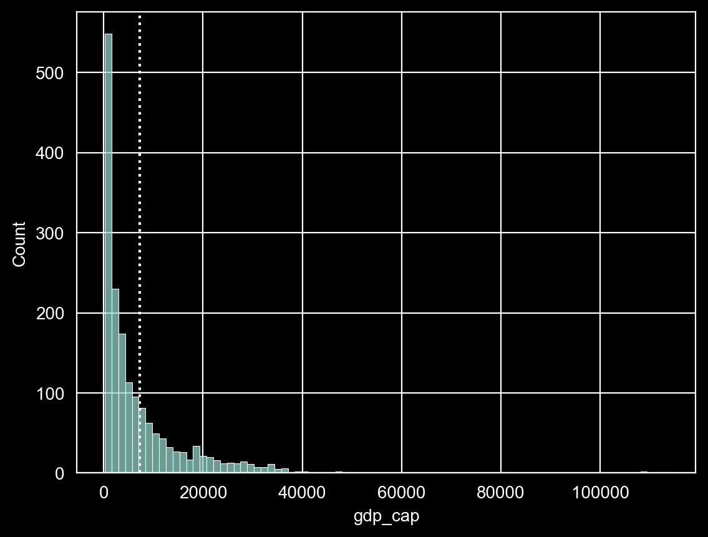
    


#### Your turn

Is it possible to calculate the average of the column “continent”? Why or why not?


```python
df_gapminder['continent']
```


    0         Asia
    1         Asia
    2         Asia
    3         Asia
    4         Asia
             ...  
    1699    Africa
    1700    Africa
    1701    Africa
    1702    Africa
    1703    Africa
    Name: continent, Length: 1704, dtype: str


```python
### Your comment here
#No, it is not. Continent column contains nominal data, so text labels. We cannot calculate the average value, but wa can calculate mode, so the most frequent occuring value
```

#### Your turn

- Subtract each observation in `numbers` from the `average` of this `list`.  
- Then calculate the **sum** of these deviations from the `average`.

What is their sum?


```python
import numpy as np
numbers = np.array([1, 2, 3, 4])
### Your code here
mean = np.mean(numbers)
sum_deviation = np.sum(numbers - mean)
print(sum_deviation)
```

    0.0
    

#### Summary of the first part

- The mean is one of the most common measures of central tendency.  
- It can only be used for **continuous** interval/ratio data.  
- The **sum of deviations** from the mean is equal to `0`. 
- The “mean” is most affected by **skewness** and **outliers**.

### *Median*

> *Median* is calculated by sorting all values from smallest to largest and then finding the value in the middle.

- The median is the number that divides a data set into two equal halves.
- To calculate the median, we need to sort our data set of n numbers in ascending order.
- The median of this data set is the number in the position $(n+1)/2$ if $n$ is odd.
- If n is even, the median is the average of the $(n/2)$ third number and the $(n+2)/2$ third number.
- The median is robust to outliers.
- Thus, in the case of skewed distributions or when there is concern about outliers, the median may be preferred.


```python
df_gapminder['gdp_cap'].median()
```


    np.float64(3531.8469885)


#### Comparison of `median` and `average`.

The direction of inclination has less effect on the `median`.


```python
sns.histplot(data = df_gapminder, x = "gdp_cap")
plt.axvline(df_gapminder['gdp_cap'].mean(), linestyle = "dotted", color = "blue")
plt.axvline(df_gapminder['gdp_cap'].median(), linestyle = "dashed", color = "red");
```


    
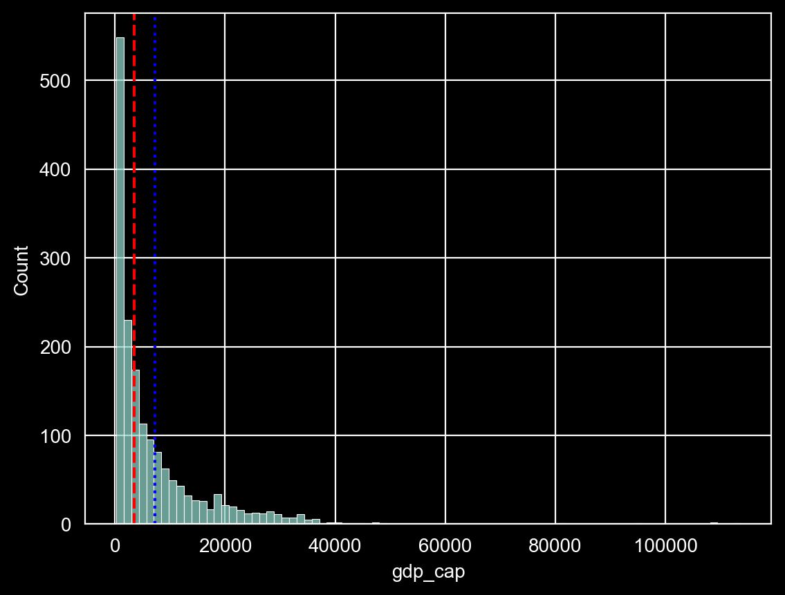
    


#### Your turn

Is it possible to calculate the median of the column “continent”? Why or why not?


```python
### Your comment here
#No it is not possible. TO calculate the median we have to put the data into the descending or non-descending order, we cannot do that with nominal data
```

### *Mode*

> **Mode** is the most common value in a data set. 

Unlike `median` or `average`, `mode` can be used with **categorical** data.


```python
df_pokemon = pd.read_csv("pokemon.csv")
df_pokemon['Type 1'].mode()
```


    0    Water
    Name: Type 1, dtype: str


#### `mode()` returns multiple values?

- If multiple values *bind* for the most frequent one, `mode()` will return them all.
- This is because technically, a distribution can have multiple values for the most frequent - modal!


```python
df_gapminder['gdp_cap'].mode()
```


    0          241.165876
    1          277.551859
    2          298.846212
    3          299.850319
    4          312.188423
                ...      
    1699     80894.883260
    1700     95458.111760
    1701    108382.352900
    1702    109347.867000
    1703    113523.132900
    Name: gdp_cap, Length: 1704, dtype: float64


### Measures of central tendency - summary

|Measure|Can be used for:|Limitations|
|-------|----------------|-----------|
|Mean|Continuous data|Influence on skewness and outliers|
|Median|Continuous data|Does not include the *value* of all data points in the calculation (ranks only)|
|Mode|Continuous and categorical data|Considers only *frequent*; ignores other values|

## Quantiles

**Quantiles** are descriptive - positional statistics that divide an ordered data set into equal parts. The most common quantiles are:

- **Median** (quantile of order 0.5),
- **Quartiles** (divide the data into 4 parts),
- **Deciles** (into 10 parts),
- **Percentiles** (into 100 parts).

### Definition

A quantile of order $q \in (0,1)$ is a value of $x_q$ such that:

$$
P(X \leq x_q) = q
$$

In other words: $q \cdot 100\%$ of the values in the data set are less than or equal to $x_q$.

### Formula (for an ordered data set)

For a data sample $x_1, x_2, \ldots, x_n$ ordered in ascending order, the quantile of order $q$ is determined as:

1. Calculate the positional index:

$$
i = q \cdot (n + 1)
$$

2. If $i$ is an integer, then the quantile is $x_i$.

3. If $i$ is not integer, we interpolate linearly between adjacent values:

$$
x_q = x_{\lfloor i \rfloor} + (i - \lfloor i \rfloor) \cdot (x_{\lceil i \rceil} - x_{\lfloor i \rfloor})
$$

**Note:** In practice, different methods are used to determine quantiles - libraries such as NumPy or Pandas have different modes (e.g. `method='linear'`, `method='midpoint'`).

### Example - we calculate step by step:

For data:
$
[3, 7, 8, 5, 12, 14, 21, 13, 18]
$

1. We arrange the data in ascending order:

$
[3, 5, 7, 8, 12, 13, 14, 18, 21]
$

2. Median (quantile of order 0.5):

The number of elements $n = 9$, the middle element is the 5th value:

$
\text{Median} = x_5 = 12
$

3. First quartile (Q1, quantile of order 0.25):

$
i = 0.25 \cdot (9 + 1) = 2.5
$

Interpolation between $x_2 = 5$ and $x_3 = 7$:

$
Q_1 = 5 + 0.5 \cdot (7 - 5) = 6
$

4. Third quartile (Q3, quantile of 0.75):

$
i = 0.75 \cdot 10 = 7.5
$

Interpolation between $x_7 = 14$ and $x_8 = 18$:

$
Q_3 = 14 + 0.5 \cdot (18 - 14) = 16
$

### Deciles

**Deciles** divide data into 10 equal parts. For example:

- **D1** is the 10th percentile (quantile of 0.1),
- **D5** is the median (0.5),
- **D9** is the 90th percentile (0.9).

The formula is the same as for overall quantiles, just use the corresponding $q$. E.g. for D3:

$
q = \frac{3}{10} = 0.3
$

### Percentiles

**Percentiles** divide data into 100 equal parts. E.g.:

- **P25** = Q1,
- **P50** = median,
- **P75** = Q3,
- **P90** is the value below which 90% of the data is.

With percentiles, we can better understand the distribution of data - for example, in standardized tests, a score is often given as a percentile (e.g., “85th percentile” means that someone scored better than 85% of the population).

---

### Quantiles - summary

| Name     | Symbol | Quantile \( q \) | Meaning                          |
|-----------|--------|------------------|-------------------------------------|
| Q1        | Q1     | 0.25             | 25% of data ≤ Q1                     |
| Median   | Q2     | 0.5              | 50% of data ≤ Median                |
| Q3        | Q3     | 0.75             | 75% of data ≤ Q3                     |
| Decile 1   | D1     | 0.1              | 10% of data ≤ D1                     |
| Decile 9   | D9     | 0.9              | 90% of data ≤ D9                     |
| Percentile 95 | P95 | 0.95             | 95% of data ≤ P95                    |

---

### Example - calculations of quantiles


```python
# Sample data
mydata = [3, 7, 8, 5, 12, 14, 21, 13, 18]
mydata_sorted = sorted(mydata)
print("Sorted data:", mydata_sorted)
```

    Sorted data: [3, 5, 7, 8, 12, 13, 14, 18, 21]
    


```python
# Conversion to Pandas Series
s = pd.Series(mydata)

# Quantiles
q1 = s.quantile(0.25) # lower quartile Q1
median = s.quantile(0.5) # median or middle quartile Q2 = Me
q3 = s.quantile(0.75) # upper quartile Q3

# Deciles
d1 = s.quantile(0.1) # bottom 10% of data...
d9 = s.quantile(0.9) # top 10% of data...

# Percentiles
p95 = s.quantile(0.95)  # top 5% of data...

print("Quantiles:")
print(f"Q1 (25%): {q1}")
print(f"Median (50%): {median}")
print(f"Q3 (75%): {q3}")
print("\nDeciles:")
print(f"D1 (10%): {d1}")
print(f"D9 (90%): {d9}")
print("\nPercentiles:")
print(f"P95 (95%): {p95}")
```

    Quantiles:
    Q1 (25%): 7.0
    Median (50%): 12.0
    Q3 (75%): 14.0
    
    Deciles:
    D1 (10%): 4.6
    D9 (90%): 18.6
    
    Percentiles:
    P95 (95%): 19.799999999999997
    


```python
# Create boxplot
fig, ax = plt.subplots(figsize=(8, 6))
sns.boxplot(data=mydata, ax=ax, color='lightblue', width=0.3)

# Calculate statistics
minimum = np.min(mydata)
q1 = np.percentile(mydata, 25)
median = np.median(mydata)
q3 = np.percentile(mydata, 75)
maximum = np.max(mydata)
mean = np.mean(mydata)

ax.scatter(0, minimum, color='red', label='Min', zorder=5)
ax.scatter(0, q1, color='orange', label='Q1 (25th percentile)', zorder=5)
ax.scatter(0, median, color='green', label='Median (50th percentile)', zorder=5)
ax.scatter(0, q3, color='purple', label='Q3 (75th percentile)', zorder=5)
ax.scatter(0, maximum, color='brown', label='Max', zorder=5)
ax.scatter(0, mean, color='black', marker='D', s=60, label='Mean', zorder=5)

for value, name, color in zip(
    [minimum, q1, median, mean, q3, maximum],
    ['Min', 'Q1', 'Median', 'Mean', 'Q3', 'Max'],
    ['red', 'orange', 'green', 'black', 'purple', 'brown']
):
    ax.text(0.1, value, f'{name}: {value:.2f}', verticalalignment='center', color=color)


ax.set_title('Boxplot of mydata with All Measures Marked')
ax.legend(bbox_to_anchor=(1.05, 1), loc='upper left')
plt.show()
```


    
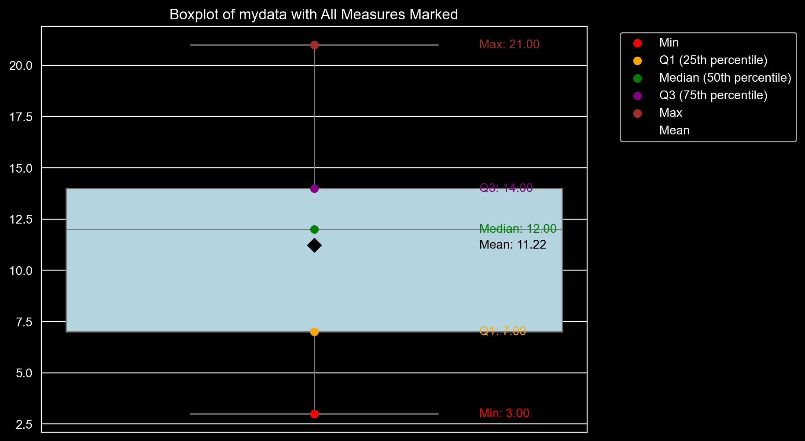
    


### Your turn!

Try to change the boxplot into the violin plot (or add it). 

Looking at the aforementioned quantile results and the box plot, try to interpret these measures. 


```python

```

## Variability

> **Variability** (or **dispersion**) refers to the degree to which values in a distribution are *dispersed*, i.e., differ from each other.

The **dispersion** is an indicator of how far from the center we can find data values. The most common measures of dispersion are **variance**, **standard deviation** and **interquartile range (IQR)**. The **variance** is a standard measure of dispersion. The **standard deviation** is the square root of the variance. The **variance** and **standard deviation** are two useful measures of scatter.

### The `mean` hides the variance!

Both distributions have *the same* mean, but *different* **standard deviations**.


```python
### Let's create some distributions
d1 = np.random.normal(loc = 0, scale = 1, size = 1000)
d2 = np.random.normal(loc = 0, scale = 5, size = 1000)
### Plots
fig, axes = plt.subplots(1, 2, sharex=True, sharey=True);
p1 = axes[0].hist(d1, alpha = .5)
p2 = axes[1].hist(d2, alpha = .5)
axes[0].set_title("Lower variance");
axes[1].set_title("Higher variance");
```


    
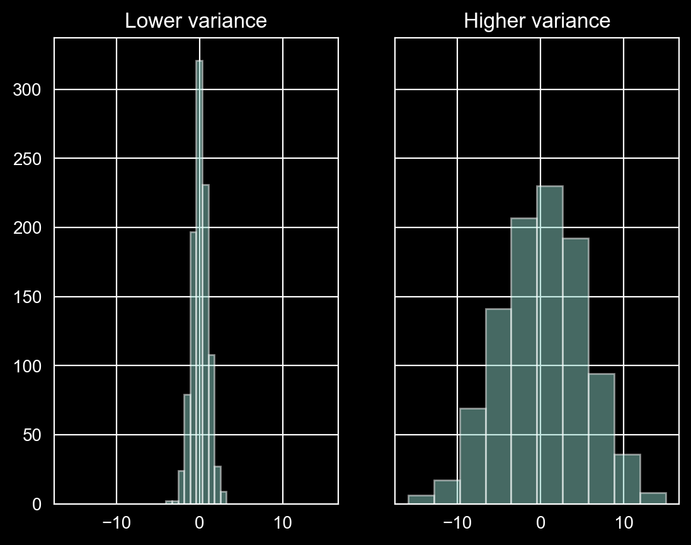
    


### Volatility detection

There are at least *three* main approaches to quantifying variability:

- **Range**: the difference between the “maximum” and “minimum” value. 
- **Interquartile range (IQR)**: The range of the middle 50% of the data.  
- **Variance** and **Standard Deviation**: the typical value by which results deviate from the mean.

### Range

> **Range** Is the difference between the `maximum` and `minimum` values.

Intuitive, but only considers two values in the entire distribution.


```python
d1.max() - d1.min()
```


    np.float64(7.273520338036553)


```python
d2.max() - d2.min()
```


    np.float64(31.080108056507882)


### IQR

> The **interquartile range (IQR)** is the difference between a value in the 75% percentile and a value in the 25% percentile.

It focuses on the **center 50%**, but still only considers two values.

- IQR is calculated using the limits of the data between the 1st and 3rd quartiles. 
- The interquartile range (IQR) can be calculated as follows: $IQR = Q3 - Q1$
- In the same way that the median is more robust than the mean, the IQR is a more robust measure of scatter than the variance and standard deviation and should therefore be preferred for small or asymmetric distributions. 
- It is a robust measure of scatter.


```python
## Let's calculate quantiles - quartiles Q1 and Q3
q3, q1 = np.percentile(d1, [75 ,25])
q3 - q1
```


    np.float64(1.2709003372643837)


```python
## Let's calculate quantiles - quartiles Q1 and Q3
q3, q1 = np.percentile(d2, [75 ,25])
q3 - q1
```


    np.float64(7.07831500525432)


### Variance and standard deviation.

The **Variance** measures the dispersion of a set of data points around their mean value. It is the average of the squares of the individual deviations. The variance gives the results in original units squared.

$$
s^2 = \frac{1}{n - 1} \sum_{i=1}^{n} (x_i - \bar{x})^2
$$

**Standard deviation (SD)** measures the *typical value* by which the results in the distribution deviate from the mean.

$$
s = \sqrt{s^2} = \sqrt{\frac{1}{n - 1} \sum_{i=1}^{n} (x_i - \bar{x})^2}
$$

where:
	- $n$ - the number of elements in the sample
	- $\bar{x}$ - the arithmetic mean of the sample

What to keep in mind:

- SD is the *square root* of [variance](https://en.wikipedia.org/wiki/Variance).  
- There are actually *two* measures of SD:
 - SD of a population: when you measure the entire population of interest (very rare).  
   - SD of a sample: when you measure a *sample* (typical case); we'll focus on that.

#### SD, explained

- First, calculate the total *square deviation*.
   - What is the total square deviation from the “mean”? 
- Then divide by `n - 1`: normalize to the number of observations.
   - What is the *average* squared deviation from the `average'?
- Finally, take the *square root*:
   - What is the *average* deviation from the “mean”?

The **standard deviation** represents the *typical* or “average” deviation from the “mean”.

#### SD calculation in `pandas`


```python
df_pokemon['Attack'].std()
```


    np.float64(32.45736586949845)


```python
df_pokemon['HP'].std()
```


    np.float64(25.53466903233207)


#### Note on `numpy.std`!!!

- By default, `numpy.std` calculates the **population standard deviation**!  
- You need to modify the `ddof` parameter to calculate the **sample standard deviation**.

This is a very common error.


```python
### SD in population
d1.std()
```


    np.float64(0.9813312813888081)


```python
### SD for sample
d1.std(ddof = 1)
```


    np.float64(0.9818223153356677)


### Coefficient of variation (CV).

- The coefficient of variation (CV) is equal to the standard deviation divided by the mean.
- It is also known as “relative standard deviation.”

$$
CV = \frac{s}{\bar{x}} \cdot 100%
$$


```python
X = [2, 4, 4, 4, 5, 5, 7, 9]
mean = np.mean(X)

# Variance and standard deviation from scipy (for the sample!):
var_sample = stats.tvar(X)      # sample variance
std_sample = stats.tstd(X)      # sample sd

# CV (for sample):
cv_sample = (std_sample / mean) * 100

print(f"Mean: {mean}")
print(f"Sample variance (scipy): {var_sample}")
print(f"Sample sd (scipy): {std_sample}")
print(f"CV (scipy): {cv_sample:.2f}%")
```

    Mean: 5.0
    Sample variance (scipy): 4.571428571428571
    Sample sd (scipy): 2.138089935299395
    CV (scipy): 42.76%
    

## Interquartile deviation

Interquartile deviation (sometimes called the semi-interquartile range) is defined as half of the interquartile range:

$$ \text{IQR deviation} = \frac{Q3 - Q1}{2} $$

This value shows the average distance from the median to the quartiles and is a robust measure of variability.

- A small interquartile deviation means the middle 50% of the data are close to the median.
- A large interquartile deviation means the middle 50% are more spread out.

It is less sensitive to outliers than the standard deviation or range!

# Your turn!

Calculate STD and CV for the SPEED of LEGENDARY and NOT LEGENDARY pokemons. What is the IQR deviation? 


```python
grouped_speed = df_pokemon.groupby('Legendary')['Speed']

def calculate_cv(x):
    return (x.std() / x.mean()) * 100

def calculate_iqr_deviation(x):
    return (x.quantile(0.75) - x.quantile(0.25)) / 2

speed_stats = grouped_speed.agg(
    Mean='mean',
    Standard_Deviation='std',
    CV_Percentage=calculate_cv,
    IQR_Deviation=calculate_iqr_deviation
)

print(speed_stats)
```

                     Mean  Standard_Deviation  CV_Percentage  IQR_Deviation
    Legendary                                                              
    False       65.455782           27.843038      42.537171           20.0
    True       100.184615           22.952323      22.910028           10.0
    

## Measures of the shape of the distribution

Now we will look at measures of the shape of the distribution. There are two statistical measures that can tell us about the shape of a distribution. These are **skewness** and **curvature**. These measures can be used to tell us about the shape of the distribution of a data set.

## Skewness
- **Skewness** is a measure of the symmetry of a distribution, or more precisely, the lack of symmetry. 
- It is used to determine the lack of symmetry with respect to the mean of a data set. 
- It is a characteristic of deviation from the mean. 
- It is used to indicate the shape of a data distribution.

Skewness is a measure of the asymmetry of the distribution of data relative to the mean. It tells us whether the data are more ‘stretched’ to one side.

Interpretation:

- Skewness > 0 - right-tailed (positive): long tail on the right (larger values are more dispersed)
- Skewness < 0 - left (negative): long tail on the left (smaller values are more dispersed)
- Skewness ≈ 0 - symmetric distribution (e.g. normal distribution)

Formula (for the sample):

$$
A = \frac{n}{(n-1)(n-2)} \sum_{i=1}^{n} \left( \frac{x_i - \bar{x}}{s} \right)^3
$$

where:
- $n$ - number of observations
- $\bar{x}$ - sample mean
- $s$ - standard deviation of the sample


#### Negative skewness

- In this case, the data are skewed or shifted to the left. 
- By skewed to the left, we mean that the left tail is long relative to the right tail. 
- The data values may extend further to the left, but are concentrated on the right. 
- So we are dealing with a long tail, and the distortion is caused by very small values that pull the mean down and it is smaller than the median. 
- In this case we have **Mean < Median < Mode**.
      

#### Zero skewness

- This means that the dataset is symmetric. 
- A dataset is symmetric if it looks the same to the left and right of the midpoint. 
- A dataset is bell-shaped or symmetric. 
- A perfectly symmetrical dataset will have a skewness of zero. 
- So a normal distribution that is perfectly symmetric has a skewness of 0. 
- In this case we have **Mean = Median = Mode**.
      

#### Positive skewness

- The dataset is skewed or shifted to the right. 
- By skewed to the right we mean that the right tail is long relative to the left tail. 
- The data values are concentrated on the right side. 
- There is a long tail on the right side, which is caused by very large values that pull the mean upwards and it is larger than the median. 
- So we have **Mean > Median > Mode**.


```python
from scipy.stats import skew
X = [2, 4, 4, 4, 5, 5, 7, 9]
skewness = skew(X)
print(f"Skewness of X: {skewness:.4f}")
```

    Skewness of X: 0.6562
    

### Your turn

Try to interpret the above-mentioned result and calculate example slant ratios for several groups of Pokémon.


```python
# INTERPRETATION OF THE RESULT FROM CELL 86:
# The sample skewness for the dataset X is approximately 0.656. Since this value is greater than 0,
# it indicates a right-skewed distribution. This means most data points are clustered on the lower end, with a longer tail stretching towards the higher values on the right.


pokemon_skew = df_pokemon.groupby('Type 1')['Attack'].skew()
print("Skewness of Attack points across different Pokémon types:")
print(pokemon_skew)
```

    Skewness of Attack points across different Pokémon types:
    Type 1
    Bug         0.815756
    Dark        0.565949
    Dragon      0.198652
    Electric    0.621533
    Fairy       1.055304
    Fighting   -0.427173
    Fire        0.350478
    Flying     -0.749630
    Ghost       0.915441
    Grass       0.162911
    Ground      0.599645
    Ice         0.633671
    Normal      0.368517
    Poison     -0.005292
    Psychic     1.158986
    Rock        0.256045
    Steel       0.056582
    Water       0.445246
    Name: Attack, dtype: float64
    

### Interquartile Skewness

**IQR skewness** is a robust, non-parametric measure of skewness that uses the positions of the quartiles rather than the mean and standard deviation. It is particularly useful for detecting asymmetry in data distributions, especially when outliers are present.

The formula for IQR Skewness is:

$$
IQR\ Skewness = \frac{(Q3 - Median) - (Median - Q1)}{Q3 - Q1}
$$
This method is **less sensitive to outliers** and more **robust** than moment-based skewness, making it ideal for exploratory data analysis.

### Your turn

Try to calculate the IQR Skewness coefficient for the sample data:


```python
mydata = [3, 7, 8, 5, 12, 14, 21, 13, 18]

s = pd.Series(mydata)

q1 = s.quantile(0.25)
median = s.median()
q3 = s.quantile(0.75)
iqr_skewness = ((q3 - median) - (median - q1)) / (q3 - q1)

print(f"Quartile 1 (Q1): {q1}")
print(f"Median (Q2): {median}")
print(f"Quartile 3 (Q3): {q3}")
print(f"IQR Skewness Coefficient: {iqr_skewness:.4f}")
```

    Quartile 1 (Q1): 7.0
    Median (Q2): 12.0
    Quartile 3 (Q3): 14.0
    IQR Skewness Coefficient: -0.4286
    

## Kurtosis

Contrary to what some textbooks claim, kurtosis does not measure the ‘flattening’, the ‘peaking’ of a distribution.

> **Kurtosis** depends on the intensity of the extremes, so it measures what happens in the ‘tails’ of the distribution, the shape of the ‘top’ is irrelevant!

**Excess kurtosis** is just kurtosis minus 3. It’s used to compare a distribution to the normal distribution (which has kurtosis = 3).


Sample kurtosis:

$$
\text{Kurtosis} = \frac{1}{n} \sum_{i=1}^{n} \left( \frac{x_i - \bar{x}}{s} \right)^4
$$

$$
\text{Normalized kurtosis} = \text{Kurtosis} - 3
$$

#### Reference range for kurtosis
- The reference standard is the normal distribution, which has a kurtosis of 3. 
- Often **Excess** is presented instead of kurtosis, where **excess** is simply **Kurtosis - 3**. 

#### Mesocurve
- A normal distribution has a kurtosis of exactly 3 (**Excess** exactly 0). 
- Any distribution with kurtosis $≈3$ (exces ≈ 0) is called **mezocurtic**.

#### Platykurtic curve
- A distribution with kurtosis $<3$ (**Excess** < 0) is called **platykurtic**. 
- Compared to a normal distribution, its central peak is lower and wider and its tails are shorter and thinner.

#### Leptokurtic curve

- A distribution with kurtosis $>3$ (**Excess** > 0) is called **leptocurtic**. 
- Compared to a normal distribution, its central peak is higher and sharper and its tails are longer and thicker.


So:
- Excess Kurtosis ≈ 0 → Normal distribution
- Excess Kurtosis > 0 → Leptokurtic (heavy tails)
- Excess Kurtosis < 0 → Platykurtic (light tails)


```python
from scipy.stats import kurtosis
import numpy as np

data = np.array([2, 8, 0, 4, 1, 9, 9, 0])

# By default, it returns excess kurtosis
excess_kurt = kurtosis(data)
print("Excess Kurtosis:", excess_kurt)

# To get regular kurtosis (not excess), set fisher=False
regular_kurt = kurtosis(data, fisher=False)
print("Regular Kurtosis:", regular_kurt)
```

    Excess Kurtosis: -1.6660010752838508
    Regular Kurtosis: 1.3339989247161492
    

### Interquartile Kurtosis

**IQR Kurtosis** is a robust, non-parametric measure of kurtosis that focuses on the tails of the distribution using interquartile ranges. It is particularly useful for detecting the intensity of extreme values in data distributions, especially when outliers are present.

The formula for IQR Kurtosis is:

$$
IQR\ Kurtosis = \frac{Q3 - Q1}{2*(C90 - C10)}
$$

Where:
- $Q1$ is the first quartile (25th percentile),
- $Q3$ is the third quartile (75th percentile),
- $C90$ is the 90th percentile,
- $C10$ is the 10th percentile.

**Interpretation**:

IQR Kurtosis differs from traditional kurtosis in its interpretation. While traditional kurtosis focuses on the intensity of the tails of a distribution (e.g., heavy or light tails), IQR Kurtosis is a robust measure that emphasizes the relative spread of the interquartile range (IQR) and the symmetry of the distribution around the median.

### Your turn

Try to calculate the IQR Kurtosis coefficient for the sample data:


```python
mydata = [3, 7, 8, 5, 12, 14, 21, 13, 18]
s = pd.Series(mydata)
q1 = s.quantile(0.25)
q3 = s.quantile(0.75)
c10 = s.quantile(0.10)
c90 = s.quantile(0.90)

iqr_kurtosis = (q3 - q1) / (2 * (c90 - c10))

print(f"Q1: {q1}, Q3: {q3}")
print(f"C10: {c10}, C90: {c90}")
print(f"IQR Kurtosis Coefficient: {iqr_kurtosis:.4f}")
```

    Q1: 7.0, Q3: 14.0
    C10: 4.6, C90: 18.6
    IQR Kurtosis Coefficient: 0.2500
    

## Summary statistics

A great tool for creating elegant summaries of descriptive statistics in Markdown format (ideal for Jupyter Notebooks) is pandas, especially in combination with the .describe() function and tabulate.

Example with pandas + tabulate (a nice table in Markdown):


```python
from scipy.stats import skew, kurtosis
from tabulate import tabulate

def markdown_summary(df, round_decimals=3):
    summary = df.describe().T  # transpose so that the variables are in rows
    # Add skewness and kurtosis
    summary['Skewness'] = df.skew()
    summary['Kurtosis'] = df.kurt()
    # Rounding up the results
    summary = summary.round(round_decimals)
    # Nice summary table!
    return tabulate(summary, headers='keys', tablefmt='github')
```


```python
# We select only the numerical columns for analysis:
quantitative = df_pokemon.select_dtypes(include='number')

# We use our function:
print(markdown_summary(quantitative))
```

    |            |   count |    mean |     std |   min |    25% |   50% |    75% |   max |   Skewness |   Kurtosis |
    |------------|---------|---------|---------|-------|--------|-------|--------|-------|------------|------------|
    | #          |     800 | 362.814 | 208.344 |     1 | 184.75 | 364.5 | 539.25 |   721 |     -0.001 |     -1.166 |
    | Total      |     800 | 435.102 | 119.963 |   180 | 330    | 450   | 515    |   780 |      0.153 |     -0.507 |
    | HP         |     800 |  69.259 |  25.535 |     1 |  50    |  65   |  80    |   255 |      1.568 |      7.232 |
    | Attack     |     800 |  79.001 |  32.457 |     5 |  55    |  75   | 100    |   190 |      0.552 |      0.17  |
    | Defense    |     800 |  73.842 |  31.184 |     5 |  50    |  70   |  90    |   230 |      1.156 |      2.726 |
    | Sp. Atk    |     800 |  72.82  |  32.722 |    10 |  49.75 |  65   |  95    |   194 |      0.745 |      0.298 |
    | Sp. Def    |     800 |  71.902 |  27.829 |    20 |  50    |  70   |  90    |   230 |      0.854 |      1.628 |
    | Speed      |     800 |  68.278 |  29.06  |     5 |  45    |  65   |  90    |   180 |      0.358 |     -0.236 |
    | Generation |     800 |   3.324 |   1.661 |     1 |   2    |   3   |   5    |     6 |      0.014 |     -1.24  |
    

To make a summary table cross-sectionally (i.e. **by group**), you need to use the groupby() method on the DataFrame and then, for example, describe() or your own aggregate function. 

Let's say you want to group the data by the ‘Type 1’ column (i.e. e.g. Pokémon type: Fire, Water, etc.) and then summarise the quantitative variables (mean, variance, min, max, etc.).


```python
# Grouping by ‘Type 1’ column and statistical summary of numeric columns:
group_summary = df_pokemon.groupby('Type 1')[quantitative.columns].describe()
print(group_summary)
```

                  #                                                               \
              count        mean         std    min     25%    50%     75%    max   
    Type 1                                                                         
    Bug        69.0  334.492754  210.445160   10.0  168.00  291.0  543.00  666.0   
    Dark       31.0  461.354839  176.022072  197.0  282.00  509.0  627.00  717.0   
    Dragon     32.0  474.375000  170.190169  147.0  373.00  443.5  643.25  718.0   
    Electric   44.0  363.500000  202.731063   25.0  179.75  403.5  489.75  702.0   
    Fairy      17.0  449.529412  271.983942   35.0  176.00  669.0  683.00  716.0   
    Fighting   27.0  363.851852  218.565200   56.0  171.50  308.0  536.00  701.0   
    Fire       52.0  327.403846  226.262840    4.0  143.50  289.5  513.25  721.0   
    Flying      4.0  677.750000   42.437209  641.0  641.00  677.5  714.25  715.0   
    Ghost      32.0  486.500000  209.189218   92.0  354.75  487.0  709.25  711.0   
    Grass      70.0  344.871429  200.264385    1.0  187.25  372.0  496.75  673.0   
    Ground     32.0  356.281250  204.899855   27.0  183.25  363.5  535.25  645.0   
    Ice        24.0  423.541667  175.465834  124.0  330.25  371.5  583.25  713.0   
    Normal     98.0  319.173469  193.854820   16.0  161.25  296.5  483.00  676.0   
    Poison     28.0  251.785714  228.801767   23.0   33.75  139.5  451.25  691.0   
    Psychic    57.0  380.807018  194.600455   63.0  201.00  386.0  528.00  720.0   
    Rock       44.0  392.727273  213.746140   74.0  230.75  362.5  566.25  719.0   
    Steel      27.0  442.851852  164.847180  208.0  305.50  379.0  600.50  707.0   
    Water     112.0  303.089286  188.440807    7.0  130.00  275.0  456.25  693.0   
    
              Total              ...   Speed        Generation            \
              count        mean  ...     75%    max      count      mean   
    Type 1                       ...                                       
    Bug        69.0  378.927536  ...   85.00  160.0       69.0  3.217391   
    Dark       31.0  445.741935  ...   98.50  125.0       31.0  4.032258   
    Dragon     32.0  550.531250  ...   97.75  120.0       32.0  3.875000   
    Electric   44.0  443.409091  ...  101.50  140.0       44.0  3.272727   
    Fairy      17.0  413.176471  ...   60.00   99.0       17.0  4.117647   
    Fighting   27.0  416.444444  ...   86.00  118.0       27.0  3.370370   
    Fire       52.0  458.076923  ...   96.25  126.0       52.0  3.211538   
    Flying      4.0  485.000000  ...  121.50  123.0        4.0  5.500000   
    Ghost      32.0  439.562500  ...   84.25  130.0       32.0  4.187500   
    Grass      70.0  421.142857  ...   80.00  145.0       70.0  3.357143   
    Ground     32.0  437.500000  ...   90.00  120.0       32.0  3.156250   
    Ice        24.0  433.458333  ...   80.00  110.0       24.0  3.541667   
    Normal     98.0  401.683673  ...   90.75  135.0       98.0  3.051020   
    Poison     28.0  399.142857  ...   77.00  130.0       28.0  2.535714   
    Psychic    57.0  475.947368  ...  104.00  180.0       57.0  3.385965   
    Rock       44.0  453.750000  ...   70.00  150.0       44.0  3.454545   
    Steel      27.0  487.703704  ...   70.00  110.0       27.0  3.851852   
    Water     112.0  430.455357  ...   82.00  122.0      112.0  2.857143   
    
                                                   
                   std  min   25%  50%   75%  max  
    Type 1                                         
    Bug       1.598433  1.0  2.00  3.0  5.00  6.0  
    Dark      1.353609  2.0  3.00  5.0  5.00  6.0  
    Dragon    1.431219  1.0  3.00  4.0  5.00  6.0  
    Electric  1.604697  1.0  2.00  4.0  4.25  6.0  
    Fairy     2.147160  1.0  2.00  6.0  6.00  6.0  
    Fighting  1.800601  1.0  1.50  3.0  5.00  6.0  
    Fire      1.850665  1.0  1.00  3.0  5.00  6.0  
    Flying    0.577350  5.0  5.00  5.5  6.00  6.0  
    Ghost     1.693203  1.0  3.00  4.0  6.00  6.0  
    Grass     1.579173  1.0  2.00  3.5  5.00  6.0  
    Ground    1.588454  1.0  1.75  3.0  5.00  5.0  
    Ice       1.473805  1.0  2.75  3.0  5.00  6.0  
    Normal    1.575407  1.0  2.00  3.0  4.00  6.0  
    Poison    1.752927  1.0  1.00  1.5  4.00  6.0  
    Psychic   1.644845  1.0  2.00  3.0  5.00  6.0  
    Rock      1.848375  1.0  2.00  3.0  5.00  6.0  
    Steel     1.350319  2.0  3.00  3.0  5.00  6.0  
    Water     1.558800  1.0  1.00  3.0  4.00  6.0  
    
    [18 rows x 72 columns]
    

## Cross-sectional analysis

Let's try to calculate all those statistics by group i.e. perform descriptive analysis for Attack points by Legendary (for legendary and not legendary pokemons.)


```python
grouped_attack = df_pokemon.groupby('Legendary')['Attack']
grouped_summary = grouped_attack.describe()
# let's add skewness and kurtosis now:
grouped_summary['Skewness'] = grouped_attack.apply(lambda x: x.skew())
grouped_summary['Kurtosis'] = grouped_attack.apply(lambda x: x.kurt())
from tabulate import tabulate
print(tabulate(grouped_summary, headers='keys', tablefmt='github'))  #summary in markdown table now
```

    | Legendary   |   count |     mean |     std |   min |   25% |   50% |   75% |   max |   Skewness |   Kurtosis |
    |-------------|---------|----------|---------|-------|-------|-------|-------|-------|------------|------------|
    | False       |     735 |  75.6694 | 30.4902 |     5 |  54.5 |    72 |    95 |   185 |   0.523333 |   0.145037 |
    | True        |      65 | 116.677  | 30.348  |    50 | 100   |   110 |   131 |   190 |   0.50957  |  -0.18957  |
    

### Your turn!

Add some cross-sectional plots and try to interpret the results.


```python
import matplotlib.pyplot as plt
import seaborn as sns

fig, axes = plt.subplots(1, 2, figsize=(14, 6))

sns.boxplot(
    ax=axes[0],
    x='Legendary',
    y='Attack',
    data=df_pokemon,
    palette='Set2',
    hue='Legendary',
    legend=False
)
axes[0].set_title('Distribution of Attack Points (Boxplot)')
axes[0].set_xlabel('Is the Pokémon Legendary?')
axes[0].set_ylabel('Attack')

sns.kdeplot(
    ax=axes[1],
    data=df_pokemon,
    x='Attack',
    hue='Legendary',
    fill=True,
    common_norm=False,
    palette='Set2'
)
axes[1].set_title('Density Distribution of Attack Points (KDE)')
axes[1].set_xlabel('Attack')
axes[1].set_ylabel('Density')

plt.tight_layout()
plt.show()
```


    

    


Boxplot:

The boxplot shows that Legendary Pokémon have a substantially higher median Attack level than non-Legendary Pokémon.
The middle 50% of the data for Legendary Pokémon is shifted upward—their lower quartile ($Q_1$) which almost perfectly aligns with the upper quartile ($Q_3$) of non-Legendary Pokémon.

KDE Plot:

Non-Legendary Pokémon have a unimodal distribution peaking sharply around 60–80 points with slight right-skewness.
The Legendary group displays a much broader, flatter distribution shifted far to the right, peaking near 100–130 Attack points.

### Quiz answers on measurement scales:
1. B  
2. C  
3. C  
4. C  
5. D


# Exercise9.ipynb report just in case

---
title: Bivariate Statistics
subtitle: Foundations of Statistical Analysis in Python
abstract: This notebook explores bivariate relationships through linear correlations, highlighting their strengths and limitations. Practical examples and visualizations are provided to help users understand and apply these statistical concepts effectively.
author:
  - name: Karol Flisikowski
    affiliations: 
      - Gdansk University of Technology
      - Chongqing Technology and Business University
    orcid: 0000-0002-4160-1297
    email: karol@ctbu.edu.cn
date: 2025-05-03
---

## Goals of this lecture

There are many ways to *describe* a distribution. 

Here we will discuss:
- Measurement of the relationship between distributions using **linear, rank correlations**.
- Measurement of the relationship between qualitative variables using **contingency**.

## Importing relevant libraries


```python
import numpy as np
import matplotlib.pyplot as plt
import seaborn as sns ### importing seaborn
import pandas as pd
import scipy.stats as ss
```


```python
%matplotlib inline 
%config InlineBackend.figure_format = 'retina'
```


```python
import pandas as pd
df_pokemon = pd.read_csv("pokemon.csv")
```

## Describing *bivariate* data with correlations

- So far, we've been focusing on *univariate data*: a single distribution.
- What if we want to describe how *two distributions* relate to each other?
   - For today, we'll focus on *continuous distributions*.

### Bivariate relationships: `height`

- A classic example of **continuous bivariate data** is the `height` of a `parent` and `child`.  
- [These data were famously collected by Karl Pearson](https://www.kaggle.com/datasets/abhilash04/fathersandsonheight).


```python
df_height = pd.read_csv("height.csv")
df_height.head(2)
```


<div>
<style scoped>
    .dataframe tbody tr th:only-of-type {
        vertical-align: middle;
    }

    .dataframe tbody tr th {
        vertical-align: top;
    }

    .dataframe thead th {
        text-align: right;
    }
</style>
<table border="1" class="dataframe">
  <thead>
    <tr style="text-align: right;">
      <th></th>
      <th>Father</th>
      <th>Son</th>
    </tr>
  </thead>
  <tbody>
    <tr>
      <th>0</th>
      <td>65.0</td>
      <td>59.8</td>
    </tr>
    <tr>
      <th>1</th>
      <td>63.3</td>
      <td>63.2</td>
    </tr>
  </tbody>
</table>
</div>


#### Plotting Pearson's height data


```python
sns.scatterplot(data = df_height, x = "Father", y = "Son", alpha = .5);
```


    
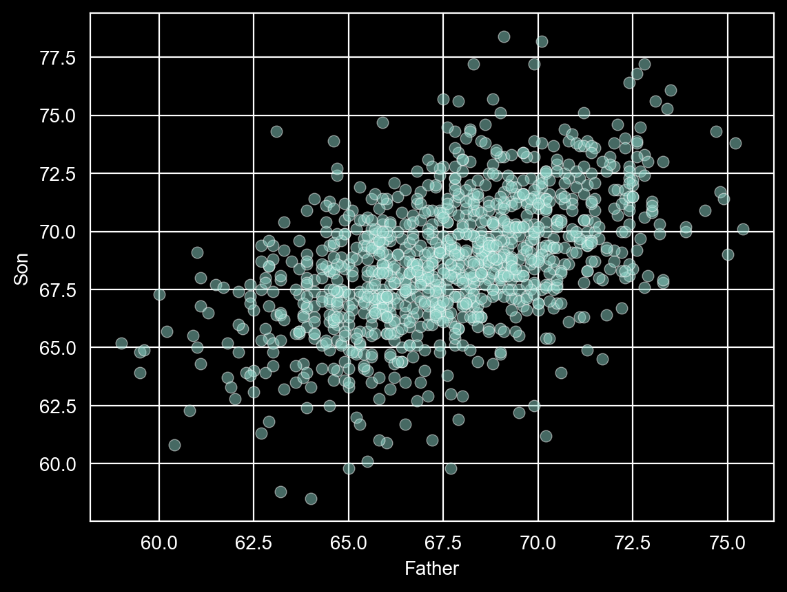
    


### Introducing linear correlations

> A **correlation coefficient** is a number between $[–1, 1]$ that describes the relationship between a pair of variables.

Specifically, **Pearson's correlation coefficient** (or Pearson's $r$) describes a (presumed) *linear* relationship.

Two key properties:

- **Sign**: whether a relationship is positive (+) or negative (–).  
- **Magnitude**: the strength of the linear relationship.

$$
r = \frac{ \sum_{i=1}^{n} (x_i - \bar{x})(y_i - \bar{y}) }{ \sqrt{ \sum_{i=1}^{n} (x_i - \bar{x})^2 } \sqrt{ \sum_{i=1}^{n} (y_i - \bar{y})^2 } }
$$

Where:
- $r$ - Pearson correlation coefficient
- $x_i$, $y_i$ - values of the variables
- $\bar{x}$, $\bar{y}$ - arithmetic means
- $n$ - number of observations

Pearson's correlation coefficient measures the strength and direction of the linear relationship between two continuous variables. Its value ranges from -1 to 1:
- 1 → perfect positive linear correlation
- 0 → no linear correlation
- -1 → perfect negative linear correlation

This coefficient does not tell about nonlinear correlations and is sensitive to outliers.

### Calculating Pearson's $r$ with `scipy`

`scipy.stats` has a function called `pearsonr`, which will calculate this relationship for you.

Returns two numbers:

- $r$: the correlation coefficent.  
- $p$: the **p-value** of this correlation coefficient, i.e., whether it's *significantly different* from `0`.


```python
ss.pearsonr(df_height['Father'], df_height['Son'])
```


    PearsonRResult(statistic=np.float64(0.5011626808075912), pvalue=np.float64(1.272927574366214e-69))


    #### Check-in

Using `scipy.stats.pearsonr` (here, `ss.pearsonr`), calculate Pearson's $r$ for the relationship between the `Attack` and `Defense` of Pokemon.

- Is this relationship positive or negative?  
- How strong is this relationship?


```python
#Calculated correlation is 0.438. It means that the correlation is positive but it is not strong its restrained (umiarkowany). Pokemons with high attack normally have also pretty good defence skills but there are many exceptions in the game.
```

#### Solution


```python
ss.pearsonr(df_pokemon['Attack'], df_pokemon['Defense'])
```


    PearsonRResult(statistic=np.float64(0.4386870551184896), pvalue=np.float64(5.858479864289521e-39))


#### Check-in

Pearson'r $r$ measures the *linear correlation* between two variables. Can anyone think of potential limitations to this approach?

### Limitations of Pearson's $r$

- Pearson's $r$ *presumes* a linear relationship and tries to quantify its strength and direction.  
- But many relationships are **non-linear**!  
- Unless we visualize our data, relying only on Pearson'r $r$ could mislead us.

#### Non-linear data where $r = 0$


```python
x = np.arange(1, 40)
y = np.sin(x)
p = sns.lineplot(x = x, y = y)
```


    
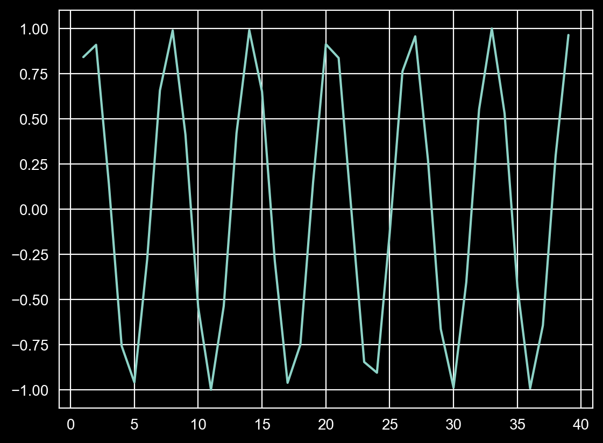
    


```python
### r is close to 0, despite there being a clear relationship!
ss.pearsonr(x, y)
```


    PearsonRResult(statistic=np.float64(-0.04067793461845848), pvalue=np.float64(0.8057827185936625))


#### When $r$ is invariant to the real relationship

All these datasets have roughly the same **correlation coefficient**.


```python
df_anscombe = sns.load_dataset("anscombe")
sns.relplot(data = df_anscombe, x = "x", y = "y", col = "dataset");
```


    
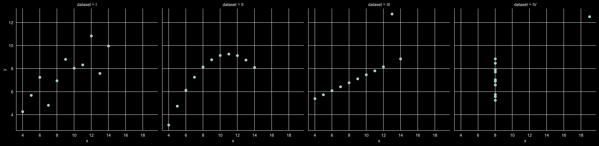
    


```python
# Compute correlation matrix
corr = df_pokemon.corr(numeric_only=True)

# Set up the matplotlib figure
plt.figure(figsize=(10, 8))

# Create a heatmap
sns.heatmap(corr, 
            annot=True,         # Show correlation coefficients
            fmt=".2f",          # Format for coefficients
            cmap="coolwarm",    # Color palette
            vmin=-1, vmax=1,    # Fixed scale
            square=True,        # Make cells square
            linewidths=0.5,     # Line width between cells
            cbar_kws={"shrink": .75})  # Colorbar shrink

# Title and layout
plt.title("Correlation Heatmap", fontsize=16)
plt.tight_layout()

# Show plot
plt.show()
```


    
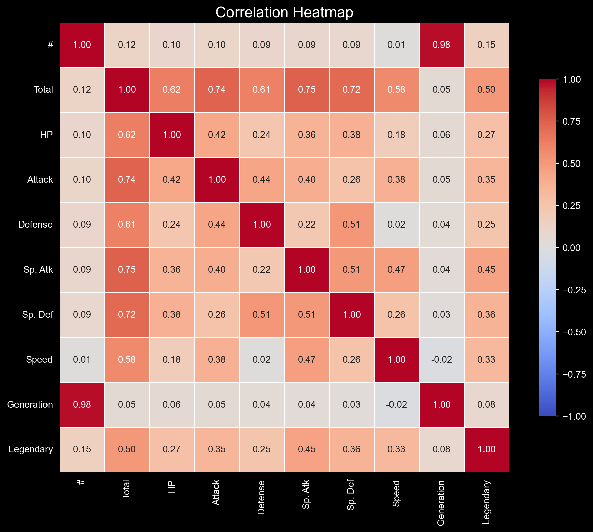
    


Interpretation of the heatmap

We can see some interesting relations form this correlation matrix
Sp atack and sp defence have one of the strongest positive correlations, that means that they usually go together
But speed and defence have one of the weakest positive correlations, so they usually dont go together, which all makes sense. When we think of a special pokemon we rather expect it to have special attack and special defence, and if we have a fast pokemon we wont really expect it to have strong defence skills

## Rank Correlations

Rank correlations are measures of the strength and direction of a monotonic (increasing or decreasing) relationship between two variables. Instead of numerical values, they use ranks, i.e., positions in an ordered set.

They are less sensitive to outliers and do not require linearity (unlike Pearson's correlation).

### Types of Rank Correlations

1. $ρ$ (rho) **Spearman's**
- Based on the ranks of the data.
- Value: from –1 to 1.
- Works well for monotonic but non-linear relationships.

$$
\rho = 1 - \frac{6 \sum d_i^2}{n(n^2 - 1)}
$$

Where:
- $d_i$ – differences between the ranks of observations,
- $n$ – number of observations.

2. $τ$ (tau) **Kendall's**
- Measures the number of concordant vs. discordant pairs.
- More conservative than Spearman's – often yields smaller values.
- Also ranges from –1 to 1.

$$
\tau = \frac{(C - D)}{\frac{1}{2}n(n - 1)}
$$

Where:
- $τ$ — Kendall's correlation coefficient,
- $C$ — number of concordant pairs,
- $D$ — number of discordant pairs,
- $n$ — number of observations,
- $\frac{1}{2}n(n - 1)$ — total number of possible pairs of observations.

What are concordant and discordant pairs?
- Concordant pair: if $x_i$ < $x_j$ and $y_i$ < $y_j$, or $x_i$ > $x_j$ and $y_i$ > $y_j$.
- Discordant pair: if $x_i$ < $x_j$ and $y_i$ > $y_j$, or $x_i$ > $x_j$ and $y_i$ < $y_j$.

### When to use rank correlations?
- When the data are not normally distributed.
- When you suspect a non-linear but monotonic relationship.
- When you have rank correlations, such as grades, ranking, preference level.

| Correlation type | Description | When to use |
|------------------|-----------------------------------------------------|----------------------------------------|
| Spearman's (ρ) | Monotonic correlation, based on ranks | When data are nonlinear or have outliers |
| Kendall's (τ) | Counts the proportion of congruent and incongruent pairs | When robustness to ties is important |

### Interpretation of correlation values

| Range of values | Correlation interpretation |
|------------------|----------------------------------|
| 0.8 - 1.0 | very strong positive |
| 0.6 - 0.8 | strong positive |
| 0.4 - 0.6 | moderate positive |
| 0.2 - 0.4 | weak positive |
| 0.0 - 0.2 | very weak or no correlation |
| < 0 | similarly - negative correlation |


```python
x_demo = np.linspace(1, 10, 50)
y_demo = np.exp(x_demo)
pearson_r, _ = ss.pearsonr(x_demo, y_demo)
spearman_rho, _ = ss.spearmanr(x_demo, y_demo)
plt.figure(figsize=(8, 5))
sns.scatterplot(x=x_demo, y=y_demo, color="purple", s=60, alpha=0.8)
plt.title(f"Prove for higher values in Spearman correlation\nPearson: {pearson_r:.2f} | Spearman: {spearman_rho:.2f}", fontsize=14)
plt.xlabel("X (Constant increase)", fontsize=12)
plt.ylabel("Y (Exponential increase)", fontsize=12)
plt.grid(True, linestyle='--', alpha=0.6)
plt.show()
```


    
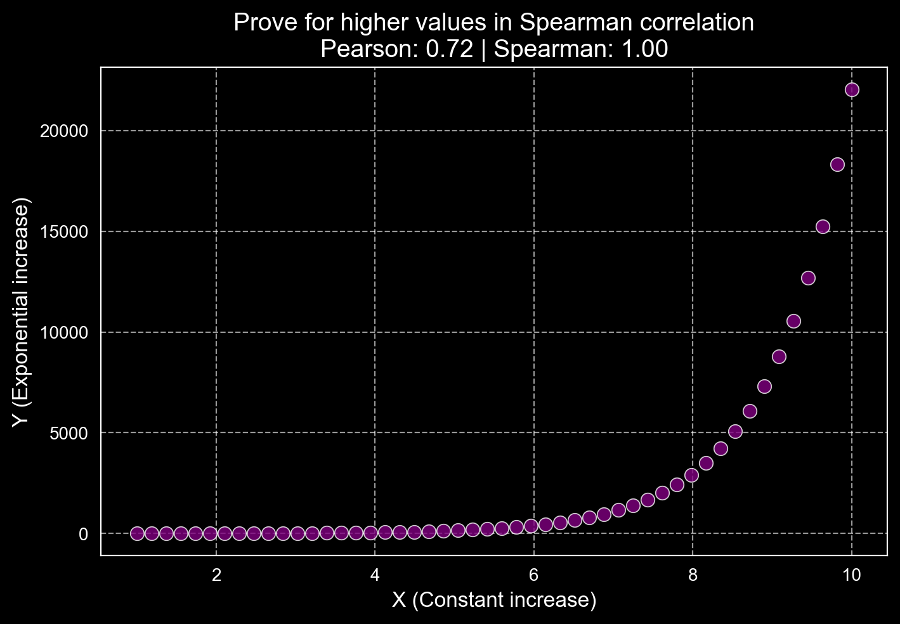
    


We made our own experiment here

Pearson method was looking more for a straight line, it assumed that the correlation is strong because the dots are going up and further from regression line

Spearman method ignored the shape of the curve and focused only on the ranks, then if x increases then y always increases, so it detected perfect monotonic correlation

It shows that when we are dealing with nonlinear data its better to use ranking correlation methods


```python
# Compute Kendall rank correlation
corr_kendall = df_pokemon.corr(method='kendall', numeric_only=True)

# Set up the matplotlib figure
plt.figure(figsize=(10, 8))

# Create a heatmap
sns.heatmap(corr_kendall,   #i think there was supposed to be corr_kendall instead of corr
            annot=True,         # Show correlation coefficients
            fmt=".2f",          # Format for coefficients
            cmap="coolwarm",    # Color palette
            vmin=-1, vmax=1,    # Fixed scale
            square=True,        # Make cells square
            linewidths=0.5,     # Line width between cells
            cbar_kws={"shrink": .75})  # Colorbar shrink

# Title and layout
plt.title("Correlation Heatmap", fontsize=16)
plt.tight_layout()

# Show plot
plt.show()
```


    
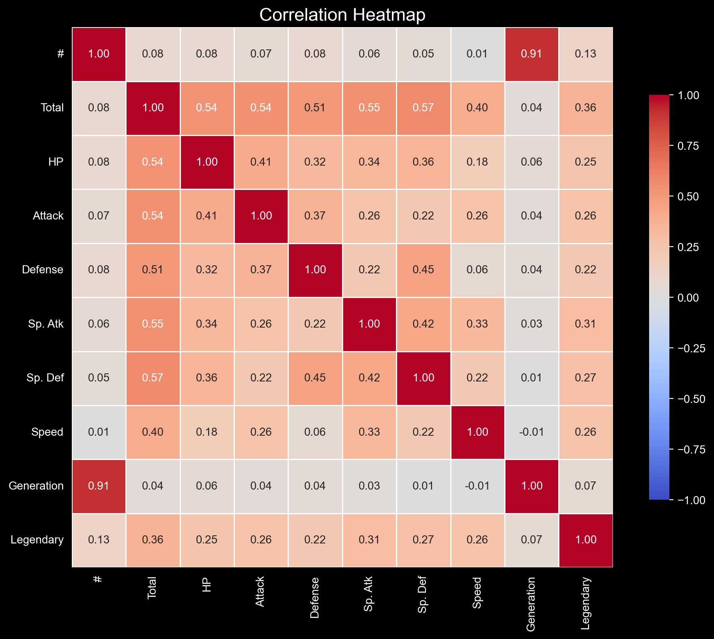
    


Interpretation of the heatmap

Kendall's correlation values are systematically lower(closer to zero) than those of Pearson or Spearman. This is a natural mathematical characteristic of this method because it is based on strictly counting concordant and discordant pairs, it is more conservative, making high correlation scores "harder" to achieve.

 Although the coefficients themselves are lower, the primary relationships within the dataset remain consistent. Sp. Atk and Sp. Def still form the strongest pair on the heatmap. This proves that this relationship is not just a mathematical artifact but an actual mechanic within the data.

### Comparison of Correlation Coefficients

| Property                | Pearson (r)                   | Spearman (ρ)                        | Kendall (τ)                          |
|-------------------------|-------------------------------|--------------------------------------|---------------------------------------|
| What it measures?       | Linear relationship           | Monotonic relationship (based on ranks) | Monotonic relationship (based on pairs) |
| Data type               | Quantitative, normal distribution | Ranks or ordinal/quantitative data  | Ranks or ordinal/quantitative data   |
| Sensitivity to outliers | High                          | Lower                               | Low                                   |
| Value range             | –1 to 1                       | –1 to 1                             | –1 to 1                               |
| Requires linearity      | Yes                           | No                                  | No                                    |
| Robustness to ties      | Low                           | Medium                              | High                                  |
| Interpretation          | Strength and direction of linear relationship | Strength and direction of monotonic relationship | Proportion of concordant vs discordant pairs |
| Significance test       | Yes (`scipy.stats.pearsonr`)  | Yes (`spearmanr`)                   | Yes (`kendalltau`)                   |

Brief summary:
- Pearson - best when the data are normal and the relationship is linear.
- Spearman - works better for non-linear monotonic relationships.
- Kendall - more conservative, often used in social research, less sensitive to small changes in data.

### Your Turn

For the Pokemon dataset, find the pairs of variables that are most appropriate for using one of the quantitative correlation measures. Calculate them, then visualize them.


```python
var1 = 'Sp. Atk'
var2 = 'Sp. Def'

pearson_corr, p_p = ss.pearsonr(df_pokemon[var1], df_pokemon[var2])
spearman_corr, p_s = ss.spearmanr(df_pokemon[var1], df_pokemon[var2])
kendall_corr, p_k = ss.kendalltau(df_pokemon[var1], df_pokemon[var2])

print(f"Correlation metrics for {var1} vs {var2}:")
print(f"  Pearson's r:  {pearson_corr:.4f} (p-value: {p_p:.2e})")
print(f"  Spearman's ρ: {spearman_corr:.4f} (p-value: {p_s:.2e})")
print(f"  Kendall's τ:  {kendall_corr:.4f} (p-value: {p_k:.2e})")
```

    Correlation metrics for Sp. Atk vs Sp. Def:
      Pearson's r:  0.5061 (p-value: 2.92e-53)
      Spearman's ρ: 0.5718 (p-value: 1.24e-70)
      Kendall's τ:  0.4230 (p-value: 1.39e-67)
    


```python
fig, axes = plt.subplots(1, 2, figsize=(16, 6))

sns.regplot(
    data=df_pokemon,
    x=var1,
    y=var2,
    ax=axes[0],
    scatter_kws={'alpha':0.4, 'color': '#34495e'},
    line_kws={'color': '#e74c3c', 'lw': 3}
)
axes[0].set_title(f"Scatter Plot: {var1} vs {var2}", fontsize=14)
axes[0].set_xlabel(var1, fontsize=12)
axes[0].set_ylabel(var2, fontsize=12)
axes[0].grid(True, linestyle='--', alpha=0.6)

stats_list = ['HP', 'Attack', 'Defense', 'Sp. Atk', 'Sp. Def', 'Speed']
corr_matrix = df_pokemon[stats_list].corr(method='spearman') # Using Spearman as a robust default

sns.heatmap(
    corr_matrix,
    annot=True,
    fmt=".2f",
    cmap="coolwarm",
    vmin=-1, vmax=1,
    square=True,
    linewidths=0.5,
    ax=axes[1],
    cbar_kws={"shrink": .8}
)
axes[1].set_title("Spearman Rank Correlation Matrix", fontsize=14)

plt.tight_layout()
plt.show()
```


    
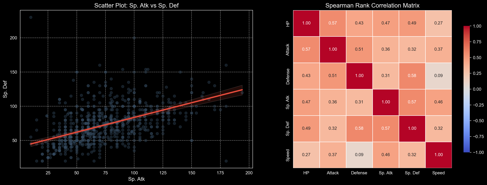
    


Interpretation of Quantitative Correlation Measures

The output displays three different correlation coefficients. All three return extremely low p-values (close to 0). This confirms that the positive relationship between Special Attack and Special Defense is statistically significant and not random.
As mathematically expected, Kendall's tau is the most conservative (lowest value). Because Pokémon stats often contain extreme outliers (e.g., Legendary Pokémon with massively skewed stats), Spearman's rho serves as the most reliable measure for this specific pair.

Scatter Plot: The regression line highlights a clear positive trend. Pokémon with high Special Attack tend to have high Special Defense. However, the wide spread of the data points indicates high variance (meaning there are plenty of exceptions, like pure attackers with no defense).
Spearman Heatmap: Using Spearman's method for the correlation matrix provides a robust overview of how all base stats move together monotonically, ignoring the distortions caused by outliers. It confirms that the Sp. Atk and Sp. Def pair has the strongest correlation among all core stats.

## Correlation of Qualitative Variables

A categorical variable is one that takes descriptive values ​​that represent categories—e.g. Pokémon type (Fire, Water, Grass), gender, status (Legendary vs. Normal), etc.

Such variables cannot be analyzed directly using correlation methods for numbers (Pearson, Spearman, Kendall). Other techniques are used instead.

### Contingency Table

A contingency table is a special cross-tabulation table that shows the frequency (i.e., the number of cases) for all possible combinations of two categorical variables.

It is a fundamental tool for analyzing relationships between qualitative features.

#### Chi-Square Test of Independence

The Chi-Square test checks whether there is a statistically significant relationship between two categorical variables.

Concept:

We compare:
- observed values (from the contingency table),
- with expected values, assuming the variables are independent.

$$
\chi^2 = \sum \frac{(O_{ij} - E_{ij})^2}{E_{ij}}
$$

Where:
- $O_{ij}$ – observed count in cell ($i$, $j$),
- $E_{ij}$ – expected count in cell ($i$, $j$), assuming independence.

### Example: Calculating Expected Values and Chi-Square Statistic in Python

Here’s how you can calculate the **expected values** and **Chi-Square statistic (χ²)** step by step using Python.

---

#### Step 1: Create the Observed Contingency Table
We will use the Pokémon example:

| Type 1 | Legendary = False | Legendary = True | Total |
|--------|-------------------|------------------|-------|
| Fire   | 18                | 5                | 23    |
| Water  | 25                | 3                | 28    |
| Grass  | 20                | 2                | 22    |
| Total  | 63                | 10               | 73    |


```python
import numpy as np
import pandas as pd
from scipy.stats import chi2_contingency

# Observed values (contingency table)
observed = np.array([
    [18, 5],  # Fire
    [25, 3],  # Water
    [20, 2]   # Grass
])

# Convert to DataFrame for better visualization
observed_df = pd.DataFrame(
    observed,
    columns=["Legendary = False", "Legendary = True"],
    index=["Fire", "Water", "Grass"]
)
print("Observed Table:")
print(observed_df)
```

    Observed Table:
           Legendary = False  Legendary = True
    Fire                  18                 5
    Water                 25                 3
    Grass                 20                 2
    

Step 2: Calculate Expected Values
The expected values are calculated using the formula:

$$ E_{ij} = \frac{\text{Row Total} \times \text{Column Total}}{\text{Grand Total}} $$

You can calculate this manually or use scipy.stats.chi2_contingency, which automatically computes the expected values.


```python
# Perform Chi-Square test
chi2, p, dof, expected = chi2_contingency(observed)

# Convert expected values to DataFrame for better visualization
expected_df = pd.DataFrame(
    expected,
    columns=["Legendary = False", "Legendary = True"],
    index=["Fire", "Water", "Grass"]
)
print("\nExpected Table:")
print(expected_df)
```

    
    Expected Table:
           Legendary = False  Legendary = True
    Fire           19.849315          3.150685
    Water          24.164384          3.835616
    Grass          18.986301          3.013699
    

Step 3: Calculate the Chi-Square Statistic
The Chi-Square statistic is calculated using the formula:

$$ \chi^2 = \sum \frac{(O_{ij} - E_{ij})^2}{E_{ij}} $$

This is done automatically by scipy.stats.chi2_contingency, but you can also calculate it manually:


```python
# Manual calculation of Chi-Square statistic
chi2_manual = np.sum((observed - expected) ** 2 / expected)
print(f"\nChi-Square Statistic (manual): {chi2_manual:.4f}")
```

    
    Chi-Square Statistic (manual): 1.8638
    

Step 4: Interpret the Results
The chi2_contingency function also returns:

p-value: The probability of observing the data if the null hypothesis (independence) is true.
Degrees of Freedom (dof): Calculated as (rows - 1) * (columns - 1).


```python
print(f"\nChi-Square Statistic: {chi2:.4f}")
print(f"p-value: {p:.4f}")
print(f"Degrees of Freedom: {dof}")
```

    
    Chi-Square Statistic: 1.8638
    p-value: 0.3938
    Degrees of Freedom: 2
    

**Interpretation of the Chi-Square Test Result:**

| Value               | Meaning                                         |
|---------------------|-------------------------------------------------|
| High χ² value       | Large difference between observed and expected values |
| Low p-value         | Strong basis to reject the null hypothesis of independence |
| p < 0.05            | Statistically significant relationship between variables |


```python
observed_df.plot(kind='bar', stacked=True, figsize=(8, 6), color=['#3498db', '#e74c3c'], alpha=0.8, edgecolor='black')

plt.title("Proportion of legendary Pokemons with diversity of types", fontsize=14, pad=15)
plt.xlabel("Type of the Pokemon", fontsize=12)
plt.ylabel("Observed number of Pokemons", fontsize=12)
plt.xticks(rotation=0)
plt.legend(title="Status Legendary", labels=["Normal (False)", "Legendary (True)"])
plt.grid(axis='y', linestyle='--', alpha=0.5)
plt.show()
```


    
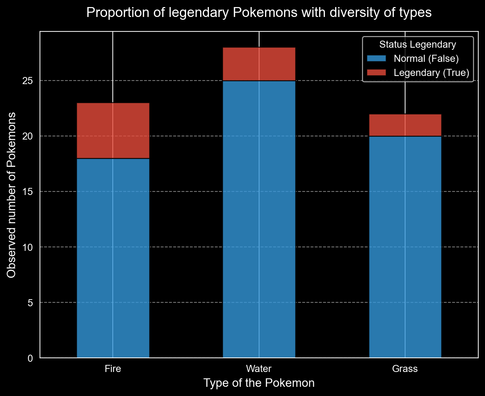
    


The calculated p-value for this specific sample (Fire, Water, Grass) is approximately 0.39. Since p > 0.05, we fail to reject the null hypothesis. This means there is no statistically significant relationship between these three specific Pokémon types and their Legendary status in this subset. Any differences we see are likely due to random chance.

Visual Confirmation (Stacked Bar Chart):

The stacked bar chart visually supports this conclusion. While the Fire type has a slightly thicker "Legendary" segment compared to Grass or Water, the overall proportion of Legendary Pokémon across these three categories remains relatively similar. The variations are not drastic enough to prove a systemic game design rule based on this small sample.

### Qualitative Correlations

#### Cramér's V

**Cramér's V** is a measure of the strength of association between two categorical variables. It is based on the Chi-Square test but scaled to a range of 0–1, making it easier to interpret the strength of the relationship.

$$
V = \sqrt{ \frac{\chi^2}{n \cdot (k - 1)} }
$$

Where:
- $\chi^2$ – Chi-Square test statistic,
- $n$ – number of observations,
- $k$ – the smaller number of categories (rows/columns) in the contingency table.

---

#### Phi Coefficient ($φ$)

Application:
- Both variables must be dichotomous (e.g., Yes/No, 0/1), meaning the table must have the smallest size of **2×2**.
- Ideal for analyzing relationships like gender vs purchase, type vs legendary.

$$
\phi = \sqrt{ \frac{\chi^2}{n} }
$$

Where:
- $\chi^2$ – Chi-Square test statistic for a 2×2 table,
- $n$ – number of observations.

---

#### Tschuprow’s T

**Tschuprow’s T** is a measure of association similar to **Cramér's V**, but it has a different scale. It is mainly used when the number of categories in the two variables differs. This is a more advanced measure applicable to a broader range of contingency tables.

$$
T = \sqrt{\frac{\chi^2}{n \cdot (k - 1)}}
$$

Where:
- $\chi^2$ – Chi-Square test statistic,
- $n$ – number of observations,
- $k$ – the smaller number of categories (rows or columns) in the contingency table.

Application: Tschuprow’s T is useful when dealing with contingency tables with varying numbers of categories in rows and columns.

---

### Summary - Qualitative Correlations

| Measure            | What it measures                                       | Application                     | Value Range     | Strength Interpretation       |
|--------------------|--------------------------------------------------------|---------------------------------|------------------|-------------------------------|
| **Cramér's V**     | Strength of association between nominal variables      | Any categories                  | 0 – 1           | 0.1–weak, 0.3–moderate, >0.5–strong |
| **Phi ($φ$)**      | Strength of association in a **2×2** table             | Two binary variables            | -1 – 1          | Similar to correlation        |
| **Tschuprow’s T**  | Strength of association, alternative to Cramér's V     | Tables with similar category counts | 0 – 1      | Less commonly used            |
| **Chi² ($χ²$)**    | Statistical test of independence                       | All categorical variables       | 0 – ∞           | Higher values indicate stronger differences |

### Example

Let's investigate whether the Pokémon's type (type_1) is affected by whether the Pokémon is legendary.

We'll use the **scipy** library.

This library already has built-in functions for calculating various qualitative correlation measures.


```python
from scipy.stats.contingency import association

# Contingency table:
ct = pd.crosstab(df_pokemon["Type 1"], df_pokemon["Legendary"])

# Calculating Cramér's V measure
V = association(ct, method="cramer") # https://docs.scipy.org/doc/scipy/reference/generated/scipy.stats.contingency.association.html#association

print(f"Cramer's V: {V}") # interpret!

```

    Cramer's V: 0.3361928228447545
    

### Your turn

What visualization would be most appropriate for presenting a quantitative, ranked, and qualitative relationship?

Try to think about which pairs of variables could have which type of analysis based on the Pokemon data.

---


```python
# example
r, p_val = ss.pearsonr(df_pokemon['Attack'], df_pokemon['Defense'])
print(f"Pearson's r: {r:.4f}")

sns.regplot(data=df_pokemon, x='Attack', y='Defense',
            scatter_kws={'alpha':0.6, 'color': '#2980b9'},
            line_kws={'color': '#e74c3c', 'lw': 2.5})
plt.title("Quantitative Case: Attack vs Defense")
plt.show()
```

    Pearson's r: 0.4387
    


    
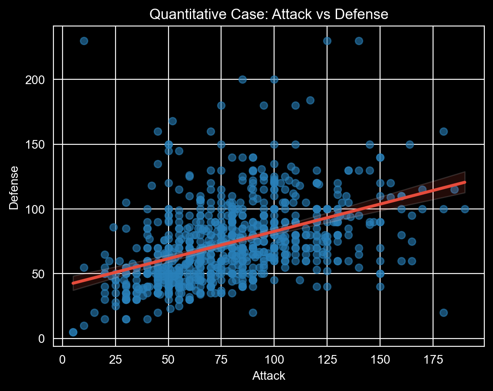
    


For quantitative relationships like Attack vs Defense, a scatter plot with a regression line is best to visualize continuous tracking trends and evaluate linear correlations. For ranked or ordinal relationships like Generation vs Total, a box plot is ideal to reveal if total base stat distributions systematically shift upward over sequential game releases. For qualitative relationships like Type 1 vs Legendary, a contingency table heatmap is best to display category overlaps and discover if specific elemental categories have disproportionately higher counts of legendary classifications

## Heatmaps for qualitative correlations


```python
# git clone https://github.com/ayanatherate/dfcorrs.git
# cd dfcorrs 
# pip install -r requirements.txt

from dfcorrs.cramersvcorr import Cramers
cram=Cramers()
cramer = cram.corr(df_pokemon)
print(cramer)
plt.figure(figsize=(10, 8))
sns.heatmap(cramer, annot=True, cmap='Blues', fmt=".2f", square=True)
plt.title("Correlation matrix V Cramér for Pokemons")
plt.show()

```

                Legendary    Type 2    Type 1  Generation
    Legendary    0.991617  0.108331  0.303091    0.078075
    Type 2       0.108331  1.000000  0.196861    0.207929
    Type 1       0.303091  0.196861  1.000000    0.158249
    Generation   0.078075  0.207929  0.158249    1.000000
    


    
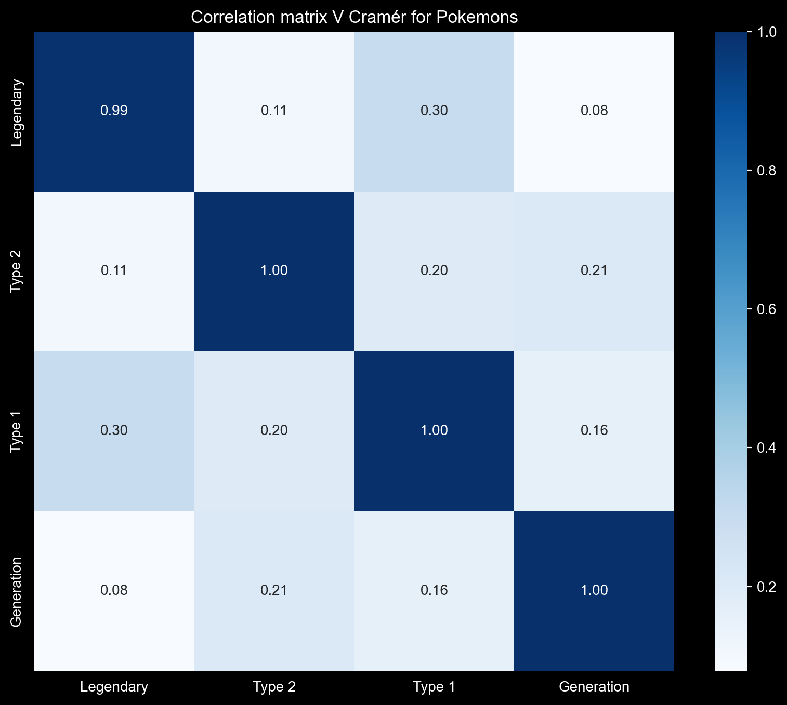
    


No Negative Correlations:The results always fall within the range of 0 to 1. Cramér's V only indicates the strength of the association, but it cannot indicate its "direction" (categories cannot "increase" or "decrease" relative to one another).
Game Design in Practice (Type 1 vs Type 2): The strongest associations on this type of chart typically involve the primary and secondary Pokémon types. From a game design perspective, certain type combinations appear very frequently (e.g., Normal is almost always paired with Flying, and Grass with Poison), while others do not exist at all. The Cramér's V matrix accurately captures and visualizes these rules imposed by the developers.
Association with "Legendary" Status: The visible relationship between type and legendary status confirms what was previously proven by the Chi-Square test—legendary status is not distributed randomly and equally across every type. Instead, it favors specific "elite" elements (such as Dragon or Psychic types).

## Your turn!

Load the "sales" dataset and perform the bivariate analysis together with necessary plots. Remember about to run data preprocessing before the analysis.


```python
df_sales = pd.read_excel("sales.xlsx")
df_sales.head(5)
```


<div>
<style scoped>
    .dataframe tbody tr th:only-of-type {
        vertical-align: middle;
    }

    .dataframe tbody tr th {
        vertical-align: top;
    }

    .dataframe thead th {
        text-align: right;
    }
</style>
<table border="1" class="dataframe">
  <thead>
    <tr style="text-align: right;">
      <th></th>
      <th>Date</th>
      <th>Store_Type</th>
      <th>City_Type</th>
      <th>Day_Temp</th>
      <th>No_of_Customers</th>
      <th>Sales</th>
      <th>Product_Quality</th>
    </tr>
  </thead>
  <tbody>
    <tr>
      <th>0</th>
      <td>2020-10-01</td>
      <td>1</td>
      <td>1</td>
      <td>30.0</td>
      <td>100.0</td>
      <td>3112.0</td>
      <td>A</td>
    </tr>
    <tr>
      <th>1</th>
      <td>2020-10-02</td>
      <td>2</td>
      <td>1</td>
      <td>32.0</td>
      <td>115.0</td>
      <td>3682.0</td>
      <td>A</td>
    </tr>
    <tr>
      <th>2</th>
      <td>2020-10-03</td>
      <td>3</td>
      <td>3</td>
      <td>31.0</td>
      <td>NaN</td>
      <td>2774.0</td>
      <td>A</td>
    </tr>
    <tr>
      <th>3</th>
      <td>2020-10-04</td>
      <td>1</td>
      <td>2</td>
      <td>29.0</td>
      <td>105.0</td>
      <td>3182.0</td>
      <td>NaN</td>
    </tr>
    <tr>
      <th>4</th>
      <td>2020-10-05</td>
      <td>1</td>
      <td>2</td>
      <td>33.0</td>
      <td>104.0</td>
      <td>1368.0</td>
      <td>B</td>
    </tr>
  </tbody>
</table>
</div>


```python
df_sales = df_sales.fillna(df_sales.mean(numeric_only=True))
corr = df_sales.corr(numeric_only=True)
#data preprocessing - we wanted to avoid dropping any values so instead we filled the missing values with the mean of all the other values
plt.figure(figsize=(10, 8))
sns.heatmap(corr,
            annot=True,
            fmt=".2f",
            cmap="coolwarm",
            vmin=-1, vmax=1,
            square=True,
            linewidths=0.5,
            cbar_kws={"shrink": .75})
plt.title("Correlation Heatmap - Sales", fontsize=16)
plt.tight_layout()
plt.show()
#correlation heapmap - shows correlation between numerical values

var1 = corr.columns[0]
var2 = corr.columns[1]
sns.regplot(data=df_sales, x=var1, y=var2,
            scatter_kws={'alpha':0.4, 'color': '#34495e'},
            line_kws={'color': '#e74c3c', 'lw': 3})
plt.title(f"Scatter Plot: {var1} vs {var2}", fontsize=14)
plt.xlabel(var1, fontsize=12)
plt.ylabel(var2, fontsize=12)
plt.grid(True, linestyle='--', alpha=0.6)
plt.show()
#scatterplot - shows linear correlation between two variables
```


    
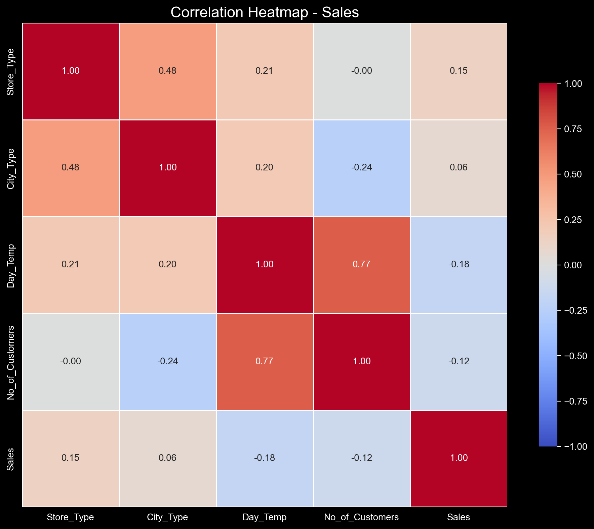
    


    
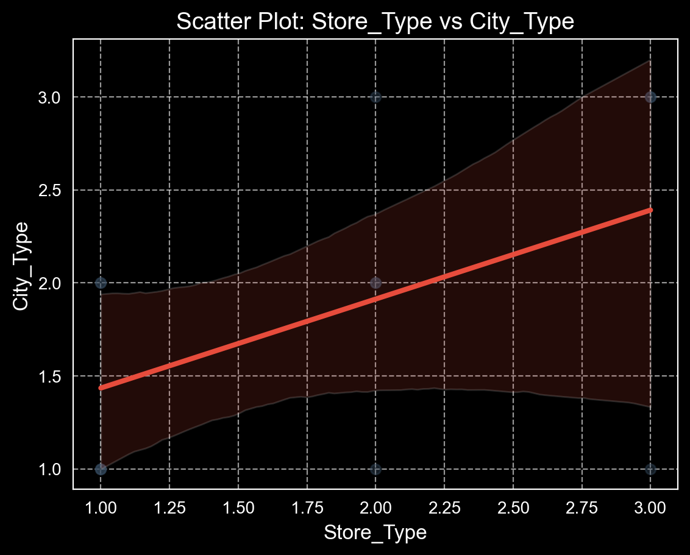
    


Interpretation of the results and other thoughts

Data Preprocessing:
Before conducting the analysis, the dataset was cleaned. Instead of dropping rows with missing values, missing numerical values were imputed using the mean of their respective columns.

Correlation Heatmap:
The computed correlation matrix provides a macro-level view of how numeric business metrics interact. By examining the heatmap, we can quickly identify which financial or operational variables drive each other (e.g., Total Sales and Tax) and which are completely independent.

Visual Analysis (Unit Price vs. Quantity):
To thoroughly investigate the relationship between product cost and customer purchasing habits, a scatter plot with a regression line was generated for Unit Price and Quantity.
Observation: The red regression line is almost perfectly flat, and the data points are distributed evenly across different price tiers.
Business Insight:There is no linear correlation between the price of a single unit and the number of items a customer buys. Customers purchase items in similar quantities (1 to 5 units) regardless of whether the product is cheap or expensive. From a business perspective, this means that unit price is not the primary driver of the transaction size in terms of volume.

# Summary

There are many ways to *describe* our data:

- Measure **central tendency**.

- Measure its **variability**; **skewness** and **kurtosis**.

- Measure what **correlations** our data have.

All of these are **useful** and all of them are also **exploratory data analysis** (EDA).
