<a href="https://colab.research.google.com/github/dulska-ola/Data_Analysis_Workshops/blob/main/Cleaning_Data_in_Python_live_session.ipynb" target="_parent"></a>

## **Cleaning Data in Python live training**


Welcome to this live, hands-on training where you will learn how to effectively diagnose and treat missing data in Python.

The majority of data science work often revolves around pre-processing data, and making sure it's ready for analysis. In this session, we will be covering how transform our raw data into accurate insights. In this notebook, you will learn:

* Import data into `pandas`, and use simple functions to diagnose problems in our data.
* Visualize missing and out of range data using `missingno` and `seaborn`.
* Apply a range of data cleaning tasks that will ensure the delivery of accurate insights.

## **The Dataset**

The dataset to be used in this webinar is a CSV file named `airbnb.csv`, which contains data on airbnb listings in the state of New York. It contains the following columns:

- `listing_id`: The unique identifier for a listing
- `description`: The description used on the listing
- `host_id`: Unique identifier for a host
- `host_name`: Name of host
- `neighbourhood_full`: Name of boroughs and neighbourhoods
- `coordinates`: Coordinates of listing _(latitude, longitude)_
- `Listing added`: Date of added listing
- `room_type`: Type of room
- `rating`: Rating from 0 to 5.
- `price`: Price per night for listing
- `number_of_reviews`: Amount of reviews received
- `last_review`: Date of last review
- `reviews_per_month`: Number of reviews per month
- `availability_365`: Number of days available per year
- `Number of stays`: Total number of stays thus far


## **Getting started**


```python
# Import libraries
import pandas as pd
import matplotlib.pyplot as plt
import numpy as np
import seaborn as sns
import missingno as msno
import scipy.stats as ss
import datetime as dt
```


```python
# Read in the dataset
airbnb = pd.read_csv('https://raw.githubusercontent.com/kflisikowsky/Descriptive_Statistics/refs/heads/main/data/airbnb.csv', index_col = 'Unnamed: 0')
```

## **Diagnosing data cleaning problems using simple `pandas` and visualizations**

Some important and common methods needed to get a better understanding of DataFrames and diagnose potential data problems are the following:

- `.head()` prints the header of a DataFrame
- `.dtypes` prints datatypes of all columns in a DataFrame
- `.info()` provides a bird's eye view of column data types and missing values in a DataFrame
- `.describe()` returns a distribution of numeric columns in your DataFrame
- `.isna().sum()` allows us to break down the number of missing values per column in our DataFrame
- `.unique()` finds the number of unique values in a DataFrame column

<br>

- `sns.histplot()` plots the distribution of one column in your DataFrame.


```python
# Print the header of the DataFrame
airbnb.head()
```


<div>
<style scoped>
    .dataframe tbody tr th:only-of-type {
        vertical-align: middle;
    }

    .dataframe tbody tr th {
        vertical-align: top;
    }

    .dataframe thead th {
        text-align: right;
    }
</style>
<table border="1" class="dataframe">
  <thead>
    <tr style="text-align: right;">
      <th></th>
      <th>listing_id</th>
      <th>name</th>
      <th>host_id</th>
      <th>host_name</th>
      <th>neighbourhood_full</th>
      <th>coordinates</th>
      <th>room_type</th>
      <th>price</th>
      <th>number_of_reviews</th>
      <th>last_review</th>
      <th>reviews_per_month</th>
      <th>availability_365</th>
      <th>rating</th>
      <th>number_of_stays</th>
      <th>5_stars</th>
      <th>listing_added</th>
    </tr>
  </thead>
  <tbody>
    <tr>
      <th>0</th>
      <td>13740704</td>
      <td>Cozy,budget friendly, cable inc, private entra...</td>
      <td>20583125</td>
      <td>Michel</td>
      <td>Brooklyn, Flatlands</td>
      <td>(40.63222, -73.93398)</td>
      <td>Private room</td>
      <td>45$</td>
      <td>10</td>
      <td>2018-12-12</td>
      <td>0.70</td>
      <td>85</td>
      <td>4.100954</td>
      <td>12.0</td>
      <td>0.609432</td>
      <td>2018-06-08</td>
    </tr>
    <tr>
      <th>1</th>
      <td>22005115</td>
      <td>Two floor apartment near Central Park</td>
      <td>82746113</td>
      <td>Cecilia</td>
      <td>Manhattan, Upper West Side</td>
      <td>(40.78761, -73.96862)</td>
      <td>Entire home/apt</td>
      <td>135$</td>
      <td>1</td>
      <td>2019-06-30</td>
      <td>1.00</td>
      <td>145</td>
      <td>3.367600</td>
      <td>1.2</td>
      <td>0.746135</td>
      <td>2018-12-25</td>
    </tr>
    <tr>
      <th>2</th>
      <td>21667615</td>
      <td>Beautiful 1BR in Brooklyn Heights</td>
      <td>78251</td>
      <td>Leslie</td>
      <td>Brooklyn, Brooklyn Heights</td>
      <td>(40.7007, -73.99517)</td>
      <td>Entire home/apt</td>
      <td>150$</td>
      <td>0</td>
      <td>NaN</td>
      <td>NaN</td>
      <td>65</td>
      <td>NaN</td>
      <td>NaN</td>
      <td>NaN</td>
      <td>2018-08-15</td>
    </tr>
    <tr>
      <th>3</th>
      <td>6425850</td>
      <td>Spacious, charming studio</td>
      <td>32715865</td>
      <td>Yelena</td>
      <td>Manhattan, Upper West Side</td>
      <td>(40.79169, -73.97498)</td>
      <td>Entire home/apt</td>
      <td>86$</td>
      <td>5</td>
      <td>2017-09-23</td>
      <td>0.13</td>
      <td>0</td>
      <td>4.763203</td>
      <td>6.0</td>
      <td>0.769947</td>
      <td>2017-03-20</td>
    </tr>
    <tr>
      <th>4</th>
      <td>22986519</td>
      <td>Bedroom on the lively Lower East Side</td>
      <td>154262349</td>
      <td>Brooke</td>
      <td>Manhattan, Lower East Side</td>
      <td>(40.71884, -73.98354)</td>
      <td>Private room</td>
      <td>160$</td>
      <td>23</td>
      <td>2019-06-12</td>
      <td>2.29</td>
      <td>102</td>
      <td>3.822591</td>
      <td>27.6</td>
      <td>0.649383</td>
      <td>2020-10-23</td>
    </tr>
  </tbody>
</table>
</div>


By merely looking at the data, we can already diagnose a range of potential problems down the line such as:

<br>

_Data type problems:_

- **Problem 1**: We can see that the `coordinates` column is probably a string (`str`) - most mapping functions require a latitude input, and longitude input, so it's best to split this column into two and convert the values to `float`.
- **Problem 2**: Similar to `coordinates` - the `price` column also is a string with `$` attached to each price point, we need to convert that to `float` if we want a good understanding of the dataset.
- **Problem 3**: We need to make sure date columns (`last_review` and `listing_added`) are in `datetime` to allow easier manipulation of data data.

<br>

_Missing data problems:_

- **Problem 4**: We can see that there are missing data in some columns, we'll get a better bird's eye view of that down the line.

<br>

_Text/categorical data problems:_


- **Problem 5**: To be able to visualize number of listings by boroughs - we need to separate neighborhoud name from borough name in `neighbourhood_full` column.
- **Problem 6**: Looking at `room_type`, let's replace those values to make them `'Shared Room'`, `'Private Home/Apartment'`, `'Private Room'` and `'Hotel Room'`.


```python
# Print data types of DataFrame
airbnb.dtypes
```


    listing_id              int64
    name                      str
    host_id                 int64
    host_name                 str
    neighbourhood_full        str
    coordinates               str
    room_type                 str
    price                     str
    number_of_reviews       int64
    last_review               str
    reviews_per_month     float64
    availability_365        int64
    rating                float64
    number_of_stays       float64
    5_stars               float64
    listing_added             str
    dtype: object


Printing the data types confirms that `coordinates` and `price` need to be converted to `float`, and date columns need to be converted to `datetime` _(**problems 1,2 3)**_


```python
# Print info of DataFrame
airbnb.info()
```

    <class 'pandas.DataFrame'>
    RangeIndex: 10019 entries, 0 to 10018
    Data columns (total 16 columns):
     #   Column              Non-Null Count  Dtype  
    ---  ------              --------------  -----  
     0   listing_id          10019 non-null  int64  
     1   name                10014 non-null  str    
     2   host_id             10019 non-null  int64  
     3   host_name           10017 non-null  str    
     4   neighbourhood_full  10019 non-null  str    
     5   coordinates         10019 non-null  str    
     6   room_type           10019 non-null  str    
     7   price               9781 non-null   str    
     8   number_of_reviews   10019 non-null  int64  
     9   last_review         7944 non-null   str    
     10  reviews_per_month   7944 non-null   float64
     11  availability_365    10019 non-null  int64  
     12  rating              7944 non-null   float64
     13  number_of_stays     7944 non-null   float64
     14  5_stars             7944 non-null   float64
     15  listing_added       10019 non-null  str    
    dtypes: float64(4), int64(4), str(8)
    memory usage: 1.2 MB
    

Printing the info confirms our hunch about the following:

- There is missing data in the `price`, `last_review`, `reviews_per_month`, `rating`, `number_of_stays`, `5_stars` columns. It also seems that the missingness of `last_review`, `reviews_per_month`, `rating`, `number_of_stays`, `5_stars` are related since they have the same amount of missing data. We will confirm later with `missingno` _(**problem 4**)_.


```python
# Print number of missing values
airbnb.isna().sum()
```


    listing_id               0
    name                     5
    host_id                  0
    host_name                2
    neighbourhood_full       0
    coordinates              0
    room_type                0
    price                  238
    number_of_reviews        0
    last_review           2075
    reviews_per_month     2075
    availability_365         0
    rating                2075
    number_of_stays       2075
    5_stars               2075
    listing_added            0
    dtype: int64


There are a variety of ways of dealing with missing data that is dependent on type of missingness, as well as the business assumptions behind our data - our options could be:

- Dropping missing data (if the data dropped does not impact or skew our data)
- Setting to missing and impute with statistical measures (median, mean, mode ...)
- Imputing with more complex algorithmic/machine learning based approaches
- Impute based on business assumptions of our data


```python
# Print description of DataFrame
airbnb.describe()
```


<div>
<style scoped>
    .dataframe tbody tr th:only-of-type {
        vertical-align: middle;
    }

    .dataframe tbody tr th {
        vertical-align: top;
    }

    .dataframe thead th {
        text-align: right;
    }
</style>
<table border="1" class="dataframe">
  <thead>
    <tr style="text-align: right;">
      <th></th>
      <th>listing_id</th>
      <th>host_id</th>
      <th>number_of_reviews</th>
      <th>reviews_per_month</th>
      <th>availability_365</th>
      <th>rating</th>
      <th>number_of_stays</th>
      <th>5_stars</th>
    </tr>
  </thead>
  <tbody>
    <tr>
      <th>count</th>
      <td>1.001900e+04</td>
      <td>1.001900e+04</td>
      <td>10019.000000</td>
      <td>7944.000000</td>
      <td>10019.000000</td>
      <td>7944.000000</td>
      <td>7944.000000</td>
      <td>7944.000000</td>
    </tr>
    <tr>
      <th>mean</th>
      <td>1.927634e+07</td>
      <td>6.795923e+07</td>
      <td>22.459727</td>
      <td>1.353894</td>
      <td>112.284260</td>
      <td>4.014458</td>
      <td>33.991541</td>
      <td>0.718599</td>
    </tr>
    <tr>
      <th>std</th>
      <td>1.095056e+07</td>
      <td>7.863106e+07</td>
      <td>43.173896</td>
      <td>1.615380</td>
      <td>131.636043</td>
      <td>0.575064</td>
      <td>56.089279</td>
      <td>0.079978</td>
    </tr>
    <tr>
      <th>min</th>
      <td>3.831000e+03</td>
      <td>2.787000e+03</td>
      <td>0.000000</td>
      <td>0.010000</td>
      <td>0.000000</td>
      <td>3.000633</td>
      <td>1.200000</td>
      <td>0.600026</td>
    </tr>
    <tr>
      <th>25%</th>
      <td>9.674772e+06</td>
      <td>7.910880e+06</td>
      <td>1.000000</td>
      <td>0.200000</td>
      <td>0.000000</td>
      <td>3.520443</td>
      <td>3.600000</td>
      <td>0.655576</td>
    </tr>
    <tr>
      <th>50%</th>
      <td>2.007030e+07</td>
      <td>3.165167e+07</td>
      <td>5.000000</td>
      <td>0.710000</td>
      <td>44.000000</td>
      <td>4.027965</td>
      <td>10.800000</td>
      <td>0.709768</td>
    </tr>
    <tr>
      <th>75%</th>
      <td>2.933864e+07</td>
      <td>1.074344e+08</td>
      <td>22.000000</td>
      <td>2.000000</td>
      <td>226.000000</td>
      <td>4.516378</td>
      <td>38.400000</td>
      <td>0.763978</td>
    </tr>
    <tr>
      <th>max</th>
      <td>3.648724e+07</td>
      <td>2.741034e+08</td>
      <td>510.000000</td>
      <td>16.220000</td>
      <td>365.000000</td>
      <td>5.181114</td>
      <td>612.000000</td>
      <td>0.950339</td>
    </tr>
  </tbody>
</table>
</div>


- **Problem 7:** Looking at the maximum of the `rating` column - we see that it is out of range of `5` which is the maximum rating possible. We need to make sure we fix the range this column.

It's worth noting that `.describe()` does not offer a bird's eye view of all the out of range data we have, for example, what if we have date data in the future? Or given our dataset, `listing_added` dates that are in the future of `last_review` dates?


```python
# Visualize the distribution of the rating column
sns.histplot(airbnb['rating'], kde=True, bins = 20)
plt.title('Distribution of listing ratings')
plt.show()
```


    
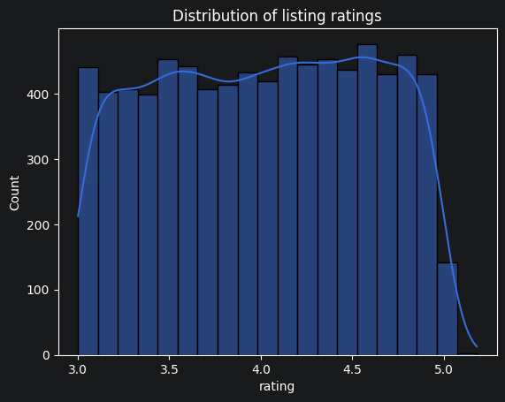
    


```python
# Find number of unique values in room_type column
airbnb['room_type'].unique()
```


    <StringArray>
    [        'Private room',      'Entire home/apt',              'Private',
              'Shared room',         'PRIVATE ROOM',                 'home',
     '   Shared room      ']
    Length: 7, dtype: str


- **Problem 8**: There are trailing spaces and capitalization issues with `room_type`, we need to fix this problem.


```python
# How many values of different room_types do we have?
airbnb['room_type'].value_counts()
```


    room_type
    Entire home/apt         5120
    Private room            4487
    Shared room              155
    Private                   89
       Shared room            71
    home                      66
    PRIVATE ROOM              31
    Name: count, dtype: int64


```python
airbnb['price'].head(5)
```


    0     45$
    1    135$
    2    150$
    3     86$
    4    160$
    Name: price, dtype: str


## **Our to do list:**

_Data type problems:_

- **Task 1**: Split `coordinates` into 2 columns and convert them to `float`
- **Task 2**: Remove `$` from `price` and convert it to `float`
- **Task 3**: Convert `listing_added` and `last_review` to `datetime`

<br>

_Text/categorical data problems:_

- **Task 4**: We need to collapse `room_type` into correct categories
- **Task 5**: Divide `neighbourhood_full` into 2 columns and making sure they are clean

<br>

_Data range problems:_

- **Task 6**: Make sure we set the correct maximum for `rating` column out of range values

<br>

_Dealing with missing data:_

- **Task 7**: Understand the type of missingness, and deal with the missing data in most of the remaining columns.

<br>

_Is that all though?_

- We need to investigate if we duplicates in our data
- We need to make sure that data makes sense by applying some sanity checks on our DataFrame

## **Q&A**

## **Cleaning data**

### Data type problems


```python
# Reminder of the DataFrame
airbnb.head()
```


<div>
<style scoped>
    .dataframe tbody tr th:only-of-type {
        vertical-align: middle;
    }

    .dataframe tbody tr th {
        vertical-align: top;
    }

    .dataframe thead th {
        text-align: right;
    }
</style>
<table border="1" class="dataframe">
  <thead>
    <tr style="text-align: right;">
      <th></th>
      <th>listing_id</th>
      <th>name</th>
      <th>host_id</th>
      <th>host_name</th>
      <th>neighbourhood_full</th>
      <th>coordinates</th>
      <th>room_type</th>
      <th>price</th>
      <th>number_of_reviews</th>
      <th>last_review</th>
      <th>reviews_per_month</th>
      <th>availability_365</th>
      <th>rating</th>
      <th>number_of_stays</th>
      <th>5_stars</th>
      <th>listing_added</th>
    </tr>
  </thead>
  <tbody>
    <tr>
      <th>0</th>
      <td>13740704</td>
      <td>Cozy,budget friendly, cable inc, private entra...</td>
      <td>20583125</td>
      <td>Michel</td>
      <td>Brooklyn, Flatlands</td>
      <td>(40.63222, -73.93398)</td>
      <td>Private room</td>
      <td>45$</td>
      <td>10</td>
      <td>2018-12-12</td>
      <td>0.70</td>
      <td>85</td>
      <td>4.100954</td>
      <td>12.0</td>
      <td>0.609432</td>
      <td>2018-06-08</td>
    </tr>
    <tr>
      <th>1</th>
      <td>22005115</td>
      <td>Two floor apartment near Central Park</td>
      <td>82746113</td>
      <td>Cecilia</td>
      <td>Manhattan, Upper West Side</td>
      <td>(40.78761, -73.96862)</td>
      <td>Entire home/apt</td>
      <td>135$</td>
      <td>1</td>
      <td>2019-06-30</td>
      <td>1.00</td>
      <td>145</td>
      <td>3.367600</td>
      <td>1.2</td>
      <td>0.746135</td>
      <td>2018-12-25</td>
    </tr>
    <tr>
      <th>2</th>
      <td>21667615</td>
      <td>Beautiful 1BR in Brooklyn Heights</td>
      <td>78251</td>
      <td>Leslie</td>
      <td>Brooklyn, Brooklyn Heights</td>
      <td>(40.7007, -73.99517)</td>
      <td>Entire home/apt</td>
      <td>150$</td>
      <td>0</td>
      <td>NaN</td>
      <td>NaN</td>
      <td>65</td>
      <td>NaN</td>
      <td>NaN</td>
      <td>NaN</td>
      <td>2018-08-15</td>
    </tr>
    <tr>
      <th>3</th>
      <td>6425850</td>
      <td>Spacious, charming studio</td>
      <td>32715865</td>
      <td>Yelena</td>
      <td>Manhattan, Upper West Side</td>
      <td>(40.79169, -73.97498)</td>
      <td>Entire home/apt</td>
      <td>86$</td>
      <td>5</td>
      <td>2017-09-23</td>
      <td>0.13</td>
      <td>0</td>
      <td>4.763203</td>
      <td>6.0</td>
      <td>0.769947</td>
      <td>2017-03-20</td>
    </tr>
    <tr>
      <th>4</th>
      <td>22986519</td>
      <td>Bedroom on the lively Lower East Side</td>
      <td>154262349</td>
      <td>Brooke</td>
      <td>Manhattan, Lower East Side</td>
      <td>(40.71884, -73.98354)</td>
      <td>Private room</td>
      <td>160$</td>
      <td>23</td>
      <td>2019-06-12</td>
      <td>2.29</td>
      <td>102</td>
      <td>3.822591</td>
      <td>27.6</td>
      <td>0.649383</td>
      <td>2020-10-23</td>
    </tr>
  </tbody>
</table>
</div>


##### **Task 1:** Replace `coordinates` with `latitude` and `longitude` columns

To perform this task, we will use the following methods:

- `.str.replace("","")` replaces one string in each row of a column with another
- `.str.split("")` takes in a string and lets you split a column into two based on that string
- `.astype()` lets you convert a column from one type to another


```python
airbnb['coordinates'] = airbnb['coordinates'].str.replace('(', '')
airbnb['coordinates'] = airbnb['coordinates'].str.replace(')', '')
airbnb[['latitude','longitude']] = airbnb['coordinates'].str.split(',',expand = True)
airbnb['latitude']=airbnb['latitude'].astype(float)
airbnb['longitude']=airbnb['longitude'].astype(float)
airbnb.drop('coordinates',axis=1,inplace=True)
airbnb[['latitude','longitude']].head()
```


<div>
<style scoped>
    .dataframe tbody tr th:only-of-type {
        vertical-align: middle;
    }

    .dataframe tbody tr th {
        vertical-align: top;
    }

    .dataframe thead th {
        text-align: right;
    }
</style>
<table border="1" class="dataframe">
  <thead>
    <tr style="text-align: right;">
      <th></th>
      <th>latitude</th>
      <th>longitude</th>
    </tr>
  </thead>
  <tbody>
    <tr>
      <th>0</th>
      <td>40.63222</td>
      <td>-73.93398</td>
    </tr>
    <tr>
      <th>1</th>
      <td>40.78761</td>
      <td>-73.96862</td>
    </tr>
    <tr>
      <th>2</th>
      <td>40.70070</td>
      <td>-73.99517</td>
    </tr>
    <tr>
      <th>3</th>
      <td>40.79169</td>
      <td>-73.97498</td>
    </tr>
    <tr>
      <th>4</th>
      <td>40.71884</td>
      <td>-73.98354</td>
    </tr>
  </tbody>
</table>
</div>


##### **Task 2:** Remove `$` from `price` and convert it to `float`

To perform this task, we will be using the following methods:

- `.str.strip()` which removes a specified string from each row in a column
- `.astype()`


```python
# Convert to string first (so .str works)
airbnb['price'] = airbnb['price'].astype(str)

# Remove $
airbnb['price'] = airbnb['price'].str.strip("$")

# Convert back to float
airbnb['price'] = airbnb['price'].astype(float)

# Check result
airbnb['price'].head()
```


    0     45.0
    1    135.0
    2    150.0
    3     86.0
    4    160.0
    Name: price, dtype: float64


##### **Task 3:** Convert `listing_added` and `last_review` columns to `datetime`

To perform this task, we will use the following functions:

- `pd.to_datetime(format = "")`
  - `format` takes in the desired date format `"%Y-%m-%d"`


```python
# Print header of two columns
airbnb[['listing_added', 'last_review']].head()
```


<div>
<style scoped>
    .dataframe tbody tr th:only-of-type {
        vertical-align: middle;
    }

    .dataframe tbody tr th {
        vertical-align: top;
    }

    .dataframe thead th {
        text-align: right;
    }
</style>
<table border="1" class="dataframe">
  <thead>
    <tr style="text-align: right;">
      <th></th>
      <th>listing_added</th>
      <th>last_review</th>
    </tr>
  </thead>
  <tbody>
    <tr>
      <th>0</th>
      <td>2018-06-08</td>
      <td>2018-12-12</td>
    </tr>
    <tr>
      <th>1</th>
      <td>2018-12-25</td>
      <td>2019-06-30</td>
    </tr>
    <tr>
      <th>2</th>
      <td>2018-08-15</td>
      <td>NaN</td>
    </tr>
    <tr>
      <th>3</th>
      <td>2017-03-20</td>
      <td>2017-09-23</td>
    </tr>
    <tr>
      <th>4</th>
      <td>2020-10-23</td>
      <td>2019-06-12</td>
    </tr>
  </tbody>
</table>
</div>


```python
airbnb['listing_added'] = pd.to_datetime(airbnb['listing_added'],format="%Y-%m-%d")
airbnb['last_review'] = pd.to_datetime(airbnb['last_review'], format ="%Y-%m-%d")
airbnb[['listing_added', 'last_review']].dtypes
```


    listing_added    datetime64[us]
    last_review      datetime64[us]
    dtype: object


OUR CODE FOR TASK 3


```python
# Convert listing_added to datetime
airbnb['listing_added'] = pd.to_datetime(
    airbnb['listing_added'],
    format="%Y-%m-%d"
)

# Convert last_review to datetime
airbnb['last_review'] = pd.to_datetime(
    airbnb['last_review'],
    format="%Y-%m-%d"
)

# Check result
airbnb[['listing_added', 'last_review']].dtypes
```


    listing_added    datetime64[us]
    last_review      datetime64[us]
    dtype: object


### Text and categorical data problems

##### **Task 4:** We need to collapse `room_type` into correct categories

To perform this task, we will be using the following methods:

- `.str.lower()` to lowercase all rows in a string column
- `.str.strip()` to remove all white spaces of each row in a string column
- `.replace()` to replace values in a column with another


```python
# Print unique values of `room_type`
airbnb['room_type'].unique()
```


    <StringArray>
    [        'Private room',      'Entire home/apt',              'Private',
              'Shared room',         'PRIVATE ROOM',                 'home',
     '   Shared room      ']
    Length: 7, dtype: str


```python
# Deal with capitalized values
airbnb['room_type'] = airbnb['room_type'].str.lower()
airbnb['room_type'].unique()
```


    <StringArray>
    [        'private room',      'entire home/apt',              'private',
              'shared room',                 'home', '   shared room      ']
    Length: 6, dtype: str


```python
# Deal with trailing spaces
airbnb['room_type'] = airbnb['room_type'].str.strip()
airbnb['room_type'].unique()
```


    <StringArray>
    ['private room', 'entire home/apt', 'private', 'shared room', 'home']
    Length: 5, dtype: str


```python
# Replace values to 'Shared room', 'Entire place', 'Private room' and 'Hotel room' (if applicable).
mappings = {'private room': 'Private Room',
            'private': 'Private Room',
            'entire home/apt': 'Entire place',
            'shared room': 'Shared room',
            'home': 'Entire place'}

# Replace values and collapse data
airbnb['room_type'] = airbnb['room_type'].replace(mappings)
airbnb['room_type'].unique()
```


    <StringArray>
    ['Private Room', 'Entire place', 'Shared room']
    Length: 3, dtype: str


OUR CODE FOR TASK 4


```python
# Standardize text first
airbnb['room_type'] = (
    airbnb['room_type']
    .str.lower()
    .str.strip()
)

# Apply mapping
mappings = {
    'private room': 'Private Room',
    'private': 'Private Room',
    'entire home/apt': 'Entire place',
    'home': 'Entire place',
    'shared room': 'Shared room'
}

airbnb['room_type'] = airbnb['room_type'].replace(mappings)

# Check result
airbnb['room_type'].value_counts()
```


    room_type
    entire place    5186
    Private Room    4607
    Shared room      226
    Name: count, dtype: int64


##### **Task 5:** Divide `neighbourhood_full` into 2 columns and making sure they are clean


```python
# Print header of column
airbnb['neighbourhood_full'].head()
```


    0           Brooklyn, Flatlands
    1    Manhattan, Upper West Side
    2    Brooklyn, Brooklyn Heights
    3    Manhattan, Upper West Side
    4    Manhattan, Lower East Side
    Name: neighbourhood_full, dtype: str


OUR CODE FOR TASK 5


```python
# Split into two columns
airbnb[['borough', 'neighbourhood']] = airbnb['neighbourhood_full'].str.split(',', expand=True)

# Clean whitespace
airbnb['borough'] = airbnb['borough'].str.strip()
airbnb['neighbourhood'] = airbnb['neighbourhood'].str.strip()

# Check result
airbnb[['borough', 'neighbourhood']].head()
```


<div>
<style scoped>
    .dataframe tbody tr th:only-of-type {
        vertical-align: middle;
    }

    .dataframe tbody tr th {
        vertical-align: top;
    }

    .dataframe thead th {
        text-align: right;
    }
</style>
<table border="1" class="dataframe">
  <thead>
    <tr style="text-align: right;">
      <th></th>
      <th>borough</th>
      <th>neighbourhood</th>
    </tr>
  </thead>
  <tbody>
    <tr>
      <th>0</th>
      <td>Brooklyn</td>
      <td>Flatlands</td>
    </tr>
    <tr>
      <th>1</th>
      <td>Manhattan</td>
      <td>Upper West Side</td>
    </tr>
    <tr>
      <th>2</th>
      <td>Brooklyn</td>
      <td>Brooklyn Heights</td>
    </tr>
    <tr>
      <th>3</th>
      <td>Manhattan</td>
      <td>Upper West Side</td>
    </tr>
    <tr>
      <th>4</th>
      <td>Manhattan</td>
      <td>Lower East Side</td>
    </tr>
  </tbody>
</table>
</div>


##### **Task 6:** Make sure we set the correct maximum for `rating` column out of range values


```python


airbnb.loc[airbnb['rating'] > 5.0, 'rating'] = 5.0


airbnb['rating'].max()
airbnb[['room_type', 'rating']].sort_values(by='rating', ascending=False).head()
```


<div>
<style scoped>
    .dataframe tbody tr th:only-of-type {
        vertical-align: middle;
    }

    .dataframe tbody tr th {
        vertical-align: top;
    }

    .dataframe thead th {
        text-align: right;
    }
</style>
<table border="1" class="dataframe">
  <thead>
    <tr style="text-align: right;">
      <th></th>
      <th>room_type</th>
      <th>rating</th>
    </tr>
  </thead>
  <tbody>
    <tr>
      <th>6732</th>
      <td>Private Room</td>
      <td>5.000000</td>
    </tr>
    <tr>
      <th>8821</th>
      <td>entire place</td>
      <td>5.000000</td>
    </tr>
    <tr>
      <th>1925</th>
      <td>entire place</td>
      <td>5.000000</td>
    </tr>
    <tr>
      <th>9317</th>
      <td>entire place</td>
      <td>4.999561</td>
    </tr>
    <tr>
      <th>2060</th>
      <td>entire place</td>
      <td>4.999229</td>
    </tr>
  </tbody>
</table>
</div>


## **Q&A**

### Dealing with missing data

The `missingno` (imported as `msno`) package is great for visualizing missing data - we will be using:

- `msno.matrix()` visualizes a missingness matrix
- `msno.bar()` visualizes a missngness barplot
- `plt.show()` to show the plot


```python
# Visualize the missingness
msno.matrix(airbnb)
plt.show()
```


    
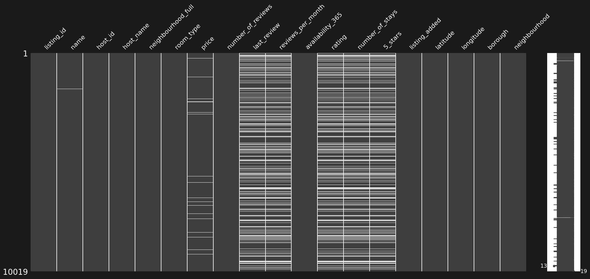
    


Looking at the missingness matrix, we can see that missing values are almost identical between `last_review`, `reviews_per_month`, `rating`, `number_of_stays`, and `5_stars`. Let's confirm this further by sorting on `rating`.


```python
# Visualize the missingness on sorted values
msno.matrix(airbnb.sort_values(by = 'rating'))
plt.show()
```


    
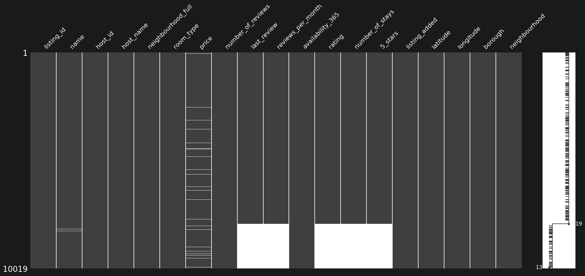
    


```python
# Missingness barplot
msno.bar(airbnb)
```


    <Axes: >


    
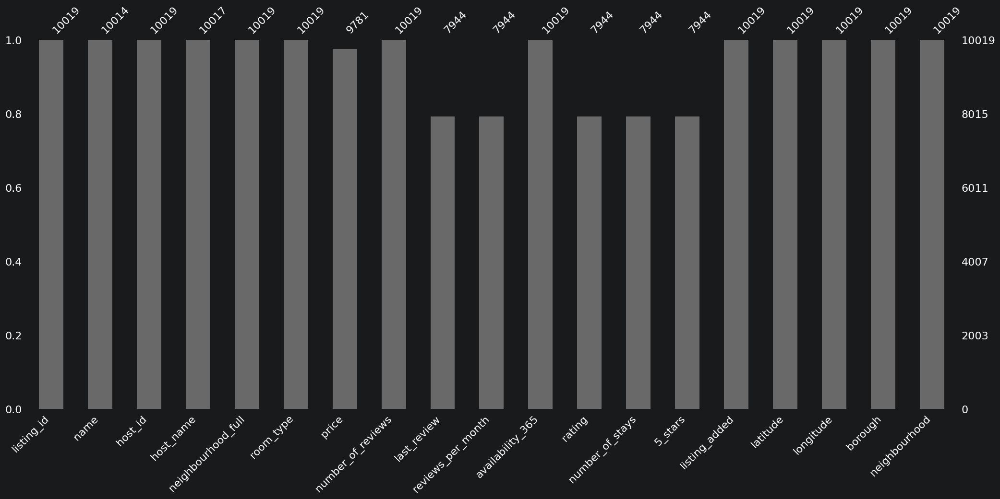
    


**Treating the** `rating`, `number_of_stays`, `5_stars`, `reviews_per_month` **columns**


```python
# Understand DataFrame with missing values in rating, number_of_stays, 5_stars, reviews_per_month
airbnb[airbnb['rating'].isna()].describe()
```


<div>
<style scoped>
    .dataframe tbody tr th:only-of-type {
        vertical-align: middle;
    }

    .dataframe tbody tr th {
        vertical-align: top;
    }

    .dataframe thead th {
        text-align: right;
    }
</style>
<table border="1" class="dataframe">
  <thead>
    <tr style="text-align: right;">
      <th></th>
      <th>listing_id</th>
      <th>host_id</th>
      <th>price</th>
      <th>number_of_reviews</th>
      <th>last_review</th>
      <th>reviews_per_month</th>
      <th>availability_365</th>
      <th>rating</th>
      <th>number_of_stays</th>
      <th>5_stars</th>
      <th>listing_added</th>
      <th>latitude</th>
      <th>longitude</th>
    </tr>
  </thead>
  <tbody>
    <tr>
      <th>count</th>
      <td>2.075000e+03</td>
      <td>2.075000e+03</td>
      <td>2028.000000</td>
      <td>2075.0</td>
      <td>0</td>
      <td>0.0</td>
      <td>2075.000000</td>
      <td>0.0</td>
      <td>0.0</td>
      <td>0.0</td>
      <td>2075</td>
      <td>2075.000000</td>
      <td>2075.000000</td>
    </tr>
    <tr>
      <th>mean</th>
      <td>2.274238e+07</td>
      <td>8.022455e+07</td>
      <td>191.553748</td>
      <td>0.0</td>
      <td>NaT</td>
      <td>NaN</td>
      <td>104.531566</td>
      <td>NaN</td>
      <td>NaN</td>
      <td>NaN</td>
      <td>2018-06-08 17:01:31.951807</td>
      <td>40.732074</td>
      <td>-73.956771</td>
    </tr>
    <tr>
      <th>min</th>
      <td>6.358800e+04</td>
      <td>1.475100e+04</td>
      <td>0.000000</td>
      <td>0.0</td>
      <td>NaT</td>
      <td>NaN</td>
      <td>0.000000</td>
      <td>NaN</td>
      <td>NaN</td>
      <td>NaN</td>
      <td>2018-02-03 00:00:00</td>
      <td>40.527000</td>
      <td>-74.209410</td>
    </tr>
    <tr>
      <th>25%</th>
      <td>1.232923e+07</td>
      <td>1.224305e+07</td>
      <td>70.000000</td>
      <td>0.0</td>
      <td>NaT</td>
      <td>NaN</td>
      <td>0.000000</td>
      <td>NaN</td>
      <td>NaN</td>
      <td>NaN</td>
      <td>2018-04-05 00:00:00</td>
      <td>40.697845</td>
      <td>-73.985185</td>
    </tr>
    <tr>
      <th>50%</th>
      <td>2.345182e+07</td>
      <td>4.040116e+07</td>
      <td>120.000000</td>
      <td>0.0</td>
      <td>NaT</td>
      <td>NaN</td>
      <td>7.000000</td>
      <td>NaN</td>
      <td>NaN</td>
      <td>NaN</td>
      <td>2018-06-05 00:00:00</td>
      <td>40.727790</td>
      <td>-73.960940</td>
    </tr>
    <tr>
      <th>75%</th>
      <td>3.400364e+07</td>
      <td>1.333498e+08</td>
      <td>205.250000</td>
      <td>0.0</td>
      <td>NaT</td>
      <td>NaN</td>
      <td>211.000000</td>
      <td>NaN</td>
      <td>NaN</td>
      <td>NaN</td>
      <td>2018-08-13 00:00:00</td>
      <td>40.763480</td>
      <td>-73.939540</td>
    </tr>
    <tr>
      <th>max</th>
      <td>3.648724e+07</td>
      <td>2.741034e+08</td>
      <td>5250.000000</td>
      <td>0.0</td>
      <td>NaT</td>
      <td>NaN</td>
      <td>365.000000</td>
      <td>NaN</td>
      <td>NaN</td>
      <td>NaN</td>
      <td>2018-10-17 00:00:00</td>
      <td>40.911690</td>
      <td>-73.727310</td>
    </tr>
    <tr>
      <th>std</th>
      <td>1.123730e+07</td>
      <td>8.663163e+07</td>
      <td>316.186639</td>
      <td>0.0</td>
      <td>NaN</td>
      <td>NaN</td>
      <td>138.266525</td>
      <td>NaN</td>
      <td>NaN</td>
      <td>NaN</td>
      <td>NaN</td>
      <td>0.051168</td>
      <td>0.041065</td>
    </tr>
  </tbody>
</table>
</div>


```python
# Understand DataFrame with missing values in rating, number_of_stays, 5_stars, reviews_per_month
airbnb[~airbnb['rating'].isna()].describe()
```


<div>
<style scoped>
    .dataframe tbody tr th:only-of-type {
        vertical-align: middle;
    }

    .dataframe tbody tr th {
        vertical-align: top;
    }

    .dataframe thead th {
        text-align: right;
    }
</style>
<table border="1" class="dataframe">
  <thead>
    <tr style="text-align: right;">
      <th></th>
      <th>listing_id</th>
      <th>host_id</th>
      <th>price</th>
      <th>number_of_reviews</th>
      <th>last_review</th>
      <th>reviews_per_month</th>
      <th>availability_365</th>
      <th>rating</th>
      <th>number_of_stays</th>
      <th>5_stars</th>
      <th>listing_added</th>
      <th>latitude</th>
      <th>longitude</th>
    </tr>
  </thead>
  <tbody>
    <tr>
      <th>count</th>
      <td>7.944000e+03</td>
      <td>7.944000e+03</td>
      <td>7753.000000</td>
      <td>7944.000000</td>
      <td>7944</td>
      <td>7944.000000</td>
      <td>7944.000000</td>
      <td>7944.000000</td>
      <td>7944.000000</td>
      <td>7944.000000</td>
      <td>7944</td>
      <td>7944.000000</td>
      <td>7944.000000</td>
    </tr>
    <tr>
      <th>mean</th>
      <td>1.837100e+07</td>
      <td>6.475548e+07</td>
      <td>140.272411</td>
      <td>28.326284</td>
      <td>2018-10-07 03:30:05.438066</td>
      <td>1.353894</td>
      <td>114.309290</td>
      <td>4.014422</td>
      <td>33.991541</td>
      <td>0.718599</td>
      <td>2018-04-03 15:56:11.601208</td>
      <td>40.728325</td>
      <td>-73.950642</td>
    </tr>
    <tr>
      <th>min</th>
      <td>3.831000e+03</td>
      <td>2.787000e+03</td>
      <td>0.000000</td>
      <td>1.000000</td>
      <td>2011-03-28 00:00:00</td>
      <td>0.010000</td>
      <td>0.000000</td>
      <td>3.000633</td>
      <td>1.200000</td>
      <td>0.600026</td>
      <td>2010-09-22 00:00:00</td>
      <td>40.508680</td>
      <td>-74.239860</td>
    </tr>
    <tr>
      <th>25%</th>
      <td>8.970241e+06</td>
      <td>7.137797e+06</td>
      <td>69.000000</td>
      <td>3.000000</td>
      <td>2018-07-16 00:00:00</td>
      <td>0.200000</td>
      <td>0.000000</td>
      <td>3.520443</td>
      <td>3.600000</td>
      <td>0.655576</td>
      <td>2018-01-10 00:00:00</td>
      <td>40.688567</td>
      <td>-73.982152</td>
    </tr>
    <tr>
      <th>50%</th>
      <td>1.928118e+07</td>
      <td>2.949374e+07</td>
      <td>105.000000</td>
      <td>9.000000</td>
      <td>2019-05-19 00:00:00</td>
      <td>0.710000</td>
      <td>54.000000</td>
      <td>4.027965</td>
      <td>10.800000</td>
      <td>0.709768</td>
      <td>2018-11-13 00:00:00</td>
      <td>40.721785</td>
      <td>-73.954415</td>
    </tr>
    <tr>
      <th>75%</th>
      <td>2.789420e+07</td>
      <td>1.016715e+08</td>
      <td>170.000000</td>
      <td>32.000000</td>
      <td>2019-06-23 00:00:00</td>
      <td>2.000000</td>
      <td>229.000000</td>
      <td>4.516378</td>
      <td>38.400000</td>
      <td>0.763978</td>
      <td>2018-12-18 00:00:00</td>
      <td>40.763360</td>
      <td>-73.934930</td>
    </tr>
    <tr>
      <th>max</th>
      <td>3.641363e+07</td>
      <td>2.733615e+08</td>
      <td>8000.000000</td>
      <td>510.000000</td>
      <td>2019-07-08 00:00:00</td>
      <td>16.220000</td>
      <td>365.000000</td>
      <td>5.000000</td>
      <td>612.000000</td>
      <td>0.950339</td>
      <td>2020-10-23 00:00:00</td>
      <td>40.913060</td>
      <td>-73.719280</td>
    </tr>
    <tr>
      <th>std</th>
      <td>1.069161e+07</td>
      <td>7.608428e+07</td>
      <td>163.668464</td>
      <td>46.741066</td>
      <td>NaN</td>
      <td>1.615380</td>
      <td>129.781153</td>
      <td>0.574998</td>
      <td>56.089279</td>
      <td>0.079978</td>
      <td>NaN</td>
      <td>0.055482</td>
      <td>0.047013</td>
    </tr>
  </tbody>
</table>
</div>


Looking at the missing data in the DataFrame - we can see that `number_of_reviews` across all missing rows is 0. We can infer that these listings have never been visited - hence could be inferred they're inactive/have never been visited.

We can impute them as following:

- Set `NaN` for `reviews_per_month`, `number_of_stays`, `5_stars` to 0.
- Since a `rating` did not happen, let's keep the column as is - but create a new column named `rated` that takes in `1` if yes, `0` if no.
- We will also leave `last_review` as is.


```python
# Impute missing data
airbnb = airbnb.fillna({'reviews_per_month':0,
                        'number_of_stays':0,
                        '5_stars':0})

# Create is_rated column
is_rated = np.where(airbnb['rating'].isna() == True, 0, 1)
airbnb['is_rated'] = is_rated
```

**Treating the** `price` **column**


```python
# Investigate DataFrame with missing values in price
airbnb[airbnb['price'].isna()].describe()
```


<div>
<style scoped>
    .dataframe tbody tr th:only-of-type {
        vertical-align: middle;
    }

    .dataframe tbody tr th {
        vertical-align: top;
    }

    .dataframe thead th {
        text-align: right;
    }
</style>
<table border="1" class="dataframe">
  <thead>
    <tr style="text-align: right;">
      <th></th>
      <th>listing_id</th>
      <th>host_id</th>
      <th>price</th>
      <th>number_of_reviews</th>
      <th>last_review</th>
      <th>reviews_per_month</th>
      <th>availability_365</th>
      <th>rating</th>
      <th>number_of_stays</th>
      <th>5_stars</th>
      <th>listing_added</th>
      <th>latitude</th>
      <th>longitude</th>
      <th>is_rated</th>
    </tr>
  </thead>
  <tbody>
    <tr>
      <th>count</th>
      <td>2.380000e+02</td>
      <td>2.380000e+02</td>
      <td>0.0</td>
      <td>238.000000</td>
      <td>191</td>
      <td>238.000000</td>
      <td>238.000000</td>
      <td>191.000000</td>
      <td>238.000000</td>
      <td>238.000000</td>
      <td>238</td>
      <td>238.000000</td>
      <td>238.000000</td>
      <td>238.000000</td>
    </tr>
    <tr>
      <th>mean</th>
      <td>1.805656e+07</td>
      <td>6.262965e+07</td>
      <td>NaN</td>
      <td>22.445378</td>
      <td>2018-10-18 04:31:24.816754</td>
      <td>1.117563</td>
      <td>98.953782</td>
      <td>4.078343</td>
      <td>26.934454</td>
      <td>0.577721</td>
      <td>2018-04-22 11:47:53.949579</td>
      <td>40.727270</td>
      <td>-73.946071</td>
      <td>0.802521</td>
    </tr>
    <tr>
      <th>min</th>
      <td>8.092400e+04</td>
      <td>1.145900e+05</td>
      <td>NaN</td>
      <td>0.000000</td>
      <td>2015-08-11 00:00:00</td>
      <td>0.000000</td>
      <td>0.000000</td>
      <td>3.007359</td>
      <td>0.000000</td>
      <td>0.000000</td>
      <td>2015-02-05 00:00:00</td>
      <td>40.581980</td>
      <td>-74.160620</td>
      <td>0.000000</td>
    </tr>
    <tr>
      <th>25%</th>
      <td>8.282298e+06</td>
      <td>6.034050e+06</td>
      <td>NaN</td>
      <td>1.000000</td>
      <td>2018-07-10 12:00:00</td>
      <td>0.080000</td>
      <td>0.000000</td>
      <td>3.646496</td>
      <td>1.200000</td>
      <td>0.613462</td>
      <td>2018-02-26 00:00:00</td>
      <td>40.688043</td>
      <td>-73.970362</td>
      <td>1.000000</td>
    </tr>
    <tr>
      <th>50%</th>
      <td>1.863600e+07</td>
      <td>2.809524e+07</td>
      <td>NaN</td>
      <td>6.000000</td>
      <td>2019-05-20 00:00:00</td>
      <td>0.350000</td>
      <td>23.000000</td>
      <td>4.149203</td>
      <td>7.200000</td>
      <td>0.681884</td>
      <td>2018-08-30 00:00:00</td>
      <td>40.719925</td>
      <td>-73.951370</td>
      <td>1.000000</td>
    </tr>
    <tr>
      <th>75%</th>
      <td>2.753759e+07</td>
      <td>1.009006e+08</td>
      <td>NaN</td>
      <td>26.000000</td>
      <td>2019-06-24 00:00:00</td>
      <td>1.435000</td>
      <td>192.000000</td>
      <td>4.538671</td>
      <td>31.200000</td>
      <td>0.746239</td>
      <td>2018-12-17 18:00:00</td>
      <td>40.762030</td>
      <td>-73.927908</td>
      <td>1.000000</td>
    </tr>
    <tr>
      <th>max</th>
      <td>3.638875e+07</td>
      <td>2.668265e+08</td>
      <td>NaN</td>
      <td>207.000000</td>
      <td>2019-07-08 00:00:00</td>
      <td>8.870000</td>
      <td>365.000000</td>
      <td>4.957646</td>
      <td>248.400000</td>
      <td>0.934979</td>
      <td>2019-01-02 00:00:00</td>
      <td>40.870390</td>
      <td>-73.734620</td>
      <td>1.000000</td>
    </tr>
    <tr>
      <th>std</th>
      <td>1.065176e+07</td>
      <td>7.518785e+07</td>
      <td>NaN</td>
      <td>35.798003</td>
      <td>NaN</td>
      <td>1.666262</td>
      <td>125.872256</td>
      <td>0.568705</td>
      <td>42.957603</td>
      <td>0.297066</td>
      <td>NaN</td>
      <td>0.057426</td>
      <td>0.048688</td>
      <td>0.398936</td>
    </tr>
  </tbody>
</table>
</div>


```python
# Investigate DataFrame with missing values in price
airbnb[~airbnb['price'].isna()].describe()
```


<div>
<style scoped>
    .dataframe tbody tr th:only-of-type {
        vertical-align: middle;
    }

    .dataframe tbody tr th {
        vertical-align: top;
    }

    .dataframe thead th {
        text-align: right;
    }
</style>
<table border="1" class="dataframe">
  <thead>
    <tr style="text-align: right;">
      <th></th>
      <th>listing_id</th>
      <th>host_id</th>
      <th>price</th>
      <th>number_of_reviews</th>
      <th>last_review</th>
      <th>reviews_per_month</th>
      <th>availability_365</th>
      <th>rating</th>
      <th>number_of_stays</th>
      <th>5_stars</th>
      <th>listing_added</th>
      <th>latitude</th>
      <th>longitude</th>
      <th>is_rated</th>
    </tr>
  </thead>
  <tbody>
    <tr>
      <th>count</th>
      <td>9.781000e+03</td>
      <td>9.781000e+03</td>
      <td>9781.000000</td>
      <td>9781.000000</td>
      <td>7753</td>
      <td>9781.000000</td>
      <td>9781.000000</td>
      <td>7753.000000</td>
      <td>9781.000000</td>
      <td>9781.000000</td>
      <td>9781</td>
      <td>9781.000000</td>
      <td>9781.000000</td>
      <td>9781.000000</td>
    </tr>
    <tr>
      <th>mean</th>
      <td>1.930602e+07</td>
      <td>6.808891e+07</td>
      <td>150.905122</td>
      <td>22.460076</td>
      <td>2018-10-06 20:58:21.096349</td>
      <td>1.072421</td>
      <td>112.608629</td>
      <td>4.012848</td>
      <td>26.952091</td>
      <td>0.569579</td>
      <td>2018-04-17 05:12:42.253348</td>
      <td>40.729146</td>
      <td>-73.952053</td>
      <td>0.792659</td>
    </tr>
    <tr>
      <th>min</th>
      <td>3.831000e+03</td>
      <td>2.787000e+03</td>
      <td>0.000000</td>
      <td>0.000000</td>
      <td>2011-03-28 00:00:00</td>
      <td>0.000000</td>
      <td>0.000000</td>
      <td>3.000633</td>
      <td>0.000000</td>
      <td>0.000000</td>
      <td>2010-09-22 00:00:00</td>
      <td>40.508680</td>
      <td>-74.239860</td>
      <td>0.000000</td>
    </tr>
    <tr>
      <th>25%</th>
      <td>9.697749e+06</td>
      <td>7.950356e+06</td>
      <td>69.000000</td>
      <td>1.000000</td>
      <td>2018-07-16 00:00:00</td>
      <td>0.040000</td>
      <td>0.000000</td>
      <td>3.519034</td>
      <td>1.200000</td>
      <td>0.611653</td>
      <td>2018-03-08 00:00:00</td>
      <td>40.689920</td>
      <td>-73.983040</td>
      <td>1.000000</td>
    </tr>
    <tr>
      <th>50%</th>
      <td>2.012526e+07</td>
      <td>3.167887e+07</td>
      <td>106.000000</td>
      <td>5.000000</td>
      <td>2019-05-19 00:00:00</td>
      <td>0.380000</td>
      <td>44.000000</td>
      <td>4.024336</td>
      <td>6.000000</td>
      <td>0.681930</td>
      <td>2018-09-09 00:00:00</td>
      <td>40.723090</td>
      <td>-73.955590</td>
      <td>1.000000</td>
    </tr>
    <tr>
      <th>75%</th>
      <td>2.941006e+07</td>
      <td>1.074344e+08</td>
      <td>180.000000</td>
      <td>22.000000</td>
      <td>2019-06-23 00:00:00</td>
      <td>1.550000</td>
      <td>228.000000</td>
      <td>4.514836</td>
      <td>26.400000</td>
      <td>0.750136</td>
      <td>2018-12-14 00:00:00</td>
      <td>40.763430</td>
      <td>-73.936270</td>
      <td>1.000000</td>
    </tr>
    <tr>
      <th>max</th>
      <td>3.648724e+07</td>
      <td>2.741034e+08</td>
      <td>8000.000000</td>
      <td>510.000000</td>
      <td>2019-07-08 00:00:00</td>
      <td>16.220000</td>
      <td>365.000000</td>
      <td>5.000000</td>
      <td>612.000000</td>
      <td>0.950339</td>
      <td>2020-10-23 00:00:00</td>
      <td>40.913060</td>
      <td>-73.719280</td>
      <td>1.000000</td>
    </tr>
    <tr>
      <th>std</th>
      <td>1.095656e+07</td>
      <td>7.871215e+07</td>
      <td>205.877428</td>
      <td>43.339259</td>
      <td>NaN</td>
      <td>1.536342</td>
      <td>131.762503</td>
      <td>0.575099</td>
      <td>52.007111</td>
      <td>0.299874</td>
      <td>NaN</td>
      <td>0.054568</td>
      <td>0.045834</td>
      <td>0.405422</td>
    </tr>
  </tbody>
</table>
</div>


From a common sense perspective, the most predictive factor for a room's price is the `room_type` column, so let's visualize how price varies by room type with `sns.boxplot()` which displays the following information:


<p align="center">

</p>


```python
# Visualize relationship between price and room_type
sns.boxplot(x = 'room_type', y = 'price', data = airbnb)
plt.ylim(0, 400)
plt.xlabel('Room Type')
plt.ylabel('Price')
plt.show()
```


    
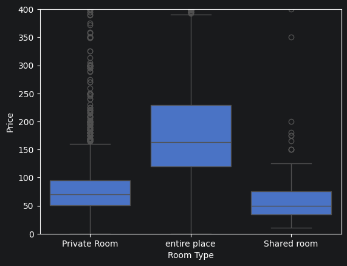
    


```python
# Get median price per room_type
airbnb.groupby('room_type')['price'].median()
```


    room_type
    Private Room     70.0
    Shared room      50.0
    entire place    163.0
    Name: price, dtype: float64


```python
# Impute price based on conditions
airbnb.loc[(airbnb['price'].isna()) & (airbnb['room_type'] == 'Entire place'), 'price'] = 163.0
airbnb.loc[(airbnb['price'].isna()) & (airbnb['room_type'] == 'Private Room'), 'price'] = 70.0
airbnb.loc[(airbnb['price'].isna()) & (airbnb['room_type'] == 'Shared Room'), 'price'] = 50.0
```


```python
# Confirm price has been imputed
airbnb.isna().sum()
```


    listing_id               0
    name                     5
    host_id                  0
    host_name                2
    neighbourhood_full       0
    room_type                0
    price                  107
    number_of_reviews        0
    last_review           2075
    reviews_per_month        0
    availability_365         0
    rating                2075
    number_of_stays          0
    5_stars                  0
    listing_added            0
    latitude                 0
    longitude                0
    borough                  0
    neighbourhood            0
    is_rated                 0
    dtype: int64


### What's still to be done?

Albeit we've done a significant amount of data cleaning tasks, there are still a couple of problems we have yet to diagnose. When cleaning data, we need to consider:

- Values that do not make any sense *(for example: are there values of `last_review` that older than `listing_added`? Are there listings in the future?*)
- Presence of duplicates values - and how to deal with them?

##### **Task 8:** Do we have consistent date data?


```python
# Doing some sanity checks on date data
today = dt.date.today()
```


```python
# Are there reviews in the future?
airbnb[airbnb['last_review'].dt.date > today]
airbnb = airbnb[~(airbnb['last_review'].dt.date > today)]
```


```python
# Are there listings in the future?
airbnb[airbnb['listing_added'].dt.date > today]
```


<div>
<style scoped>
    .dataframe tbody tr th:only-of-type {
        vertical-align: middle;
    }

    .dataframe tbody tr th {
        vertical-align: top;
    }

    .dataframe thead th {
        text-align: right;
    }
</style>
<table border="1" class="dataframe">
  <thead>
    <tr style="text-align: right;">
      <th></th>
      <th>listing_id</th>
      <th>name</th>
      <th>host_id</th>
      <th>host_name</th>
      <th>neighbourhood_full</th>
      <th>room_type</th>
      <th>price</th>
      <th>number_of_reviews</th>
      <th>last_review</th>
      <th>reviews_per_month</th>
      <th>availability_365</th>
      <th>rating</th>
      <th>number_of_stays</th>
      <th>5_stars</th>
      <th>listing_added</th>
      <th>latitude</th>
      <th>longitude</th>
      <th>borough</th>
      <th>neighbourhood</th>
      <th>is_rated</th>
    </tr>
  </thead>
  <tbody>
  </tbody>
</table>
</div>


```python
# Drop these rows since they are only 4 rows
airbnb = airbnb[~(airbnb['listing_added'].dt.date > today)]
```


```python
# Are there any listings with listing_added > last_review
inconsistent_dates = airbnb[airbnb['listing_added'].dt.date > airbnb['last_review'].dt.date]
inconsistent_dates
```


<div>
<style scoped>
    .dataframe tbody tr th:only-of-type {
        vertical-align: middle;
    }

    .dataframe tbody tr th {
        vertical-align: top;
    }

    .dataframe thead th {
        text-align: right;
    }
</style>
<table border="1" class="dataframe">
  <thead>
    <tr style="text-align: right;">
      <th></th>
      <th>listing_id</th>
      <th>name</th>
      <th>host_id</th>
      <th>host_name</th>
      <th>neighbourhood_full</th>
      <th>room_type</th>
      <th>price</th>
      <th>number_of_reviews</th>
      <th>last_review</th>
      <th>reviews_per_month</th>
      <th>availability_365</th>
      <th>rating</th>
      <th>number_of_stays</th>
      <th>5_stars</th>
      <th>listing_added</th>
      <th>latitude</th>
      <th>longitude</th>
      <th>borough</th>
      <th>neighbourhood</th>
      <th>is_rated</th>
    </tr>
  </thead>
  <tbody>
    <tr>
      <th>4</th>
      <td>22986519</td>
      <td>Bedroom on the lively Lower East Side</td>
      <td>154262349</td>
      <td>Brooke</td>
      <td>Manhattan, Lower East Side</td>
      <td>Private Room</td>
      <td>160.0</td>
      <td>23</td>
      <td>2019-06-12</td>
      <td>2.29</td>
      <td>102</td>
      <td>3.822591</td>
      <td>27.6</td>
      <td>0.649383</td>
      <td>2020-10-23</td>
      <td>40.71884</td>
      <td>-73.98354</td>
      <td>Manhattan</td>
      <td>Lower East Side</td>
      <td>1</td>
    </tr>
    <tr>
      <th>50</th>
      <td>20783900</td>
      <td>Marvelous Manhattan Marble Hill Private Suites</td>
      <td>148960265</td>
      <td>Randy</td>
      <td>Manhattan, Marble Hill</td>
      <td>Private Room</td>
      <td>93.0</td>
      <td>7</td>
      <td>2018-10-06</td>
      <td>0.32</td>
      <td>0</td>
      <td>4.868036</td>
      <td>8.4</td>
      <td>0.609263</td>
      <td>2020-02-17</td>
      <td>40.87618</td>
      <td>-73.91266</td>
      <td>Manhattan</td>
      <td>Marble Hill</td>
      <td>1</td>
    </tr>
    <tr>
      <th>60</th>
      <td>1908852</td>
      <td>Oversized Studio By Columbus Circle</td>
      <td>684629</td>
      <td>Alana</td>
      <td>Manhattan, Upper West Side</td>
      <td>entire place</td>
      <td>189.0</td>
      <td>7</td>
      <td>2016-05-06</td>
      <td>0.13</td>
      <td>0</td>
      <td>4.841204</td>
      <td>8.4</td>
      <td>0.725995</td>
      <td>2017-09-17</td>
      <td>40.77060</td>
      <td>-73.98919</td>
      <td>Manhattan</td>
      <td>Upper West Side</td>
      <td>1</td>
    </tr>
    <tr>
      <th>124</th>
      <td>28659894</td>
      <td>Private bedroom in prime Bushwick! Near Trains!!!</td>
      <td>216235179</td>
      <td>Nina</td>
      <td>Brooklyn, Bushwick</td>
      <td>Private Room</td>
      <td>55.0</td>
      <td>4</td>
      <td>2019-04-12</td>
      <td>0.58</td>
      <td>358</td>
      <td>4.916252</td>
      <td>4.8</td>
      <td>0.703117</td>
      <td>2020-08-23</td>
      <td>40.69988</td>
      <td>-73.92072</td>
      <td>Brooklyn</td>
      <td>Bushwick</td>
      <td>1</td>
    </tr>
    <tr>
      <th>511</th>
      <td>33619855</td>
      <td>Modern &amp; Spacious in trendy Crown Heights</td>
      <td>253354074</td>
      <td>Yehudis</td>
      <td>Brooklyn, Crown Heights</td>
      <td>entire place</td>
      <td>150.0</td>
      <td>6</td>
      <td>2019-05-27</td>
      <td>2.50</td>
      <td>148</td>
      <td>3.462432</td>
      <td>7.2</td>
      <td>0.610929</td>
      <td>2020-10-07</td>
      <td>40.66387</td>
      <td>-73.93840</td>
      <td>Brooklyn</td>
      <td>Crown Heights</td>
      <td>1</td>
    </tr>
    <tr>
      <th>521</th>
      <td>25317793</td>
      <td>Awesome Cozy Room in The Heart of Sunnyside!</td>
      <td>136406167</td>
      <td>Kara</td>
      <td>Queens, Sunnyside</td>
      <td>Private Room</td>
      <td>65.0</td>
      <td>22</td>
      <td>2019-06-11</td>
      <td>1.63</td>
      <td>131</td>
      <td>4.442485</td>
      <td>26.4</td>
      <td>0.722388</td>
      <td>2020-10-22</td>
      <td>40.74090</td>
      <td>-73.92696</td>
      <td>Queens</td>
      <td>Sunnyside</td>
      <td>1</td>
    </tr>
  </tbody>
</table>
</div>


```python
# Drop these rows since they are only 2 rows
airbnb.drop(inconsistent_dates.index, inplace = True, errors='ignore')
```

##### **Task 9:** Let's deal with duplicate data


There are two notable types of duplicate data:

- Identical duplicate data across all columns
- Identical duplicate data cross most or some columns

To diagnose, and deal with duplicate data, we will be using the following methods and functions:

- `.duplicated(subset = , keep = )`
  - `subset` lets us pick one or more columns with duplicate values.
  - `keep` returns lets us return all instances of duplicate values.
- `.drop_duplicates(subset = , keep = )`
  


```python
# Print the header of the DataFrame again
airbnb.head()
```


<div>
<style scoped>
    .dataframe tbody tr th:only-of-type {
        vertical-align: middle;
    }

    .dataframe tbody tr th {
        vertical-align: top;
    }

    .dataframe thead th {
        text-align: right;
    }
</style>
<table border="1" class="dataframe">
  <thead>
    <tr style="text-align: right;">
      <th></th>
      <th>listing_id</th>
      <th>name</th>
      <th>host_id</th>
      <th>host_name</th>
      <th>neighbourhood_full</th>
      <th>room_type</th>
      <th>price</th>
      <th>number_of_reviews</th>
      <th>last_review</th>
      <th>reviews_per_month</th>
      <th>availability_365</th>
      <th>rating</th>
      <th>number_of_stays</th>
      <th>5_stars</th>
      <th>listing_added</th>
      <th>latitude</th>
      <th>longitude</th>
      <th>borough</th>
      <th>neighbourhood</th>
      <th>is_rated</th>
    </tr>
  </thead>
  <tbody>
    <tr>
      <th>0</th>
      <td>13740704</td>
      <td>Cozy,budget friendly, cable inc, private entra...</td>
      <td>20583125</td>
      <td>Michel</td>
      <td>Brooklyn, Flatlands</td>
      <td>Private Room</td>
      <td>45.0</td>
      <td>10</td>
      <td>2018-12-12</td>
      <td>0.70</td>
      <td>85</td>
      <td>4.100954</td>
      <td>12.0</td>
      <td>0.609432</td>
      <td>2018-06-08</td>
      <td>40.63222</td>
      <td>-73.93398</td>
      <td>Brooklyn</td>
      <td>Flatlands</td>
      <td>1</td>
    </tr>
    <tr>
      <th>1</th>
      <td>22005115</td>
      <td>Two floor apartment near Central Park</td>
      <td>82746113</td>
      <td>Cecilia</td>
      <td>Manhattan, Upper West Side</td>
      <td>entire place</td>
      <td>135.0</td>
      <td>1</td>
      <td>2019-06-30</td>
      <td>1.00</td>
      <td>145</td>
      <td>3.367600</td>
      <td>1.2</td>
      <td>0.746135</td>
      <td>2018-12-25</td>
      <td>40.78761</td>
      <td>-73.96862</td>
      <td>Manhattan</td>
      <td>Upper West Side</td>
      <td>1</td>
    </tr>
    <tr>
      <th>2</th>
      <td>21667615</td>
      <td>Beautiful 1BR in Brooklyn Heights</td>
      <td>78251</td>
      <td>Leslie</td>
      <td>Brooklyn, Brooklyn Heights</td>
      <td>entire place</td>
      <td>150.0</td>
      <td>0</td>
      <td>NaT</td>
      <td>0.00</td>
      <td>65</td>
      <td>NaN</td>
      <td>0.0</td>
      <td>0.000000</td>
      <td>2018-08-15</td>
      <td>40.70070</td>
      <td>-73.99517</td>
      <td>Brooklyn</td>
      <td>Brooklyn Heights</td>
      <td>0</td>
    </tr>
    <tr>
      <th>3</th>
      <td>6425850</td>
      <td>Spacious, charming studio</td>
      <td>32715865</td>
      <td>Yelena</td>
      <td>Manhattan, Upper West Side</td>
      <td>entire place</td>
      <td>86.0</td>
      <td>5</td>
      <td>2017-09-23</td>
      <td>0.13</td>
      <td>0</td>
      <td>4.763203</td>
      <td>6.0</td>
      <td>0.769947</td>
      <td>2017-03-20</td>
      <td>40.79169</td>
      <td>-73.97498</td>
      <td>Manhattan</td>
      <td>Upper West Side</td>
      <td>1</td>
    </tr>
    <tr>
      <th>5</th>
      <td>271954</td>
      <td>Beautiful brownstone apartment</td>
      <td>1423798</td>
      <td>Aj</td>
      <td>Manhattan, Greenwich Village</td>
      <td>entire place</td>
      <td>150.0</td>
      <td>203</td>
      <td>2019-06-20</td>
      <td>2.22</td>
      <td>300</td>
      <td>4.478396</td>
      <td>243.6</td>
      <td>0.743500</td>
      <td>2018-12-15</td>
      <td>40.73388</td>
      <td>-73.99452</td>
      <td>Manhattan</td>
      <td>Greenwich Village</td>
      <td>1</td>
    </tr>
  </tbody>
</table>
</div>


```python
# Find duplicates
airbnb.duplicated().sum()
```


    np.int64(13)


```python
# Remove identical duplicates
airbnb = airbnb.drop_duplicates()
```


```python
# Find non-identical duplicates
airbnb.duplicated(subset=['listing_id']).sum()
```


    np.int64(7)


```python
# Show all duplicates
airbnb[airbnb.duplicated(subset=['listing_id'], keep=False)].sort_values(by='listing_id')
```


<div>
<style scoped>
    .dataframe tbody tr th:only-of-type {
        vertical-align: middle;
    }

    .dataframe tbody tr th {
        vertical-align: top;
    }

    .dataframe thead th {
        text-align: right;
    }
</style>
<table border="1" class="dataframe">
  <thead>
    <tr style="text-align: right;">
      <th></th>
      <th>listing_id</th>
      <th>name</th>
      <th>host_id</th>
      <th>host_name</th>
      <th>neighbourhood_full</th>
      <th>room_type</th>
      <th>price</th>
      <th>number_of_reviews</th>
      <th>last_review</th>
      <th>reviews_per_month</th>
      <th>availability_365</th>
      <th>rating</th>
      <th>number_of_stays</th>
      <th>5_stars</th>
      <th>listing_added</th>
      <th>latitude</th>
      <th>longitude</th>
      <th>borough</th>
      <th>neighbourhood</th>
      <th>is_rated</th>
    </tr>
  </thead>
  <tbody>
    <tr>
      <th>5761</th>
      <td>2044392</td>
      <td>The heart of Williamsburg 2 bedroom</td>
      <td>620218</td>
      <td>Sarah</td>
      <td>Brooklyn, Williamsburg</td>
      <td>entire place</td>
      <td>250.0</td>
      <td>0</td>
      <td>NaT</td>
      <td>0.00</td>
      <td>0</td>
      <td>NaN</td>
      <td>0.0</td>
      <td>0.000000</td>
      <td>2018-05-24</td>
      <td>40.71257</td>
      <td>-73.96149</td>
      <td>Brooklyn</td>
      <td>Williamsburg</td>
      <td>0</td>
    </tr>
    <tr>
      <th>8699</th>
      <td>2044392</td>
      <td>The heart of Williamsburg 2 bedroom</td>
      <td>620218</td>
      <td>Sarah</td>
      <td>Brooklyn, Williamsburg</td>
      <td>entire place</td>
      <td>245.0</td>
      <td>0</td>
      <td>NaT</td>
      <td>0.00</td>
      <td>0</td>
      <td>NaN</td>
      <td>0.0</td>
      <td>0.000000</td>
      <td>2018-08-09</td>
      <td>40.71257</td>
      <td>-73.96149</td>
      <td>Brooklyn</td>
      <td>Williamsburg</td>
      <td>0</td>
    </tr>
    <tr>
      <th>4187</th>
      <td>4244242</td>
      <td>Best Bedroom in Bedstuy/Bushwick. Ensuite bath...</td>
      <td>22023014</td>
      <td>BrooklynSleeps</td>
      <td>Brooklyn, Bedford-Stuyvesant</td>
      <td>Private Room</td>
      <td>73.0</td>
      <td>110</td>
      <td>2019-06-23</td>
      <td>1.96</td>
      <td>323</td>
      <td>4.962314</td>
      <td>132.0</td>
      <td>0.809882</td>
      <td>2018-12-18</td>
      <td>40.69496</td>
      <td>-73.93949</td>
      <td>Brooklyn</td>
      <td>Bedford-Stuyvesant</td>
      <td>1</td>
    </tr>
    <tr>
      <th>2871</th>
      <td>4244242</td>
      <td>Best Bedroom in Bedstuy/Bushwick. Ensuite bath...</td>
      <td>22023014</td>
      <td>BrooklynSleeps</td>
      <td>Brooklyn, Bedford-Stuyvesant</td>
      <td>Private Room</td>
      <td>70.0</td>
      <td>110</td>
      <td>2019-06-23</td>
      <td>1.96</td>
      <td>323</td>
      <td>4.962314</td>
      <td>132.0</td>
      <td>0.809882</td>
      <td>2018-12-18</td>
      <td>40.69496</td>
      <td>-73.93949</td>
      <td>Brooklyn</td>
      <td>Bedford-Stuyvesant</td>
      <td>1</td>
    </tr>
    <tr>
      <th>2255</th>
      <td>7319856</td>
      <td>450ft Square Studio in Gramercy NY</td>
      <td>11773680</td>
      <td>Adam</td>
      <td>Manhattan, Kips Bay</td>
      <td>entire place</td>
      <td>280.0</td>
      <td>4</td>
      <td>2016-05-22</td>
      <td>0.09</td>
      <td>225</td>
      <td>3.903764</td>
      <td>4.8</td>
      <td>0.756381</td>
      <td>2015-11-17</td>
      <td>40.73813</td>
      <td>-73.98098</td>
      <td>Manhattan</td>
      <td>Kips Bay</td>
      <td>1</td>
    </tr>
    <tr>
      <th>77</th>
      <td>7319856</td>
      <td>450ft Square Studio in Gramercy NY</td>
      <td>11773680</td>
      <td>Adam</td>
      <td>Manhattan, Kips Bay</td>
      <td>entire place</td>
      <td>289.0</td>
      <td>4</td>
      <td>2016-05-22</td>
      <td>0.09</td>
      <td>225</td>
      <td>3.903764</td>
      <td>4.8</td>
      <td>0.756381</td>
      <td>2015-11-17</td>
      <td>40.73813</td>
      <td>-73.98098</td>
      <td>Manhattan</td>
      <td>Kips Bay</td>
      <td>1</td>
    </tr>
    <tr>
      <th>7933</th>
      <td>9078222</td>
      <td>Prospect Park 3 bdrm, Sleeps 8 (#2)</td>
      <td>47219962</td>
      <td>Babajide</td>
      <td>Brooklyn, Prospect-Lefferts Gardens</td>
      <td>entire place</td>
      <td>150.0</td>
      <td>123</td>
      <td>2019-07-01</td>
      <td>2.74</td>
      <td>263</td>
      <td>3.466881</td>
      <td>147.6</td>
      <td>0.738191</td>
      <td>2018-12-26</td>
      <td>40.66086</td>
      <td>-73.96159</td>
      <td>Brooklyn</td>
      <td>Prospect-Lefferts Gardens</td>
      <td>1</td>
    </tr>
    <tr>
      <th>555</th>
      <td>9078222</td>
      <td>Prospect Park 3 bdrm, Sleeps 8 (#2)</td>
      <td>47219962</td>
      <td>Babajide</td>
      <td>Brooklyn, Prospect-Lefferts Gardens</td>
      <td>entire place</td>
      <td>154.0</td>
      <td>123</td>
      <td>2019-07-01</td>
      <td>2.74</td>
      <td>263</td>
      <td>3.466881</td>
      <td>147.6</td>
      <td>0.738191</td>
      <td>2018-12-26</td>
      <td>40.66086</td>
      <td>-73.96159</td>
      <td>Brooklyn</td>
      <td>Prospect-Lefferts Gardens</td>
      <td>1</td>
    </tr>
    <tr>
      <th>3430</th>
      <td>15027024</td>
      <td>Newly renovated 1bd on lively &amp; historic St Marks</td>
      <td>8344620</td>
      <td>Ethan</td>
      <td>Manhattan, East Village</td>
      <td>entire place</td>
      <td>180.0</td>
      <td>10</td>
      <td>2018-12-31</td>
      <td>0.30</td>
      <td>0</td>
      <td>3.869729</td>
      <td>12.0</td>
      <td>0.772513</td>
      <td>2018-06-27</td>
      <td>40.72693</td>
      <td>-73.98385</td>
      <td>Manhattan</td>
      <td>East Village</td>
      <td>1</td>
    </tr>
    <tr>
      <th>1481</th>
      <td>15027024</td>
      <td>Newly renovated 1bd on lively &amp; historic St Marks</td>
      <td>8344620</td>
      <td>Ethan</td>
      <td>Manhattan, East Village</td>
      <td>entire place</td>
      <td>180.0</td>
      <td>10</td>
      <td>2018-12-31</td>
      <td>0.30</td>
      <td>0</td>
      <td>3.969729</td>
      <td>12.0</td>
      <td>0.772513</td>
      <td>2018-06-27</td>
      <td>40.72693</td>
      <td>-73.98385</td>
      <td>Manhattan</td>
      <td>East Village</td>
      <td>1</td>
    </tr>
    <tr>
      <th>7316</th>
      <td>31470004</td>
      <td>Private bedroom/Bathroom in a 2 bedroom apartment</td>
      <td>71241932</td>
      <td>Max</td>
      <td>Manhattan, East Village</td>
      <td>Private Room</td>
      <td>2500.0</td>
      <td>0</td>
      <td>NaT</td>
      <td>0.00</td>
      <td>90</td>
      <td>NaN</td>
      <td>0.0</td>
      <td>0.000000</td>
      <td>2018-04-09</td>
      <td>40.72544</td>
      <td>-73.97818</td>
      <td>Manhattan</td>
      <td>East Village</td>
      <td>0</td>
    </tr>
    <tr>
      <th>9322</th>
      <td>31470004</td>
      <td>Private bedroom/Bathroom in a 2 bedroom apartment</td>
      <td>71241932</td>
      <td>Max</td>
      <td>Manhattan, East Village</td>
      <td>Private Room</td>
      <td>2500.0</td>
      <td>0</td>
      <td>NaT</td>
      <td>0.00</td>
      <td>90</td>
      <td>NaN</td>
      <td>0.0</td>
      <td>0.000000</td>
      <td>2018-03-12</td>
      <td>40.72544</td>
      <td>-73.97818</td>
      <td>Manhattan</td>
      <td>East Village</td>
      <td>0</td>
    </tr>
    <tr>
      <th>7155</th>
      <td>35801208</td>
      <td>Comfy 2 bedroom Close To Manhattan</td>
      <td>256911412</td>
      <td>Taylor</td>
      <td>Brooklyn, Williamsburg</td>
      <td>entire place</td>
      <td>101.0</td>
      <td>0</td>
      <td>NaT</td>
      <td>0.00</td>
      <td>27</td>
      <td>NaN</td>
      <td>0.0</td>
      <td>0.000000</td>
      <td>2018-10-17</td>
      <td>40.70469</td>
      <td>-73.93690</td>
      <td>Brooklyn</td>
      <td>Williamsburg</td>
      <td>0</td>
    </tr>
    <tr>
      <th>9265</th>
      <td>35801208</td>
      <td>Comfy 2 bedroom Close To Manhattan</td>
      <td>256911412</td>
      <td>Taylor</td>
      <td>Brooklyn, Williamsburg</td>
      <td>entire place</td>
      <td>101.0</td>
      <td>0</td>
      <td>NaT</td>
      <td>0.00</td>
      <td>27</td>
      <td>NaN</td>
      <td>0.0</td>
      <td>0.000000</td>
      <td>2018-05-03</td>
      <td>40.70469</td>
      <td>-73.93690</td>
      <td>Brooklyn</td>
      <td>Williamsburg</td>
      <td>0</td>
    </tr>
  </tbody>
</table>
</div>


To treat identical duplicates across some columns, we will chain the `.groupby()` and `.agg()` methods where we group by the column used to find duplicates (`listing_id`) and aggregate across statistical measures for `price`, `rating` and `list_added`. The `.agg()` method takes in a dictionary with each column's aggregation method - we will use the following aggregations:

- `mean` for `price` and `rating` columns
- `max` for `listing_added` column
- `first` for all remaining column

*A note on dictionary comprehensions:*

Dictionaries are useful data structures in Python with the following format
`my_dictionary = {key: value}` where a `key` is mapped to a `value` and whose `value` can be returned with `my_dictionary[key]` - dictionary comprehensions allow us to programmatically create dicitonaries using the structure:

```
{x: x*2 for x in [1,2,3,4,5]}
{1:2, 2:4, 3:6, 4:8, 5:10}
```


```python
aggregations = {
    'price': 'mean',
    'rating': 'mean',
    'listing_added': 'max'
}
reszta_kolumn = {col: 'first' for col in airbnb.columns if col not in ['listing_id', 'price', 'rating', 'listing_added']}
aggregations.update(reszta_kolumn)
airbnb = airbnb.groupby('listing_id', as_index=False).agg(aggregations)
```


```python
airbnb = airbnb[airbnb['price'] > 0]
airbnb['logprice'] = np.log(airbnb['price'])
sns.histplot(airbnb['price'],kde=True,bins = 20)
plt.show()
```


    
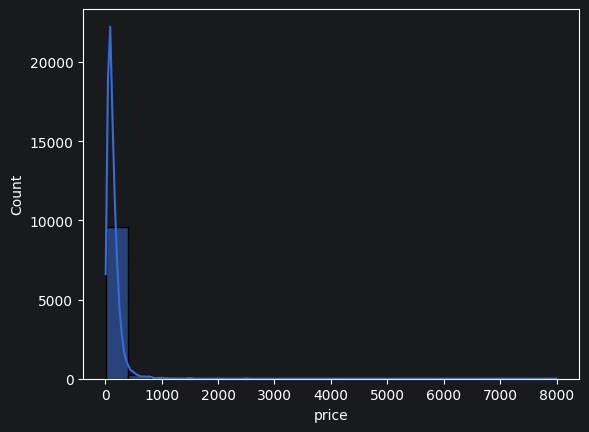
    


# **Univariate Analysis**


**Measurement scales**

Measurement scales determine what mathematical and statistical operations can be performed on data. There are four basic types of scales:

1. **Nominal** scale
- Data is used only for naming or categorizing.
- The order between values cannot be determined.
- Possible operations: count, mode, frequency analysis.

Examples:
- Pokémon type (type_1): “fire”, ‘water’, ‘grass’, etc.
- Species, gender, colors, brands etc.


```python
#Nominal scale -> uses names as categories
airbnb["room_type"].value_counts()
```


    room_type
    entire place    5071
    Private Room    4594
    Shared room      219
    Name: count, dtype: int64


```python
#Ordinal scale -> uses names for categorising but can be ordered
print(airbnb["room_type"].unique())
```

    <StringArray>
    ['entire place', 'Private Room', 'Shared room']
    Length: 3, dtype: str
    


```python
#Interval scale -> numerical with equel intervals(temperature in Celcius)
#Ratio -> has absolute zero (temperature in Kelvin)
airbnb[["number_of_reviews","availability_365","rating"]].describe()
```


<div>
<style scoped>
    .dataframe tbody tr th:only-of-type {
        vertical-align: middle;
    }

    .dataframe tbody tr th {
        vertical-align: top;
    }

    .dataframe thead th {
        text-align: right;
    }
</style>
<table border="1" class="dataframe">
  <thead>
    <tr style="text-align: right;">
      <th></th>
      <th>number_of_reviews</th>
      <th>availability_365</th>
      <th>rating</th>
    </tr>
  </thead>
  <tbody>
    <tr>
      <th>count</th>
      <td>9884.000000</td>
      <td>9884.000000</td>
      <td>7836.000000</td>
    </tr>
    <tr>
      <th>mean</th>
      <td>22.456293</td>
      <td>112.545629</td>
      <td>4.013144</td>
    </tr>
    <tr>
      <th>std</th>
      <td>43.267581</td>
      <td>131.810178</td>
      <td>0.574559</td>
    </tr>
    <tr>
      <th>min</th>
      <td>0.000000</td>
      <td>0.000000</td>
      <td>3.000633</td>
    </tr>
    <tr>
      <th>25%</th>
      <td>1.000000</td>
      <td>0.000000</td>
      <td>3.519665</td>
    </tr>
    <tr>
      <th>50%</th>
      <td>5.000000</td>
      <td>44.000000</td>
      <td>4.026178</td>
    </tr>
    <tr>
      <th>75%</th>
      <td>22.000000</td>
      <td>228.000000</td>
      <td>4.514286</td>
    </tr>
    <tr>
      <th>max</th>
      <td>510.000000</td>
      <td>365.000000</td>
      <td>5.000000</td>
    </tr>
  </tbody>
</table>
</div>


Calculating the average rating of a room (of any type)


```python
airbnb["rating"].mean()
```


    np.float64(4.013144122848648)


Calculating the average rating of private room


```python
mean_rating_private = airbnb[(airbnb["room_type"] == "Private Room")]["rating"].mean()
print(mean_rating_private)
```

    4.0119730881765365
    

Average vs skewness


```python
sns.histplot(data=airbnb, x="rating")
plt.axvline(mean_rating_private, color='r',linestyle='dashed')
plt.show()
```


    
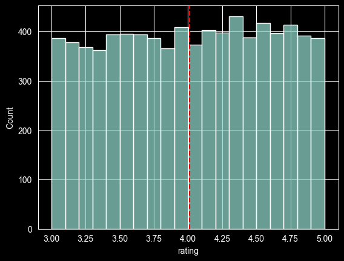
    


```python
sns.histplot(data=airbnb, x="price")
plt.axvline(airbnb["price"].mean(), color='r',linestyle='dashed')
plt.show()
```


    
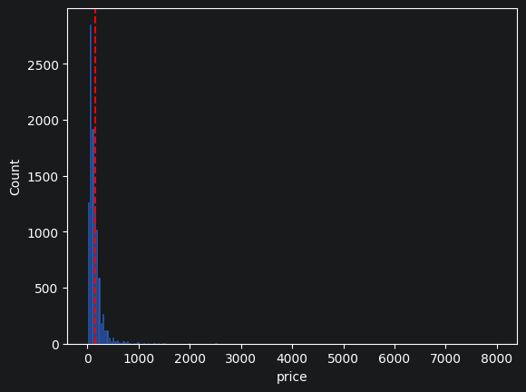
    


In Exercise8 file, there is a question asking if its possible to calculate the mean of continent column, here a simillar question can be asked about the room_type column. Ofcourse it is not possible to calculate the mean of it as it contains nominal data.

Median


```python
airbnb['price'].median()
```


    np.float64(105.0)


Median vs Average


```python
sns.histplot(data=airbnb,x="price")
plt.axvline(airbnb['price'].mean(),linestyle='dotted',color="red")
plt.axvline(airbnb['price'].median(), linestyle="dotted",color="blue")
```


    <matplotlib.lines.Line2D at 0x25925407380>


    
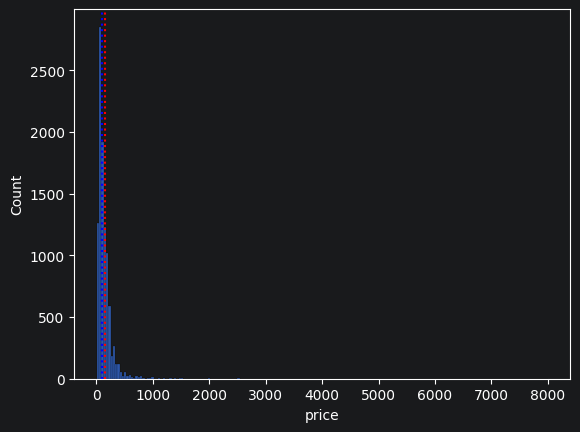
    


Mode


```python
airbnb["room_type"].mode()
```


    0    entire place
    Name: room_type, dtype: str


Calculations of quantiles


```python
sorted_prices = sorted(airbnb["price"])
print("Sorted prices:",sorted_prices)
```

    Sorted prices: [10.0, 10.0, 10.0, 10.0, 10.0, 10.0, 10.0, 16.0, 18.0, 18.0, 20.0, 20.0, 20.0, 20.0, 20.0, 20.0, 20.0, 20.0, 20.0, 21.0, 21.0, 22.0, 23.0, 24.0, 25.0, 25.0, 25.0, 25.0, 25.0, 25.0, 25.0, 25.0, 25.0, 25.0, 25.0, 25.0, 25.0, 26.0, 26.0, 26.0, 26.0, 26.0, 27.0, 27.0, 27.0, 28.0, 28.0, 28.0, 28.0, 28.0, 28.0, 28.0, 28.0, 28.0, 28.0, 28.0, 28.0, 29.0, 29.0, 29.0, 29.0, 29.0, 29.0, 29.0, 29.0, 29.0, 29.0, 29.0, 29.0, 29.0, 29.0, 29.0, 29.0, 29.0, 30.0, 30.0, 30.0, 30.0, 30.0, 30.0, 30.0, 30.0, 30.0, 30.0, 30.0, 30.0, 30.0, 30.0, 30.0, 30.0, 30.0, 30.0, 30.0, 30.0, 30.0, 30.0, 30.0, 30.0, 30.0, 30.0, 30.0, 30.0, 30.0, 30.0, 30.0, 30.0, 30.0, 30.0, 30.0, 30.0, 30.0, 30.0, 30.0, 30.0, 30.0, 30.0, 30.0, 30.0, 30.0, 30.0, 30.0, 30.0, 31.0, 31.0, 31.0, 31.0, 31.0, 31.0, 31.0, 31.0, 31.0, 31.0, 31.0, 32.0, 32.0, 32.0, 32.0, 32.0, 32.0, 32.0, 32.0, 32.0, 32.0, 32.0, 32.0, 32.0, 32.0, 32.0, 32.0, 33.0, 33.0, 33.0, 33.0, 33.0, 33.0, 33.0, 33.0, 33.0, 33.0, 33.0, 34.0, 34.0, 34.0, 34.0, 34.0, 34.0, 34.0, 34.0, 34.0, 34.0, 34.0, 34.0, 34.0, 34.0, 34.0, 35.0, 35.0, 35.0, 35.0, 35.0, 35.0, 35.0, 35.0, 35.0, 35.0, 35.0, 35.0, 35.0, 35.0, 35.0, 35.0, 35.0, 35.0, 35.0, 35.0, 35.0, 35.0, 35.0, 35.0, 35.0, 35.0, 35.0, 35.0, 35.0, 35.0, 35.0, 35.0, 35.0, 35.0, 35.0, 35.0, 35.0, 35.0, 35.0, 35.0, 35.0, 35.0, 35.0, 35.0, 35.0, 35.0, 35.0, 35.0, 35.0, 35.0, 35.0, 35.0, 35.0, 35.0, 35.0, 35.0, 35.0, 35.0, 35.0, 35.0, 35.0, 35.0, 35.0, 35.0, 35.0, 35.0, 35.0, 35.0, 35.0, 35.0, 35.0, 35.0, 35.0, 35.0, 35.0, 35.0, 35.0, 35.0, 35.0, 35.0, 35.0, 35.0, 35.0, 35.0, 35.0, 35.0, 35.0, 35.0, 35.0, 35.0, 35.0, 35.0, 35.0, 35.0, 35.0, 36.0, 36.0, 36.0, 36.0, 36.0, 36.0, 36.0, 36.0, 36.0, 36.0, 36.0, 36.0, 36.0, 36.0, 36.0, 36.0, 36.0, 36.0, 36.0, 36.0, 36.0, 36.0, 36.0, 36.0, 36.0, 37.0, 37.0, 37.0, 37.0, 37.0, 37.0, 37.0, 37.0, 37.0, 37.0, 37.0, 37.0, 37.0, 37.0, 37.0, 37.0, 37.0, 37.0, 37.0, 38.0, 38.0, 38.0, 38.0, 38.0, 38.0, 38.0, 38.0, 38.0, 38.0, 38.0, 38.0, 38.0, 38.0, 38.0, 38.0, 38.0, 38.0, 38.0, 38.0, 38.0, 38.0, 38.0, 38.0, 38.0, 38.0, 38.0, 38.0, 38.0, 38.0, 38.0, 38.0, 38.0, 38.0, 38.0, 38.0, 38.0, 39.0, 39.0, 39.0, 39.0, 39.0, 39.0, 39.0, 39.0, 39.0, 39.0, 39.0, 39.0, 39.0, 39.0, 39.0, 39.0, 39.0, 39.0, 39.0, 39.0, 39.0, 39.0, 39.0, 39.0, 39.0, 39.0, 39.0, 39.0, 39.0, 39.0, 39.0, 39.0, 39.0, 39.0, 39.0, 39.0, 39.0, 39.0, 39.0, 39.0, 39.0, 39.0, 39.0, 40.0, 40.0, 40.0, 40.0, 40.0, 40.0, 40.0, 40.0, 40.0, 40.0, 40.0, 40.0, 40.0, 40.0, 40.0, 40.0, 40.0, 40.0, 40.0, 40.0, 40.0, 40.0, 40.0, 40.0, 40.0, 40.0, 40.0, 40.0, 40.0, 40.0, 40.0, 40.0, 40.0, 40.0, 40.0, 40.0, 40.0, 40.0, 40.0, 40.0, 40.0, 40.0, 40.0, 40.0, 40.0, 40.0, 40.0, 40.0, 40.0, 40.0, 40.0, 40.0, 40.0, 40.0, 40.0, 40.0, 40.0, 40.0, 40.0, 40.0, 40.0, 40.0, 40.0, 40.0, 40.0, 40.0, 40.0, 40.0, 40.0, 40.0, 40.0, 40.0, 40.0, 40.0, 40.0, 40.0, 40.0, 40.0, 40.0, 40.0, 40.0, 40.0, 40.0, 40.0, 40.0, 40.0, 40.0, 40.0, 40.0, 40.0, 40.0, 40.0, 40.0, 40.0, 40.0, 40.0, 40.0, 40.0, 40.0, 40.0, 40.0, 40.0, 40.0, 40.0, 40.0, 40.0, 40.0, 40.0, 40.0, 40.0, 40.0, 40.0, 40.0, 40.0, 40.0, 40.0, 40.0, 40.0, 40.0, 40.0, 40.0, 40.0, 40.0, 40.0, 40.0, 40.0, 40.0, 40.0, 40.0, 40.0, 40.0, 40.0, 40.0, 40.0, 40.0, 40.0, 40.0, 40.0, 41.0, 41.0, 41.0, 41.0, 41.0, 41.0, 41.0, 41.0, 41.0, 41.0, 41.0, 41.0, 41.0, 41.0, 41.0, 41.0, 41.0, 41.0, 41.0, 41.0, 41.0, 41.0, 41.0, 41.0, 41.0, 41.0, 41.0, 41.0, 42.0, 42.0, 42.0, 42.0, 42.0, 42.0, 42.0, 42.0, 42.0, 42.0, 42.0, 42.0, 42.0, 42.0, 42.0, 42.0, 42.0, 42.0, 42.0, 42.0, 42.0, 42.0, 42.0, 42.0, 42.0, 42.0, 42.0, 42.0, 42.0, 42.0, 42.0, 42.0, 42.0, 42.0, 42.0, 43.0, 43.0, 43.0, 43.0, 43.0, 43.0, 43.0, 43.0, 43.0, 43.0, 43.0, 43.0, 43.0, 43.0, 43.0, 43.0, 43.0, 43.0, 43.0, 43.0, 43.0, 43.0, 43.0, 44.0, 44.0, 44.0, 44.0, 44.0, 44.0, 44.0, 44.0, 44.0, 44.0, 44.0, 44.0, 44.0, 44.0, 44.0, 44.0, 44.0, 44.0, 44.0, 44.0, 44.0, 44.0, 44.0, 44.0, 44.0, 44.0, 44.0, 44.0, 45.0, 45.0, 45.0, 45.0, 45.0, 45.0, 45.0, 45.0, 45.0, 45.0, 45.0, 45.0, 45.0, 45.0, 45.0, 45.0, 45.0, 45.0, 45.0, 45.0, 45.0, 45.0, 45.0, 45.0, 45.0, 45.0, 45.0, 45.0, 45.0, 45.0, 45.0, 45.0, 45.0, 45.0, 45.0, 45.0, 45.0, 45.0, 45.0, 45.0, 45.0, 45.0, 45.0, 45.0, 45.0, 45.0, 45.0, 45.0, 45.0, 45.0, 45.0, 45.0, 45.0, 45.0, 45.0, 45.0, 45.0, 45.0, 45.0, 45.0, 45.0, 45.0, 45.0, 45.0, 45.0, 45.0, 45.0, 45.0, 45.0, 45.0, 45.0, 45.0, 45.0, 45.0, 45.0, 45.0, 45.0, 45.0, 45.0, 45.0, 45.0, 45.0, 45.0, 45.0, 45.0, 45.0, 45.0, 45.0, 45.0, 45.0, 45.0, 45.0, 45.0, 45.0, 45.0, 45.0, 45.0, 45.0, 45.0, 45.0, 45.0, 45.0, 45.0, 45.0, 45.0, 45.0, 45.0, 45.0, 45.0, 45.0, 45.0, 45.0, 45.0, 45.0, 45.0, 45.0, 45.0, 45.0, 45.0, 45.0, 45.0, 45.0, 45.0, 45.0, 45.0, 45.0, 45.0, 45.0, 45.0, 45.0, 45.0, 45.0, 45.0, 45.0, 45.0, 45.0, 45.0, 45.0, 45.0, 45.0, 45.0, 45.0, 45.0, 45.0, 45.0, 45.0, 45.0, 45.0, 45.0, 45.0, 45.0, 45.0, 45.0, 45.0, 45.0, 45.0, 45.0, 45.0, 45.0, 45.0, 45.0, 45.0, 45.0, 45.0, 45.0, 45.0, 45.0, 45.0, 45.0, 45.0, 45.0, 45.0, 45.0, 45.0, 45.0, 46.0, 46.0, 46.0, 46.0, 46.0, 46.0, 46.0, 46.0, 46.0, 46.0, 46.0, 46.0, 46.0, 46.0, 46.0, 46.0, 46.0, 46.0, 46.0, 47.0, 47.0, 47.0, 47.0, 47.0, 47.0, 47.0, 47.0, 47.0, 47.0, 47.0, 47.0, 47.0, 47.0, 47.0, 47.0, 47.0, 47.0, 47.0, 47.0, 47.0, 47.0, 47.0, 47.0, 47.0, 47.0, 47.0, 47.0, 47.0, 47.0, 48.0, 48.0, 48.0, 48.0, 48.0, 48.0, 48.0, 48.0, 48.0, 48.0, 48.0, 48.0, 48.0, 48.0, 48.0, 48.0, 48.0, 48.0, 48.0, 48.0, 48.0, 48.0, 48.0, 48.0, 48.0, 48.0, 48.0, 48.0, 48.0, 48.0, 48.0, 48.0, 48.0, 48.0, 48.0, 48.0, 48.0, 48.0, 48.0, 48.0, 48.0, 48.0, 48.0, 48.0, 48.0, 49.0, 49.0, 49.0, 49.0, 49.0, 49.0, 49.0, 49.0, 49.0, 49.0, 49.0, 49.0, 49.0, 49.0, 49.0, 49.0, 49.0, 49.0, 49.0, 49.0, 49.0, 49.0, 49.0, 49.0, 49.0, 49.0, 49.0, 49.0, 49.0, 49.0, 49.0, 49.0, 49.0, 49.0, 49.0, 49.0, 49.0, 49.0, 49.0, 49.0, 49.0, 49.0, 49.0, 49.0, 49.0, 49.0, 49.0, 49.0, 49.0, 49.0, 49.0, 49.0, 49.0, 49.0, 49.0, 49.0, 49.0, 50.0, 50.0, 50.0, 50.0, 50.0, 50.0, 50.0, 50.0, 50.0, 50.0, 50.0, 50.0, 50.0, 50.0, 50.0, 50.0, 50.0, 50.0, 50.0, 50.0, 50.0, 50.0, 50.0, 50.0, 50.0, 50.0, 50.0, 50.0, 50.0, 50.0, 50.0, 50.0, 50.0, 50.0, 50.0, 50.0, 50.0, 50.0, 50.0, 50.0, 50.0, 50.0, 50.0, 50.0, 50.0, 50.0, 50.0, 50.0, 50.0, 50.0, 50.0, 50.0, 50.0, 50.0, 50.0, 50.0, 50.0, 50.0, 50.0, 50.0, 50.0, 50.0, 50.0, 50.0, 50.0, 50.0, 50.0, 50.0, 50.0, 50.0, 50.0, 50.0, 50.0, 50.0, 50.0, 50.0, 50.0, 50.0, 50.0, 50.0, 50.0, 50.0, 50.0, 50.0, 50.0, 50.0, 50.0, 50.0, 50.0, 50.0, 50.0, 50.0, 50.0, 50.0, 50.0, 50.0, 50.0, 50.0, 50.0, 50.0, 50.0, 50.0, 50.0, 50.0, 50.0, 50.0, 50.0, 50.0, 50.0, 50.0, 50.0, 50.0, 50.0, 50.0, 50.0, 50.0, 50.0, 50.0, 50.0, 50.0, 50.0, 50.0, 50.0, 50.0, 50.0, 50.0, 50.0, 50.0, 50.0, 50.0, 50.0, 50.0, 50.0, 50.0, 50.0, 50.0, 50.0, 50.0, 50.0, 50.0, 50.0, 50.0, 50.0, 50.0, 50.0, 50.0, 50.0, 50.0, 50.0, 50.0, 50.0, 50.0, 50.0, 50.0, 50.0, 50.0, 50.0, 50.0, 50.0, 50.0, 50.0, 50.0, 50.0, 50.0, 50.0, 50.0, 50.0, 50.0, 50.0, 50.0, 50.0, 50.0, 50.0, 50.0, 50.0, 50.0, 50.0, 50.0, 50.0, 50.0, 50.0, 50.0, 50.0, 50.0, 50.0, 50.0, 50.0, 50.0, 50.0, 50.0, 50.0, 50.0, 50.0, 50.0, 50.0, 50.0, 50.0, 50.0, 50.0, 50.0, 50.0, 50.0, 50.0, 50.0, 50.0, 50.0, 50.0, 50.0, 50.0, 50.0, 50.0, 50.0, 50.0, 50.0, 50.0, 50.0, 50.0, 50.0, 50.0, 50.0, 50.0, 50.0, 50.0, 50.0, 50.0, 50.0, 50.0, 50.0, 50.0, 50.0, 50.0, 50.0, 50.0, 50.0, 50.0, 50.0, 50.0, 50.0, 50.0, 50.0, 50.0, 50.0, 50.0, 50.0, 50.0, 50.0, 50.0, 50.0, 50.0, 50.0, 50.0, 50.0, 50.0, 50.0, 50.0, 50.0, 50.0, 50.0, 50.0, 50.0, 50.0, 50.0, 50.0, 50.0, 50.0, 50.0, 50.0, 50.0, 50.0, 50.0, 50.0, 50.0, 50.0, 50.0, 50.0, 50.0, 50.0, 50.0, 50.0, 50.0, 50.0, 50.0, 50.0, 50.0, 50.0, 50.0, 51.0, 51.0, 51.0, 51.0, 51.0, 51.0, 51.0, 51.0, 51.0, 51.0, 51.0, 51.0, 51.0, 51.0, 51.0, 51.0, 52.0, 52.0, 52.0, 52.0, 52.0, 52.0, 52.0, 52.0, 52.0, 52.0, 52.0, 52.0, 52.0, 52.0, 52.0, 52.0, 52.0, 52.0, 52.0, 52.0, 53.0, 53.0, 53.0, 53.0, 53.0, 53.0, 53.0, 53.0, 53.0, 53.0, 53.0, 53.0, 53.0, 53.0, 53.0, 53.0, 53.0, 53.0, 53.0, 53.0, 53.0, 54.0, 54.0, 54.0, 54.0, 54.0, 54.0, 54.0, 54.0, 54.0, 54.0, 54.0, 54.0, 54.0, 54.0, 54.0, 54.0, 54.0, 54.0, 54.0, 54.0, 54.0, 54.0, 54.0, 54.0, 54.0, 54.0, 54.0, 55.0, 55.0, 55.0, 55.0, 55.0, 55.0, 55.0, 55.0, 55.0, 55.0, 55.0, 55.0, 55.0, 55.0, 55.0, 55.0, 55.0, 55.0, 55.0, 55.0, 55.0, 55.0, 55.0, 55.0, 55.0, 55.0, 55.0, 55.0, 55.0, 55.0, 55.0, 55.0, 55.0, 55.0, 55.0, 55.0, 55.0, 55.0, 55.0, 55.0, 55.0, 55.0, 55.0, 55.0, 55.0, 55.0, 55.0, 55.0, 55.0, 55.0, 55.0, 55.0, 55.0, 55.0, 55.0, 55.0, 55.0, 55.0, 55.0, 55.0, 55.0, 55.0, 55.0, 55.0, 55.0, 55.0, 55.0, 55.0, 55.0, 55.0, 55.0, 55.0, 55.0, 55.0, 55.0, 55.0, 55.0, 55.0, 55.0, 55.0, 55.0, 55.0, 55.0, 55.0, 55.0, 55.0, 55.0, 55.0, 55.0, 55.0, 55.0, 55.0, 55.0, 55.0, 55.0, 55.0, 55.0, 55.0, 55.0, 55.0, 55.0, 55.0, 55.0, 55.0, 55.0, 55.0, 55.0, 55.0, 55.0, 55.0, 55.0, 55.0, 55.0, 55.0, 55.0, 55.0, 55.0, 55.0, 55.0, 55.0, 55.0, 55.0, 55.0, 55.0, 55.0, 55.0, 55.0, 55.0, 55.0, 55.0, 55.0, 55.0, 55.0, 55.0, 55.0, 55.0, 55.0, 55.0, 55.0, 55.0, 55.0, 55.0, 55.0, 55.0, 55.0, 55.0, 55.0, 55.0, 55.0, 55.0, 55.0, 55.0, 55.0, 55.0, 55.0, 55.0, 55.0, 55.0, 55.0, 55.0, 55.0, 55.0, 55.0, 55.0, 55.0, 55.0, 55.0, 55.0, 55.0, 55.0, 55.0, 55.0, 55.0, 55.0, 55.0, 55.0, 55.0, 55.0, 55.0, 55.0, 55.0, 55.0, 55.0, 55.0, 55.0, 55.0, 55.0, 55.0, 55.0, 55.0, 55.0, 55.0, 55.0, 55.0, 55.0, 55.0, 55.0, 55.0, 55.0, 55.0, 55.0, 55.0, 55.0, 55.0, 55.0, 55.0, 55.0, 55.0, 55.0, 55.0, 55.0, 56.0, 56.0, 56.0, 56.0, 56.0, 56.0, 56.0, 56.0, 56.0, 56.0, 56.0, 56.0, 56.0, 56.0, 56.0, 56.0, 56.0, 56.0, 57.0, 57.0, 57.0, 57.0, 57.0, 57.0, 57.0, 57.0, 57.0, 57.0, 57.0, 57.0, 57.0, 57.0, 57.0, 57.0, 57.0, 58.0, 58.0, 58.0, 58.0, 58.0, 58.0, 58.0, 58.0, 58.0, 58.0, 58.0, 58.0, 58.0, 58.0, 58.0, 58.0, 58.0, 58.0, 58.0, 58.0, 58.0, 58.0, 58.0, 58.0, 58.0, 58.0, 58.0, 58.0, 58.0, 58.0, 58.0, 58.0, 58.0, 58.0, 59.0, 59.0, 59.0, 59.0, 59.0, 59.0, 59.0, 59.0, 59.0, 59.0, 59.0, 59.0, 59.0, 59.0, 59.0, 59.0, 59.0, 59.0, 59.0, 59.0, 59.0, 59.0, 59.0, 59.0, 59.0, 59.0, 59.0, 59.0, 59.0, 59.0, 59.0, 59.0, 59.0, 59.0, 59.0, 59.0, 59.0, 59.0, 59.0, 59.0, 59.0, 59.0, 59.0, 59.0, 59.0, 59.0, 59.0, 59.0, 59.0, 59.0, 59.0, 59.0, 59.0, 59.0, 59.0, 59.0, 59.0, 59.0, 59.0, 59.0, 59.0, 59.0, 59.0, 59.0, 59.0, 59.0, 59.0, 59.0, 59.0, 59.0, 59.0, 59.0, 59.0, 59.0, 59.0, 59.0, 59.0, 59.0, 59.0, 59.0, 60.0, 60.0, 60.0, 60.0, 60.0, 60.0, 60.0, 60.0, 60.0, 60.0, 60.0, 60.0, 60.0, 60.0, 60.0, 60.0, 60.0, 60.0, 60.0, 60.0, 60.0, 60.0, 60.0, 60.0, 60.0, 60.0, 60.0, 60.0, 60.0, 60.0, 60.0, 60.0, 60.0, 60.0, 60.0, 60.0, 60.0, 60.0, 60.0, 60.0, 60.0, 60.0, 60.0, 60.0, 60.0, 60.0, 60.0, 60.0, 60.0, 60.0, 60.0, 60.0, 60.0, 60.0, 60.0, 60.0, 60.0, 60.0, 60.0, 60.0, 60.0, 60.0, 60.0, 60.0, 60.0, 60.0, 60.0, 60.0, 60.0, 60.0, 60.0, 60.0, 60.0, 60.0, 60.0, 60.0, 60.0, 60.0, 60.0, 60.0, 60.0, 60.0, 60.0, 60.0, 60.0, 60.0, 60.0, 60.0, 60.0, 60.0, 60.0, 60.0, 60.0, 60.0, 60.0, 60.0, 60.0, 60.0, 60.0, 60.0, 60.0, 60.0, 60.0, 60.0, 60.0, 60.0, 60.0, 60.0, 60.0, 60.0, 60.0, 60.0, 60.0, 60.0, 60.0, 60.0, 60.0, 60.0, 60.0, 60.0, 60.0, 60.0, 60.0, 60.0, 60.0, 60.0, 60.0, 60.0, 60.0, 60.0, 60.0, 60.0, 60.0, 60.0, 60.0, 60.0, 60.0, 60.0, 60.0, 60.0, 60.0, 60.0, 60.0, 60.0, 60.0, 60.0, 60.0, 60.0, 60.0, 60.0, 60.0, 60.0, 60.0, 60.0, 60.0, 60.0, 60.0, 60.0, 60.0, 60.0, 60.0, 60.0, 60.0, 60.0, 60.0, 60.0, 60.0, 60.0, 60.0, 60.0, 60.0, 60.0, 60.0, 60.0, 60.0, 60.0, 60.0, 60.0, 60.0, 60.0, 60.0, 60.0, 60.0, 60.0, 60.0, 60.0, 60.0, 60.0, 60.0, 60.0, 60.0, 60.0, 60.0, 60.0, 60.0, 60.0, 60.0, 60.0, 60.0, 60.0, 60.0, 60.0, 60.0, 60.0, 60.0, 60.0, 60.0, 60.0, 60.0, 60.0, 60.0, 60.0, 60.0, 60.0, 60.0, 60.0, 60.0, 60.0, 60.0, 60.0, 60.0, 60.0, 60.0, 60.0, 60.0, 60.0, 60.0, 60.0, 60.0, 60.0, 60.0, 60.0, 60.0, 60.0, 60.0, 60.0, 60.0, 60.0, 60.0, 60.0, 60.0, 60.0, 60.0, 60.0, 60.0, 60.0, 60.0, 60.0, 60.0, 60.0, 60.0, 60.0, 60.0, 60.0, 60.0, 60.0, 60.0, 60.0, 60.0, 60.0, 60.0, 60.0, 60.0, 60.0, 60.0, 60.0, 60.0, 60.0, 60.0, 60.0, 60.0, 60.0, 60.0, 60.0, 60.0, 60.0, 60.0, 60.0, 60.0, 60.0, 60.0, 60.0, 60.0, 60.0, 60.0, 60.0, 60.0, 61.0, 61.0, 61.0, 61.0, 61.0, 61.0, 62.0, 62.0, 62.0, 62.0, 62.0, 62.0, 62.0, 62.0, 62.0, 62.0, 62.0, 62.0, 62.0, 62.0, 62.0, 62.0, 62.0, 62.0, 62.0, 62.0, 62.0, 62.0, 62.0, 62.0, 62.0, 62.0, 63.0, 63.0, 63.0, 63.0, 63.0, 63.0, 63.0, 63.0, 63.0, 63.0, 63.0, 63.0, 63.0, 63.0, 63.0, 63.0, 63.0, 63.0, 63.0, 63.0, 63.0, 63.0, 63.0, 63.0, 63.0, 63.0, 64.0, 64.0, 64.0, 64.0, 64.0, 64.0, 64.0, 64.0, 64.0, 64.0, 64.0, 64.0, 64.0, 64.0, 64.0, 64.0, 64.0, 64.0, 64.0, 64.0, 64.0, 64.0, 64.0, 65.0, 65.0, 65.0, 65.0, 65.0, 65.0, 65.0, 65.0, 65.0, 65.0, 65.0, 65.0, 65.0, 65.0, 65.0, 65.0, 65.0, 65.0, 65.0, 65.0, 65.0, 65.0, 65.0, 65.0, 65.0, 65.0, 65.0, 65.0, 65.0, 65.0, 65.0, 65.0, 65.0, 65.0, 65.0, 65.0, 65.0, 65.0, 65.0, 65.0, 65.0, 65.0, 65.0, 65.0, 65.0, 65.0, 65.0, 65.0, 65.0, 65.0, 65.0, 65.0, 65.0, 65.0, 65.0, 65.0, 65.0, 65.0, 65.0, 65.0, 65.0, 65.0, 65.0, 65.0, 65.0, 65.0, 65.0, 65.0, 65.0, 65.0, 65.0, 65.0, 65.0, 65.0, 65.0, 65.0, 65.0, 65.0, 65.0, 65.0, 65.0, 65.0, 65.0, 65.0, 65.0, 65.0, 65.0, 65.0, 65.0, 65.0, 65.0, 65.0, 65.0, 65.0, 65.0, 65.0, 65.0, 65.0, 65.0, 65.0, 65.0, 65.0, 65.0, 65.0, 65.0, 65.0, 65.0, 65.0, 65.0, 65.0, 65.0, 65.0, 65.0, 65.0, 65.0, 65.0, 65.0, 65.0, 65.0, 65.0, 65.0, 65.0, 65.0, 65.0, 65.0, 65.0, 65.0, 65.0, 65.0, 65.0, 65.0, 65.0, 65.0, 65.0, 65.0, 65.0, 65.0, 65.0, 65.0, 65.0, 65.0, 65.0, 65.0, 65.0, 65.0, 65.0, 65.0, 65.0, 65.0, 65.0, 65.0, 65.0, 65.0, 65.0, 65.0, 65.0, 65.0, 65.0, 65.0, 65.0, 65.0, 65.0, 65.0, 65.0, 65.0, 65.0, 65.0, 65.0, 65.0, 65.0, 65.0, 65.0, 65.0, 65.0, 65.0, 65.0, 65.0, 65.0, 65.0, 65.0, 65.0, 65.0, 65.0, 65.0, 65.0, 65.0, 65.0, 65.0, 65.0, 65.0, 65.0, 65.0, 65.0, 65.0, 65.0, 65.0, 65.0, 65.0, 65.0, 65.0, 65.0, 65.0, 65.0, 65.0, 65.0, 65.0, 65.0, 65.0, 65.0, 65.0, 65.0, 65.0, 65.0, 65.0, 65.0, 65.0, 65.0, 65.0, 65.0, 65.0, 65.0, 65.0, 65.0, 65.0, 65.0, 65.0, 65.0, 65.0, 65.0, 65.0, 65.0, 65.0, 65.0, 65.0, 65.0, 65.0, 65.0, 65.0, 66.0, 66.0, 66.0, 66.0, 66.0, 66.0, 66.0, 66.0, 66.0, 66.0, 66.0, 66.0, 66.0, 66.0, 66.0, 66.0, 66.0, 66.0, 66.0, 66.0, 66.0, 66.0, 67.0, 67.0, 67.0, 67.0, 67.0, 67.0, 67.0, 67.0, 67.0, 67.0, 67.0, 67.0, 67.0, 67.0, 67.0, 67.0, 67.0, 67.0, 67.0, 67.0, 67.0, 67.0, 67.0, 67.0, 68.0, 68.0, 68.0, 68.0, 68.0, 68.0, 68.0, 68.0, 68.0, 68.0, 68.0, 68.0, 68.0, 68.0, 68.0, 68.0, 68.0, 68.0, 68.0, 68.0, 68.0, 68.0, 68.0, 68.0, 68.0, 68.0, 68.0, 68.0, 68.0, 68.0, 68.0, 68.0, 68.0, 68.0, 68.0, 68.0, 68.0, 68.0, 68.0, 68.0, 69.0, 69.0, 69.0, 69.0, 69.0, 69.0, 69.0, 69.0, 69.0, 69.0, 69.0, 69.0, 69.0, 69.0, 69.0, 69.0, 69.0, 69.0, 69.0, 69.0, 69.0, 69.0, 69.0, 69.0, 69.0, 69.0, 69.0, 69.0, 69.0, 69.0, 69.0, 69.0, 69.0, 69.0, 69.0, 69.0, 69.0, 69.0, 69.0, 69.0, 69.0, 69.0, 69.0, 69.0, 69.0, 69.0, 69.0, 69.0, 69.0, 69.0, 69.0, 69.0, 69.0, 69.0, 69.0, 69.0, 69.0, 69.0, 69.0, 69.0, 69.0, 69.0, 69.0, 69.0, 69.0, 69.0, 69.0, 69.0, 69.0, 69.0, 69.0, 69.0, 69.0, 69.0, 69.0, 69.0, 69.0, 69.0, 69.0, 69.0, 69.0, 69.0, 69.0, 70.0, 70.0, 70.0, 70.0, 70.0, 70.0, 70.0, 70.0, 70.0, 70.0, 70.0, 70.0, 70.0, 70.0, 70.0, 70.0, 70.0, 70.0, 70.0, 70.0, 70.0, 70.0, 70.0, 70.0, 70.0, 70.0, 70.0, 70.0, 70.0, 70.0, 70.0, 70.0, 70.0, 70.0, 70.0, 70.0, 70.0, 70.0, 70.0, 70.0, 70.0, 70.0, 70.0, 70.0, 70.0, 70.0, 70.0, 70.0, 70.0, 70.0, 70.0, 70.0, 70.0, 70.0, 70.0, 70.0, 70.0, 70.0, 70.0, 70.0, 70.0, 70.0, 70.0, 70.0, 70.0, 70.0, 70.0, 70.0, 70.0, 70.0, 70.0, 70.0, 70.0, 70.0, 70.0, 70.0, 70.0, 70.0, 70.0, 70.0, 70.0, 70.0, 70.0, 70.0, 70.0, 70.0, 70.0, 70.0, 70.0, 70.0, 70.0, 70.0, 70.0, 70.0, 70.0, 70.0, 70.0, 70.0, 70.0, 70.0, 70.0, 70.0, 70.0, 70.0, 70.0, 70.0, 70.0, 70.0, 70.0, 70.0, 70.0, 70.0, 70.0, 70.0, 70.0, 70.0, 70.0, 70.0, 70.0, 70.0, 70.0, 70.0, 70.0, 70.0, 70.0, 70.0, 70.0, 70.0, 70.0, 70.0, 70.0, 70.0, 70.0, 70.0, 70.0, 70.0, 70.0, 70.0, 70.0, 70.0, 70.0, 70.0, 70.0, 70.0, 70.0, 70.0, 70.0, 70.0, 70.0, 70.0, 70.0, 70.0, 70.0, 70.0, 70.0, 70.0, 70.0, 70.0, 70.0, 70.0, 70.0, 70.0, 70.0, 70.0, 70.0, 70.0, 70.0, 70.0, 70.0, 70.0, 70.0, 70.0, 70.0, 70.0, 70.0, 70.0, 70.0, 70.0, 70.0, 70.0, 70.0, 70.0, 70.0, 70.0, 70.0, 70.0, 70.0, 70.0, 70.0, 70.0, 70.0, 70.0, 70.0, 70.0, 70.0, 70.0, 70.0, 70.0, 70.0, 70.0, 70.0, 70.0, 70.0, 70.0, 70.0, 70.0, 70.0, 70.0, 70.0, 70.0, 70.0, 70.0, 70.0, 70.0, 70.0, 70.0, 70.0, 70.0, 70.0, 70.0, 70.0, 70.0, 70.0, 70.0, 70.0, 70.0, 70.0, 70.0, 70.0, 70.0, 70.0, 70.0, 70.0, 70.0, 70.0, 70.0, 70.0, 70.0, 70.0, 70.0, 70.0, 70.0, 70.0, 70.0, 70.0, 70.0, 70.0, 70.0, 70.0, 70.0, 70.0, 70.0, 70.0, 70.0, 70.0, 70.0, 70.0, 70.0, 70.0, 70.0, 70.0, 70.0, 70.0, 70.0, 70.0, 70.0, 70.0, 70.0, 70.0, 70.0, 70.0, 70.0, 70.0, 70.0, 70.0, 70.0, 70.0, 70.0, 70.0, 70.0, 70.0, 70.0, 70.0, 70.0, 70.0, 70.0, 70.0, 70.0, 70.0, 70.0, 70.0, 70.0, 70.0, 70.0, 70.0, 70.0, 70.0, 70.0, 70.0, 70.0, 70.0, 70.0, 70.0, 70.0, 70.0, 70.0, 70.0, 70.0, 70.0, 70.0, 70.0, 70.0, 70.0, 70.0, 70.0, 70.0, 70.0, 70.0, 70.0, 70.0, 70.0, 70.0, 70.0, 70.0, 70.0, 70.0, 70.0, 70.0, 70.0, 70.0, 70.0, 70.0, 70.0, 70.0, 70.0, 70.0, 70.0, 70.0, 70.0, 70.0, 70.0, 70.0, 70.0, 70.0, 70.0, 70.0, 70.0, 70.0, 70.0, 70.0, 70.0, 70.0, 70.0, 70.0, 70.0, 70.0, 70.0, 70.0, 70.0, 70.0, 70.0, 70.0, 70.0, 70.0, 70.0, 70.0, 70.0, 70.0, 70.0, 70.0, 70.0, 70.0, 70.0, 70.0, 70.0, 70.0, 70.0, 70.0, 70.0, 70.0, 71.0, 71.0, 71.0, 71.0, 71.0, 71.0, 71.0, 71.5, 72.0, 72.0, 72.0, 72.0, 72.0, 72.0, 72.0, 72.0, 72.0, 72.0, 72.0, 72.0, 72.0, 72.0, 72.0, 72.0, 72.0, 72.0, 72.0, 72.0, 72.0, 72.0, 72.0, 73.0, 73.0, 73.0, 73.0, 73.0, 73.0, 73.0, 73.0, 73.0, 73.0, 73.0, 73.0, 73.0, 73.0, 73.0, 73.0, 73.0, 73.0, 73.0, 73.0, 73.0, 74.0, 74.0, 74.0, 74.0, 74.0, 74.0, 74.0, 74.0, 74.0, 74.0, 74.0, 74.0, 74.0, 74.0, 74.0, 74.0, 74.0, 75.0, 75.0, 75.0, 75.0, 75.0, 75.0, 75.0, 75.0, 75.0, 75.0, 75.0, 75.0, 75.0, 75.0, 75.0, 75.0, 75.0, 75.0, 75.0, 75.0, 75.0, 75.0, 75.0, 75.0, 75.0, 75.0, 75.0, 75.0, 75.0, 75.0, 75.0, 75.0, 75.0, 75.0, 75.0, 75.0, 75.0, 75.0, 75.0, 75.0, 75.0, 75.0, 75.0, 75.0, 75.0, 75.0, 75.0, 75.0, 75.0, 75.0, 75.0, 75.0, 75.0, 75.0, 75.0, 75.0, 75.0, 75.0, 75.0, 75.0, 75.0, 75.0, 75.0, 75.0, 75.0, 75.0, 75.0, 75.0, 75.0, 75.0, 75.0, 75.0, 75.0, 75.0, 75.0, 75.0, 75.0, 75.0, 75.0, 75.0, 75.0, 75.0, 75.0, 75.0, 75.0, 75.0, 75.0, 75.0, 75.0, 75.0, 75.0, 75.0, 75.0, 75.0, 75.0, 75.0, 75.0, 75.0, 75.0, 75.0, 75.0, 75.0, 75.0, 75.0, 75.0, 75.0, 75.0, 75.0, 75.0, 75.0, 75.0, 75.0, 75.0, 75.0, 75.0, 75.0, 75.0, 75.0, 75.0, 75.0, 75.0, 75.0, 75.0, 75.0, 75.0, 75.0, 75.0, 75.0, 75.0, 75.0, 75.0, 75.0, 75.0, 75.0, 75.0, 75.0, 75.0, 75.0, 75.0, 75.0, 75.0, 75.0, 75.0, 75.0, 75.0, 75.0, 75.0, 75.0, 75.0, 75.0, 75.0, 75.0, 75.0, 75.0, 75.0, 75.0, 75.0, 75.0, 75.0, 75.0, 75.0, 75.0, 75.0, 75.0, 75.0, 75.0, 75.0, 75.0, 75.0, 75.0, 75.0, 75.0, 75.0, 75.0, 75.0, 75.0, 75.0, 75.0, 75.0, 75.0, 75.0, 75.0, 75.0, 75.0, 75.0, 75.0, 75.0, 75.0, 75.0, 75.0, 75.0, 75.0, 75.0, 75.0, 75.0, 75.0, 75.0, 75.0, 75.0, 75.0, 75.0, 75.0, 75.0, 75.0, 75.0, 75.0, 75.0, 75.0, 75.0, 75.0, 75.0, 75.0, 75.0, 75.0, 75.0, 75.0, 75.0, 75.0, 75.0, 75.0, 75.0, 75.0, 75.0, 75.0, 75.0, 75.0, 75.0, 75.0, 75.0, 75.0, 75.0, 75.0, 75.0, 75.0, 75.0, 75.0, 75.0, 75.0, 75.0, 75.0, 75.0, 75.0, 75.0, 75.0, 75.0, 75.0, 75.0, 75.0, 75.0, 75.0, 75.0, 75.0, 75.0, 75.0, 75.0, 75.0, 75.0, 75.0, 75.0, 75.0, 75.0, 75.0, 75.0, 75.0, 75.0, 75.0, 75.0, 75.0, 75.0, 75.0, 75.0, 75.0, 75.0, 75.0, 75.0, 75.0, 75.0, 75.0, 75.0, 75.0, 75.0, 76.0, 76.0, 76.0, 76.0, 76.0, 76.0, 76.0, 76.0, 76.0, 76.0, 76.0, 76.0, 76.0, 76.0, 76.0, 76.0, 76.0, 77.0, 77.0, 77.0, 77.0, 77.0, 77.0, 77.0, 77.0, 77.0, 77.0, 77.0, 77.0, 77.0, 77.0, 77.0, 77.0, 77.0, 77.0, 77.0, 77.0, 77.0, 77.0, 77.0, 78.0, 78.0, 78.0, 78.0, 78.0, 78.0, 78.0, 78.0, 78.0, 78.0, 78.0, 78.0, 78.0, 78.0, 78.0, 78.0, 78.0, 78.0, 78.0, 78.0, 78.0, 78.0, 78.0, 78.0, 78.0, 78.0, 79.0, 79.0, 79.0, 79.0, 79.0, 79.0, 79.0, 79.0, 79.0, 79.0, 79.0, 79.0, 79.0, 79.0, 79.0, 79.0, 79.0, 79.0, 79.0, 79.0, 79.0, 79.0, 79.0, 79.0, 79.0, 79.0, 79.0, 79.0, 79.0, 79.0, 79.0, 79.0, 79.0, 79.0, 79.0, 79.0, 79.0, 79.0, 79.0, 79.0, 79.0, 79.0, 79.0, 79.0, 79.0, 79.0, 79.0, 79.0, 79.0, 79.0, 79.0, 79.0, 79.0, 79.0, 79.0, 79.0, 79.0, 79.0, 80.0, 80.0, 80.0, 80.0, 80.0, 80.0, 80.0, 80.0, 80.0, 80.0, 80.0, 80.0, 80.0, 80.0, 80.0, 80.0, 80.0, 80.0, 80.0, 80.0, 80.0, 80.0, 80.0, 80.0, 80.0, 80.0, 80.0, 80.0, 80.0, 80.0, 80.0, 80.0, 80.0, 80.0, 80.0, 80.0, 80.0, 80.0, 80.0, 80.0, 80.0, 80.0, 80.0, 80.0, 80.0, 80.0, 80.0, 80.0, 80.0, 80.0, 80.0, 80.0, 80.0, 80.0, 80.0, 80.0, 80.0, 80.0, 80.0, 80.0, 80.0, 80.0, 80.0, 80.0, 80.0, 80.0, 80.0, 80.0, 80.0, 80.0, 80.0, 80.0, 80.0, 80.0, 80.0, 80.0, 80.0, 80.0, 80.0, 80.0, 80.0, 80.0, 80.0, 80.0, 80.0, 80.0, 80.0, 80.0, 80.0, 80.0, 80.0, 80.0, 80.0, 80.0, 80.0, 80.0, 80.0, 80.0, 80.0, 80.0, 80.0, 80.0, 80.0, 80.0, 80.0, 80.0, 80.0, 80.0, 80.0, 80.0, 80.0, 80.0, 80.0, 80.0, 80.0, 80.0, 80.0, 80.0, 80.0, 80.0, 80.0, 80.0, 80.0, 80.0, 80.0, 80.0, 80.0, 80.0, 80.0, 80.0, 80.0, 80.0, 80.0, 80.0, 80.0, 80.0, 80.0, 80.0, 80.0, 80.0, 80.0, 80.0, 80.0, 80.0, 80.0, 80.0, 80.0, 80.0, 80.0, 80.0, 80.0, 80.0, 80.0, 80.0, 80.0, 80.0, 80.0, 80.0, 80.0, 80.0, 80.0, 80.0, 80.0, 80.0, 80.0, 80.0, 80.0, 80.0, 80.0, 80.0, 80.0, 80.0, 80.0, 80.0, 80.0, 80.0, 80.0, 80.0, 80.0, 80.0, 80.0, 80.0, 80.0, 80.0, 80.0, 80.0, 80.0, 80.0, 80.0, 80.0, 80.0, 80.0, 80.0, 80.0, 80.0, 80.0, 80.0, 80.0, 80.0, 80.0, 80.0, 80.0, 80.0, 80.0, 80.0, 80.0, 80.0, 80.0, 80.0, 80.0, 80.0, 80.0, 80.0, 80.0, 80.0, 80.0, 80.0, 80.0, 80.0, 80.0, 80.0, 80.0, 80.0, 80.0, 80.0, 80.0, 80.0, 80.0, 80.0, 80.0, 80.0, 80.0, 80.0, 80.0, 80.0, 80.0, 80.0, 80.0, 80.0, 80.0, 80.0, 81.0, 81.0, 81.0, 81.0, 81.0, 81.0, 81.0, 81.0, 81.0, 81.0, 82.0, 82.0, 82.0, 82.0, 82.0, 82.0, 82.0, 82.0, 82.0, 82.0, 82.0, 82.0, 82.0, 82.0, 82.0, 83.0, 83.0, 83.0, 83.0, 83.0, 83.0, 83.0, 83.0, 83.0, 83.0, 83.0, 83.0, 83.0, 83.0, 83.0, 83.0, 83.0, 84.0, 84.0, 84.0, 84.0, 84.0, 84.0, 84.0, 84.0, 84.0, 84.0, 84.0, 84.0, 84.0, 84.0, 85.0, 85.0, 85.0, 85.0, 85.0, 85.0, 85.0, 85.0, 85.0, 85.0, 85.0, 85.0, 85.0, 85.0, 85.0, 85.0, 85.0, 85.0, 85.0, 85.0, 85.0, 85.0, 85.0, 85.0, 85.0, 85.0, 85.0, 85.0, 85.0, 85.0, 85.0, 85.0, 85.0, 85.0, 85.0, 85.0, 85.0, 85.0, 85.0, 85.0, 85.0, 85.0, 85.0, 85.0, 85.0, 85.0, 85.0, 85.0, 85.0, 85.0, 85.0, 85.0, 85.0, 85.0, 85.0, 85.0, 85.0, 85.0, 85.0, 85.0, 85.0, 85.0, 85.0, 85.0, 85.0, 85.0, 85.0, 85.0, 85.0, 85.0, 85.0, 85.0, 85.0, 85.0, 85.0, 85.0, 85.0, 85.0, 85.0, 85.0, 85.0, 85.0, 85.0, 85.0, 85.0, 85.0, 85.0, 85.0, 85.0, 85.0, 85.0, 85.0, 85.0, 85.0, 85.0, 85.0, 85.0, 85.0, 85.0, 85.0, 85.0, 85.0, 85.0, 85.0, 85.0, 85.0, 85.0, 85.0, 85.0, 85.0, 85.0, 85.0, 85.0, 85.0, 85.0, 85.0, 85.0, 85.0, 85.0, 85.0, 85.0, 85.0, 85.0, 85.0, 85.0, 85.0, 85.0, 85.0, 85.0, 85.0, 85.0, 85.0, 85.0, 85.0, 85.0, 85.0, 85.0, 85.0, 85.0, 85.0, 85.0, 85.0, 85.0, 85.0, 85.0, 85.0, 85.0, 85.0, 85.0, 85.0, 85.0, 85.0, 85.0, 85.0, 85.0, 85.0, 85.0, 85.0, 85.0, 85.0, 85.0, 85.0, 85.0, 85.0, 86.0, 86.0, 86.0, 86.0, 86.0, 86.0, 86.0, 86.0, 86.0, 86.0, 86.0, 86.0, 86.0, 86.0, 86.0, 86.0, 86.0, 86.0, 87.0, 87.0, 87.0, 87.0, 87.0, 87.0, 87.0, 87.0, 87.0, 87.0, 87.0, 87.0, 87.0, 87.0, 87.0, 87.0, 87.0, 87.0, 87.0, 87.0, 87.0, 87.0, 87.0, 87.0, 88.0, 88.0, 88.0, 88.0, 88.0, 88.0, 88.0, 88.0, 88.0, 88.0, 88.0, 88.0, 88.0, 88.0, 88.0, 88.0, 88.0, 88.0, 88.0, 88.0, 88.0, 89.0, 89.0, 89.0, 89.0, 89.0, 89.0, 89.0, 89.0, 89.0, 89.0, 89.0, 89.0, 89.0, 89.0, 89.0, 89.0, 89.0, 89.0, 89.0, 89.0, 89.0, 89.0, 89.0, 89.0, 89.0, 89.0, 89.0, 89.0, 89.0, 89.0, 89.0, 89.0, 89.0, 89.0, 89.0, 89.0, 89.0, 89.0, 89.0, 89.0, 89.0, 89.0, 89.0, 89.0, 89.0, 89.0, 89.0, 89.0, 89.0, 89.0, 89.0, 89.0, 89.0, 89.0, 89.0, 89.0, 89.0, 89.0, 89.0, 89.0, 89.0, 89.0, 89.0, 89.0, 89.0, 89.0, 89.0, 89.0, 89.0, 89.0, 89.0, 89.0, 89.0, 90.0, 90.0, 90.0, 90.0, 90.0, 90.0, 90.0, 90.0, 90.0, 90.0, 90.0, 90.0, 90.0, 90.0, 90.0, 90.0, 90.0, 90.0, 90.0, 90.0, 90.0, 90.0, 90.0, 90.0, 90.0, 90.0, 90.0, 90.0, 90.0, 90.0, 90.0, 90.0, 90.0, 90.0, 90.0, 90.0, 90.0, 90.0, 90.0, 90.0, 90.0, 90.0, 90.0, 90.0, 90.0, 90.0, 90.0, 90.0, 90.0, 90.0, 90.0, 90.0, 90.0, 90.0, 90.0, 90.0, 90.0, 90.0, 90.0, 90.0, 90.0, 90.0, 90.0, 90.0, 90.0, 90.0, 90.0, 90.0, 90.0, 90.0, 90.0, 90.0, 90.0, 90.0, 90.0, 90.0, 90.0, 90.0, 90.0, 90.0, 90.0, 90.0, 90.0, 90.0, 90.0, 90.0, 90.0, 90.0, 90.0, 90.0, 90.0, 90.0, 90.0, 90.0, 90.0, 90.0, 90.0, 90.0, 90.0, 90.0, 90.0, 90.0, 90.0, 90.0, 90.0, 90.0, 90.0, 90.0, 90.0, 90.0, 90.0, 90.0, 90.0, 90.0, 90.0, 90.0, 90.0, 90.0, 90.0, 90.0, 90.0, 90.0, 90.0, 90.0, 90.0, 90.0, 90.0, 90.0, 90.0, 90.0, 90.0, 90.0, 90.0, 90.0, 90.0, 90.0, 90.0, 90.0, 90.0, 90.0, 90.0, 90.0, 90.0, 90.0, 90.0, 90.0, 90.0, 90.0, 90.0, 90.0, 90.0, 90.0, 90.0, 90.0, 90.0, 90.0, 90.0, 90.0, 90.0, 90.0, 90.0, 90.0, 90.0, 90.0, 90.0, 90.0, 90.0, 90.0, 90.0, 90.0, 90.0, 90.0, 90.0, 90.0, 90.0, 90.0, 90.0, 90.0, 90.0, 90.0, 90.0, 90.0, 91.0, 91.0, 91.0, 91.0, 91.0, 91.0, 91.0, 91.0, 91.0, 91.0, 91.0, 91.0, 91.0, 92.0, 92.0, 92.0, 92.0, 92.0, 92.0, 92.0, 92.0, 92.0, 92.0, 93.0, 93.0, 93.0, 93.0, 93.0, 93.0, 93.0, 93.0, 93.0, 93.0, 93.0, 93.0, 93.0, 94.0, 94.0, 94.0, 94.0, 94.0, 94.0, 94.0, 94.0, 94.0, 94.0, 94.0, 95.0, 95.0, 95.0, 95.0, 95.0, 95.0, 95.0, 95.0, 95.0, 95.0, 95.0, 95.0, 95.0, 95.0, 95.0, 95.0, 95.0, 95.0, 95.0, 95.0, 95.0, 95.0, 95.0, 95.0, 95.0, 95.0, 95.0, 95.0, 95.0, 95.0, 95.0, 95.0, 95.0, 95.0, 95.0, 95.0, 95.0, 95.0, 95.0, 95.0, 95.0, 95.0, 95.0, 95.0, 95.0, 95.0, 95.0, 95.0, 95.0, 95.0, 95.0, 95.0, 95.0, 95.0, 95.0, 95.0, 95.0, 95.0, 95.0, 95.0, 95.0, 95.0, 95.0, 95.0, 95.0, 95.0, 95.0, 95.0, 95.0, 95.0, 95.0, 95.0, 95.0, 95.0, 95.0, 95.0, 95.0, 95.0, 95.0, 95.0, 95.0, 95.0, 95.0, 95.0, 95.0, 95.0, 95.0, 95.0, 95.0, 95.0, 95.0, 95.0, 95.0, 95.0, 95.0, 95.0, 95.0, 95.0, 95.0, 95.0, 95.0, 95.0, 95.0, 95.0, 95.0, 95.0, 95.0, 95.0, 95.0, 95.0, 95.0, 95.0, 95.0, 95.0, 95.0, 95.0, 95.0, 95.0, 95.0, 95.0, 95.0, 95.0, 95.0, 95.0, 95.0, 95.0, 95.0, 95.0, 95.0, 96.0, 96.0, 96.0, 96.0, 96.0, 96.0, 96.0, 96.0, 96.0, 96.0, 96.0, 96.0, 96.0, 96.0, 96.0, 97.0, 97.0, 97.0, 97.0, 97.0, 97.0, 97.0, 97.0, 97.0, 97.0, 97.0, 97.0, 97.0, 97.0, 97.0, 97.0, 97.0, 98.0, 98.0, 98.0, 98.0, 98.0, 98.0, 98.0, 98.0, 98.0, 98.0, 98.0, 98.0, 98.0, 98.0, 98.0, 98.0, 98.0, 98.0, 98.0, 98.0, 98.0, 98.0, 98.0, 98.0, 98.0, 98.0, 98.0, 98.0, 98.0, 98.0, 98.0, 98.0, 99.0, 99.0, 99.0, 99.0, 99.0, 99.0, 99.0, 99.0, 99.0, 99.0, 99.0, 99.0, 99.0, 99.0, 99.0, 99.0, 99.0, 99.0, 99.0, 99.0, 99.0, 99.0, 99.0, 99.0, 99.0, 99.0, 99.0, 99.0, 99.0, 99.0, 99.0, 99.0, 99.0, 99.0, 99.0, 99.0, 99.0, 99.0, 99.0, 99.0, 99.0, 99.0, 99.0, 99.0, 99.0, 99.0, 99.0, 99.0, 99.0, 99.0, 99.0, 99.0, 99.0, 99.0, 99.0, 99.0, 99.0, 99.0, 99.0, 99.0, 99.0, 99.0, 99.0, 99.0, 99.0, 99.0, 99.0, 99.0, 99.0, 99.0, 99.0, 99.0, 99.0, 99.0, 99.0, 99.0, 99.0, 99.0, 99.0, 99.0, 99.0, 99.0, 99.0, 99.0, 99.0, 99.0, 99.0, 99.0, 99.0, 99.0, 99.0, 99.0, 99.0, 99.0, 99.0, 99.0, 99.0, 99.0, 99.0, 99.0, 99.0, 99.0, 99.0, 99.0, 99.0, 99.0, 99.0, 99.0, 99.0, 99.0, 99.0, 99.0, 99.0, 99.0, 99.0, 99.0, 99.0, 99.0, 99.0, 99.0, 99.0, 99.0, 99.0, 99.0, 99.0, 99.0, 99.0, 99.0, 99.0, 99.0, 99.0, 99.0, 99.0, 99.0, 99.0, 99.0, 99.0, 99.0, 99.0, 99.0, 99.0, 99.0, 99.0, 99.0, 99.0, 99.0, 99.0, 100.0, 100.0, 100.0, 100.0, 100.0, 100.0, 100.0, 100.0, 100.0, 100.0, 100.0, 100.0, 100.0, 100.0, 100.0, 100.0, 100.0, 100.0, 100.0, 100.0, 100.0, 100.0, 100.0, 100.0, 100.0, 100.0, 100.0, 100.0, 100.0, 100.0, 100.0, 100.0, 100.0, 100.0, 100.0, 100.0, 100.0, 100.0, 100.0, 100.0, 100.0, 100.0, 100.0, 100.0, 100.0, 100.0, 100.0, 100.0, 100.0, 100.0, 100.0, 100.0, 100.0, 100.0, 100.0, 100.0, 100.0, 100.0, 100.0, 100.0, 100.0, 100.0, 100.0, 100.0, 100.0, 100.0, 100.0, 100.0, 100.0, 100.0, 100.0, 100.0, 100.0, 100.0, 100.0, 100.0, 100.0, 100.0, 100.0, 100.0, 100.0, 100.0, 100.0, 100.0, 100.0, 100.0, 100.0, 100.0, 100.0, 100.0, 100.0, 100.0, 100.0, 100.0, 100.0, 100.0, 100.0, 100.0, 100.0, 100.0, 100.0, 100.0, 100.0, 100.0, 100.0, 100.0, 100.0, 100.0, 100.0, 100.0, 100.0, 100.0, 100.0, 100.0, 100.0, 100.0, 100.0, 100.0, 100.0, 100.0, 100.0, 100.0, 100.0, 100.0, 100.0, 100.0, 100.0, 100.0, 100.0, 100.0, 100.0, 100.0, 100.0, 100.0, 100.0, 100.0, 100.0, 100.0, 100.0, 100.0, 100.0, 100.0, 100.0, 100.0, 100.0, 100.0, 100.0, 100.0, 100.0, 100.0, 100.0, 100.0, 100.0, 100.0, 100.0, 100.0, 100.0, 100.0, 100.0, 100.0, 100.0, 100.0, 100.0, 100.0, 100.0, 100.0, 100.0, 100.0, 100.0, 100.0, 100.0, 100.0, 100.0, 100.0, 100.0, 100.0, 100.0, 100.0, 100.0, 100.0, 100.0, 100.0, 100.0, 100.0, 100.0, 100.0, 100.0, 100.0, 100.0, 100.0, 100.0, 100.0, 100.0, 100.0, 100.0, 100.0, 100.0, 100.0, 100.0, 100.0, 100.0, 100.0, 100.0, 100.0, 100.0, 100.0, 100.0, 100.0, 100.0, 100.0, 100.0, 100.0, 100.0, 100.0, 100.0, 100.0, 100.0, 100.0, 100.0, 100.0, 100.0, 100.0, 100.0, 100.0, 100.0, 100.0, 100.0, 100.0, 100.0, 100.0, 100.0, 100.0, 100.0, 100.0, 100.0, 100.0, 100.0, 100.0, 100.0, 100.0, 100.0, 100.0, 100.0, 100.0, 100.0, 100.0, 100.0, 100.0, 100.0, 100.0, 100.0, 100.0, 100.0, 100.0, 100.0, 100.0, 100.0, 100.0, 100.0, 100.0, 100.0, 100.0, 100.0, 100.0, 100.0, 100.0, 100.0, 100.0, 100.0, 100.0, 100.0, 100.0, 100.0, 100.0, 100.0, 100.0, 100.0, 100.0, 100.0, 100.0, 100.0, 100.0, 100.0, 100.0, 100.0, 100.0, 100.0, 100.0, 100.0, 100.0, 100.0, 100.0, 100.0, 100.0, 100.0, 100.0, 100.0, 100.0, 100.0, 100.0, 100.0, 100.0, 100.0, 100.0, 100.0, 100.0, 100.0, 100.0, 100.0, 100.0, 100.0, 100.0, 100.0, 100.0, 100.0, 100.0, 100.0, 100.0, 100.0, 100.0, 100.0, 100.0, 100.0, 100.0, 100.0, 100.0, 100.0, 100.0, 100.0, 100.0, 100.0, 100.0, 100.0, 100.0, 100.0, 100.0, 100.0, 100.0, 100.0, 100.0, 100.0, 100.0, 100.0, 100.0, 100.0, 100.0, 100.0, 100.0, 100.0, 100.0, 100.0, 100.0, 100.0, 100.0, 100.0, 100.0, 100.0, 100.0, 100.0, 100.0, 100.0, 100.0, 100.0, 100.0, 100.0, 100.0, 100.0, 100.0, 100.0, 100.0, 100.0, 100.0, 100.0, 100.0, 100.0, 100.0, 100.0, 100.0, 100.0, 100.0, 100.0, 100.0, 100.0, 100.0, 100.0, 100.0, 100.0, 100.0, 100.0, 100.0, 100.0, 100.0, 100.0, 100.0, 100.0, 101.0, 101.0, 101.0, 101.0, 101.0, 101.0, 101.0, 101.0, 102.0, 102.0, 102.0, 102.0, 102.0, 102.0, 102.0, 102.0, 102.0, 102.0, 103.0, 103.0, 103.0, 103.0, 103.0, 103.0, 103.0, 103.0, 103.0, 103.0, 103.0, 103.0, 103.0, 104.0, 104.0, 104.0, 104.0, 105.0, 105.0, 105.0, 105.0, 105.0, 105.0, 105.0, 105.0, 105.0, 105.0, 105.0, 105.0, 105.0, 105.0, 105.0, 105.0, 105.0, 105.0, 105.0, 105.0, 105.0, 105.0, 105.0, 105.0, 105.0, 105.0, 105.0, 105.0, 105.0, 105.0, 105.0, 105.0, 105.0, 105.0, 105.0, 105.0, 105.0, 105.0, 105.0, 105.0, 105.0, 105.0, 105.0, 105.0, 105.0, 105.0, 105.0, 105.0, 105.0, 105.0, 105.0, 105.0, 105.0, 105.0, 105.0, 105.0, 105.0, 105.0, 105.0, 105.0, 105.0, 105.0, 105.0, 105.0, 105.0, 105.0, 105.0, 105.0, 105.0, 105.0, 105.0, 105.0, 105.0, 105.0, 106.0, 106.0, 106.0, 106.0, 106.0, 106.0, 106.0, 106.0, 107.0, 107.0, 107.0, 107.0, 107.0, 107.0, 107.0, 107.0, 107.0, 107.0, 108.0, 108.0, 108.0, 108.0, 108.0, 108.0, 108.0, 108.0, 108.0, 108.0, 108.0, 109.0, 109.0, 109.0, 109.0, 109.0, 109.0, 109.0, 109.0, 109.0, 109.0, 109.0, 109.0, 109.0, 109.0, 109.0, 109.0, 109.0, 109.0, 109.0, 109.0, 109.0, 109.0, 109.0, 109.0, 109.0, 109.0, 109.0, 109.0, 110.0, 110.0, 110.0, 110.0, 110.0, 110.0, 110.0, 110.0, 110.0, 110.0, 110.0, 110.0, 110.0, 110.0, 110.0, 110.0, 110.0, 110.0, 110.0, 110.0, 110.0, 110.0, 110.0, 110.0, 110.0, 110.0, 110.0, 110.0, 110.0, 110.0, 110.0, 110.0, 110.0, 110.0, 110.0, 110.0, 110.0, 110.0, 110.0, 110.0, 110.0, 110.0, 110.0, 110.0, 110.0, 110.0, 110.0, 110.0, 110.0, 110.0, 110.0, 110.0, 110.0, 110.0, 110.0, 110.0, 110.0, 110.0, 110.0, 110.0, 110.0, 110.0, 110.0, 110.0, 110.0, 110.0, 110.0, 110.0, 110.0, 110.0, 110.0, 110.0, 110.0, 110.0, 110.0, 110.0, 110.0, 110.0, 110.0, 110.0, 110.0, 110.0, 110.0, 110.0, 110.0, 110.0, 110.0, 110.0, 110.0, 110.0, 110.0, 110.0, 110.0, 110.0, 110.0, 110.0, 110.0, 110.0, 110.0, 110.0, 110.0, 110.0, 110.0, 110.0, 110.0, 110.0, 110.0, 110.0, 110.0, 110.0, 110.0, 110.0, 110.0, 110.0, 110.0, 110.0, 110.0, 110.0, 110.0, 110.0, 110.0, 110.0, 110.0, 110.0, 110.0, 110.0, 110.0, 110.0, 110.0, 110.0, 110.0, 110.0, 110.0, 110.0, 110.0, 110.0, 110.0, 110.0, 110.0, 110.0, 110.0, 111.0, 111.0, 111.0, 111.0, 112.0, 112.0, 112.0, 112.0, 112.0, 112.0, 112.0, 112.0, 112.0, 113.0, 113.0, 113.0, 113.0, 113.0, 113.0, 113.0, 113.0, 113.0, 114.0, 115.0, 115.0, 115.0, 115.0, 115.0, 115.0, 115.0, 115.0, 115.0, 115.0, 115.0, 115.0, 115.0, 115.0, 115.0, 115.0, 115.0, 115.0, 115.0, 115.0, 115.0, 115.0, 115.0, 115.0, 115.0, 115.0, 115.0, 115.0, 115.0, 115.0, 115.0, 115.0, 115.0, 115.0, 115.0, 115.0, 115.0, 115.0, 115.0, 115.0, 115.0, 115.0, 115.0, 115.0, 115.0, 115.0, 115.0, 115.0, 115.0, 115.0, 115.0, 115.0, 115.0, 115.0, 115.0, 115.0, 115.0, 115.0, 115.0, 115.0, 115.0, 115.0, 115.0, 115.0, 115.0, 115.0, 115.0, 115.0, 115.0, 115.0, 115.0, 115.0, 115.0, 115.0, 115.0, 115.0, 115.0, 115.0, 115.0, 115.0, 115.0, 115.0, 115.0, 115.0, 115.0, 115.0, 115.0, 115.0, 115.0, 115.0, 115.0, 115.0, 115.0, 115.0, 115.0, 115.0, 115.0, 115.0, 115.0, 116.0, 116.0, 116.0, 116.0, 116.0, 116.0, 117.0, 117.0, 117.0, 117.0, 117.0, 117.0, 117.0, 117.0, 117.0, 117.0, 118.0, 118.0, 118.0, 118.0, 118.0, 118.0, 118.0, 118.0, 118.0, 118.0, 118.0, 118.0, 118.0, 118.0, 118.0, 118.0, 119.0, 119.0, 119.0, 119.0, 119.0, 119.0, 119.0, 119.0, 119.0, 119.0, 119.0, 119.0, 119.0, 119.0, 119.0, 119.0, 119.0, 119.0, 119.0, 119.0, 119.0, 119.0, 119.0, 119.0, 119.0, 119.0, 119.0, 119.0, 119.0, 119.0, 119.0, 119.0, 119.0, 120.0, 120.0, 120.0, 120.0, 120.0, 120.0, 120.0, 120.0, 120.0, 120.0, 120.0, 120.0, 120.0, 120.0, 120.0, 120.0, 120.0, 120.0, 120.0, 120.0, 120.0, 120.0, 120.0, 120.0, 120.0, 120.0, 120.0, 120.0, 120.0, 120.0, 120.0, 120.0, 120.0, 120.0, 120.0, 120.0, 120.0, 120.0, 120.0, 120.0, 120.0, 120.0, 120.0, 120.0, 120.0, 120.0, 120.0, 120.0, 120.0, 120.0, 120.0, 120.0, 120.0, 120.0, 120.0, 120.0, 120.0, 120.0, 120.0, 120.0, 120.0, 120.0, 120.0, 120.0, 120.0, 120.0, 120.0, 120.0, 120.0, 120.0, 120.0, 120.0, 120.0, 120.0, 120.0, 120.0, 120.0, 120.0, 120.0, 120.0, 120.0, 120.0, 120.0, 120.0, 120.0, 120.0, 120.0, 120.0, 120.0, 120.0, 120.0, 120.0, 120.0, 120.0, 120.0, 120.0, 120.0, 120.0, 120.0, 120.0, 120.0, 120.0, 120.0, 120.0, 120.0, 120.0, 120.0, 120.0, 120.0, 120.0, 120.0, 120.0, 120.0, 120.0, 120.0, 120.0, 120.0, 120.0, 120.0, 120.0, 120.0, 120.0, 120.0, 120.0, 120.0, 120.0, 120.0, 120.0, 120.0, 120.0, 120.0, 120.0, 120.0, 120.0, 120.0, 120.0, 120.0, 120.0, 120.0, 120.0, 120.0, 120.0, 120.0, 120.0, 120.0, 120.0, 120.0, 120.0, 120.0, 120.0, 120.0, 120.0, 120.0, 120.0, 120.0, 120.0, 120.0, 120.0, 120.0, 120.0, 120.0, 120.0, 120.0, 120.0, 120.0, 120.0, 120.0, 120.0, 120.0, 120.0, 120.0, 120.0, 120.0, 120.0, 120.0, 120.0, 120.0, 120.0, 120.0, 120.0, 120.0, 120.0, 120.0, 120.0, 120.0, 120.0, 120.0, 120.0, 120.0, 120.0, 120.0, 120.0, 120.0, 120.0, 120.0, 120.0, 120.0, 120.0, 120.0, 120.0, 120.0, 120.0, 120.0, 120.0, 120.0, 120.0, 120.0, 120.0, 120.0, 120.0, 120.0, 120.0, 120.0, 120.0, 120.0, 120.0, 120.0, 120.0, 120.0, 120.0, 120.0, 120.0, 120.0, 120.0, 120.0, 120.0, 120.0, 120.0, 120.0, 120.0, 120.0, 121.0, 121.0, 121.0, 121.0, 121.0, 122.0, 122.0, 122.0, 122.0, 122.0, 122.0, 122.0, 122.0, 122.0, 123.0, 123.0, 123.0, 123.0, 123.0, 123.0, 123.0, 124.0, 124.0, 124.0, 124.0, 124.0, 124.0, 124.0, 124.0, 125.0, 125.0, 125.0, 125.0, 125.0, 125.0, 125.0, 125.0, 125.0, 125.0, 125.0, 125.0, 125.0, 125.0, 125.0, 125.0, 125.0, 125.0, 125.0, 125.0, 125.0, 125.0, 125.0, 125.0, 125.0, 125.0, 125.0, 125.0, 125.0, 125.0, 125.0, 125.0, 125.0, 125.0, 125.0, 125.0, 125.0, 125.0, 125.0, 125.0, 125.0, 125.0, 125.0, 125.0, 125.0, 125.0, 125.0, 125.0, 125.0, 125.0, 125.0, 125.0, 125.0, 125.0, 125.0, 125.0, 125.0, 125.0, 125.0, 125.0, 125.0, 125.0, 125.0, 125.0, 125.0, 125.0, 125.0, 125.0, 125.0, 125.0, 125.0, 125.0, 125.0, 125.0, 125.0, 125.0, 125.0, 125.0, 125.0, 125.0, 125.0, 125.0, 125.0, 125.0, 125.0, 125.0, 125.0, 125.0, 125.0, 125.0, 125.0, 125.0, 125.0, 125.0, 125.0, 125.0, 125.0, 125.0, 125.0, 125.0, 125.0, 125.0, 125.0, 125.0, 125.0, 125.0, 125.0, 125.0, 125.0, 125.0, 125.0, 125.0, 125.0, 125.0, 125.0, 125.0, 125.0, 125.0, 125.0, 125.0, 125.0, 125.0, 125.0, 125.0, 125.0, 125.0, 125.0, 125.0, 125.0, 125.0, 125.0, 125.0, 125.0, 125.0, 125.0, 125.0, 125.0, 125.0, 125.0, 125.0, 125.0, 125.0, 125.0, 125.0, 125.0, 125.0, 125.0, 125.0, 125.0, 125.0, 125.0, 125.0, 125.0, 125.0, 125.0, 125.0, 125.0, 125.0, 125.0, 125.0, 125.0, 125.0, 125.0, 125.0, 125.0, 125.0, 125.0, 125.0, 125.0, 125.0, 125.0, 125.0, 125.0, 125.0, 125.0, 125.0, 125.0, 125.0, 125.0, 125.0, 125.0, 125.0, 125.0, 125.0, 125.0, 125.0, 125.0, 125.0, 125.0, 125.0, 125.0, 125.0, 125.0, 125.0, 125.0, 125.0, 125.0, 125.0, 125.0, 125.0, 125.0, 125.0, 125.0, 125.0, 125.0, 125.0, 125.0, 125.0, 125.0, 125.0, 126.0, 126.0, 126.0, 126.0, 126.0, 126.0, 127.0, 127.0, 127.0, 127.0, 127.0, 128.0, 128.0, 128.0, 128.0, 128.0, 128.0, 128.0, 128.0, 128.0, 128.0, 129.0, 129.0, 129.0, 129.0, 129.0, 129.0, 129.0, 129.0, 129.0, 129.0, 129.0, 129.0, 129.0, 129.0, 129.0, 129.0, 129.0, 129.0, 129.0, 129.0, 129.0, 129.0, 129.0, 129.0, 129.0, 129.0, 129.0, 129.0, 129.0, 129.0, 129.0, 129.0, 129.0, 129.0, 129.0, 129.0, 129.0, 129.0, 129.0, 129.0, 130.0, 130.0, 130.0, 130.0, 130.0, 130.0, 130.0, 130.0, 130.0, 130.0, 130.0, 130.0, 130.0, 130.0, 130.0, 130.0, 130.0, 130.0, 130.0, 130.0, 130.0, 130.0, 130.0, 130.0, 130.0, 130.0, 130.0, 130.0, 130.0, 130.0, 130.0, 130.0, 130.0, 130.0, 130.0, 130.0, 130.0, 130.0, 130.0, 130.0, 130.0, 130.0, 130.0, 130.0, 130.0, 130.0, 130.0, 130.0, 130.0, 130.0, 130.0, 130.0, 130.0, 130.0, 130.0, 130.0, 130.0, 130.0, 130.0, 130.0, 130.0, 130.0, 130.0, 130.0, 130.0, 130.0, 130.0, 130.0, 130.0, 130.0, 130.0, 130.0, 130.0, 130.0, 130.0, 130.0, 130.0, 130.0, 130.0, 130.0, 130.0, 130.0, 130.0, 130.0, 130.0, 130.0, 130.0, 130.0, 130.0, 130.0, 130.0, 130.0, 130.0, 130.0, 130.0, 130.0, 130.0, 130.0, 130.0, 130.0, 130.0, 130.0, 130.0, 130.0, 130.0, 130.0, 130.0, 131.0, 131.0, 131.0, 131.0, 131.0, 132.0, 132.0, 132.0, 132.0, 132.0, 132.0, 132.0, 132.0, 132.0, 132.0, 132.0, 133.0, 133.0, 133.0, 133.0, 133.0, 133.0, 133.0, 133.0, 133.0, 133.0, 133.0, 133.0, 134.0, 134.0, 134.0, 134.0, 134.0, 134.0, 134.0, 135.0, 135.0, 135.0, 135.0, 135.0, 135.0, 135.0, 135.0, 135.0, 135.0, 135.0, 135.0, 135.0, 135.0, 135.0, 135.0, 135.0, 135.0, 135.0, 135.0, 135.0, 135.0, 135.0, 135.0, 135.0, 135.0, 135.0, 135.0, 135.0, 135.0, 135.0, 135.0, 135.0, 135.0, 135.0, 135.0, 135.0, 135.0, 135.0, 135.0, 135.0, 135.0, 135.0, 135.0, 135.0, 135.0, 135.0, 135.0, 135.0, 135.0, 135.0, 135.0, 135.0, 135.0, 135.0, 135.0, 135.0, 135.0, 135.0, 135.0, 135.0, 135.0, 135.0, 135.0, 135.0, 135.0, 135.0, 135.0, 135.0, 135.0, 135.0, 135.0, 135.0, 135.0, 135.0, 135.0, 135.0, 135.0, 135.0, 135.0, 135.0, 135.0, 135.0, 135.0, 135.0, 135.0, 135.0, 135.0, 135.0, 135.0, 135.0, 135.0, 135.0, 135.0, 136.0, 136.0, 136.0, 136.0, 136.0, 136.0, 137.0, 137.0, 137.0, 137.0, 138.0, 138.0, 138.0, 138.0, 138.0, 138.0, 138.0, 138.0, 139.0, 139.0, 139.0, 139.0, 139.0, 139.0, 139.0, 139.0, 139.0, 139.0, 139.0, 139.0, 139.0, 139.0, 139.0, 139.0, 139.0, 139.0, 139.0, 139.0, 139.0, 139.0, 139.0, 139.0, 139.0, 139.0, 139.0, 139.0, 139.0, 139.0, 139.0, 140.0, 140.0, 140.0, 140.0, 140.0, 140.0, 140.0, 140.0, 140.0, 140.0, 140.0, 140.0, 140.0, 140.0, 140.0, 140.0, 140.0, 140.0, 140.0, 140.0, 140.0, 140.0, 140.0, 140.0, 140.0, 140.0, 140.0, 140.0, 140.0, 140.0, 140.0, 140.0, 140.0, 140.0, 140.0, 140.0, 140.0, 140.0, 140.0, 140.0, 140.0, 140.0, 140.0, 140.0, 140.0, 140.0, 140.0, 140.0, 140.0, 140.0, 140.0, 140.0, 140.0, 140.0, 140.0, 140.0, 140.0, 140.0, 140.0, 140.0, 140.0, 140.0, 140.0, 140.0, 140.0, 140.0, 140.0, 140.0, 140.0, 140.0, 140.0, 140.0, 140.0, 140.0, 140.0, 140.0, 140.0, 140.0, 140.0, 140.0, 140.0, 140.0, 140.0, 140.0, 140.0, 140.0, 140.0, 140.0, 140.0, 140.0, 140.0, 140.0, 140.0, 140.0, 140.0, 140.0, 140.0, 140.0, 140.0, 140.0, 140.0, 140.0, 140.0, 140.0, 140.0, 140.0, 140.0, 140.0, 140.0, 140.0, 141.0, 141.0, 142.0, 142.0, 142.0, 142.0, 142.0, 142.0, 142.0, 142.0, 142.0, 143.0, 143.0, 143.0, 143.0, 143.0, 143.0, 143.0, 143.0, 144.0, 144.0, 144.0, 144.0, 144.0, 144.0, 144.0, 144.0, 144.0, 144.0, 144.0, 144.0, 144.0, 144.0, 145.0, 145.0, 145.0, 145.0, 145.0, 145.0, 145.0, 145.0, 145.0, 145.0, 145.0, 145.0, 145.0, 145.0, 145.0, 145.0, 145.0, 145.0, 145.0, 145.0, 145.0, 145.0, 145.0, 145.0, 145.0, 145.0, 145.0, 145.0, 145.0, 145.0, 145.0, 145.0, 145.0, 145.0, 145.0, 145.0, 145.0, 145.0, 145.0, 145.0, 145.0, 145.0, 145.0, 145.0, 145.0, 145.0, 145.0, 145.0, 145.0, 145.0, 145.0, 145.0, 145.0, 145.0, 145.0, 145.0, 145.0, 145.0, 145.0, 145.0, 145.0, 145.0, 146.0, 146.0, 146.0, 147.0, 147.0, 147.0, 147.0, 147.0, 147.0, 148.0, 148.0, 148.0, 148.0, 148.0, 148.0, 148.0, 148.0, 149.0, 149.0, 149.0, 149.0, 149.0, 149.0, 149.0, 149.0, 149.0, 149.0, 149.0, 149.0, 149.0, 149.0, 149.0, 149.0, 149.0, 149.0, 149.0, 149.0, 149.0, 149.0, 149.0, 149.0, 149.0, 149.0, 149.0, 149.0, 149.0, 149.0, 149.0, 149.0, 149.0, 149.0, 149.0, 149.0, 149.0, 149.0, 149.0, 149.0, 149.0, 149.0, 149.0, 149.0, 149.0, 149.0, 149.0, 149.0, 149.0, 149.0, 149.0, 149.0, 150.0, 150.0, 150.0, 150.0, 150.0, 150.0, 150.0, 150.0, 150.0, 150.0, 150.0, 150.0, 150.0, 150.0, 150.0, 150.0, 150.0, 150.0, 150.0, 150.0, 150.0, 150.0, 150.0, 150.0, 150.0, 150.0, 150.0, 150.0, 150.0, 150.0, 150.0, 150.0, 150.0, 150.0, 150.0, 150.0, 150.0, 150.0, 150.0, 150.0, 150.0, 150.0, 150.0, 150.0, 150.0, 150.0, 150.0, 150.0, 150.0, 150.0, 150.0, 150.0, 150.0, 150.0, 150.0, 150.0, 150.0, 150.0, 150.0, 150.0, 150.0, 150.0, 150.0, 150.0, 150.0, 150.0, 150.0, 150.0, 150.0, 150.0, 150.0, 150.0, 150.0, 150.0, 150.0, 150.0, 150.0, 150.0, 150.0, 150.0, 150.0, 150.0, 150.0, 150.0, 150.0, 150.0, 150.0, 150.0, 150.0, 150.0, 150.0, 150.0, 150.0, 150.0, 150.0, 150.0, 150.0, 150.0, 150.0, 150.0, 150.0, 150.0, 150.0, 150.0, 150.0, 150.0, 150.0, 150.0, 150.0, 150.0, 150.0, 150.0, 150.0, 150.0, 150.0, 150.0, 150.0, 150.0, 150.0, 150.0, 150.0, 150.0, 150.0, 150.0, 150.0, 150.0, 150.0, 150.0, 150.0, 150.0, 150.0, 150.0, 150.0, 150.0, 150.0, 150.0, 150.0, 150.0, 150.0, 150.0, 150.0, 150.0, 150.0, 150.0, 150.0, 150.0, 150.0, 150.0, 150.0, 150.0, 150.0, 150.0, 150.0, 150.0, 150.0, 150.0, 150.0, 150.0, 150.0, 150.0, 150.0, 150.0, 150.0, 150.0, 150.0, 150.0, 150.0, 150.0, 150.0, 150.0, 150.0, 150.0, 150.0, 150.0, 150.0, 150.0, 150.0, 150.0, 150.0, 150.0, 150.0, 150.0, 150.0, 150.0, 150.0, 150.0, 150.0, 150.0, 150.0, 150.0, 150.0, 150.0, 150.0, 150.0, 150.0, 150.0, 150.0, 150.0, 150.0, 150.0, 150.0, 150.0, 150.0, 150.0, 150.0, 150.0, 150.0, 150.0, 150.0, 150.0, 150.0, 150.0, 150.0, 150.0, 150.0, 150.0, 150.0, 150.0, 150.0, 150.0, 150.0, 150.0, 150.0, 150.0, 150.0, 150.0, 150.0, 150.0, 150.0, 150.0, 150.0, 150.0, 150.0, 150.0, 150.0, 150.0, 150.0, 150.0, 150.0, 150.0, 150.0, 150.0, 150.0, 150.0, 150.0, 150.0, 150.0, 150.0, 150.0, 150.0, 150.0, 150.0, 150.0, 150.0, 150.0, 150.0, 150.0, 150.0, 150.0, 150.0, 150.0, 150.0, 150.0, 150.0, 150.0, 150.0, 150.0, 150.0, 150.0, 150.0, 150.0, 150.0, 150.0, 150.0, 150.0, 150.0, 150.0, 150.0, 150.0, 150.0, 150.0, 150.0, 150.0, 150.0, 150.0, 150.0, 150.0, 150.0, 150.0, 150.0, 150.0, 150.0, 150.0, 150.0, 150.0, 150.0, 150.0, 150.0, 150.0, 150.0, 150.0, 150.0, 150.0, 150.0, 150.0, 150.0, 150.0, 150.0, 150.0, 150.0, 150.0, 150.0, 150.0, 150.0, 150.0, 150.0, 150.0, 150.0, 150.0, 150.0, 150.0, 150.0, 150.0, 150.0, 150.0, 150.0, 150.0, 150.0, 150.0, 150.0, 150.0, 150.0, 150.0, 150.0, 150.0, 150.0, 150.0, 150.0, 150.0, 150.0, 150.0, 150.0, 150.0, 150.0, 150.0, 150.0, 150.0, 150.0, 150.0, 150.0, 150.0, 150.0, 150.0, 150.0, 150.0, 150.0, 150.0, 150.0, 150.0, 150.0, 150.0, 150.0, 150.0, 150.0, 150.0, 150.0, 150.0, 150.0, 150.0, 150.0, 150.0, 150.0, 150.0, 150.0, 150.0, 150.0, 150.0, 150.0, 150.0, 150.0, 150.0, 150.0, 150.0, 150.0, 150.0, 150.0, 150.0, 150.0, 150.0, 150.0, 150.0, 150.0, 150.0, 150.0, 150.0, 150.0, 150.0, 150.0, 150.0, 150.0, 150.0, 150.0, 150.0, 150.0, 150.0, 150.0, 150.0, 150.0, 150.0, 150.0, 150.0, 150.0, 150.0, 151.0, 151.0, 151.0, 151.0, 152.0, 152.0, 152.0, 152.0, 152.0, 153.0, 153.0, 153.0, 154.0, 154.0, 154.0, 154.0, 154.0, 154.0, 154.0, 155.0, 155.0, 155.0, 155.0, 155.0, 155.0, 155.0, 155.0, 155.0, 155.0, 155.0, 155.0, 155.0, 155.0, 155.0, 155.0, 155.0, 155.0, 155.0, 155.0, 155.0, 155.0, 155.0, 155.0, 155.0, 155.0, 155.0, 155.0, 155.0, 156.0, 157.0, 157.0, 157.0, 157.0, 157.0, 158.0, 158.0, 158.0, 158.0, 158.0, 158.0, 158.0, 158.0, 158.0, 158.0, 158.0, 159.0, 159.0, 159.0, 159.0, 159.0, 159.0, 159.0, 159.0, 159.0, 159.0, 159.0, 159.0, 159.0, 159.0, 159.0, 159.0, 159.0, 159.0, 159.0, 159.0, 159.0, 159.0, 159.0, 159.0, 159.0, 159.0, 159.0, 159.0, 159.0, 159.0, 159.0, 159.0, 160.0, 160.0, 160.0, 160.0, 160.0, 160.0, 160.0, 160.0, 160.0, 160.0, 160.0, 160.0, 160.0, 160.0, 160.0, 160.0, 160.0, 160.0, 160.0, 160.0, 160.0, 160.0, 160.0, 160.0, 160.0, 160.0, 160.0, 160.0, 160.0, 160.0, 160.0, 160.0, 160.0, 160.0, 160.0, 160.0, 160.0, 160.0, 160.0, 160.0, 160.0, 160.0, 160.0, 160.0, 160.0, 160.0, 160.0, 160.0, 160.0, 160.0, 160.0, 160.0, 160.0, 160.0, 160.0, 160.0, 160.0, 160.0, 160.0, 160.0, 160.0, 160.0, 160.0, 160.0, 160.0, 160.0, 160.0, 160.0, 160.0, 160.0, 160.0, 160.0, 160.0, 160.0, 160.0, 160.0, 160.0, 160.0, 160.0, 160.0, 160.0, 160.0, 160.0, 160.0, 160.0, 160.0, 160.0, 161.0, 161.0, 161.0, 161.0, 162.0, 162.0, 162.0, 162.0, 163.0, 163.0, 163.0, 163.0, 164.0, 164.0, 164.0, 164.0, 164.0, 164.0, 164.0, 164.0, 164.0, 165.0, 165.0, 165.0, 165.0, 165.0, 165.0, 165.0, 165.0, 165.0, 165.0, 165.0, 165.0, 165.0, 165.0, 165.0, 165.0, 165.0, 165.0, 165.0, 165.0, 165.0, 165.0, 165.0, 165.0, 165.0, 165.0, 165.0, 165.0, 165.0, 165.0, 165.0, 165.0, 165.0, 165.0, 165.0, 165.0, 165.0, 165.0, 165.0, 165.0, 165.0, 165.0, 165.0, 165.0, 165.0, 165.0, 165.0, 165.0, 165.0, 165.0, 165.0, 165.0, 165.0, 165.0, 165.0, 165.0, 165.0, 165.0, 165.0, 165.0, 165.0, 165.0, 165.0, 166.0, 166.0, 166.0, 166.0, 166.0, 166.0, 166.0, 166.0, 167.0, 167.0, 167.0, 167.0, 167.0, 167.0, 168.0, 168.0, 168.0, 168.0, 168.0, 168.0, 168.0, 168.0, 168.0, 169.0, 169.0, 169.0, 169.0, 169.0, 169.0, 169.0, 169.0, 169.0, 169.0, 169.0, 169.0, 169.0, 169.0, 169.0, 169.0, 169.0, 169.0, 169.0, 169.0, 169.0, 169.0, 169.0, 169.0, 169.0, 170.0, 170.0, 170.0, 170.0, 170.0, 170.0, 170.0, 170.0, 170.0, 170.0, 170.0, 170.0, 170.0, 170.0, 170.0, 170.0, 170.0, 170.0, 170.0, 170.0, 170.0, 170.0, 170.0, 170.0, 170.0, 170.0, 170.0, 170.0, 170.0, 170.0, 170.0, 170.0, 170.0, 170.0, 170.0, 170.0, 170.0, 170.0, 170.0, 170.0, 170.0, 170.0, 170.0, 170.0, 170.0, 170.0, 170.0, 170.0, 170.0, 170.0, 170.0, 171.0, 172.0, 172.0, 172.0, 172.0, 172.0, 172.0, 173.0, 175.0, 175.0, 175.0, 175.0, 175.0, 175.0, 175.0, 175.0, 175.0, 175.0, 175.0, 175.0, 175.0, 175.0, 175.0, 175.0, 175.0, 175.0, 175.0, 175.0, 175.0, 175.0, 175.0, 175.0, 175.0, 175.0, 175.0, 175.0, 175.0, 175.0, 175.0, 175.0, 175.0, 175.0, 175.0, 175.0, 175.0, 175.0, 175.0, 175.0, 175.0, 175.0, 175.0, 175.0, 175.0, 175.0, 175.0, 175.0, 175.0, 175.0, 175.0, 175.0, 175.0, 175.0, 175.0, 175.0, 175.0, 175.0, 175.0, 175.0, 175.0, 175.0, 175.0, 175.0, 175.0, 175.0, 175.0, 175.0, 175.0, 175.0, 175.0, 175.0, 175.0, 175.0, 175.0, 175.0, 175.0, 175.0, 175.0, 175.0, 175.0, 175.0, 175.0, 175.0, 175.0, 175.0, 175.0, 175.0, 175.0, 175.0, 175.0, 175.0, 175.0, 175.0, 175.0, 175.0, 175.0, 175.0, 175.0, 175.0, 175.0, 175.0, 175.0, 175.0, 175.0, 175.0, 175.0, 175.0, 175.0, 175.0, 175.0, 175.0, 175.0, 175.0, 175.0, 175.0, 175.0, 175.0, 175.0, 175.0, 175.0, 175.0, 175.0, 175.0, 175.0, 175.0, 175.0, 175.0, 175.0, 175.0, 175.0, 175.0, 175.0, 175.0, 175.0, 176.0, 176.0, 177.0, 177.0, 177.0, 178.0, 179.0, 179.0, 179.0, 179.0, 179.0, 179.0, 179.0, 179.0, 179.0, 179.0, 179.0, 179.0, 179.0, 179.0, 179.0, 179.0, 179.0, 179.0, 179.0, 179.0, 179.0, 179.0, 179.0, 179.0, 179.0, 179.0, 179.0, 179.0, 179.0, 179.0, 179.0, 179.0, 179.0, 179.0, 179.0, 179.0, 179.0, 179.0, 179.0, 179.0, 180.0, 180.0, 180.0, 180.0, 180.0, 180.0, 180.0, 180.0, 180.0, 180.0, 180.0, 180.0, 180.0, 180.0, 180.0, 180.0, 180.0, 180.0, 180.0, 180.0, 180.0, 180.0, 180.0, 180.0, 180.0, 180.0, 180.0, 180.0, 180.0, 180.0, 180.0, 180.0, 180.0, 180.0, 180.0, 180.0, 180.0, 180.0, 180.0, 180.0, 180.0, 180.0, 180.0, 180.0, 180.0, 180.0, 180.0, 180.0, 180.0, 180.0, 180.0, 180.0, 180.0, 180.0, 180.0, 180.0, 180.0, 180.0, 180.0, 180.0, 180.0, 180.0, 180.0, 180.0, 180.0, 180.0, 180.0, 180.0, 180.0, 180.0, 180.0, 180.0, 180.0, 180.0, 180.0, 180.0, 180.0, 180.0, 180.0, 180.0, 180.0, 180.0, 180.0, 180.0, 180.0, 180.0, 180.0, 180.0, 180.0, 180.0, 180.0, 180.0, 180.0, 180.0, 180.0, 180.0, 180.0, 180.0, 180.0, 180.0, 180.0, 180.0, 180.0, 180.0, 180.0, 180.0, 180.0, 180.0, 180.0, 180.0, 180.0, 180.0, 180.0, 180.0, 180.0, 180.0, 180.0, 180.0, 181.0, 181.0, 182.0, 182.0, 182.0, 182.0, 183.0, 183.0, 184.0, 184.0, 184.0, 184.0, 184.0, 185.0, 185.0, 185.0, 185.0, 185.0, 185.0, 185.0, 185.0, 185.0, 185.0, 185.0, 185.0, 185.0, 185.0, 185.0, 185.0, 185.0, 185.0, 185.0, 185.0, 185.0, 185.0, 185.0, 185.0, 185.0, 185.0, 185.0, 185.0, 185.0, 185.0, 185.0, 185.0, 185.0, 185.0, 185.0, 185.0, 185.0, 185.0, 185.0, 185.0, 185.0, 185.0, 185.0, 185.0, 185.0, 185.0, 185.0, 185.0, 185.0, 185.0, 185.0, 185.0, 185.0, 186.0, 186.0, 186.0, 186.0, 187.0, 187.0, 187.0, 187.0, 187.0, 188.0, 188.0, 188.0, 188.0, 188.0, 189.0, 189.0, 189.0, 189.0, 189.0, 189.0, 189.0, 189.0, 189.0, 189.0, 189.0, 189.0, 189.0, 189.0, 189.0, 189.0, 189.0, 189.0, 189.0, 190.0, 190.0, 190.0, 190.0, 190.0, 190.0, 190.0, 190.0, 190.0, 190.0, 190.0, 190.0, 190.0, 190.0, 190.0, 190.0, 190.0, 190.0, 190.0, 190.0, 190.0, 190.0, 190.0, 190.0, 190.0, 190.0, 190.0, 190.0, 190.0, 190.0, 190.0, 190.0, 190.0, 190.0, 190.0, 190.0, 190.0, 190.0, 190.0, 190.0, 190.0, 190.0, 190.0, 190.0, 190.0, 190.0, 190.0, 190.0, 190.0, 190.0, 190.0, 190.0, 190.0, 190.0, 190.0, 190.0, 190.0, 190.0, 190.0, 190.0, 190.0, 190.0, 190.0, 190.0, 190.0, 190.0, 190.0, 190.0, 190.0, 191.0, 191.0, 191.0, 192.0, 192.0, 193.0, 194.0, 194.0, 195.0, 195.0, 195.0, 195.0, 195.0, 195.0, 195.0, 195.0, 195.0, 195.0, 195.0, 195.0, 195.0, 195.0, 195.0, 195.0, 195.0, 195.0, 195.0, 195.0, 195.0, 195.0, 195.0, 195.0, 195.0, 195.0, 195.0, 195.0, 195.0, 195.0, 195.0, 195.0, 195.0, 195.0, 195.0, 195.0, 195.0, 195.0, 195.0, 195.0, 195.0, 195.0, 195.0, 195.0, 195.0, 195.0, 195.0, 195.0, 195.0, 195.0, 195.0, 195.0, 195.0, 195.0, 196.0, 196.0, 196.0, 196.0, 196.0, 196.0, 197.0, 197.0, 197.0, 197.0, 197.0, 198.0, 198.0, 198.0, 198.0, 198.0, 198.0, 198.0, 198.0, 198.0, 198.0, 198.0, 198.0, 198.0, 198.0, 198.0, 199.0, 199.0, 199.0, 199.0, 199.0, 199.0, 199.0, 199.0, 199.0, 199.0, 199.0, 199.0, 199.0, 199.0, 199.0, 199.0, 199.0, 199.0, 199.0, 199.0, 199.0, 199.0, 199.0, 199.0, 199.0, 199.0, 199.0, 199.0, 199.0, 199.0, 199.0, 199.0, 199.0, 199.0, 199.0, 199.0, 199.0, 199.0, 199.0, 199.0, 199.0, 199.0, 199.0, 199.0, 199.0, 199.0, 199.0, 199.0, 199.0, 199.0, 199.0, 199.0, 199.0, 199.0, 199.0, 199.0, 199.0, 199.0, 199.0, 199.0, 199.0, 199.0, 199.0, 199.0, 199.0, 199.0, 199.0, 199.0, 199.0, 199.0, 199.0, 199.0, 199.0, 199.0, 199.0, 199.0, 199.0, 199.0, 199.0, 199.0, 199.0, 199.0, 199.0, 199.0, 199.0, 199.0, 199.0, 200.0, 200.0, 200.0, 200.0, 200.0, 200.0, 200.0, 200.0, 200.0, 200.0, 200.0, 200.0, 200.0, 200.0, 200.0, 200.0, 200.0, 200.0, 200.0, 200.0, 200.0, 200.0, 200.0, 200.0, 200.0, 200.0, 200.0, 200.0, 200.0, 200.0, 200.0, 200.0, 200.0, 200.0, 200.0, 200.0, 200.0, 200.0, 200.0, 200.0, 200.0, 200.0, 200.0, 200.0, 200.0, 200.0, 200.0, 200.0, 200.0, 200.0, 200.0, 200.0, 200.0, 200.0, 200.0, 200.0, 200.0, 200.0, 200.0, 200.0, 200.0, 200.0, 200.0, 200.0, 200.0, 200.0, 200.0, 200.0, 200.0, 200.0, 200.0, 200.0, 200.0, 200.0, 200.0, 200.0, 200.0, 200.0, 200.0, 200.0, 200.0, 200.0, 200.0, 200.0, 200.0, 200.0, 200.0, 200.0, 200.0, 200.0, 200.0, 200.0, 200.0, 200.0, 200.0, 200.0, 200.0, 200.0, 200.0, 200.0, 200.0, 200.0, 200.0, 200.0, 200.0, 200.0, 200.0, 200.0, 200.0, 200.0, 200.0, 200.0, 200.0, 200.0, 200.0, 200.0, 200.0, 200.0, 200.0, 200.0, 200.0, 200.0, 200.0, 200.0, 200.0, 200.0, 200.0, 200.0, 200.0, 200.0, 200.0, 200.0, 200.0, 200.0, 200.0, 200.0, 200.0, 200.0, 200.0, 200.0, 200.0, 200.0, 200.0, 200.0, 200.0, 200.0, 200.0, 200.0, 200.0, 200.0, 200.0, 200.0, 200.0, 200.0, 200.0, 200.0, 200.0, 200.0, 200.0, 200.0, 200.0, 200.0, 200.0, 200.0, 200.0, 200.0, 200.0, 200.0, 200.0, 200.0, 200.0, 200.0, 200.0, 200.0, 200.0, 200.0, 200.0, 200.0, 200.0, 200.0, 200.0, 200.0, 200.0, 200.0, 200.0, 200.0, 200.0, 200.0, 200.0, 200.0, 200.0, 200.0, 200.0, 200.0, 200.0, 200.0, 200.0, 200.0, 200.0, 200.0, 200.0, 200.0, 200.0, 200.0, 200.0, 200.0, 200.0, 200.0, 200.0, 200.0, 200.0, 200.0, 200.0, 200.0, 200.0, 200.0, 200.0, 200.0, 200.0, 200.0, 200.0, 200.0, 200.0, 200.0, 200.0, 200.0, 200.0, 200.0, 200.0, 200.0, 200.0, 200.0, 200.0, 200.0, 200.0, 200.0, 200.0, 200.0, 200.0, 200.0, 200.0, 200.0, 200.0, 200.0, 200.0, 200.0, 200.0, 200.0, 200.0, 200.0, 200.0, 200.0, 200.0, 200.0, 200.0, 200.0, 200.0, 200.0, 200.0, 200.0, 200.0, 200.0, 200.0, 200.0, 200.0, 200.0, 200.0, 200.0, 200.0, 200.0, 200.0, 200.0, 200.0, 200.0, 200.0, 200.0, 200.0, 200.0, 200.0, 200.0, 200.0, 200.0, 200.0, 200.0, 200.0, 200.0, 200.0, 200.0, 200.0, 200.0, 200.0, 201.0, 202.0, 202.0, 202.0, 202.0, 203.0, 203.0, 204.0, 204.0, 204.0, 205.0, 205.0, 205.0, 205.0, 205.0, 205.0, 205.0, 205.0, 205.0, 205.0, 206.0, 206.0, 206.0, 206.0, 206.0, 207.0, 207.0, 207.0, 207.0, 207.0, 207.0, 208.0, 208.0, 208.0, 209.0, 209.0, 209.0, 209.0, 209.0, 209.0, 209.0, 209.0, 209.0, 210.0, 210.0, 210.0, 210.0, 210.0, 210.0, 210.0, 210.0, 210.0, 210.0, 210.0, 210.0, 210.0, 210.0, 210.0, 210.0, 210.0, 210.0, 210.0, 210.0, 210.0, 210.0, 210.0, 210.0, 210.0, 210.0, 210.0, 210.0, 210.0, 210.0, 210.0, 211.0, 212.0, 212.0, 212.0, 214.0, 214.0, 214.0, 214.0, 214.0, 214.0, 214.0, 215.0, 215.0, 215.0, 215.0, 215.0, 215.0, 215.0, 215.0, 215.0, 215.0, 215.0, 215.0, 215.0, 215.0, 215.0, 215.0, 215.0, 215.0, 215.0, 215.0, 215.0, 215.0, 215.0, 215.0, 215.0, 215.0, 215.0, 215.0, 216.0, 217.0, 217.0, 217.0, 217.0, 217.0, 217.0, 218.0, 219.0, 219.0, 219.0, 219.0, 219.0, 219.0, 219.0, 219.0, 219.0, 219.0, 219.0, 219.0, 219.0, 219.0, 220.0, 220.0, 220.0, 220.0, 220.0, 220.0, 220.0, 220.0, 220.0, 220.0, 220.0, 220.0, 220.0, 220.0, 220.0, 220.0, 220.0, 220.0, 220.0, 220.0, 220.0, 220.0, 220.0, 220.0, 220.0, 220.0, 220.0, 220.0, 220.0, 220.0, 220.0, 220.0, 220.0, 220.0, 220.0, 220.0, 220.0, 220.0, 220.0, 220.0, 220.0, 220.0, 220.0, 220.0, 220.0, 220.0, 221.0, 221.0, 222.0, 222.0, 222.0, 224.0, 224.0, 224.0, 225.0, 225.0, 225.0, 225.0, 225.0, 225.0, 225.0, 225.0, 225.0, 225.0, 225.0, 225.0, 225.0, 225.0, 225.0, 225.0, 225.0, 225.0, 225.0, 225.0, 225.0, 225.0, 225.0, 225.0, 225.0, 225.0, 225.0, 225.0, 225.0, 225.0, 225.0, 225.0, 225.0, 225.0, 225.0, 225.0, 225.0, 225.0, 225.0, 225.0, 225.0, 225.0, 225.0, 225.0, 225.0, 225.0, 225.0, 225.0, 225.0, 225.0, 225.0, 225.0, 225.0, 225.0, 225.0, 225.0, 225.0, 225.0, 225.0, 225.0, 225.0, 225.0, 225.0, 225.0, 225.0, 225.0, 225.0, 225.0, 225.0, 225.0, 225.0, 225.0, 225.0, 225.0, 225.0, 225.0, 225.0, 225.0, 225.0, 225.0, 225.0, 225.0, 225.0, 225.0, 225.0, 225.0, 227.0, 227.0, 227.0, 227.0, 227.0, 227.0, 228.0, 228.0, 228.0, 228.0, 229.0, 229.0, 229.0, 229.0, 229.0, 229.0, 229.0, 229.0, 229.0, 229.0, 229.0, 229.0, 230.0, 230.0, 230.0, 230.0, 230.0, 230.0, 230.0, 230.0, 230.0, 230.0, 230.0, 230.0, 230.0, 230.0, 230.0, 230.0, 230.0, 230.0, 230.0, 230.0, 230.0, 230.0, 231.0, 231.0, 232.0, 232.0, 234.0, 235.0, 235.0, 235.0, 235.0, 235.0, 235.0, 235.0, 235.0, 235.0, 235.0, 235.0, 236.0, 236.0, 237.0, 237.0, 237.0, 238.0, 238.0, 239.0, 239.0, 239.0, 239.0, 239.0, 239.0, 239.0, 239.0, 239.0, 239.0, 239.0, 239.0, 239.0, 239.0, 239.0, 239.0, 239.0, 239.0, 239.0, 239.0, 239.0, 240.0, 240.0, 240.0, 240.0, 240.0, 240.0, 240.0, 240.0, 240.0, 240.0, 240.0, 240.0, 240.0, 240.0, 240.0, 240.0, 240.0, 240.0, 240.0, 240.0, 240.0, 240.0, 241.0, 243.0, 243.0, 243.0, 244.0, 244.0, 244.0, 244.0, 245.0, 245.0, 245.0, 245.0, 245.0, 245.0, 245.0, 245.0, 245.0, 245.0, 245.0, 245.0, 245.0, 245.0, 245.0, 245.0, 245.0, 245.0, 245.0, 245.0, 245.0, 245.0, 245.0, 246.0, 247.0, 247.5, 248.0, 248.0, 248.0, 248.0, 248.0, 249.0, 249.0, 249.0, 249.0, 249.0, 249.0, 249.0, 249.0, 249.0, 249.0, 249.0, 249.0, 249.0, 249.0, 249.0, 249.0, 249.0, 249.0, 249.0, 249.0, 249.0, 249.0, 249.0, 249.0, 249.0, 249.0, 249.0, 249.0, 249.0, 250.0, 250.0, 250.0, 250.0, 250.0, 250.0, 250.0, 250.0, 250.0, 250.0, 250.0, 250.0, 250.0, 250.0, 250.0, 250.0, 250.0, 250.0, 250.0, 250.0, 250.0, 250.0, 250.0, 250.0, 250.0, 250.0, 250.0, 250.0, 250.0, 250.0, 250.0, 250.0, 250.0, 250.0, 250.0, 250.0, 250.0, 250.0, 250.0, 250.0, 250.0, 250.0, 250.0, 250.0, 250.0, 250.0, 250.0, 250.0, 250.0, 250.0, 250.0, 250.0, 250.0, 250.0, 250.0, 250.0, 250.0, 250.0, 250.0, 250.0, 250.0, 250.0, 250.0, 250.0, 250.0, 250.0, 250.0, 250.0, 250.0, 250.0, 250.0, 250.0, 250.0, 250.0, 250.0, 250.0, 250.0, 250.0, 250.0, 250.0, 250.0, 250.0, 250.0, 250.0, 250.0, 250.0, 250.0, 250.0, 250.0, 250.0, 250.0, 250.0, 250.0, 250.0, 250.0, 250.0, 250.0, 250.0, 250.0, 250.0, 250.0, 250.0, 250.0, 250.0, 250.0, 250.0, 250.0, 250.0, 250.0, 250.0, 250.0, 250.0, 250.0, 250.0, 250.0, 250.0, 250.0, 250.0, 250.0, 250.0, 250.0, 250.0, 250.0, 250.0, 250.0, 250.0, 250.0, 250.0, 250.0, 250.0, 250.0, 250.0, 250.0, 250.0, 250.0, 250.0, 250.0, 250.0, 250.0, 250.0, 250.0, 250.0, 250.0, 250.0, 250.0, 250.0, 250.0, 250.0, 250.0, 250.0, 250.0, 250.0, 250.0, 250.0, 250.0, 250.0, 250.0, 250.0, 250.0, 250.0, 250.0, 250.0, 250.0, 250.0, 250.0, 250.0, 250.0, 250.0, 250.0, 250.0, 250.0, 250.0, 250.0, 250.0, 250.0, 250.0, 250.0, 250.0, 250.0, 250.0, 250.0, 250.0, 250.0, 250.0, 250.0, 250.0, 250.0, 250.0, 250.0, 250.0, 250.0, 250.0, 250.0, 250.0, 250.0, 250.0, 250.0, 250.0, 250.0, 250.0, 250.0, 250.0, 250.0, 250.0, 250.0, 250.0, 250.0, 250.0, 250.0, 250.0, 250.0, 254.0, 254.0, 254.0, 255.0, 255.0, 255.0, 255.0, 255.0, 256.0, 256.0, 257.0, 258.0, 258.0, 259.0, 259.0, 259.0, 259.0, 260.0, 260.0, 260.0, 260.0, 260.0, 260.0, 260.0, 260.0, 260.0, 260.0, 260.0, 260.0, 260.0, 260.0, 260.0, 260.0, 261.0, 262.0, 263.0, 264.0, 265.0, 265.0, 265.0, 265.0, 265.0, 265.0, 265.0, 265.0, 265.0, 265.0, 265.0, 265.0, 265.0, 265.0, 265.0, 267.0, 267.0, 268.0, 268.0, 269.0, 269.0, 269.0, 269.0, 269.0, 269.0, 270.0, 270.0, 270.0, 270.0, 270.0, 270.0, 270.0, 270.0, 270.0, 270.0, 270.0, 274.0, 275.0, 275.0, 275.0, 275.0, 275.0, 275.0, 275.0, 275.0, 275.0, 275.0, 275.0, 275.0, 275.0, 275.0, 275.0, 275.0, 275.0, 275.0, 275.0, 275.0, 275.0, 275.0, 275.0, 275.0, 275.0, 275.0, 275.0, 275.0, 275.0, 275.0, 275.0, 275.0, 275.0, 275.0, 275.0, 275.0, 275.0, 275.0, 275.0, 275.0, 275.0, 275.0, 275.0, 275.0, 275.0, 275.0, 275.0, 276.0, 276.0, 277.0, 278.0, 278.0, 278.0, 278.0, 279.0, 279.0, 279.0, 279.0, 279.0, 279.0, 279.0, 280.0, 280.0, 280.0, 280.0, 280.0, 280.0, 280.0, 280.0, 280.0, 280.0, 280.0, 280.0, 280.0, 280.0, 282.0, 284.5, 285.0, 285.0, 285.0, 285.0, 285.0, 285.0, 285.0, 285.0, 285.0, 287.0, 288.0, 289.0, 289.0, 289.0, 289.0, 289.0, 289.0, 289.0, 289.0, 289.0, 289.0, 289.0, 289.0, 289.0, 290.0, 290.0, 290.0, 290.0, 290.0, 290.0, 290.0, 290.0, 290.0, 290.0, 290.0, 290.0, 292.0, 295.0, 295.0, 295.0, 295.0, 295.0, 295.0, 295.0, 295.0, 295.0, 295.0, 295.0, 295.0, 295.0, 295.0, 295.0, 295.0, 295.0, 295.0, 295.0, 295.0, 295.0, 295.0, 295.0, 295.0, 295.0, 295.0, 295.0, 295.0, 295.0, 296.0, 297.0, 298.0, 298.0, 298.0, 298.0, 298.0, 298.0, 298.0, 298.0, 299.0, 299.0, 299.0, 299.0, 299.0, 299.0, 299.0, 299.0, 299.0, 299.0, 299.0, 299.0, 299.0, 299.0, 299.0, 299.0, 299.0, 299.0, 299.0, 299.0, 299.0, 299.0, 299.0, 299.0, 299.0, 299.0, 299.0, 299.0, 299.0, 299.0, 299.0, 299.0, 299.0, 299.0, 299.0, 299.0, 299.0, 299.0, 299.0, 299.0, 299.0, 300.0, 300.0, 300.0, 300.0, 300.0, 300.0, 300.0, 300.0, 300.0, 300.0, 300.0, 300.0, 300.0, 300.0, 300.0, 300.0, 300.0, 300.0, 300.0, 300.0, 300.0, 300.0, 300.0, 300.0, 300.0, 300.0, 300.0, 300.0, 300.0, 300.0, 300.0, 300.0, 300.0, 300.0, 300.0, 300.0, 300.0, 300.0, 300.0, 300.0, 300.0, 300.0, 300.0, 300.0, 300.0, 300.0, 300.0, 300.0, 300.0, 300.0, 300.0, 300.0, 300.0, 300.0, 300.0, 300.0, 300.0, 300.0, 300.0, 300.0, 300.0, 300.0, 300.0, 300.0, 300.0, 300.0, 300.0, 300.0, 300.0, 300.0, 300.0, 300.0, 300.0, 300.0, 300.0, 300.0, 300.0, 300.0, 300.0, 300.0, 300.0, 300.0, 300.0, 300.0, 300.0, 300.0, 300.0, 300.0, 300.0, 300.0, 300.0, 300.0, 300.0, 300.0, 300.0, 300.0, 300.0, 300.0, 300.0, 300.0, 300.0, 300.0, 300.0, 300.0, 300.0, 302.0, 302.0, 302.0, 302.0, 303.0, 303.0, 303.0, 305.0, 305.0, 305.0, 305.0, 305.0, 306.0, 307.0, 308.0, 309.0, 309.0, 310.0, 310.0, 310.0, 310.0, 310.0, 312.0, 314.0, 314.0, 314.0, 315.0, 315.0, 315.0, 316.0, 317.0, 319.0, 319.0, 320.0, 320.0, 320.0, 320.0, 320.0, 321.0, 321.0, 321.0, 322.0, 325.0, 325.0, 325.0, 325.0, 325.0, 325.0, 325.0, 325.0, 325.0, 325.0, 325.0, 325.0, 325.0, 325.0, 325.0, 325.0, 325.0, 325.0, 325.0, 325.0, 325.0, 325.0, 325.0, 325.0, 325.0, 325.0, 325.0, 325.0, 325.0, 325.0, 329.0, 329.0, 330.0, 330.0, 330.0, 330.0, 330.0, 330.0, 332.0, 333.0, 333.0, 333.0, 339.0, 340.0, 340.0, 340.0, 341.0, 343.0, 345.0, 345.0, 347.0, 349.0, 349.0, 349.0, 349.0, 349.0, 349.0, 349.0, 349.0, 349.0, 349.0, 349.0, 350.0, 350.0, 350.0, 350.0, 350.0, 350.0, 350.0, 350.0, 350.0, 350.0, 350.0, 350.0, 350.0, 350.0, 350.0, 350.0, 350.0, 350.0, 350.0, 350.0, 350.0, 350.0, 350.0, 350.0, 350.0, 350.0, 350.0, 350.0, 350.0, 350.0, 350.0, 350.0, 350.0, 350.0, 350.0, 350.0, 350.0, 350.0, 350.0, 350.0, 350.0, 350.0, 350.0, 350.0, 350.0, 350.0, 350.0, 350.0, 350.0, 350.0, 350.0, 350.0, 350.0, 350.0, 350.0, 350.0, 350.0, 350.0, 350.0, 350.0, 350.0, 350.0, 350.0, 350.0, 350.0, 350.0, 350.0, 350.0, 350.0, 350.0, 350.0, 350.0, 350.0, 350.0, 352.0, 355.0, 358.0, 358.0, 359.0, 359.0, 359.0, 359.0, 360.0, 360.0, 360.0, 360.0, 360.0, 361.0, 365.0, 365.0, 365.0, 369.0, 369.0, 369.0, 369.0, 369.0, 369.0, 370.0, 370.0, 372.0, 375.0, 375.0, 375.0, 375.0, 375.0, 375.0, 375.0, 375.0, 375.0, 375.0, 376.0, 377.0, 377.0, 379.0, 380.0, 380.0, 380.0, 380.0, 380.0, 380.0, 385.0, 385.0, 387.0, 389.0, 389.0, 390.0, 390.0, 390.0, 390.0, 393.0, 395.0, 395.0, 395.0, 395.0, 395.0, 395.0, 395.0, 395.0, 395.0, 395.0, 395.0, 395.0, 395.0, 395.0, 396.0, 398.0, 399.0, 399.0, 399.0, 399.0, 399.0, 399.0, 399.0, 399.0, 399.0, 399.0, 399.0, 399.0, 399.0, 399.0, 399.0, 399.0, 399.0, 399.0, 399.0, 399.0, 400.0, 400.0, 400.0, 400.0, 400.0, 400.0, 400.0, 400.0, 400.0, 400.0, 400.0, 400.0, 400.0, 400.0, 400.0, 400.0, 400.0, 400.0, 400.0, 400.0, 400.0, 400.0, 400.0, 400.0, 400.0, 400.0, 400.0, 400.0, 400.0, 400.0, 400.0, 400.0, 400.0, 400.0, 400.0, 400.0, 400.0, 400.0, 400.0, 400.0, 400.0, 400.0, 400.0, 400.0, 400.0, 400.0, 400.0, 400.0, 400.0, 402.0, 408.0, 408.0, 409.0, 410.0, 410.0, 415.0, 415.0, 416.0, 416.0, 420.0, 425.0, 425.0, 425.0, 425.0, 425.0, 425.0, 425.0, 429.0, 432.0, 438.0, 440.0, 443.0, 449.0, 449.0, 449.0, 449.0, 450.0, 450.0, 450.0, 450.0, 450.0, 450.0, 450.0, 450.0, 450.0, 450.0, 450.0, 450.0, 450.0, 450.0, 450.0, 450.0, 450.0, 450.0, 450.0, 450.0, 450.0, 450.0, 450.0, 450.0, 450.0, 450.0, 450.0, 450.0, 450.0, 450.0, 455.0, 459.0, 459.0, 459.0, 460.0, 465.0, 465.0, 470.0, 475.0, 475.0, 475.0, 475.0, 475.0, 480.0, 480.0, 480.0, 488.0, 489.0, 489.0, 495.0, 495.0, 495.0, 495.0, 495.0, 499.0, 499.0, 499.0, 499.0, 499.0, 499.0, 499.0, 499.0, 499.0, 499.0, 499.0, 499.0, 499.0, 500.0, 500.0, 500.0, 500.0, 500.0, 500.0, 500.0, 500.0, 500.0, 500.0, 500.0, 500.0, 500.0, 500.0, 500.0, 500.0, 500.0, 500.0, 500.0, 500.0, 500.0, 500.0, 500.0, 500.0, 500.0, 500.0, 500.0, 500.0, 500.0, 500.0, 500.0, 500.0, 500.0, 505.0, 520.0, 525.0, 525.0, 525.0, 525.0, 540.0, 540.0, 545.0, 545.0, 549.0, 550.0, 550.0, 550.0, 550.0, 550.0, 550.0, 550.0, 550.0, 550.0, 550.0, 550.0, 550.0, 550.0, 550.0, 550.0, 560.0, 560.0, 575.0, 575.0, 575.0, 575.0, 575.0, 575.0, 580.0, 583.0, 585.0, 590.0, 590.0, 590.0, 595.0, 595.0, 599.0, 599.0, 599.0, 599.0, 600.0, 600.0, 600.0, 600.0, 600.0, 600.0, 600.0, 600.0, 600.0, 600.0, 600.0, 616.0, 619.0, 625.0, 649.0, 650.0, 650.0, 650.0, 650.0, 650.0, 650.0, 650.0, 650.0, 672.0, 675.0, 675.0, 675.0, 680.0, 689.0, 690.0, 699.0, 699.0, 699.0, 699.0, 699.0, 699.0, 699.0, 699.0, 699.0, 699.0, 700.0, 700.0, 700.0, 700.0, 700.0, 700.0, 700.0, 714.0, 718.0, 737.0, 748.0, 750.0, 750.0, 750.0, 750.0, 750.0, 750.0, 750.0, 750.0, 750.0, 766.0, 780.0, 785.0, 790.0, 795.0, 799.0, 799.0, 799.0, 799.0, 799.0, 800.0, 800.0, 800.0, 800.0, 800.0, 800.0, 800.0, 800.0, 800.0, 800.0, 800.0, 800.0, 800.0, 800.0, 800.0, 805.0, 820.0, 850.0, 890.0, 898.0, 899.0, 900.0, 920.0, 950.0, 956.0, 956.0, 990.0, 999.0, 999.0, 999.0, 1000.0, 1000.0, 1000.0, 1000.0, 1000.0, 1000.0, 1002.0, 1050.0, 1080.0, 1095.0, 1100.0, 1100.0, 1100.0, 1100.0, 1100.0, 1200.0, 1200.0, 1200.0, 1200.0, 1250.0, 1295.0, 1300.0, 1300.0, 1333.0, 1395.0, 1400.0, 1450.0, 1494.0, 1495.0, 1500.0, 1500.0, 1500.0, 1500.0, 1500.0, 1500.0, 1500.0, 1600.0, 1750.0, 1800.0, 1899.0, 2000.0, 2000.0, 2000.0, 2500.0, 2500.0, 2500.0, 2500.0, 2545.0, 2750.0, 2850.0, 3518.0, 3750.0, 4000.0, 4100.0, 4160.0, 5000.0, 5250.0, 8000.0]
    


```python

ser = pd.Series(airbnb["price"])
q1 = ser.quantile(0.25)
median = ser.quantile(0.5)
q3 = ser.quantile(0.75)

d1 = ser.quantile(0.1)
d9 = ser.quantile(0.9)
print(q1,median,q3,d1,d9)
```

    69.0 105.0 179.0 50.0 261.7000000000007
    


```python
plt.close('all')
fig, ax = plt.subplots(figsize=(8,6))
sns.boxplot(data=airbnb, ax=ax, x="room_type", y="price",showfliers=False)

minimum = np.min(airbnb["price"])
maximum = np.max(airbnb["price"])
mean = airbnb["price"].mean()

ax.scatter(0, minimum, color='red', label='Min', zorder=5)
ax.scatter(0, q1, color='orange', label='Q1 (25th percentile)', zorder=5)
ax.scatter(0, median, color='green', label='Median (50th percentile)', zorder=5)
ax.scatter(0, q3, color='purple', label='Q3 (75th percentile)', zorder=5)
ax.scatter(0, maximum, color='brown', label='Max', zorder=5)
ax.scatter(0, mean, color='black', marker='D', s=60, label='Mean', zorder=5)

for value, name, color in zip(
    [minimum, q1, median, mean, q3, maximum],
    ['Min', 'Q1', 'Median', 'Mean', 'Q3', 'Max'],
    ['red', 'orange', 'green', 'black', 'purple', 'brown']
):
    ax.text(0.1, value, f'{name}: {value:.2f}', verticalalignment='center', color=color)

ax.set_ylim(0, 500)

plt.show()
```


    
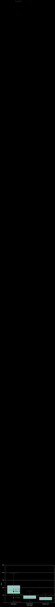
    


```python
fig, ax = plt.subplots(figsize=(10, 6))
sns.violinplot(data=airbnb, ax=ax, x="room_type", y="price")
ax.set_ylim(0, 500)
plt.title("Violin Plot: room prices")
plt.show()
```


    
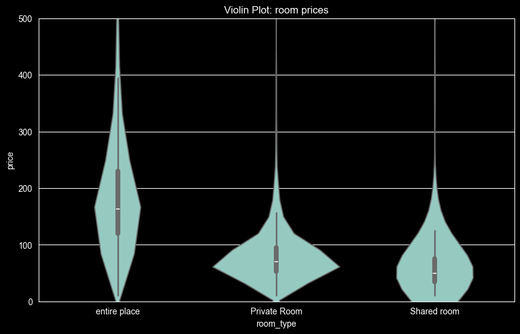
    


Calculation of standard deviation and coefficient of variation


```python
def cv(x):
    return x.std()/x.mean()
def iqr(x):
    return x.quantile(0.75) - x.quantile(0.25)

stats = airbnb.groupby('room_type')['price'].agg(['mean', 'std', cv, iqr])
stats.columns = ['Mean', 'STD', 'CV', 'IQR']
print(stats)
```

                        Mean         STD        CV    IQR
    room_type                                            
    Private Room   87.019482  101.540638  1.166872   42.0
    Shared room    70.410959  129.253272  1.835698   40.5
    entire place  209.846776  251.592275  1.198933  110.0
    

Calculating slant ratios for several room types


```python
airbnb_skew = airbnb.groupby('room_type')['price'].skew()
print("Skewness of room prices according to room types")
print(airbnb_skew)
```

    Skewness of room prices according to room types
    room_type
    Private Room    13.123533
    Shared room     11.392912
    entire place    13.680826
    Name: price, dtype: float64
    

Calculating IQR skewness


```python
def iqr_skewness(x):
    q1 = x.quantile(0.25)
    q2 = x.median()
    q3 = x.quantile(0.75)
    iqr = q3 - q1

    if iqr == 0:
        return 0
    return (q3 + q1 - 2 * q2) / iqr
iqr_skew_results = airbnb.groupby('room_type')['price'].agg(iqr_skewness)
print("IQR skewness for airbnb prices")
print(iqr_skew_results)

```

    IQR skewness for airbnb prices
    room_type
    Private Room    0.190476
    Shared room     0.234568
    entire place    0.218182
    Name: price, dtype: float64
    

Calculation of IQR kurtosis coefficient


```python
set = airbnb["price"]
q1 = set.quantile(0.25)
q3 = set.quantile(0.75)
c10 = set.quantile(0.10)
c90 = set.quantile(0.90)
iqr_kurtosis = (q3 - q1) / (2 * (c90 - c10))
print(f"Q1: {q1}, Q3: {q3}")
print(f"C10: {c10}, C90: {c90}")
print(f"IQR Kurtosis Coefficient: {iqr_kurtosis:.4f}")
```

    Q1: 69.0, Q3: 179.0
    C10: 50.0, C90: 261.7000000000007
    IQR Kurtosis Coefficient: 0.2598
    

Cross-sectional analysis


```python
fig, axes = plt.subplots(1, 2, figsize=(16, 6))
sns.scatterplot(data=airbnb, x='price', y='reviews_per_month', hue='room_type', alpha=0.4, ax=axes[0])
axes[0].set_xlim(0, 600)
axes[0].set_title("Cross-section 1: Price vs number of reservations(popularity)")
axes[0].set_xlabel("Price ($)")
axes[0].set_ylabel("Reviews per month")

sns.kdeplot(data=airbnb[airbnb['rating'] > 0], x='rating', hue='room_type', fill=True, common_norm=False, ax=axes[1])
axes[1].set_title("Cross-section 2: Proces according to the room type")
axes[1].set_xlabel("Rating")
axes[1].set_ylabel("Density")
plt.tight_layout()
plt.show()
```


    
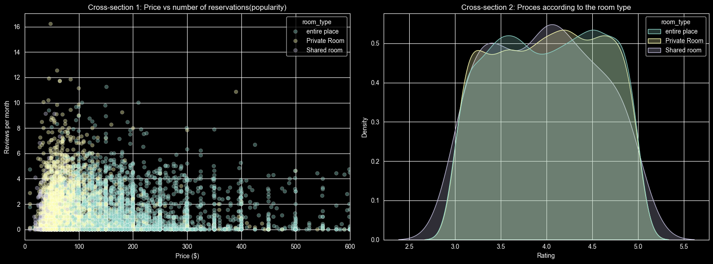
    


# Bivariate analysis/ Tips.ipynb

Calculating correlation coefficiencies


```python
var1 = 'price'
var2 = 'number_of_reviews'

pearson_r, p_pearson = ss.pearsonr(airbnb[var1], airbnb[var2])
spearman_rho, p_spearman = ss.spearmanr(airbnb[var1], airbnb[var2])
kendall_tau, p_kendall = ss.kendalltau(airbnb[var1], airbnb[var2])

print(f"Correlation metrics between {var1} and {var2}:")
print(f"  Pearson's r:      {pearson_r:.4f} (p-value: {p_pearson:.2e})")
print(f"  Spearman's ρ:     {spearman_rho:.4f} (p-value: {p_spearman:.2e})")
print(f"  Kendall's τ:      {kendall_tau:.4f} (p-value: {p_kendall:.2e})")
```

    Correlation metrics between price and number_of_reviews:
      Pearson's r:      -0.0487 (p-value: 1.25e-06)
      Spearman's ρ:     -0.0463 (p-value: 4.15e-06)
      Kendall's τ:      -0.0320 (p-value: 4.38e-06)
    

Creating regression plot


```python
plt.figure(figsize=(10, 6))

sns.regplot(
    data=airbnb,
    x=var1,
    y=var2,
    scatter_kws={'alpha': 0.5, 'color': '#2c3e50'},
    line_kws={'color': '#e74c3c', 'lw': 3}
)
plt.title("Scatter Plot with Regression Line: Price vs Reviews", fontsize=14)
plt.xlabel("Price ($)", fontsize=12)
plt.ylabel("Number of Reviews", fontsize=12)
plt.grid(True, linestyle='--', alpha=0.5)

plt.show()

```


    
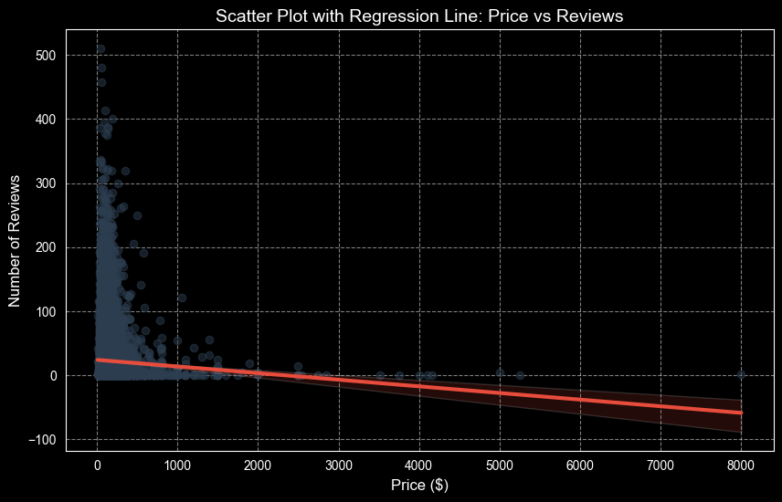
    


Creating heatmap


```python
plt.figure(figsize=(10, 8))

numeric_cols = ['price', 'number_of_reviews', 'reviews_per_month', 'availability_365', 'rating', 'number_of_stays', '5_stars']
corr_matrix = airbnb[numeric_cols].corr(method='spearman')

sns.heatmap(
    corr_matrix,
    annot=True,
    fmt=".2f",
    cmap="coolwarm",
    vmin=-1, vmax=1,
    square=True,
    linewidths=0.5,
    cbar_kws={"shrink": .8}
)
plt.title("Spearman Rank Correlation Heatmap", fontsize=14)

plt.show()
```


    
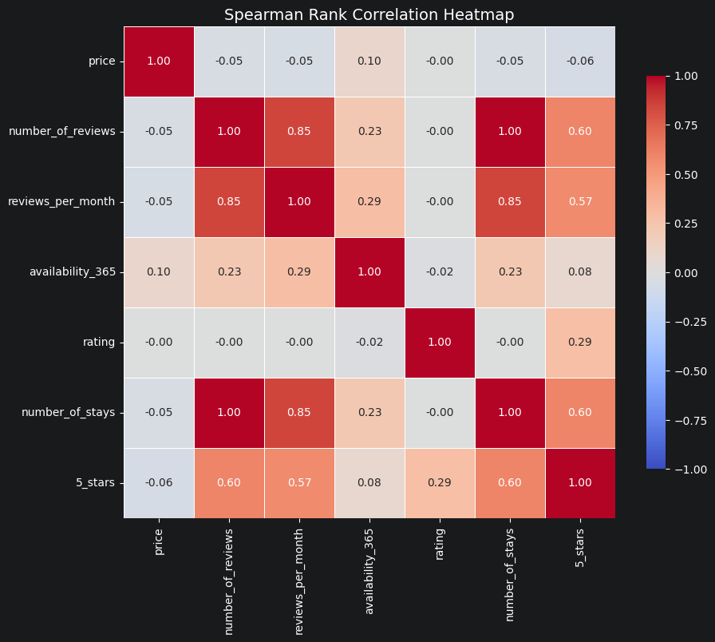
    


Interpretation

Statistical Results:The correlation coefficients (Pearson, Spearman, and Kendall) between price and the number of reviews are close to zero (and have a slightly negative sign).

Business Insight:This indicates a lack of any significant linear or monotonic relationship between a listing's price and the number of reviews left by guests. Both budget-friendly and ultra-expensive apartments can generate either very few or a high volume of reviews.

Correlation Matrix: The Spearman rank correlation heatmap reveals stronger, more intuitive relationships elsewhere-for instance, a very strong positive correlation between number_of_reviews and number_of_stays.

Calculation Pearson correlation


```python
r, p_val = ss.pearsonr(airbnb['number_of_reviews'], airbnb['number_of_stays'])
print(f"Quantitative Case: Number of Reviews vs Number of Stays")
print(f"  Pearson's r: {r:.4f} (p-value: {p_val:.2e})")
```

    Quantitative Case: Number of Reviews vs Number of Stays
      Pearson's r: 1.0000 (p-value: 0.00e+00)
    

Regression plot


```python
plt.figure(figsize=(8, 6))
sns.regplot(
    data=airbnb,
    x='number_of_reviews',
    y='number_of_stays',
    scatter_kws={'alpha':0.5, 'color': '#2980b9'},
    line_kws={'color': '#e74c3c', 'lw': 2.5}
)
plt.title("Quantitative Case: Number of Reviews vs Number of Stays", fontsize=14)
plt.xlabel("Number of Reviews")
plt.ylabel("Number of Stays")
plt.grid(True, linestyle='--', alpha=0.5)
plt.show()
```


    
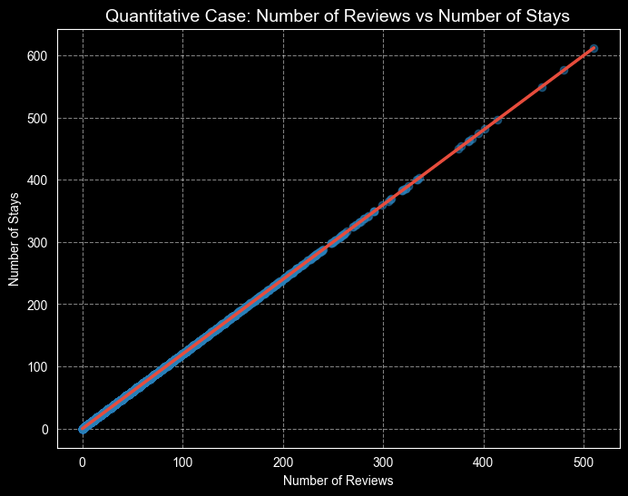
    


Interpretation

Statistical Results:The strong, positive Pearson correlation coefficient confirms that these variables move in the exact same direction.

Business Insight: The number of written reviews is a direct reflection of the estimated number of guest stays at a given property. The scatter plot allows us to observe how cleanly and synchronously both of these volume metrics follow a linear pattern.

Using logarythmic scale to see how room_type affects on the price, creating a boxplot


```python
plt.figure(figsize=(10, 6))

sns.boxplot(data=airbnb, x='room_type', y='price', palette='Set2')
plt.yscale('log')

plt.title("Categorical vs Quantitative: Price Distribution by Room Type (Log Scale)", fontsize=14)
plt.xlabel("Room Type", fontsize=12)
plt.ylabel("Price ($) - Log Scale", fontsize=12)
plt.grid(True, axis='y', linestyle='--', alpha=0.5)
plt.show()
```

    C:\Users\bilma\AppData\Local\Temp\ipykernel_13280\2986770890.py:3: FutureWarning: 
    
    Passing `palette` without assigning `hue` is deprecated and will be removed in v0.14.0. Assign the `x` variable to `hue` and set `legend=False` for the same effect.
    
      sns.boxplot(data=airbnb, x='room_type', y='price', palette='Set2')
    


    
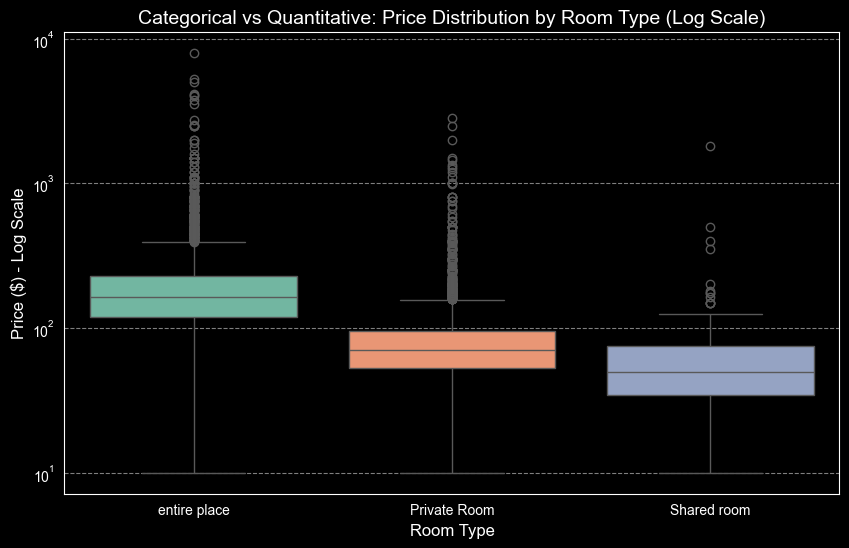
    


Interpretation

Business Insight: The box plot shows clear differences in median prices across categories. Renting an Entire home/apt is predictably associated with the highest median price.

Logarithmic Scale Application: Applying a logarithmic scale to the Y-axis allowed us to tame massive outliers (ultra-luxury, high-price listings) while simultaneously revealing the full price distribution and spread within each room type.

Room type vs Residential area


```python
airbnb['borough'] = airbnb['neighbourhood_full'].astype(str).str.split(',').str[0]

contingency_table = pd.crosstab(airbnb['room_type'], airbnb['borough'])

plt.figure(figsize=(10, 6))
sns.heatmap(contingency_table, annot=True, fmt="d", cmap="YlGnBu", cbar=True)

plt.title("Qualitative Case: Room Types Distribution across Boroughs", fontsize=14)
plt.xlabel("Borough", fontsize=12)
plt.ylabel("Room Type", fontsize=12)
plt.show()
```


    
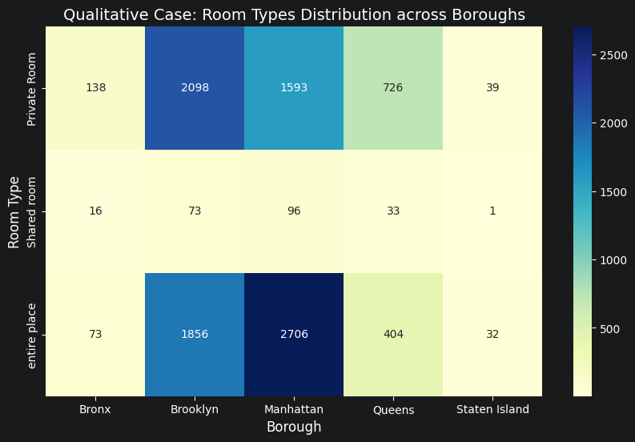
    


Interpretation

Methodology: Using a contingency table (crosstab) visualized as a heatmap is the best approach to analyze qualitative (categorical) relationships.

Business Insight:This chart allows us to instantly identify the market structure across New York. We can observe the geographical concentration of listing formats-for example, which boroughs are heavily dominated by Private rooms versus those where Entire home/apt rentals prevail.

Our own idea, Hexbin plot -> number of reviews vs number of stays


```python
plt.figure(figsize=(9, 7))

plt.hexbin(
    airbnb['number_of_reviews'],
    airbnb['number_of_stays'],
    gridsize=30,
    cmap='Blues',
    mincnt=1
)
cb = plt.colorbar(label='Number of offers in the area')

plt.title("Hexbin Density Plot (Reviews vs Stays)", fontsize=14)
plt.xlabel("Number of Reviews")
plt.ylabel("Number of Stays")
plt.show()
```


    
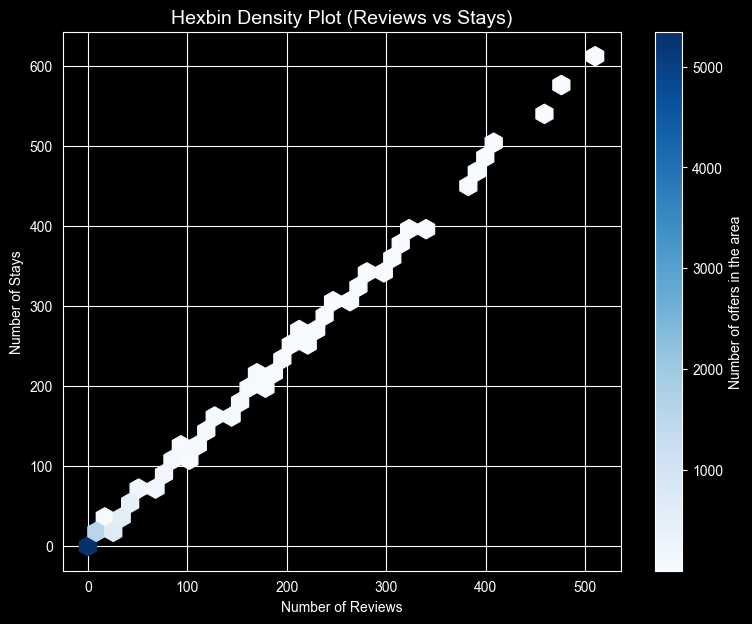
    


# MULTIVARIATE REPORT

Interpretation

Technical Justification:Regular scatter plots suffer from overplotting when dealing with large datasets like Airbnb. Thousands of overlapping points make it impossible to see the actual density of the sample.

Analytical Insight: Introducing a Hexbin density plot clearly reveals the "center of mass" of our dataset. The vast majority of listings tightly cluster in the bottom-left corner (low number of reviews and low stays). This proves that the market is heavily dominated by infrequently rented or relatively new listings, highlighting a business ecosystem driven by the "long tail" effect.


```python
import seaborn as sns
import matplotlib.pyplot as plt

# 1. Calculate correlation between price, rating, and number of reviews
print("Correlation of variables with price (Airbnb):")
correlation = airbnb[['price', 'rating', 'reviews_per_month', 'number_of_stays']].corr()
print(correlation)

# 2. Plot: Relationship between price and rating (Scatterplot)
plt.figure(figsize=(10, 5))
sns.scatterplot(x='rating', y='price', data=airbnb, alpha=0.5, color='blue')
plt.title('Relationship: Price vs Rating (Airbnb)')
plt.xlabel('Rating')
plt.ylabel('Price ($)')
plt.show()

# 3. Plot: Price vs room type (Boxplot)
plt.figure(figsize=(10, 5))
sns.boxplot(x='room_type', y='price', data=airbnb, palette='Set2', hue='room_type', legend=False)
plt.title('Price distribution depending on room type')
plt.xlabel('Room Type')
plt.ylabel('Price ($)')
plt.show()
```

    Correlation of variables with price (Airbnb):
                          price    rating  reviews_per_month  number_of_stays
    price              1.000000 -0.004802          -0.057463        -0.048740
    rating            -0.004802  1.000000           0.013392        -0.002693
    reviews_per_month -0.057463  0.013392           1.000000         0.586033
    number_of_stays   -0.048740 -0.002693           0.586033         1.000000
    


    
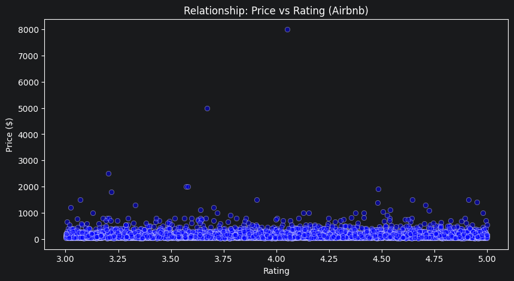
    


    
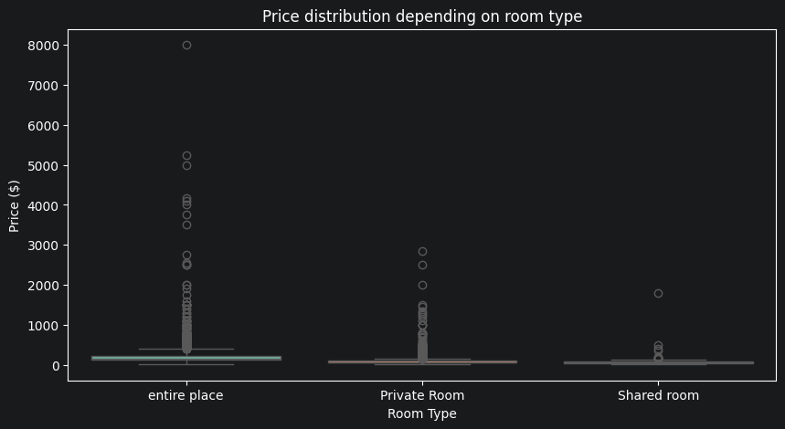
    


```python
import statsmodels.api as sm

# Data preparation
model_data = airbnb[['price', 'rating', 'number_of_stays']].dropna()

# Independent variables (X) and dependent variable (y - what we want to predict)
X = model_data[['rating', 'number_of_stays']]
y = model_data['price']

# Add a constant (intercept)
X = sm.add_constant(X)

# Training the linear regression model (OLS)
model = sm.OLS(y, X).fit()

# Display the model summary
print(model.summary())
```

                                OLS Regression Results                            
    ==============================================================================
    Dep. Variable:                  price   R-squared:                       0.001
    Model:                            OLS   Adj. R-squared:                  0.001
    Method:                 Least Squares   F-statistic:                     4.293
    Date:                Sun, 07 Jun 2026   Prob (F-statistic):             0.0137
    Time:                        16:42:15   Log-Likelihood:                -51027.
    No. Observations:                7836   AIC:                         1.021e+05
    Df Residuals:                    7833   BIC:                         1.021e+05
    Df Model:                           2                                         
    Covariance Type:            nonrobust                                         
    ===================================================================================
                          coef    std err          t      P>|t|      [0.025      0.975]
    -----------------------------------------------------------------------------------
    const             148.1610     13.035     11.366      0.000     122.609     173.713
    rating             -1.3871      3.203     -0.433      0.665      -7.665       4.891
    number_of_stays    -0.0949      0.033     -2.899      0.004      -0.159      -0.031
    ==============================================================================
    Omnibus:                    17404.247   Durbin-Watson:                   1.920
    Prob(Omnibus):                  0.000   Jarque-Bera (JB):        214884953.767
    Skew:                          20.169   Prob(JB):                         0.00
    Kurtosis:                     813.259   Cond. No.                         479.
    ==============================================================================
    
    Notes:
    [1] Standard Errors assume that the covariance matrix of the errors is correctly specified.
    

### My Conclusions (Bivariate Analysis & Regression Model)

1. Plots and Correlations:
1. Looking at the boxplot, it's pretty clear that booking an `Entire place` is the most expensive option and has the biggest price differences. On the other hand, a `Shared room` is the cheapest.
2. The correlation table shows that the `rating` and `price` are not really connected (the correlation is very weak). It seems that on Airbnb, the type of room matters much more for the price than how good the reviews are.

2. Regression Model (StatsModels):
1. Just like in Exercise 10, I built a simple linear regression model. I tried to predict the `price` using `rating` and `number_of_stays`.
2. The results show a very low R-squared value. This means our simple model isn't very good at predicting the exact price. It makes sense because Airbnb prices probably depend on many other things we didn't include here, like exact location, photos, or standard, so a simple model is just not enough for this specific dataset.


# Exercise10.ipynb 

---
title: Multivariate Statistics
subtitle: Foundations of Statistical Analysis in Python
abstract: This notebook explores multivariate relationships through linear regression analysis, highlighting its strengths and limitations. Practical examples and visualizations are provided to help users understand and apply these statistical concepts effectively.
author:
  - name: Karol Flisikowski
    affiliations:
      - Gdansk University of Technology
      - Chongqing Technology and Business University
    orcid: 0000-0002-4160-1297
    email: karol@ctbu.edu.cn
date: 2025-05-25
---

## Goals of this lecture

There are many ways to *describe* a distribution.

Here we will discuss:
- Measurement of the relationship between distributions using **linear, regression analysis**.

## Importing relevant libraries


```python
import numpy as np
import matplotlib.pyplot as plt
import seaborn as sns ### importing seaborn
import pandas as pd
import scipy.stats as ss
```


```python
%matplotlib inline
%config InlineBackend.figure_format = 'retina'
```


```python
import pandas as pd
df_estate = pd.read_csv("real_estate.csv")
df_estate.head(5)
```


<div>
<style scoped>
    .dataframe tbody tr th:only-of-type {
        vertical-align: middle;
    }

    .dataframe tbody tr th {
        vertical-align: top;
    }

    .dataframe thead th {
        text-align: right;
    }
</style>
<table border="1" class="dataframe">
  <thead>
    <tr style="text-align: right;">
      <th></th>
      <th>No</th>
      <th>house age</th>
      <th>distance to the nearest MRT station</th>
      <th>number of convenience stores</th>
      <th>latitude</th>
      <th>longitude</th>
      <th>house price of unit area</th>
    </tr>
  </thead>
  <tbody>
    <tr>
      <th>0</th>
      <td>1</td>
      <td>32.0</td>
      <td>84.87882</td>
      <td>10</td>
      <td>24.98298</td>
      <td>121.54024</td>
      <td>37.9</td>
    </tr>
    <tr>
      <th>1</th>
      <td>2</td>
      <td>19.5</td>
      <td>306.59470</td>
      <td>9</td>
      <td>24.98034</td>
      <td>121.53951</td>
      <td>42.2</td>
    </tr>
    <tr>
      <th>2</th>
      <td>3</td>
      <td>13.3</td>
      <td>561.98450</td>
      <td>5</td>
      <td>24.98746</td>
      <td>121.54391</td>
      <td>47.3</td>
    </tr>
    <tr>
      <th>3</th>
      <td>4</td>
      <td>13.3</td>
      <td>561.98450</td>
      <td>5</td>
      <td>24.98746</td>
      <td>121.54391</td>
      <td>54.8</td>
    </tr>
    <tr>
      <th>4</th>
      <td>5</td>
      <td>5.0</td>
      <td>390.56840</td>
      <td>5</td>
      <td>24.97937</td>
      <td>121.54245</td>
      <td>43.1</td>
    </tr>
  </tbody>
</table>
</div>


## Describing *multivariate* data with regression models

- So far, we've been focusing on *univariate and bivariate data*: analysis.
- What if we want to describe how *two or more than two distributions* relate to each other?

1. Let's simplify variables' names:


```python
df_estate = df_estate.rename(columns={
    'house age': 'house_age_years',
    'house price of unit area': 'price_twd_msq',
    'number of convenience stores': 'n_convenience',
    'distance to the nearest MRT station': 'dist_to_mrt_m'
})

df_estate.head(5)
```


<div>
<style scoped>
    .dataframe tbody tr th:only-of-type {
        vertical-align: middle;
    }

    .dataframe tbody tr th {
        vertical-align: top;
    }

    .dataframe thead th {
        text-align: right;
    }
</style>
<table border="1" class="dataframe">
  <thead>
    <tr style="text-align: right;">
      <th></th>
      <th>No</th>
      <th>house_age_years</th>
      <th>dist_to_mrt_m</th>
      <th>n_convenience</th>
      <th>latitude</th>
      <th>longitude</th>
      <th>price_twd_msq</th>
    </tr>
  </thead>
  <tbody>
    <tr>
      <th>0</th>
      <td>1</td>
      <td>32.0</td>
      <td>84.87882</td>
      <td>10</td>
      <td>24.98298</td>
      <td>121.54024</td>
      <td>37.9</td>
    </tr>
    <tr>
      <th>1</th>
      <td>2</td>
      <td>19.5</td>
      <td>306.59470</td>
      <td>9</td>
      <td>24.98034</td>
      <td>121.53951</td>
      <td>42.2</td>
    </tr>
    <tr>
      <th>2</th>
      <td>3</td>
      <td>13.3</td>
      <td>561.98450</td>
      <td>5</td>
      <td>24.98746</td>
      <td>121.54391</td>
      <td>47.3</td>
    </tr>
    <tr>
      <th>3</th>
      <td>4</td>
      <td>13.3</td>
      <td>561.98450</td>
      <td>5</td>
      <td>24.98746</td>
      <td>121.54391</td>
      <td>54.8</td>
    </tr>
    <tr>
      <th>4</th>
      <td>5</td>
      <td>5.0</td>
      <td>390.56840</td>
      <td>5</td>
      <td>24.97937</td>
      <td>121.54245</td>
      <td>43.1</td>
    </tr>
  </tbody>
</table>
</div>


We can also perform binning for "house_age_years":


```python
df_estate['house_age_cat'] = pd.cut(
    df_estate['house_age_years'],
    bins=[0, 15, 30, 45],
    include_lowest=True,
    right=False
)
df_estate.head(5)
```


<div>
<style scoped>
    .dataframe tbody tr th:only-of-type {
        vertical-align: middle;
    }

    .dataframe tbody tr th {
        vertical-align: top;
    }

    .dataframe thead th {
        text-align: right;
    }
</style>
<table border="1" class="dataframe">
  <thead>
    <tr style="text-align: right;">
      <th></th>
      <th>No</th>
      <th>house_age_years</th>
      <th>dist_to_mrt_m</th>
      <th>n_convenience</th>
      <th>latitude</th>
      <th>longitude</th>
      <th>price_twd_msq</th>
      <th>house_age_cat</th>
    </tr>
  </thead>
  <tbody>
    <tr>
      <th>0</th>
      <td>1</td>
      <td>32.0</td>
      <td>84.87882</td>
      <td>10</td>
      <td>24.98298</td>
      <td>121.54024</td>
      <td>37.9</td>
      <td>[30, 45)</td>
    </tr>
    <tr>
      <th>1</th>
      <td>2</td>
      <td>19.5</td>
      <td>306.59470</td>
      <td>9</td>
      <td>24.98034</td>
      <td>121.53951</td>
      <td>42.2</td>
      <td>[15, 30)</td>
    </tr>
    <tr>
      <th>2</th>
      <td>3</td>
      <td>13.3</td>
      <td>561.98450</td>
      <td>5</td>
      <td>24.98746</td>
      <td>121.54391</td>
      <td>47.3</td>
      <td>[0, 15)</td>
    </tr>
    <tr>
      <th>3</th>
      <td>4</td>
      <td>13.3</td>
      <td>561.98450</td>
      <td>5</td>
      <td>24.98746</td>
      <td>121.54391</td>
      <td>54.8</td>
      <td>[0, 15)</td>
    </tr>
    <tr>
      <th>4</th>
      <td>5</td>
      <td>5.0</td>
      <td>390.56840</td>
      <td>5</td>
      <td>24.97937</td>
      <td>121.54245</td>
      <td>43.1</td>
      <td>[0, 15)</td>
    </tr>
  </tbody>
</table>
</div>


```python
cat_dict = {
    pd.Interval(left=0, right=15, closed='left'): '0-15',
    pd.Interval(left=15, right=30, closed='left'): '15-30',
    pd.Interval(left=30, right=45, closed='left'): '30-45'
}

df_estate['house_age_cat_str'] = df_estate['house_age_cat'].map(cat_dict)
df_estate['house_age_cat_str'] = df_estate['house_age_cat_str'].astype('category')
df_estate.head()
```


<div>
<style scoped>
    .dataframe tbody tr th:only-of-type {
        vertical-align: middle;
    }

    .dataframe tbody tr th {
        vertical-align: top;
    }

    .dataframe thead th {
        text-align: right;
    }
</style>
<table border="1" class="dataframe">
  <thead>
    <tr style="text-align: right;">
      <th></th>
      <th>No</th>
      <th>house_age_years</th>
      <th>dist_to_mrt_m</th>
      <th>n_convenience</th>
      <th>latitude</th>
      <th>longitude</th>
      <th>price_twd_msq</th>
      <th>house_age_cat</th>
      <th>house_age_cat_str</th>
    </tr>
  </thead>
  <tbody>
    <tr>
      <th>0</th>
      <td>1</td>
      <td>32.0</td>
      <td>84.87882</td>
      <td>10</td>
      <td>24.98298</td>
      <td>121.54024</td>
      <td>37.9</td>
      <td>[30, 45)</td>
      <td>30-45</td>
    </tr>
    <tr>
      <th>1</th>
      <td>2</td>
      <td>19.5</td>
      <td>306.59470</td>
      <td>9</td>
      <td>24.98034</td>
      <td>121.53951</td>
      <td>42.2</td>
      <td>[15, 30)</td>
      <td>15-30</td>
    </tr>
    <tr>
      <th>2</th>
      <td>3</td>
      <td>13.3</td>
      <td>561.98450</td>
      <td>5</td>
      <td>24.98746</td>
      <td>121.54391</td>
      <td>47.3</td>
      <td>[0, 15)</td>
      <td>0-15</td>
    </tr>
    <tr>
      <th>3</th>
      <td>4</td>
      <td>13.3</td>
      <td>561.98450</td>
      <td>5</td>
      <td>24.98746</td>
      <td>121.54391</td>
      <td>54.8</td>
      <td>[0, 15)</td>
      <td>0-15</td>
    </tr>
    <tr>
      <th>4</th>
      <td>5</td>
      <td>5.0</td>
      <td>390.56840</td>
      <td>5</td>
      <td>24.97937</td>
      <td>121.54245</td>
      <td>43.1</td>
      <td>[0, 15)</td>
      <td>0-15</td>
    </tr>
  </tbody>
</table>
</div>


```python
#Checking the updated datatype of house_age_years
df_estate.house_age_cat_str.dtype
```


    CategoricalDtype(categories=['0-15', '15-30', '30-45'], ordered=True, categories_dtype=str)


```python
#Checking the dataframe for any NA values
df_estate.isna().any()
```


    No                   False
    house_age_years      False
    dist_to_mrt_m        False
    n_convenience        False
    latitude             False
    longitude            False
    price_twd_msq        False
    house_age_cat        False
    house_age_cat_str    False
    dtype: bool


## Descriptive Statistics

Prepare a heatmap with correlation coefficients on it:


```python
corr_matrix = df_estate.iloc[:, :6].corr()

plt.figure(figsize=(8, 6))
sns.heatmap(corr_matrix, annot=True, fmt=".2f", cmap="coolwarm", square=True)
plt.title("Correlation Matrix")
plt.show()
```


    
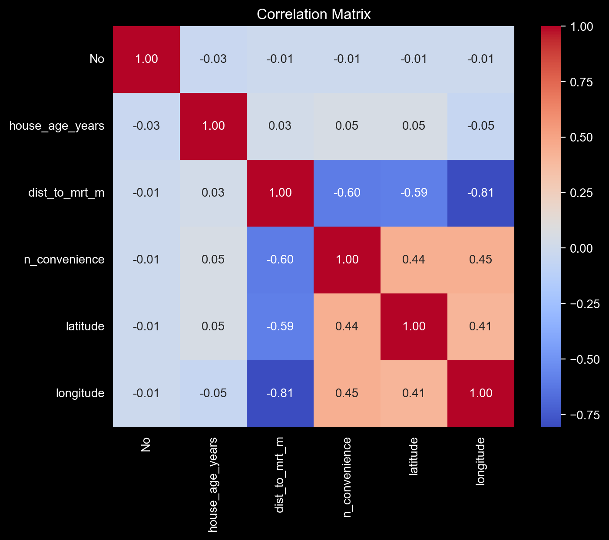
    


Draw a scatter plot of n_convenience vs. price_twd_msq:


```python
plt.scatter(df_estate['n_convenience'], df_estate['price_twd_msq'])
plt.savefig('scatter.png')
```


    
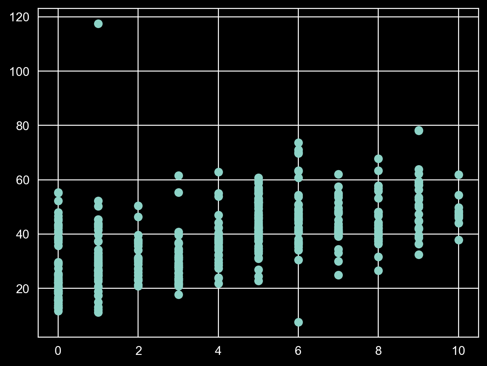
    


Draw a scatter plot of house_age_years vs. price_twd_msq:


```python
plt.scatter(df_estate['house_age_years'], df_estate['price_twd_msq'])
```


    <matplotlib.collections.PathCollection at 0x1c98f71afd0>


    
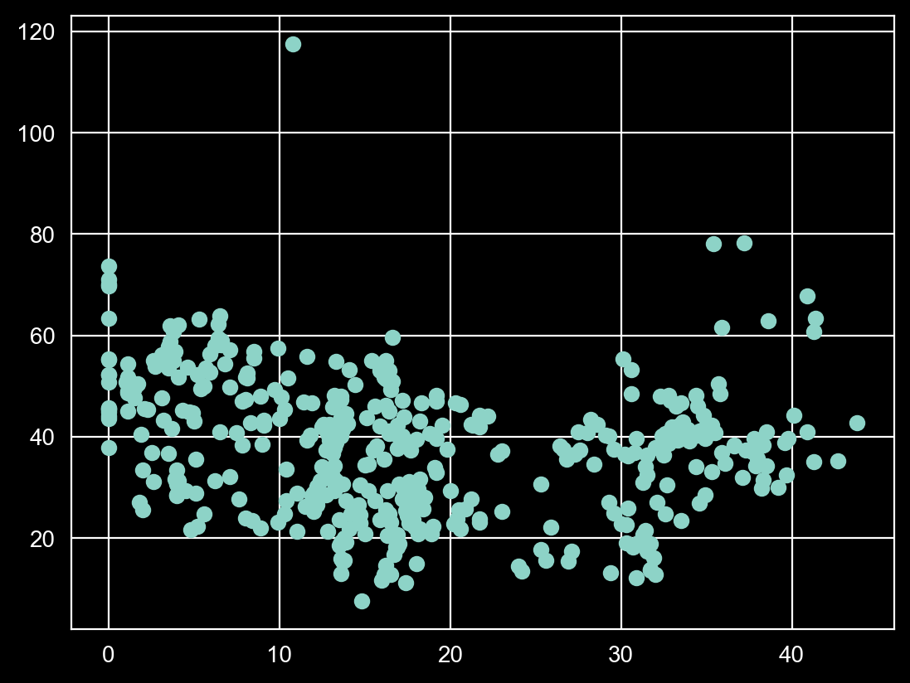
    


Draw a scatter plot of distance to nearest MRT station vs. price_twd_msq:


```python
plt.scatter(df_estate['dist_to_mrt_m'], df_estate['price_twd_msq'])
```


    <matplotlib.collections.PathCollection at 0x1c98f46c690>


    
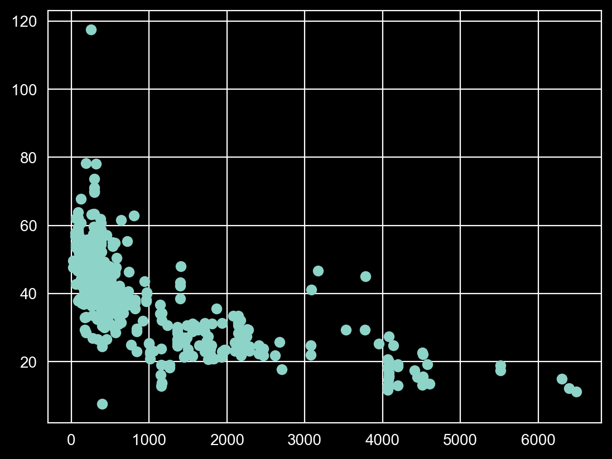
    


Plot a histogram of price_twd_msq with 10 bins, facet the plot so each house age group gets its own panel:


```python
sns.displot(data=df_estate, x='price_twd_msq', col='house_age_cat_str', bins=10)
```


    <seaborn.axisgrid.FacetGrid at 0x1c98f4d4410>


    
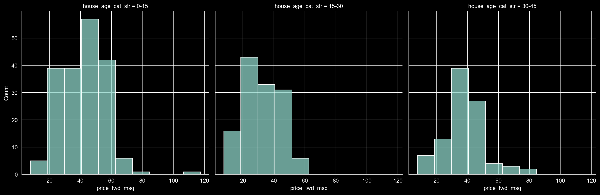
    


Summarize to calculate the mean, sd, median etc. house price/area by house age:


```python
df_estate.groupby('house_age_cat_str')['price_twd_msq'].agg(['mean', 'std', 'median'])
```


<div>
<style scoped>
    .dataframe tbody tr th:only-of-type {
        vertical-align: middle;
    }

    .dataframe tbody tr th {
        vertical-align: top;
    }

    .dataframe thead th {
        text-align: right;
    }
</style>
<table border="1" class="dataframe">
  <thead>
    <tr style="text-align: right;">
      <th></th>
      <th>mean</th>
      <th>std</th>
      <th>median</th>
    </tr>
    <tr>
      <th>house_age_cat_str</th>
      <th></th>
      <th></th>
      <th></th>
    </tr>
  </thead>
  <tbody>
    <tr>
      <th>0-15</th>
      <td>41.766842</td>
      <td>14.164308</td>
      <td>42.55</td>
    </tr>
    <tr>
      <th>15-30</th>
      <td>32.642636</td>
      <td>11.398217</td>
      <td>32.90</td>
    </tr>
    <tr>
      <th>30-45</th>
      <td>37.654737</td>
      <td>12.842547</td>
      <td>38.30</td>
    </tr>
  </tbody>
</table>
</div>


## Simple model

Run a linear regression of price_twd_msq vs. best, but only 1 predictor:


```python
import statsmodels.api as sm

# Let's use 'dist_to_mrt_m' as the single best predictor
X = df_estate[['dist_to_mrt_m']]
y = df_estate['price_twd_msq']

# Add constant for intercept
X = sm.add_constant(X)

# Fit the model
model1 = sm.OLS(y, X).fit()

# Show the summary
print(model1.summary())
```

                                OLS Regression Results                            
    ==============================================================================
    Dep. Variable:          price_twd_msq   R-squared:                       0.454
    Model:                            OLS   Adj. R-squared:                  0.452
    Method:                 Least Squares   F-statistic:                     342.2
    Date:                Sun, 07 Jun 2026   Prob (F-statistic):           4.64e-56
    Time:                        16:03:03   Log-Likelihood:                -1542.5
    No. Observations:                 414   AIC:                             3089.
    Df Residuals:                     412   BIC:                             3097.
    Df Model:                           1                                         
    Covariance Type:            nonrobust                                         
    =================================================================================
                        coef    std err          t      P>|t|      [0.025      0.975]
    ---------------------------------------------------------------------------------
    const            45.8514      0.653     70.258      0.000      44.569      47.134
    dist_to_mrt_m    -0.0073      0.000    -18.500      0.000      -0.008      -0.006
    ==============================================================================
    Omnibus:                      140.820   Durbin-Watson:                   2.151
    Prob(Omnibus):                  0.000   Jarque-Bera (JB):              988.283
    Skew:                           1.263   Prob(JB):                    2.49e-215
    Kurtosis:                      10.135   Cond. No.                     2.19e+03
    ==============================================================================
    
    Notes:
    [1] Standard Errors assume that the covariance matrix of the errors is correctly specified.
    [2] The condition number is large, 2.19e+03. This might indicate that there are
    strong multicollinearity or other numerical problems.
    

What do the above results mean? Write down the model and interpret it.

Discuss model accuracy.

Model equation:
 * price_twd_msq = Intercept + coefficient * dist_to_mrt_m
  The results indicate a negative relationship between distance to the MRT station and house price.

Model accuracy:
 * To assess accuracy, we look at the R-squared ($R^2$) value from the summary.The $R^2$ is quite low, meaning that distance to the MRT alone explains only a fraction of the total variance in house prices

## Model diagnostics

### 4 Diagnostic plots


```python
fig = plt.figure(figsize=(12, 10))
sm.graphics.plot_regress_exog(model1, 'dist_to_mrt_m', fig=fig)
plt.show()
```


    
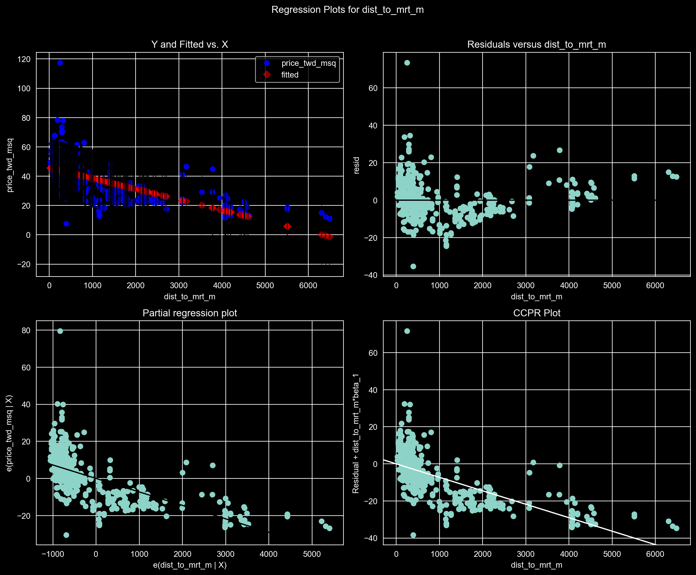
    


The four plots show...


* These plots verify whether we correctly applied the linear regression model.
* They show if the model's errors (residuals) are distributed evenly and randomly.
* They also help detect if the relationship between variables has a hidden curved shape.

### Outliers and high levarage points:


```python
fig, ax = plt.subplots(figsize=(8, 6))
sm.graphics.influence_plot(model1, ax=ax, criterion="cooks")
plt.title("Influence Plot (Outliers and High Leverage Points)")
plt.show()
```


    
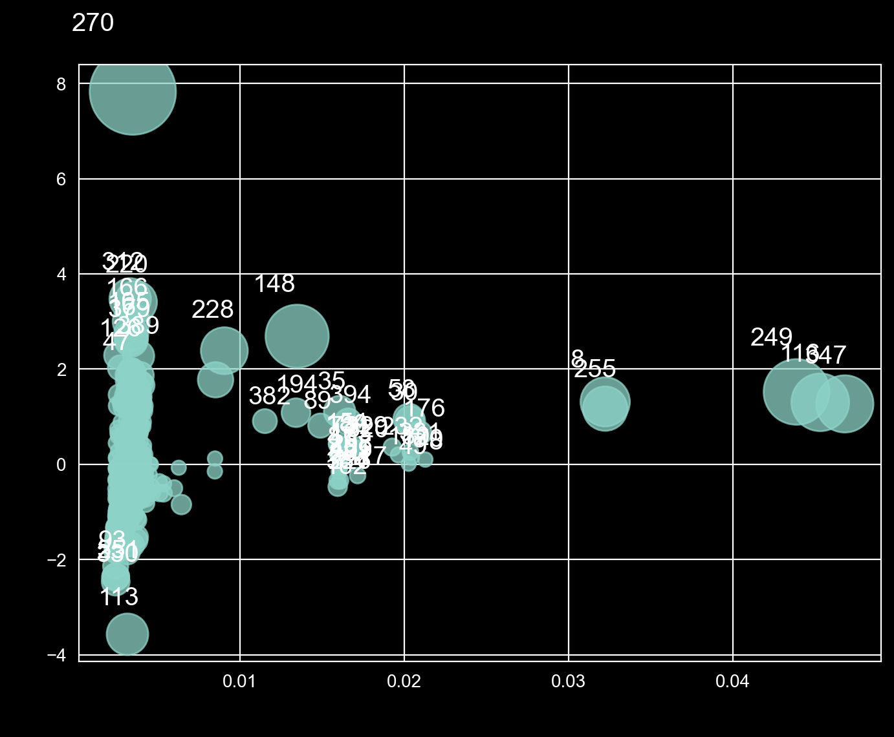
    


Discussion:


* The plot highlights unusual properties with extreme prices or features.
* The largest bubbles represent the points that most strongly distort our calculations.
* Removing these few exceptions could significantly improve the model's overall accuracy.


## Multiple Regression Model

### Test and training set

We begin by splitting the dataset into two parts, training set and testing set. In this example we will randomly take 75% row in this dataset and put it into the training set, and other 25% row in the testing set:


```python
# One-hot encoding for house_age_cat_str in df_estate

encode_dict = {True: 1, False: 0}

house_age_0_15 = df_estate['house_age_cat_str'] == '0-15'
house_age_15_30 = df_estate['house_age_cat_str'] == '15-30'
house_age_30_45 = df_estate['house_age_cat_str'] == '30-45'

df_estate['house_age_0_15'] = house_age_0_15.map(encode_dict)
df_estate['house_age_15_30'] = house_age_15_30.map(encode_dict)
df_estate['house_age_30_45'] = house_age_30_45.map(encode_dict)

df_estate.head()
```


<div>
<style scoped>
    .dataframe tbody tr th:only-of-type {
        vertical-align: middle;
    }

    .dataframe tbody tr th {
        vertical-align: top;
    }

    .dataframe thead th {
        text-align: right;
    }
</style>
<table border="1" class="dataframe">
  <thead>
    <tr style="text-align: right;">
      <th></th>
      <th>No</th>
      <th>house_age_years</th>
      <th>dist_to_mrt_m</th>
      <th>n_convenience</th>
      <th>latitude</th>
      <th>longitude</th>
      <th>price_twd_msq</th>
      <th>house_age_cat</th>
      <th>house_age_cat_str</th>
      <th>house_age_0_15</th>
      <th>house_age_15_30</th>
      <th>house_age_30_45</th>
    </tr>
  </thead>
  <tbody>
    <tr>
      <th>0</th>
      <td>1</td>
      <td>32.0</td>
      <td>84.87882</td>
      <td>10</td>
      <td>24.98298</td>
      <td>121.54024</td>
      <td>37.9</td>
      <td>[30, 45)</td>
      <td>30-45</td>
      <td>0</td>
      <td>0</td>
      <td>1</td>
    </tr>
    <tr>
      <th>1</th>
      <td>2</td>
      <td>19.5</td>
      <td>306.59470</td>
      <td>9</td>
      <td>24.98034</td>
      <td>121.53951</td>
      <td>42.2</td>
      <td>[15, 30)</td>
      <td>15-30</td>
      <td>0</td>
      <td>1</td>
      <td>0</td>
    </tr>
    <tr>
      <th>2</th>
      <td>3</td>
      <td>13.3</td>
      <td>561.98450</td>
      <td>5</td>
      <td>24.98746</td>
      <td>121.54391</td>
      <td>47.3</td>
      <td>[0, 15)</td>
      <td>0-15</td>
      <td>1</td>
      <td>0</td>
      <td>0</td>
    </tr>
    <tr>
      <th>3</th>
      <td>4</td>
      <td>13.3</td>
      <td>561.98450</td>
      <td>5</td>
      <td>24.98746</td>
      <td>121.54391</td>
      <td>54.8</td>
      <td>[0, 15)</td>
      <td>0-15</td>
      <td>1</td>
      <td>0</td>
      <td>0</td>
    </tr>
    <tr>
      <th>4</th>
      <td>5</td>
      <td>5.0</td>
      <td>390.56840</td>
      <td>5</td>
      <td>24.97937</td>
      <td>121.54245</td>
      <td>43.1</td>
      <td>[0, 15)</td>
      <td>0-15</td>
      <td>1</td>
      <td>0</td>
      <td>0</td>
    </tr>
  </tbody>
</table>
</div>


```python
from sklearn.model_selection import train_test_split

# 75% training, 25% testing, random_state=12 for reproducibility
train, test = train_test_split(df_estate, train_size=0.75, random_state=12)
```

Now we have our training set and testing set.

### Variable selection methods

Generally, selecting variables for linear regression is a debatable topic.

There are many methods for variable selecting, namely, forward stepwise selection, backward stepwise selection, etc, some are valid, some are heavily criticized.

I recommend this document: <https://www.stat.cmu.edu/~cshalizi/mreg/15/lectures/26/lecture-26.pdf> and Gung's comment: <https://stats.stackexchange.com/questions/20836/algorithms-for-automatic-model-selection/20856#20856> if you want to learn more about variable selection process.

[**If our goal is prediction**]{.ul}, it is safer to include all predictors in our model, removing variables without knowing the science behind it usually does more harm than good!!!

We begin to create our multiple linear regression model:


```python
import statsmodels.formula.api as smf
model2 = smf.ols('price_twd_msq ~ dist_to_mrt_m + house_age_0_15 + house_age_30_45', data = df_estate)
result2 = model2.fit()
result2.summary()
```


<table class="simpletable">
<caption>OLS Regression Results</caption>
<tr>
  <th>Dep. Variable:</th>      <td>price_twd_msq</td>  <th>  R-squared:         </th> <td>   0.485</td>
</tr>
<tr>
  <th>Model:</th>                   <td>OLS</td>       <th>  Adj. R-squared:    </th> <td>   0.482</td>
</tr>
<tr>
  <th>Method:</th>             <td>Least Squares</td>  <th>  F-statistic:       </th> <td>   128.9</td>
</tr>
<tr>
  <th>Date:</th>             <td>Sun, 07 Jun 2026</td> <th>  Prob (F-statistic):</th> <td>7.84e-59</td>
</tr>
<tr>
  <th>Time:</th>                 <td>16:03:05</td>     <th>  Log-Likelihood:    </th> <td> -1530.2</td>
</tr>
<tr>
  <th>No. Observations:</th>      <td>   414</td>      <th>  AIC:               </th> <td>   3068.</td>
</tr>
<tr>
  <th>Df Residuals:</th>          <td>   410</td>      <th>  BIC:               </th> <td>   3084.</td>
</tr>
<tr>
  <th>Df Model:</th>              <td>     3</td>      <th>                     </th>     <td> </td>   
</tr>
<tr>
  <th>Covariance Type:</th>      <td>nonrobust</td>    <th>                     </th>     <td> </td>   
</tr>
</table>
<table class="simpletable">
<tr>
         <td></td>            <th>coef</th>     <th>std err</th>      <th>t</th>      <th>P>|t|</th>  <th>[0.025</th>    <th>0.975]</th>  
</tr>
<tr>
  <th>Intercept</th>       <td>   43.4096</td> <td>    1.052</td> <td>   41.275</td> <td> 0.000</td> <td>   41.342</td> <td>   45.477</td>
</tr>
<tr>
  <th>dist_to_mrt_m</th>   <td>   -0.0070</td> <td>    0.000</td> <td>  -17.889</td> <td> 0.000</td> <td>   -0.008</td> <td>   -0.006</td>
</tr>
<tr>
  <th>house_age_0_15</th>  <td>    4.8450</td> <td>    1.143</td> <td>    4.239</td> <td> 0.000</td> <td>    2.598</td> <td>    7.092</td>
</tr>
<tr>
  <th>house_age_30_45</th> <td>   -0.1016</td> <td>    1.355</td> <td>   -0.075</td> <td> 0.940</td> <td>   -2.765</td> <td>    2.562</td>
</tr>
</table>
<table class="simpletable">
<tr>
  <th>Omnibus:</th>       <td>145.540</td> <th>  Durbin-Watson:     </th> <td>   2.124</td> 
</tr>
<tr>
  <th>Prob(Omnibus):</th> <td> 0.000</td>  <th>  Jarque-Bera (JB):  </th> <td>1077.318</td> 
</tr>
<tr>
  <th>Skew:</th>          <td> 1.296</td>  <th>  Prob(JB):          </th> <td>1.16e-234</td>
</tr>
<tr>
  <th>Kurtosis:</th>      <td>10.466</td>  <th>  Cond. No.          </th> <td>6.17e+03</td> 
</tr>
</table><br/><br/>Notes:<br/>[1] Standard Errors assume that the covariance matrix of the errors is correctly specified.<br/>[2] The condition number is large, 6.17e+03. This might indicate that there are<br/>strong multicollinearity or other numerical problems.


What about distance to mrt? Please plot its scatterplot with the dependent variable and verify, if any transformation is needed:


```python
import matplotlib.pyplot as plt
import numpy as np

plt.scatter(df_estate['dist_to_mrt_m'], df_estate['price_twd_msq'])

plt.scatter(np.log(df_estate['dist_to_mrt_m']), df_estate['price_twd_msq'])
```


    <matplotlib.collections.PathCollection at 0x1c994bf6350>


    
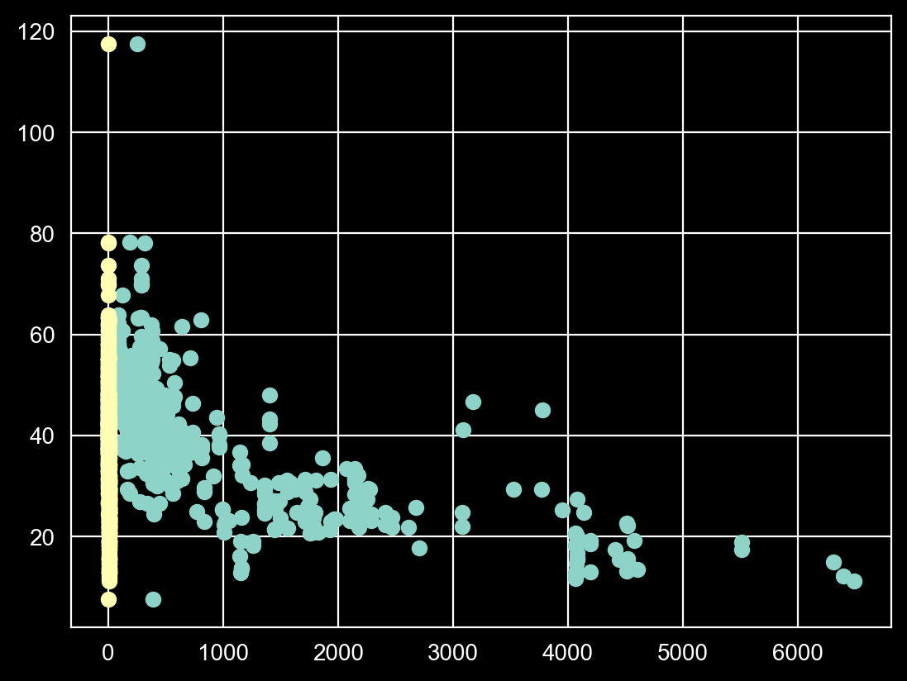
    


```python
# If any transformation is necessary, please estimate the Model3 with the transformed distance to mrt.


model3 = smf.ols('price_twd_msq ~ np.log(dist_to_mrt_m) + house_age_0_15 + house_age_30_45', data=df_estate).fit()
print(model3.summary())
```

                                OLS Regression Results                            
    ==============================================================================
    Dep. Variable:          price_twd_msq   R-squared:                       0.560
    Model:                            OLS   Adj. R-squared:                  0.557
    Method:                 Least Squares   F-statistic:                     174.2
    Date:                Sun, 07 Jun 2026   Prob (F-statistic):           8.14e-73
    Time:                        16:03:05   Log-Likelihood:                -1497.6
    No. Observations:                 414   AIC:                             3003.
    Df Residuals:                     410   BIC:                             3019.
    Df Model:                           3                                         
    Covariance Type:            nonrobust                                         
    =========================================================================================
                                coef    std err          t      P>|t|      [0.025      0.975]
    -----------------------------------------------------------------------------------------
    Intercept                92.4262      2.946     31.378      0.000      86.636      98.216
    np.log(dist_to_mrt_m)    -8.7280      0.414    -21.083      0.000      -9.542      -7.914
    house_age_0_15            3.4577      1.067      3.240      0.001       1.360       5.556
    house_age_30_45          -1.0732      1.258     -0.853      0.394      -3.546       1.399
    ==============================================================================
    Omnibus:                      183.268   Durbin-Watson:                   2.097
    Prob(Omnibus):                  0.000   Jarque-Bera (JB):             1935.230
    Skew:                           1.594   Prob(JB):                         0.00
    Kurtosis:                      13.101   Cond. No.                         45.3
    ==============================================================================
    
    Notes:
    [1] Standard Errors assume that the covariance matrix of the errors is correctly specified.
    

Discuss the results...

* Prices drop sharply near the MRT station and then stabilize, which is why we used a logarithm.
* Building age significantly affects the price (new and very old houses have different prices than average ones).
* Adding new variables and the logarithm greatly improved the model's predictive effectiveness.


```python
#Calculating residual standard error of Model1
mse_result1 = model1.mse_resid
rse_result1 = np.sqrt(mse_result1)
print('The residual standard error for the above model is:',np.round(mse_result1,3))
```

    The residual standard error for the above model is: 101.375
    


```python
#Calculating residual standard error of Model2
mse_result2 = result2.mse_resid
rse_result2 = np.sqrt(mse_result2)
print('The residual standard error for the above model is:',np.round(rse_result2,3))
```

    The residual standard error for the above model is: 9.796
    

Looking at model summary, we see that variables .... are insignificant, so let's estimate the model without those variables:


```python
# Estimate next model here

model4 = smf.ols('price_twd_msq ~ np.log(dist_to_mrt_m) + house_age_0_15', data=df_estate).fit()
print(model4.summary())
```

                                OLS Regression Results                            
    ==============================================================================
    Dep. Variable:          price_twd_msq   R-squared:                       0.560
    Model:                            OLS   Adj. R-squared:                  0.557
    Method:                 Least Squares   F-statistic:                     261.1
    Date:                Sun, 07 Jun 2026   Prob (F-statistic):           6.40e-74
    Time:                        16:03:06   Log-Likelihood:                -1497.9
    No. Observations:                 414   AIC:                             3002.
    Df Residuals:                     411   BIC:                             3014.
    Df Model:                           2                                         
    Covariance Type:            nonrobust                                         
    =========================================================================================
                                coef    std err          t      P>|t|      [0.025      0.975]
    -----------------------------------------------------------------------------------------
    Intercept                91.4396      2.708     33.763      0.000      86.116      96.764
    np.log(dist_to_mrt_m)    -8.6469      0.403    -21.467      0.000      -9.439      -7.855
    house_age_0_15            3.9415      0.904      4.360      0.000       2.164       5.719
    ==============================================================================
    Omnibus:                      180.226   Durbin-Watson:                   2.094
    Prob(Omnibus):                  0.000   Jarque-Bera (JB):             1884.848
    Skew:                           1.562   Prob(JB):                         0.00
    Kurtosis:                      12.975   Cond. No.                         40.7
    ==============================================================================
    
    Notes:
    [1] Standard Errors assume that the covariance matrix of the errors is correctly specified.
    

### Evaluating multi-collinearity

There are many standards researchers apply for deciding whether a VIF is too large. In some domains, a VIF over 2 is worthy of suspicion. Others set the bar higher, at 5 or 10. Others still will say you shouldn't pay attention to these at all. Ultimately, the main thing to consider is that small effects are more likely to be "drowned out" by higher VIFs, but this may just be a natural, unavoidable fact with your model.


```python
from statsmodels.stats.outliers_influence import variance_inflation_factor
X_vif = df_estate[['dist_to_mrt_m', 'house_age_0_15', 'house_age_30_45']].copy()
X_vif = X_vif.fillna(0)  # Fill missing values if any

# Add constant (intercept)
X_vif = sm.add_constant(X_vif)

# Calculate VIF for each feature
vif_data = pd.DataFrame()
vif_data["feature"] = X_vif.columns
vif_data["VIF"] = [variance_inflation_factor(X_vif.values, i) for i in range(X_vif.shape[1])]

print(vif_data)
```

               feature       VIF
    0            const  4.772153
    1    dist_to_mrt_m  1.061497
    2   house_age_0_15  1.399276
    3  house_age_30_45  1.400308
    

Discuss the results...


* VIF checks if our variables are duplicating the exact same information.
* Results close to 1.0 mean there is no problem (no multicollinearity).
* Distance to the MRT and building age are independent of each other, and both are useful predictors.

Finally we test our best model on test dataset (change, if any transformation on dist_to_mrt_m was needed):


```python
# Prepare test predictors (must match training predictors)
X_test = test[['dist_to_mrt_m', 'house_age_0_15', 'house_age_30_45']].copy()
X_test = X_test.fillna(0)
X_test = sm.add_constant(X_test)

# True values
y_test = test['price_twd_msq']

# Predict using model2
y_pred = result2.predict(X_test)

# Calculate RMSE as an example metric
from sklearn.metrics import mean_squared_error
rmse = np.sqrt(mean_squared_error(y_test, y_pred))
print(f"Test RMSE: {rmse:.2f}")
```

    Test RMSE: 8.38
    

Interpret results...

* RMSE represents the average error our model makes when predicting the house price.
* The result is given in the exact same units as the real estate market prices.
* This allows us to evaluate how well the model will perform in real life on entirely new data.


## Variable selection using best subset regression

*Best subset and stepwise (forward, backward, both) techniques of variable selection can be used to come up with the best linear regression model for the dependent variable medv.*


```python
# Best subset selection using sklearn's SequentialFeatureSelector (forward and backward)
from sklearn.feature_selection import SequentialFeatureSelector
from sklearn.linear_model import LinearRegression

# Prepare predictors and target
X = df_estate[['dist_to_mrt_m', 'n_convenience', 'house_age_0_15', 'house_age_15_30', 'house_age_30_45']]
y = df_estate['price_twd_msq']

# Initialize linear regression model
lr = LinearRegression()

# Forward stepwise selection
sfs_forward = SequentialFeatureSelector(lr, n_features_to_select='auto', direction='forward', cv=5)
sfs_forward.fit(X, y)
print("Forward selection support:", sfs_forward.get_support())
print("Selected features (forward):", X.columns[sfs_forward.get_support()].tolist())

# Backward stepwise selection
sfs_backward = SequentialFeatureSelector(lr, n_features_to_select='auto', direction='backward', cv=5)
sfs_backward.fit(X, y)
print("Backward selection support:", sfs_backward.get_support())
print("Selected features (backward):", X.columns[sfs_backward.get_support()].tolist())
```

    Forward selection support: [ True  True False False False]
    Selected features (forward): ['dist_to_mrt_m', 'n_convenience']
    Backward selection support: [ True  True False False  True]
    Selected features (backward): ['dist_to_mrt_m', 'n_convenience', 'house_age_30_45']
    

### Comparing competing models


```python
import statsmodels.api as sm

# Example: Compare AIC for models selected by forward and backward stepwise selection

# Forward selection model
features_forward = X.columns[sfs_forward.get_support()].tolist()
X_forward = df_estate[features_forward]
X_forward = sm.add_constant(X_forward)
model_forward = sm.OLS(y, X_forward).fit()
print("AIC (forward selection):", model_forward.aic)

# Backward selection model
features_backward = X.columns[sfs_backward.get_support()].tolist()
X_backward = df_estate[features_backward]
X_backward = sm.add_constant(X_backward)
model_backward = sm.OLS(y, X_backward).fit()
print("AIC (backward selection):", model_backward.aic)

# You can print summary for the best model (e.g., forward)
print(model_forward.summary())
```

    AIC (forward selection): 3057.2813425866216
    AIC (backward selection): 3047.991777087278
                                OLS Regression Results                            
    ==============================================================================
    Dep. Variable:          price_twd_msq   R-squared:                       0.497
    Model:                            OLS   Adj. R-squared:                  0.494
    Method:                 Least Squares   F-statistic:                     202.7
    Date:                Sun, 07 Jun 2026   Prob (F-statistic):           5.61e-62
    Time:                        16:03:06   Log-Likelihood:                -1525.6
    No. Observations:                 414   AIC:                             3057.
    Df Residuals:                     411   BIC:                             3069.
    Df Model:                           2                                         
    Covariance Type:            nonrobust                                         
    =================================================================================
                        coef    std err          t      P>|t|      [0.025      0.975]
    ---------------------------------------------------------------------------------
    const            39.1229      1.300     30.106      0.000      36.568      41.677
    dist_to_mrt_m    -0.0056      0.000    -11.799      0.000      -0.007      -0.005
    n_convenience     1.1976      0.203      5.912      0.000       0.799       1.596
    ==============================================================================
    Omnibus:                      191.943   Durbin-Watson:                   2.126
    Prob(Omnibus):                  0.000   Jarque-Bera (JB):             2159.977
    Skew:                           1.671   Prob(JB):                         0.00
    Kurtosis:                      13.679   Cond. No.                     4.58e+03
    ==============================================================================
    
    Notes:
    [1] Standard Errors assume that the covariance matrix of the errors is correctly specified.
    [2] The condition number is large, 4.58e+03. This might indicate that there are
    strong multicollinearity or other numerical problems.
    

From Best subset regression and stepwise selection (forward, backward, both), we see that the models selected by forward and backward selection may include different sets of predictors, depending on their contribution to model fit.

By comparing AIC values, the model with the lowest AIC is preferred, as it balances model complexity and goodness of fit.

In this case, the summary output for the best model (e.g., forward selection) shows which variables are most important for predicting price_twd_msq. This approach helps identify the most relevant predictors and avoid overfitting by excluding unnecessary variables.

Run model diagnostics for the BEST model:


```python
plt.scatter(model_forward.fittedvalues, model_forward.resid,
            color='royalblue',
            alpha=0.7,
            edgecolor='white')
plt.axhline(0, color='crimson', linestyle='--', linewidth=2)
plt.xlabel('Fitted Values')
plt.ylabel('Residuals')
plt.show()

sm.qqplot(model_forward.resid, line='s',
          markerfacecolor='royalblue',
          markeredgecolor='white',
          alpha=0.7)
plt.show()
```


    
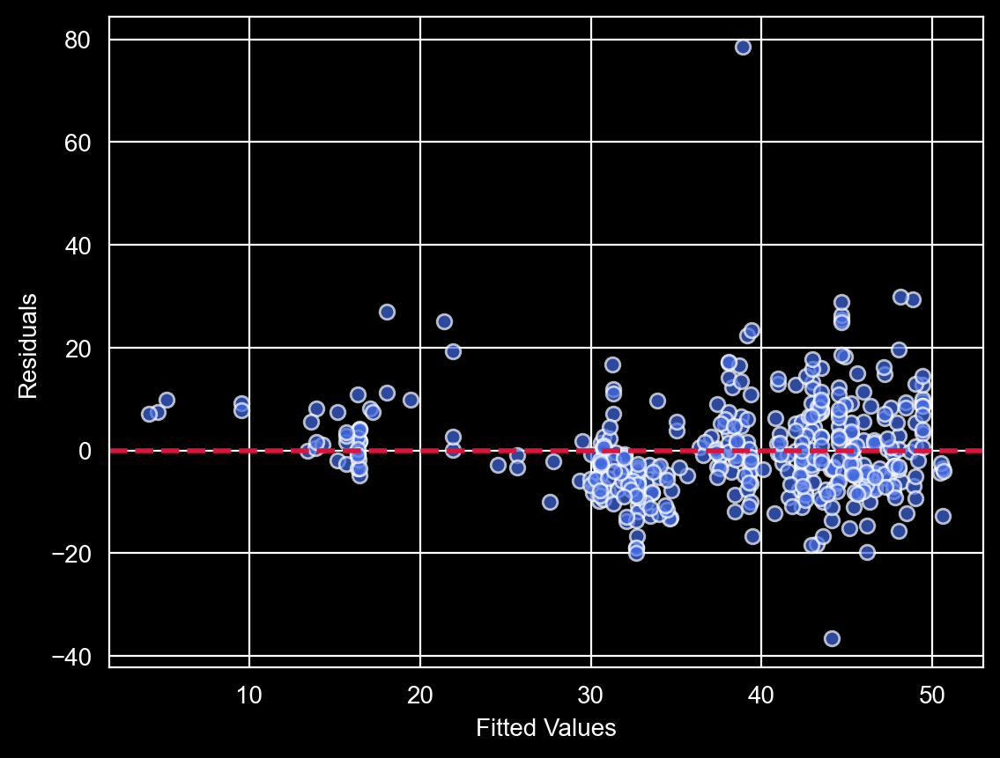
    


    
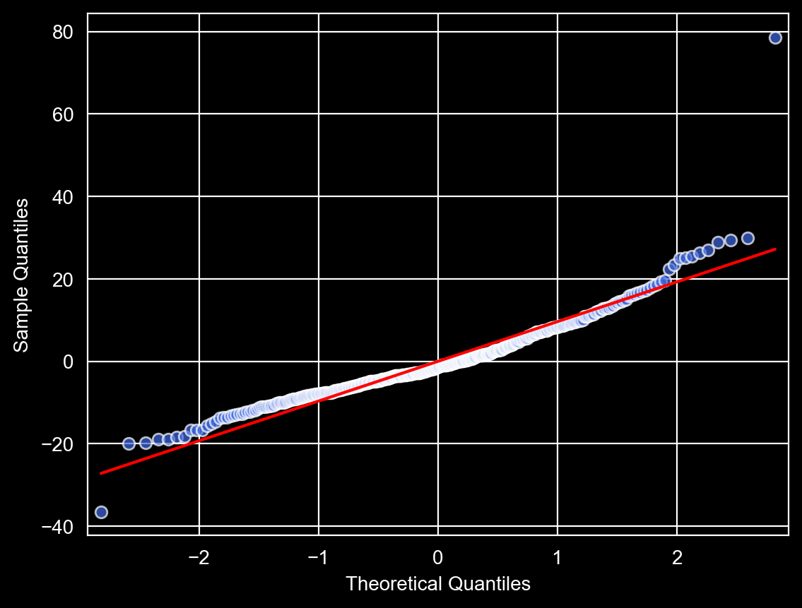
    


Finally, we can check the Out-of-sample Prediction or test error (MSPE):


```python
X_test = test[features_forward].copy()
X_test = X_test.fillna(0)
X_test = sm.add_constant(X_test)

# True values
y_test = test['price_twd_msq']

# Predict using the best model (e.g., forward selection)
y_pred = model_forward.predict(X_test)

# Calculate MSPE (Mean Squared Prediction Error)
mspe = np.mean((y_test - y_pred) ** 2)
print(f"Test MSPE (out-of-sample): {mspe:.2f}")
```

    Test MSPE (out-of-sample): 64.80
    

## Cross Validation

In Python, for cross-validation of regression models is usually done with cross_val_score from sklearn.model_selection.

To get the raw cross-validation estimate of prediction error (e.g., mean squared error), use:


```python
from sklearn.model_selection import cross_val_score
from sklearn.linear_model import LinearRegression

X = df_estate[['dist_to_mrt_m', 'house_age_0_15', 'house_age_30_45']]
y = df_estate['price_twd_msq']

model = LinearRegression()

# 5-fold cross-validation, scoring negative MSE (so we multiply by -1 to get positive MSE)
cv_scores = cross_val_score(model, X, y, cv=5, scoring='neg_mean_squared_error')

# Raw cross-validation estimate of prediction error (mean MSE)
cv_mse = -cv_scores.mean()
cv_rmse = np.sqrt(cv_mse)

print(f"Cross-validated MSE: {cv_mse:.2f}")
print(f"Cross-validated RMSE: {cv_rmse:.2f}")
```

    Cross-validated MSE: 95.90
    Cross-validated RMSE: 9.79
    

# Summary

1. Do you understand all numerical measures printed in the SUMMARY of the regression report?
2. Why do we need a cross-validation?
3. What are the diagnostic plots telling us?
4. How to compare similar, but competing models?
5. What is VIF telling us?
6. How to choose best set of predictors for the model?
