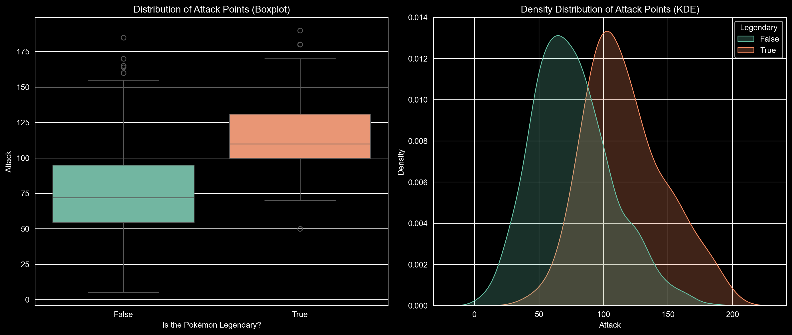

# Univariate Analysis

## Looking ahead: April Week 4, May Week 1

- In the end of April and early May, we'll dive deep into **statistics** finally.  
  - How do we calculate descriptive statistics in Python?
  - What principles should we keep in mind?

Univariate analysis is a type of statistical analysis that involves examining the distribution and characteristics of a single variable. The prefix “uni-” means “one,” so univariate analysis focuses on one variable at a time, without considering relationships between variables.

Univariate analysis is the foundation of data analysis and is essential for understanding the basic structure of your data before moving on to more complex techniques like bivariate or multivariate analysis.

# Measurement scales

Measurement scales determine what mathematical and statistical operations can be performed on data. There are four basic types of scales:

1. **Nominal** scale
- Data is used only for naming or categorizing.
- The order between values cannot be determined.
- Possible operations: count, mode, frequency analysis.

Examples:
- Pokémon type (type_1): “fire”, ‘water’, ‘grass’, etc.
- Species, gender, colors, brands etc.


```python
import pandas as pd
df_pokemon = pd.read_csv("data/pokemon.csv")
df_pokemon["Type 1"].value_counts()
```

2. **Ordinal** scale
- Data can be ordered, but the distances between them are not known.
- Possible operations: median, quantiles, rank tests (e.g. Spearman).

Examples:
- Strength level: "low", "medium", "high".
- Quality ratings: "weak", "good", "very good".


```python
import seaborn as sns

titanic = sns.load_dataset("titanic")

print(titanic["class"].unique())
```

3. **Interval** scale
- The data is numerical, with equal intervals, but lacks an absolute zero.
- Differences, mean, and standard deviation can be calculated.
- Ratios (e.g., "twice as much") do not make sense.

Examples:
- Temperature in °C (but not in Kelvin!). Why? There is no absolute zero—zero does not mean the absence of the property; it is just a conventional reference point. 0°C does not mean no temperature; 20°C is not 2 × 10°C.
- Year in a calendar (e.g., 1990). Why? Year 0 does not mark the beginning of time; 2000 is not 2 × 1000.
- Time in the hourly system (e.g., 13:00). Why? 0:00 does not mean no time, but rather an established reference point.

4. **Ratio** scale
- Numerical data with an absolute zero.
- All mathematical operations, including division, can be performed.
  
> **Not all numerical data is on a ratio scale!** For example, temperature in degrees Celsius is not on a ratio scale because 0°C does not mean the absence of temperature. However, temperature in Kelvin (K) is, as 0 K represents the absolute absence of thermal energy.

Examples:
- Height, weight, number of Pokémon attack points (attack), HP, speed.


```python
df_pokemon[["HP", "Attack", "Speed"]].describe()
```

### Table: Measurement scales in statistics

| Scale          | Example                           | Is it possible to order? | Equal spacing? | Absolute zero? | Sample statistical calculations       |
|----------------|-------------------------------------|--------------------------|----------------|------------------|------------------------------------------|
| **Nominal**  | Pokémon type (`fire`, `water` etc.)| ❌                       | ❌             | ❌               | Mode, counts, frequency analysis      |
| **Ordinal** | Ticket class (`First`, `Second`, `Third`) | ✅                       | ❌             | ❌               | Median, quantiles         |
| **Interval** | Temperature in °C                  | ✅                       | ✅             | ❌               | Mean, standard deviation         |
| **Ratio**  | HP, attack, height                   | ✅                       | ✅             | ✅               | All mathematical operations/statistical |

**Conclusion**: The type of scale affects the choice of statistical methods - for example, the Pearson correlation test requires quotient or interval data, while the Chi² test requires nominal data.


### Quiz: measurement scales in statistics.

Answer the following questions by choosing **one correct answer**. You will find the solutions at the end.

---

#### 1. Which scale **enables ordering of data**, but **does not have equal spacing**?
- A) Nominal  
- B) Ordinal  
- C) Interval  
- D) Ratio  

---

#### 2. An example of a variable on the **nominal scale** is:
- A) Temperature in °C  
- B) Height  
- C) Type of Pokémon (`fire`, `grass`, `water`)  
- D) Satisfaction level (`low`, `medium`, `high`).  

---

#### 3. Which scale **does not have absolute zero**, but has **equal spacing**?
- A) Ratio  
- B) Ordinal  
- C) Interval  
- D) Nominal  

---

#### 4. What operations are **allowed** on variables **on an ordinal scale**?
- A) Mean and standard deviation  
- B) Mode and Pearson correlation  
- C) Median and rank tests  
- D) Quotients and logarithms  

---

#### 5. The variable `“class”` in the Titanic set (`First`, `Second`, `Third`) is an example:
- A) Nominal scale  
- B) Ratio scale  
- C) Interval scale  
- D) Ordinal scale  

---

Our solutions:
1. B - ordinal -> we dont know the spacing between the elements, we can just order/rank the data
2. C - type of the pokemon -> nominal scale assigns labels to data elements
3. C - Interval -> for example Celsius scale
4. C - Median & rank tests -> because we dont know the numerical distances for ordinal data, we cannot calculate for example mean or std
5. D - Ordinal scale -> we cant do math on them, we can just rank the data, first second and third class

# Descriptive statistics

**Descriptive statistics** deals with the description of the distribution of data in a sample. Descriptive statistics give us basic summary measures about a set of data. Summary measures include measures of central tendency (mean, median and mode) and measures of variability (variance, standard deviation, minimum/maximum values, IQR (interquartile range), skewness and kurtosis).

## This week

Now we're going to look at **describing** our data - as well as the **basics of statistics**.

There are many ways to *describe* a distribution. 

Here we will discuss:
- Measures of **central tendency**: what is the typical value in this distribution?
- Measures of **variability**: how much do the values differ from each other?  
- Measures of **skewness**: how strong is the asymmetry of the distribution?
- Measures of **curvature**: what is the intensity of extreme values?


```python
import numpy as np
import matplotlib.pyplot as plt
import seaborn as sns 
import scipy.stats as stats
```


```python
%matplotlib inline 
%config InlineBackend.figure_format = 'retina'
```

## Central tendency

The **central tendency** refers to the “typical value” in a distribution.

The **central tendency** refers to the central value that describes the distribution of a variable. It can also be referred to as the center or location of the distribution. The most common measures of central tendency are **average**, **median** and **mode**. The most common measure of central tendency is the **mean**. In the case of skewed distributions or when there is concern about outliers, the **median** may be preferred. The median is thus a more reliable measure than the mean.

There are many ways to *measure* what is “typical” - average:

- Arithmetic mean
- Median (middle value)
- Mode (dominant)

### Why is this useful?

- A dataset may contain *many* observations.  
   - For example, $N$ = $5000$ of survey responses regarding `height'.  
- One way to “describe” this distribution is to **visualize** it.  
- But it is also helpful to reduce this distribution to a *single number*.

This is necessarily a **simplification** of our dataset!

### *Arithmetic average*

> **Arithmetic average** is defined as the `sum` of all values in a distribution, divided by the number of observations in that distribution.


```python
numbers = [1, 2, 3, 4]
### calculating manually...
sum(numbers)/len(numbers)
```

- The most common measure of central tendency is the average.
- The mean is also known as the simple average.
- It is denoted by the Greek letter $µ$ for a population and $\bar{x}$ for a sample.
- We can find the average of the number of elements by adding all the elements in the data set and then dividing by the number of elements in the data set.
- This is the most popular measure of central tendency, but it has a drawback.
- The average is affected by the presence of outliers.
- Thus, the average alone is not sufficient for making business decisions.

$$
\bar{x} = \frac{1}{n} \sum_{i=1}^{n} x_i
$$


#### `numpy.mean`

The `numpy` package has a function that calculates an `average` on a `list` or `numpy.ndarray`.


```python
np.mean(numbers)
```

#### `scipy.stats.tmean`

The [scipy.stats](https://docs.scipy.org/doc/scipy/tutorial/stats.html) library has a variety of statistical functions.


```python
stats.tmean(numbers)
```

#### Calculating the `average` of a `pandas` column.

If we work with `DataFrame`, we can calculate the `average` of specific columns.


```python
import pandas as pd
df_gapminder = pd.read_csv("gapminder_full.csv")
df_gapminder.head(2)
```


```python
df_gapminder['life_exp'].mean()
```

#### Your turn

How to calculate the mean life expectancy for EUROPEan countries (2007).


```python
### Your code here
mean_life_expectancy = df_gapminder[(df_gapminder['continent']=='Europe')&(df_gapminder['year']==2007)]['life_exp'].mean()
print(mean_life_expectancy)
```

#### *Average* and skewness

> **Skewness** means that there are values *extending* one of the “tails” of the distribution.

Of the measures of **central tendency**, “average” is the most dependent on the direction of skewness.

- How would you describe the following **skewness**?  
- Do you think the “mean” would be higher or lower than the “median”?


```python
sns.histplot(data = df_gapminder, x = "gdp_cap")
plt.axvline(df_gapminder['gdp_cap'].mean(), linestyle = "dotted");
```

#### Your turn

Is it possible to calculate the average of the column “continent”? Why or why not?


```python
df_gapminder['continent']
```


```python
### Your comment here
#No, it is not. Continent column contains nominal data, so text labels. We cannot calculate the average value, but wa can calculate mode, so the most frequent occuring value
```

#### Your turn

- Subtract each observation in `numbers` from the `average` of this `list`.  
- Then calculate the **sum** of these deviations from the `average`.

What is their sum?


```python
import numpy as np
numbers = np.array([1, 2, 3, 4])
### Your code here
mean = np.mean(numbers)
sum_deviation = np.sum(numbers - mean)
print(sum_deviation)
```

#### Summary of the first part

- The mean is one of the most common measures of central tendency.  
- It can only be used for **continuous** interval/ratio data.  
- The **sum of deviations** from the mean is equal to `0`. 
- The “mean” is most affected by **skewness** and **outliers**.

### *Median*

> *Median* is calculated by sorting all values from smallest to largest and then finding the value in the middle.

- The median is the number that divides a data set into two equal halves.
- To calculate the median, we need to sort our data set of n numbers in ascending order.
- The median of this data set is the number in the position $(n+1)/2$ if $n$ is odd.
- If n is even, the median is the average of the $(n/2)$ third number and the $(n+2)/2$ third number.
- The median is robust to outliers.
- Thus, in the case of skewed distributions or when there is concern about outliers, the median may be preferred.


```python
df_gapminder['gdp_cap'].median()
```

#### Comparison of `median` and `average`.

The direction of inclination has less effect on the `median`.


```python
sns.histplot(data = df_gapminder, x = "gdp_cap")
plt.axvline(df_gapminder['gdp_cap'].mean(), linestyle = "dotted", color = "blue")
plt.axvline(df_gapminder['gdp_cap'].median(), linestyle = "dashed", color = "red");
```

#### Your turn

Is it possible to calculate the median of the column “continent”? Why or why not?


```python
### Your comment here
#No it is not possible. TO calculate the median we have to put the data into the descending or non-descending order, we cannot do that with nominal data
```

### *Mode*

> **Mode** is the most common value in a data set. 

Unlike `median` or `average`, `mode` can be used with **categorical** data.


```python
df_pokemon = pd.read_csv("data/pokemon.csv")
df_pokemon['Type 1'].mode()
```

#### `mode()` returns multiple values?

- If multiple values *bind* for the most frequent one, `mode()` will return them all.
- This is because technically, a distribution can have multiple values for the most frequent - modal!


```python
df_gapminder['gdp_cap'].mode()
```

### Measures of central tendency - summary

|Measure|Can be used for:|Limitations|
|-------|----------------|-----------|
|Mean|Continuous data|Influence on skewness and outliers|
|Median|Continuous data|Does not include the *value* of all data points in the calculation (ranks only)|
|Mode|Continuous and categorical data|Considers only *frequent*; ignores other values|

## Quantiles

**Quantiles** are descriptive - positional statistics that divide an ordered data set into equal parts. The most common quantiles are:

- **Median** (quantile of order 0.5),
- **Quartiles** (divide the data into 4 parts),
- **Deciles** (into 10 parts),
- **Percentiles** (into 100 parts).

### Definition

A quantile of order $q \in (0,1)$ is a value of $x_q$ such that:

$$
P(X \leq x_q) = q
$$

In other words: $q \cdot 100\%$ of the values in the data set are less than or equal to $x_q$.

### Formula (for an ordered data set)

For a data sample $x_1, x_2, \ldots, x_n$ ordered in ascending order, the quantile of order $q$ is determined as:

1. Calculate the positional index:

$$
i = q \cdot (n + 1)
$$

2. If $i$ is an integer, then the quantile is $x_i$.

3. If $i$ is not integer, we interpolate linearly between adjacent values:

$$
x_q = x_{\lfloor i \rfloor} + (i - \lfloor i \rfloor) \cdot (x_{\lceil i \rceil} - x_{\lfloor i \rfloor})
$$

**Note:** In practice, different methods are used to determine quantiles - libraries such as NumPy or Pandas have different modes (e.g. `method='linear'`, `method='midpoint'`).

### Example - we calculate step by step:

For data:
$
[3, 7, 8, 5, 12, 14, 21, 13, 18]
$

1. We arrange the data in ascending order:

$
[3, 5, 7, 8, 12, 13, 14, 18, 21]
$

2. Median (quantile of order 0.5):

The number of elements $n = 9$, the middle element is the 5th value:

$
\text{Median} = x_5 = 12
$

3. First quartile (Q1, quantile of order 0.25):

$
i = 0.25 \cdot (9 + 1) = 2.5
$

Interpolation between $x_2 = 5$ and $x_3 = 7$:

$
Q_1 = 5 + 0.5 \cdot (7 - 5) = 6
$

4. Third quartile (Q3, quantile of 0.75):

$
i = 0.75 \cdot 10 = 7.5
$

Interpolation between $x_7 = 14$ and $x_8 = 18$:

$
Q_3 = 14 + 0.5 \cdot (18 - 14) = 16
$

### Deciles

**Deciles** divide data into 10 equal parts. For example:

- **D1** is the 10th percentile (quantile of 0.1),
- **D5** is the median (0.5),
- **D9** is the 90th percentile (0.9).

The formula is the same as for overall quantiles, just use the corresponding $q$. E.g. for D3:

$
q = \frac{3}{10} = 0.3
$

### Percentiles

**Percentiles** divide data into 100 equal parts. E.g.:

- **P25** = Q1,
- **P50** = median,
- **P75** = Q3,
- **P90** is the value below which 90% of the data is.

With percentiles, we can better understand the distribution of data - for example, in standardized tests, a score is often given as a percentile (e.g., “85th percentile” means that someone scored better than 85% of the population).

---

### Quantiles - summary

| Name     | Symbol | Quantile \( q \) | Meaning                          |
|-----------|--------|------------------|-------------------------------------|
| Q1        | Q1     | 0.25             | 25% of data ≤ Q1                     |
| Median   | Q2     | 0.5              | 50% of data ≤ Median                |
| Q3        | Q3     | 0.75             | 75% of data ≤ Q3                     |
| Decile 1   | D1     | 0.1              | 10% of data ≤ D1                     |
| Decile 9   | D9     | 0.9              | 90% of data ≤ D9                     |
| Percentile 95 | P95 | 0.95             | 95% of data ≤ P95                    |

---

### Example - calculations of quantiles


```python
# Sample data
mydata = [3, 7, 8, 5, 12, 14, 21, 13, 18]
mydata_sorted = sorted(mydata)
print("Sorted data:", mydata_sorted)
```


```python
# Conversion to Pandas Series
s = pd.Series(mydata)

# Quantiles
q1 = s.quantile(0.25) # lower quartile Q1
median = s.quantile(0.5) # median or middle quartile Q2 = Me
q3 = s.quantile(0.75) # upper quartile Q3

# Deciles
d1 = s.quantile(0.1) # bottom 10% of data...
d9 = s.quantile(0.9) # top 10% of data...

# Percentiles
p95 = s.quantile(0.95)  # top 5% of data...

print("Quantiles:")
print(f"Q1 (25%): {q1}")
print(f"Median (50%): {median}")
print(f"Q3 (75%): {q3}")
print("\nDeciles:")
print(f"D1 (10%): {d1}")
print(f"D9 (90%): {d9}")
print("\nPercentiles:")
print(f"P95 (95%): {p95}")
```


```python
# Create boxplot
fig, ax = plt.subplots(figsize=(8, 6))
sns.boxplot(data=mydata, ax=ax, color='lightblue', width=0.3)

# Calculate statistics
minimum = np.min(mydata)
q1 = np.percentile(mydata, 25)
median = np.median(mydata)
q3 = np.percentile(mydata, 75)
maximum = np.max(mydata)
mean = np.mean(mydata)

ax.scatter(0, minimum, color='red', label='Min', zorder=5)
ax.scatter(0, q1, color='orange', label='Q1 (25th percentile)', zorder=5)
ax.scatter(0, median, color='green', label='Median (50th percentile)', zorder=5)
ax.scatter(0, q3, color='purple', label='Q3 (75th percentile)', zorder=5)
ax.scatter(0, maximum, color='brown', label='Max', zorder=5)
ax.scatter(0, mean, color='black', marker='D', s=60, label='Mean', zorder=5)

for value, name, color in zip(
    [minimum, q1, median, mean, q3, maximum],
    ['Min', 'Q1', 'Median', 'Mean', 'Q3', 'Max'],
    ['red', 'orange', 'green', 'black', 'purple', 'brown']
):
    ax.text(0.1, value, f'{name}: {value:.2f}', verticalalignment='center', color=color)


ax.set_title('Boxplot of mydata with All Measures Marked')
ax.legend(bbox_to_anchor=(1.05, 1), loc='upper left')
plt.show()
```

### Your turn!

Try to change the boxplot into the violin plot (or add it). 

Looking at the aforementioned quantile results and the box plot, try to interpret these measures. 


```python

```

## Variability

> **Variability** (or **dispersion**) refers to the degree to which values in a distribution are *dispersed*, i.e., differ from each other.

The **dispersion** is an indicator of how far from the center we can find data values. The most common measures of dispersion are **variance**, **standard deviation** and **interquartile range (IQR)**. The **variance** is a standard measure of dispersion. The **standard deviation** is the square root of the variance. The **variance** and **standard deviation** are two useful measures of scatter.

### The `mean` hides the variance!

Both distributions have *the same* mean, but *different* **standard deviations**.


```python
### Let's create some distributions
d1 = np.random.normal(loc = 0, scale = 1, size = 1000)
d2 = np.random.normal(loc = 0, scale = 5, size = 1000)
### Plots
fig, axes = plt.subplots(1, 2, sharex=True, sharey=True);
p1 = axes[0].hist(d1, alpha = .5)
p2 = axes[1].hist(d2, alpha = .5)
axes[0].set_title("Lower variance");
axes[1].set_title("Higher variance");
```

### Volatility detection

There are at least *three* main approaches to quantifying variability:

- **Range**: the difference between the “maximum” and “minimum” value. 
- **Interquartile range (IQR)**: The range of the middle 50% of the data.  
- **Variance** and **Standard Deviation**: the typical value by which results deviate from the mean.

### Range

> **Range** Is the difference between the `maximum` and `minimum` values.

Intuitive, but only considers two values in the entire distribution.


```python
d1.max() - d1.min()
```


```python
d2.max() - d2.min()
```

### IQR

> The **interquartile range (IQR)** is the difference between a value in the 75% percentile and a value in the 25% percentile.

It focuses on the **center 50%**, but still only considers two values.

- IQR is calculated using the limits of the data between the 1st and 3rd quartiles. 
- The interquartile range (IQR) can be calculated as follows: $IQR = Q3 - Q1$
- In the same way that the median is more robust than the mean, the IQR is a more robust measure of scatter than the variance and standard deviation and should therefore be preferred for small or asymmetric distributions. 
- It is a robust measure of scatter.


```python
## Let's calculate quantiles - quartiles Q1 and Q3
q3, q1 = np.percentile(d1, [75 ,25])
q3 - q1
```


```python
## Let's calculate quantiles - quartiles Q1 and Q3
q3, q1 = np.percentile(d2, [75 ,25])
q3 - q1
```

### Variance and standard deviation.

The **Variance** measures the dispersion of a set of data points around their mean value. It is the average of the squares of the individual deviations. The variance gives the results in original units squared.

$$
s^2 = \frac{1}{n - 1} \sum_{i=1}^{n} (x_i - \bar{x})^2
$$

**Standard deviation (SD)** measures the *typical value* by which the results in the distribution deviate from the mean.

$$
s = \sqrt{s^2} = \sqrt{\frac{1}{n - 1} \sum_{i=1}^{n} (x_i - \bar{x})^2}
$$

where:
	- $n$ - the number of elements in the sample
	- $\bar{x}$ - the arithmetic mean of the sample

What to keep in mind:

- SD is the *square root* of [variance](https://en.wikipedia.org/wiki/Variance).  
- There are actually *two* measures of SD:
 - SD of a population: when you measure the entire population of interest (very rare).  
   - SD of a sample: when you measure a *sample* (typical case); we'll focus on that.

#### SD, explained

- First, calculate the total *square deviation*.
   - What is the total square deviation from the “mean”? 
- Then divide by `n - 1`: normalize to the number of observations.
   - What is the *average* squared deviation from the `average'?
- Finally, take the *square root*:
   - What is the *average* deviation from the “mean”?

The **standard deviation** represents the *typical* or “average” deviation from the “mean”.

#### SD calculation in `pandas`


```python
df_pokemon['Attack'].std()
```


```python
df_pokemon['HP'].std()
```

#### Note on `numpy.std`!!!

- By default, `numpy.std` calculates the **population standard deviation**!  
- You need to modify the `ddof` parameter to calculate the **sample standard deviation**.

This is a very common error.


```python
### SD in population
d1.std()
```


```python
### SD for sample
d1.std(ddof = 1)
```

### Coefficient of variation (CV).

- The coefficient of variation (CV) is equal to the standard deviation divided by the mean.
- It is also known as “relative standard deviation.”

$$
CV = \frac{s}{\bar{x}} \cdot 100%
$$


```python
X = [2, 4, 4, 4, 5, 5, 7, 9]
mean = np.mean(X)

# Variance and standard deviation from scipy (for the sample!):
var_sample = stats.tvar(X)      # sample variance
std_sample = stats.tstd(X)      # sample sd

# CV (for sample):
cv_sample = (std_sample / mean) * 100

print(f"Mean: {mean}")
print(f"Sample variance (scipy): {var_sample}")
print(f"Sample sd (scipy): {std_sample}")
print(f"CV (scipy): {cv_sample:.2f}%")
```

## Interquartile deviation

Interquartile deviation (sometimes called the semi-interquartile range) is defined as half of the interquartile range:

$$ \text{IQR deviation} = \frac{Q3 - Q1}{2} $$

This value shows the average distance from the median to the quartiles and is a robust measure of variability.

- A small interquartile deviation means the middle 50% of the data are close to the median.
- A large interquartile deviation means the middle 50% are more spread out.

It is less sensitive to outliers than the standard deviation or range!

# Your turn!

Calculate STD and CV for the SPEED of LEGENDARY and NOT LEGENDARY pokemons. What is the IQR deviation? 


```python
grouped_speed = df_pokemon.groupby('Legendary')['Speed']

def calculate_cv(x):
    return (x.std() / x.mean()) * 100

def calculate_iqr_deviation(x):
    return (x.quantile(0.75) - x.quantile(0.25)) / 2

speed_stats = grouped_speed.agg(
    Mean='mean',
    Standard_Deviation='std',
    CV_Percentage=calculate_cv,
    IQR_Deviation=calculate_iqr_deviation
)

print(speed_stats)
```

                     Mean  Standard_Deviation  CV_Percentage  IQR_Deviation
    Legendary                                                              
    False       65.455782           27.843038      42.537171           20.0
    True       100.184615           22.952323      22.910028           10.0
    

## Measures of the shape of the distribution

Now we will look at measures of the shape of the distribution. There are two statistical measures that can tell us about the shape of a distribution. These are **skewness** and **curvature**. These measures can be used to tell us about the shape of the distribution of a data set.

## Skewness
- **Skewness** is a measure of the symmetry of a distribution, or more precisely, the lack of symmetry. 
- It is used to determine the lack of symmetry with respect to the mean of a data set. 
- It is a characteristic of deviation from the mean. 
- It is used to indicate the shape of a data distribution.

Skewness is a measure of the asymmetry of the distribution of data relative to the mean. It tells us whether the data are more ‘stretched’ to one side.

Interpretation:

- Skewness > 0 - right-tailed (positive): long tail on the right (larger values are more dispersed)
- Skewness < 0 - left (negative): long tail on the left (smaller values are more dispersed)
- Skewness ≈ 0 - symmetric distribution (e.g. normal distribution)

Formula (for the sample):

$$
A = \frac{n}{(n-1)(n-2)} \sum_{i=1}^{n} \left( \frac{x_i - \bar{x}}{s} \right)^3
$$

where:
- $n$ - number of observations
- $\bar{x}$ - sample mean
- $s$ - standard deviation of the sample


#### Negative skewness

- In this case, the data are skewed or shifted to the left. 
- By skewed to the left, we mean that the left tail is long relative to the right tail. 
- The data values may extend further to the left, but are concentrated on the right. 
- So we are dealing with a long tail, and the distortion is caused by very small values that pull the mean down and it is smaller than the median. 
- In this case we have **Mean < Median < Mode**.
      

#### Zero skewness

- This means that the dataset is symmetric. 
- A dataset is symmetric if it looks the same to the left and right of the midpoint. 
- A dataset is bell-shaped or symmetric. 
- A perfectly symmetrical dataset will have a skewness of zero. 
- So a normal distribution that is perfectly symmetric has a skewness of 0. 
- In this case we have **Mean = Median = Mode**.
      

#### Positive skewness

- The dataset is skewed or shifted to the right. 
- By skewed to the right we mean that the right tail is long relative to the left tail. 
- The data values are concentrated on the right side. 
- There is a long tail on the right side, which is caused by very large values that pull the mean upwards and it is larger than the median. 
- So we have **Mean > Median > Mode**.


```python
from scipy.stats import skew
X = [2, 4, 4, 4, 5, 5, 7, 9]
skewness = skew(X)
print(f"Skewness of X: {skewness:.4f}")
```

### Your turn

Try to interpret the above-mentioned result and calculate example slant ratios for several groups of Pokémon.


```python
# INTERPRETATION OF THE RESULT FROM CELL 86:
# The sample skewness for the dataset X is approximately 0.656. Since this value is greater than 0,
# it indicates a right-skewed distribution. This means most data points are clustered on the lower end, with a longer tail stretching towards the higher values on the right.


pokemon_skew = df_pokemon.groupby('Type 1')['Attack'].skew()
print("Skewness of Attack points across different Pokémon types:")
print(pokemon_skew)
```

    Skewness of Attack points across different Pokémon types:
    Type 1
    Bug         0.815756
    Dark        0.565949
    Dragon      0.198652
    Electric    0.621533
    Fairy       1.055304
    Fighting   -0.427173
    Fire        0.350478
    Flying     -0.749630
    Ghost       0.915441
    Grass       0.162911
    Ground      0.599645
    Ice         0.633671
    Normal      0.368517
    Poison     -0.005292
    Psychic     1.158986
    Rock        0.256045
    Steel       0.056582
    Water       0.445246
    Name: Attack, dtype: float64
    

### Interquartile Skewness

**IQR skewness** is a robust, non-parametric measure of skewness that uses the positions of the quartiles rather than the mean and standard deviation. It is particularly useful for detecting asymmetry in data distributions, especially when outliers are present.

The formula for IQR Skewness is:

$$
IQR\ Skewness = \frac{(Q3 - Median) - (Median - Q1)}{Q3 - Q1}
$$
This method is **less sensitive to outliers** and more **robust** than moment-based skewness, making it ideal for exploratory data analysis.

### Your turn

Try to calculate the IQR Skewness coefficient for the sample data:


```python
mydata = [3, 7, 8, 5, 12, 14, 21, 13, 18]

s = pd.Series(mydata)

q1 = s.quantile(0.25)
median = s.median()
q3 = s.quantile(0.75)
iqr_skewness = ((q3 - median) - (median - q1)) / (q3 - q1)

print(f"Quartile 1 (Q1): {q1}")
print(f"Median (Q2): {median}")
print(f"Quartile 3 (Q3): {q3}")
print(f"IQR Skewness Coefficient: {iqr_skewness:.4f}")
```

    Quartile 1 (Q1): 7.0
    Median (Q2): 12.0
    Quartile 3 (Q3): 14.0
    IQR Skewness Coefficient: -0.4286
    

## Kurtosis

Contrary to what some textbooks claim, kurtosis does not measure the ‘flattening’, the ‘peaking’ of a distribution.

> **Kurtosis** depends on the intensity of the extremes, so it measures what happens in the ‘tails’ of the distribution, the shape of the ‘top’ is irrelevant!

**Excess kurtosis** is just kurtosis minus 3. It’s used to compare a distribution to the normal distribution (which has kurtosis = 3).


Sample kurtosis:

$$
\text{Kurtosis} = \frac{1}{n} \sum_{i=1}^{n} \left( \frac{x_i - \bar{x}}{s} \right)^4
$$

$$
\text{Normalized kurtosis} = \text{Kurtosis} - 3
$$

#### Reference range for kurtosis
- The reference standard is the normal distribution, which has a kurtosis of 3. 
- Often **Excess** is presented instead of kurtosis, where **excess** is simply **Kurtosis - 3**. 

#### Mesocurve
- A normal distribution has a kurtosis of exactly 3 (**Excess** exactly 0). 
- Any distribution with kurtosis $≈3$ (exces ≈ 0) is called **mezocurtic**.

#### Platykurtic curve
- A distribution with kurtosis $<3$ (**Excess** < 0) is called **platykurtic**. 
- Compared to a normal distribution, its central peak is lower and wider and its tails are shorter and thinner.

#### Leptokurtic curve

- A distribution with kurtosis $>3$ (**Excess** > 0) is called **leptocurtic**. 
- Compared to a normal distribution, its central peak is higher and sharper and its tails are longer and thicker.


So:
- Excess Kurtosis ≈ 0 → Normal distribution
- Excess Kurtosis > 0 → Leptokurtic (heavy tails)
- Excess Kurtosis < 0 → Platykurtic (light tails)


```python
from scipy.stats import kurtosis
import numpy as np

data = np.array([2, 8, 0, 4, 1, 9, 9, 0])

# By default, it returns excess kurtosis
excess_kurt = kurtosis(data)
print("Excess Kurtosis:", excess_kurt)

# To get regular kurtosis (not excess), set fisher=False
regular_kurt = kurtosis(data, fisher=False)
print("Regular Kurtosis:", regular_kurt)
```

### Interquartile Kurtosis

**IQR Kurtosis** is a robust, non-parametric measure of kurtosis that focuses on the tails of the distribution using interquartile ranges. It is particularly useful for detecting the intensity of extreme values in data distributions, especially when outliers are present.

The formula for IQR Kurtosis is:

$$
IQR\ Kurtosis = \frac{Q3 - Q1}{2*(C90 - C10)}
$$

Where:
- $Q1$ is the first quartile (25th percentile),
- $Q3$ is the third quartile (75th percentile),
- $C90$ is the 90th percentile,
- $C10$ is the 10th percentile.

**Interpretation**:

IQR Kurtosis differs from traditional kurtosis in its interpretation. While traditional kurtosis focuses on the intensity of the tails of a distribution (e.g., heavy or light tails), IQR Kurtosis is a robust measure that emphasizes the relative spread of the interquartile range (IQR) and the symmetry of the distribution around the median.

### Your turn

Try to calculate the IQR Kurtosis coefficient for the sample data:


```python
mydata = [3, 7, 8, 5, 12, 14, 21, 13, 18]
s = pd.Series(mydata)
q1 = s.quantile(0.25)
q3 = s.quantile(0.75)
c10 = s.quantile(0.10)
c90 = s.quantile(0.90)

iqr_kurtosis = (q3 - q1) / (2 * (c90 - c10))

print(f"Q1: {q1}, Q3: {q3}")
print(f"C10: {c10}, C90: {c90}")
print(f"IQR Kurtosis Coefficient: {iqr_kurtosis:.4f}")
```

    Q1: 7.0, Q3: 14.0
    C10: 4.6, C90: 18.6
    IQR Kurtosis Coefficient: 0.2500
    

## Summary statistics

A great tool for creating elegant summaries of descriptive statistics in Markdown format (ideal for Jupyter Notebooks) is pandas, especially in combination with the .describe() function and tabulate.

Example with pandas + tabulate (a nice table in Markdown):


```python
from scipy.stats import skew, kurtosis
from tabulate import tabulate

def markdown_summary(df, round_decimals=3):
    summary = df.describe().T  # transpose so that the variables are in rows
    # Add skewness and kurtosis
    summary['Skewness'] = df.skew()
    summary['Kurtosis'] = df.kurt()
    # Rounding up the results
    summary = summary.round(round_decimals)
    # Nice summary table!
    return tabulate(summary, headers='keys', tablefmt='github')
```


```python
# We select only the numerical columns for analysis:
quantitative = df_pokemon.select_dtypes(include='number')

# We use our function:
print(markdown_summary(quantitative))
```

To make a summary table cross-sectionally (i.e. **by group**), you need to use the groupby() method on the DataFrame and then, for example, describe() or your own aggregate function. 

Let's say you want to group the data by the ‘Type 1’ column (i.e. e.g. Pokémon type: Fire, Water, etc.) and then summarise the quantitative variables (mean, variance, min, max, etc.).


```python
# Grouping by ‘Type 1’ column and statistical summary of numeric columns:
group_summary = df_pokemon.groupby('Type 1')[quantitative.columns].describe()
print(group_summary)
```

## Cross-sectional analysis

Let's try to calculate all those statistics by group i.e. perform descriptive analysis for Attack points by Legendary (for legendary and not legendary pokemons.)


```python
grouped_attack = df_pokemon.groupby('Legendary')['Attack']
grouped_summary = grouped_attack.describe()
# let's add skewness and kurtosis now:
grouped_summary['Skewness'] = grouped_attack.apply(lambda x: x.skew())
grouped_summary['Kurtosis'] = grouped_attack.apply(lambda x: x.kurt())
from tabulate import tabulate
print(tabulate(grouped_summary, headers='keys', tablefmt='github'))  #summary in markdown table now
```

### Your turn!

Add some cross-sectional plots and try to interpret the results.


```python
import matplotlib.pyplot as plt
import seaborn as sns

fig, axes = plt.subplots(1, 2, figsize=(14, 6))

sns.boxplot(
    ax=axes[0],
    x='Legendary',
    y='Attack',
    data=df_pokemon,
    palette='Set2',
    hue='Legendary',
    legend=False
)
axes[0].set_title('Distribution of Attack Points (Boxplot)')
axes[0].set_xlabel('Is the Pokémon Legendary?')
axes[0].set_ylabel('Attack')

sns.kdeplot(
    ax=axes[1],
    data=df_pokemon,
    x='Attack',
    hue='Legendary',
    fill=True,
    common_norm=False,
    palette='Set2'
)
axes[1].set_title('Density Distribution of Attack Points (KDE)')
axes[1].set_xlabel('Attack')
axes[1].set_ylabel('Density')

plt.tight_layout()
plt.show()
```


    

    


Boxplot:

The boxplot shows that Legendary Pokémon have a substantially higher median Attack level than non-Legendary Pokémon.
The middle 50% of the data for Legendary Pokémon is shifted upward—their lower quartile ($Q_1$) which almost perfectly aligns with the upper quartile ($Q_3$) of non-Legendary Pokémon.

KDE Plot:

Non-Legendary Pokémon have a unimodal distribution peaking sharply around 60–80 points with slight right-skewness.
The Legendary group displays a much broader, flatter distribution shifted far to the right, peaking near 100–130 Attack points.

### Quiz answers on measurement scales:
1. B  
2. C  
3. C  
4. C  
5. D
